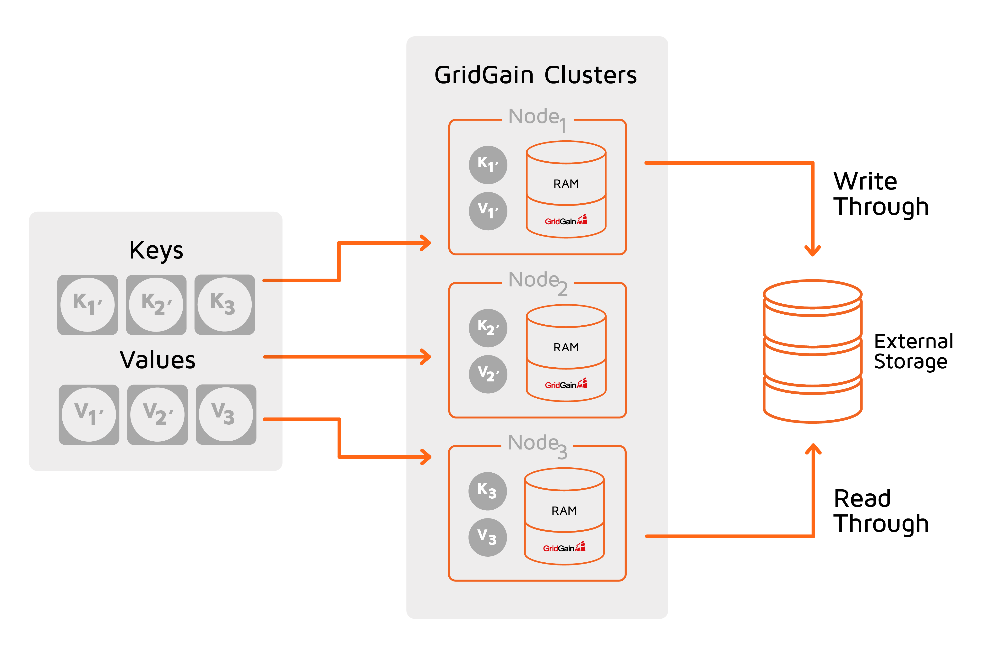

# External Storage

## Overview

You can use GridGain as a caching layer on top of an existing database such as an RDBMS or NoSQL databases, for example, Apache Cassandra or MongoDB.
This use case accelerates the underlying database by employing in-memory processing.

GridGain provides an out-of-the-box integration with Apache Cassandra.
For other NoSQL databases for which integration is not available off-the-shelf, you can provide your own [implementation of the `CacheStore` interface](custom-cache-store.md).


Depending on underlying database, GridGain SQL API may return different results for external storage table lookup and underlying database.


The two main use cases where an external storage can be used include:

* A caching layer to an existing database. In this scenario, you can dramatically improve the processing speed by loading data into memory. You can also bring SQL support to a database that does not have it (when all data is loaded into memory).

* You want to persist the data in an external database (instead of using the [native persistence](../../architecture/storage/native-persistence.md)).



The `CacheStore` interface extends both `javax.cache.integration.CacheLoader` and `javax.cache.integration.CacheWriter`, which are used for _read-through_ and _write-through_ features respectively. You can also implement each of the interfaces individually and provide them to the cache configuration separately.


In addition to key-value operations, GridGain writes through the results of SQL INSERT, UPDATE, and MERGE queries. However, SELECT queries never read through data from the external database.


### Read-Through and Write-Through

Read-through means that the data is read from the underlying persistent store if it is not available in the cache.
Note that this is true only for get operations made through the key-value API; SELECT queries never read through data from the external database.
To execute select queries, the data must be pre-loaded from the database into the cache by calling the `loadCache()` method.

Write-through means that the data is automatically persisted when it is updated in the cache.
All read-through and write-through operations participate in cache transactions and are committed or rolled back as a whole.

### Write-Behind Caching

In a simple write-through mode, each put and remove operation involves a corresponding request to the persistent store; therefore, the overall duration of the update operation might be relatively long. Additionally, an intensive cache update rate can cause an extremely high storage load.

For such cases, you can enable the _write-behind_ mode, in which update operations are performed asynchronously. The key concept of this approach is to accumulate updates and asynchronously flush them to the underlying database as a bulk operation.
You can trigger flushing of data based on time-based events (the maximum time that data entry can reside in the queue is limited), queue-size events (the queue is flushed when its size reaches some particular point), or both of them (whichever occurs first).


**Performance vs. Consistency**

Enabling write-behind caching increases performance by performing asynchronous updates, but this can lead to a potential drop in consistency as some updates could be lost due to node failures or crashes.


With the write-behind approach, only the last update to an entry is written to the underlying storage.
If a cache entry with a key named `key1` is sequentially updated with values `value1`, `value2`, and `value3` respectively, then only a single store request for the `(key1, value3)` pair is propagated to the persistent store.


**Update Performance**

Batch operations are usually more efficient than a sequence of individual operations.
You can exploit this feature by enabling batch operations in the write-behind mode.
Update sequences of similar types (put or remove) can be grouped to a single batch.
For example, if you put the pairs `(key1, value1)`, `(key2, value2)`, `(key3, value3)` into the cache sequentially, the three operations are batched into a single `CacheStore.putAll(...)` operation.


## RDBMS Integration

To use an RDBMS as an underlying storage, you can use one of the following implementations of `CacheStore`.

* `CacheJdbcPojoStore` -- stores objects as a set of fields using reflection. Use this implementation if you are adding GridGain on top of an existing database and want to use specific fields (or all of them) from the underlying table.
* `CacheJdbcBlobStore` -- stores objects in the underlying database in the Blob format. This option is useful in scenarios when you use an external database as a persistent storage and want to store your data in a simple format.

Below are configuration examples for both implementations of `CacheStore`.

### CacheJdbcPojoStore

With `CacheJdbcPojoStore`, you can store objects as a set of fields and can configure the mapping between table columns and objects fields via the configuration.

1. Set the `CacheConfiguration.cacheStoreFactory` property to `org.apache.ignite.cache.store.jdbc.CacheJdbcPojoStoreFactory` and provide the following properties:
   * `dataSourceBean` -- database connection credentials: URL, user, password.
   * `dialect` -- the class that implements the SQL dialect compatible with your database. GridGain provides out-of-the-box implementations for MySQL, MariaDB, Oracle, H2, SQLServer, and DB2 databases. These dialects can be found in the `org.apache.ignite.cache.store.jdbc.dialect` package of the GridGain distribution.
   * `types` -- this property is required to define mappings between the database table and the corresponding POJO (see POJO configuration example below).
2. Optionally, configure [query entities](../sql/sql-api.md#query-entities) if you want to execute SQL queries on the cache.

The following example demonstrates how to configure a GridGain cache on top of a MySQL table. The table has 2 columns: `id` (INTEGER) and `name` (VARCHAR), which are mapped to objects of the `Person` class.

You can configure `CacheJdbcPojoStore` via both the XML configuration and Java code.



```xml
```



```java
IgniteConfiguration igniteCfg = new IgniteConfiguration();

CacheConfiguration<Integer, Person> personCacheCfg = new CacheConfiguration<>();

personCacheCfg.setName("PersonCache");
personCacheCfg.setCacheMode(CacheMode.PARTITIONED);
personCacheCfg.setAtomicityMode(CacheAtomicityMode.ATOMIC);

personCacheCfg.setReadThrough(true);
personCacheCfg.setWriteThrough(true);

CacheJdbcPojoStoreFactory<Integer, Person> factory = new CacheJdbcPojoStoreFactory<>();
factory.setDialect(new MySQLDialect());
factory.setDataSourceFactory((Factory<DataSource>)() -> {
    MysqlDataSource mysqlDataSrc = new MysqlDataSource();
    mysqlDataSrc.setURL("jdbc:mysql://[host]:[port]/[database]");
    mysqlDataSrc.setUser("YOUR_USER_NAME");
    mysqlDataSrc.setPassword("YOUR_PASSWORD");
    return mysqlDataSrc;
});

JdbcType personType = new JdbcType();
personType.setCacheName("PersonCache");
personType.setKeyType(Integer.class);
personType.setValueType(Person.class);
// Specify the schema if applicable
// personType.setDatabaseSchema("MY_DB_SCHEMA");
personType.setDatabaseTable("PERSON");

personType.setKeyFields(new JdbcTypeField(java.sql.Types.INTEGER, "id", Integer.class, "id"));

personType.setValueFields(new JdbcTypeField(java.sql.Types.INTEGER, "id", Integer.class, "id"),
                          new JdbcTypeField(java.sql.Types.VARCHAR, "name", String.class, "name"));

factory.setTypes(personType);

personCacheCfg.setCacheStoreFactory(factory);

QueryEntity qryEntity = new QueryEntity();

qryEntity.setKeyType(Integer.class.getName());
qryEntity.setValueType(Person.class.getName());
qryEntity.setKeyFieldName("id");

Set<String> keyFields = new HashSet<>();
keyFields.add("id");
qryEntity.setKeyFields(keyFields);

LinkedHashMap<String, String> fields = new LinkedHashMap<>();
fields.put("id", "java.lang.Integer");
fields.put("name", "java.lang.String");

qryEntity.setFields(fields);

personCacheCfg.setQueryEntities(Collections.singletonList(qryEntity));

igniteCfg.setCacheConfiguration(personCacheCfg);
```




```java
class Person implements Serializable {
    private static final long serialVersionUID = 0L;

    private int id;

    private String name;

    public Person() {
    }

    public String getName() {
        return name;
    }

    public void setName(String name) {
        this.name = name;
    }

    public int getId() {
        return id;
    }

    public void setId(int id) {
        this.id = id;
    }
}
```


### Connecting to a MariaDB Database

The following example configures a `CacheJdbcPojoStore` on top of a MariaDB table, reusing the `PERSON` table and `Person` class from the example above.
In Java, use `MariaDBCacheStoreFactory`, which applies the MariaDB dialect automatically.
In XML, use `CacheJdbcPojoStoreFactory` with `MariaDBDialect` and a MariaDB data source.



```java
// JDBC type mapping between the MariaDB PERSON table and the Person POJO.
JdbcType personType = new JdbcType();
personType.setCacheName("PersonCache");
personType.setKeyType(Integer.class);
personType.setValueType(Person.class);
personType.setDatabaseTable("PERSON");

personType.setKeyFields(new JdbcTypeField(java.sql.Types.INTEGER, "id", Integer.class, "id"));

personType.setValueFields(new JdbcTypeField(java.sql.Types.INTEGER, "id", Integer.class, "id"),
                          new JdbcTypeField(java.sql.Types.VARCHAR, "name", String.class, "name"));

// MariaDB-backed cache store. The MariaDB dialect is applied automatically.
MariaDBCacheStoreFactory<Integer, Person> storeFactory = new MariaDBCacheStoreFactory<>();
storeFactory.setDataSourceFactory("jdbc:mariadb://[host]:[port]/[database]", "YOUR_USER_NAME", "YOUR_PASSWORD");
storeFactory.setTypes(personType);

CacheConfiguration<Integer, Person> personCacheCfg = new CacheConfiguration<>("PersonCache");
personCacheCfg.setCacheStoreFactory(storeFactory);
personCacheCfg.setReadThrough(true);
personCacheCfg.setWriteThrough(true);
```



```xml
<!-- MariaDB data source bean -->
<bean id="mariaDbDataSource" class="org.mariadb.jdbc.MariaDbDataSource">
  <property name="url" value="jdbc:mariadb://[host]:[port]/[database]"/>
  <property name="user" value="YOUR_USER_NAME"/>
  <property name="password" value="YOUR_PASSWORD"/>
</bean>

<bean class="org.apache.ignite.configuration.CacheConfiguration">
  <property name="name" value="PersonCache"/>
  <property name="readThrough" value="true"/>
  <property name="writeThrough" value="true"/>
  <property name="cacheStoreFactory">
    <bean class="org.apache.ignite.cache.store.jdbc.CacheJdbcPojoStoreFactory">
      <property name="dataSourceBean" value="mariaDbDataSource"/>
      <property name="dialect">
        <bean class="org.apache.ignite.cache.store.jdbc.dialect.MariaDBDialect"/>
      </property>
      <property name="types">
        <list>
          <bean class="org.apache.ignite.cache.store.jdbc.JdbcType">
            <property name="cacheName" value="PersonCache"/>
            <property name="keyType" value="java.lang.Integer"/>
            <property name="valueType" value="com.gridgain.pgarg.model.Person"/>
            <property name="databaseTable" value="PERSON"/>
            <property name="keyFields">
              <list>
                <bean class="org.apache.ignite.cache.store.jdbc.JdbcTypeField">
                  <constructor-arg><util:constant static-field="java.sql.Types.INTEGER"/></constructor-arg>
                  <constructor-arg value="id"/>
                  <constructor-arg value="int"/>
                  <constructor-arg value="id"/>
                </bean>
              </list>
            </property>
            <property name="valueFields">
              <list>
                <bean class="org.apache.ignite.cache.store.jdbc.JdbcTypeField">
                  <constructor-arg><util:constant static-field="java.sql.Types.INTEGER"/></constructor-arg>
                  <constructor-arg value="id"/>
                  <constructor-arg value="int"/>
                  <constructor-arg value="id"/>
                </bean>
                <bean class="org.apache.ignite.cache.store.jdbc.JdbcTypeField">
                  <constructor-arg><util:constant static-field="java.sql.Types.VARCHAR"/></constructor-arg>
                  <constructor-arg value="name"/>
                  <constructor-arg value="java.lang.String"/>
                  <constructor-arg value="name"/>
                </bean>
              </list>
            </property>
          </bean>
        </list>
      </property>
    </bean>
  </property>
</bean>
```



unsupported



unsupported




`MariaDBCacheStoreFactory` requires a data source; if you do not configure one, `create()` throws an `IgniteException`. The convenience `setDataSourceFactory(url, user, password)` method builds a `MariaDbDataSource` for you, or you can pass your own `Factory<DataSource>`.


### CacheJdbcBlobStore

`CacheJdbcBlobStore` stores objects in the underlying database in the blob format.
It creates a table named 'ENTRIES', with the `akey` and `val` columns (both have the `binary` type).

You can change the default table definition by providing a custom create table query and DML queries used to load, delete, and update the data.
Refer to `CacheJdbcBlobStore` for details.

In the example below, the objects of the Person class are stored as an array of bytes in a single column.



```xml
<bean id="mysqlDataSource" class="com.mysql.jdbc.jdbc2.optional.MysqlDataSource">
  <property name="URL" value="jdbc:mysql://[host]:[port]/[database]"/>
  <property name="user" value="YOUR_USER_NAME"/>
  <property name="password" value="YOUR_PASSWORD"/>
</bean>

<bean id="ignite.cfg" class="org.apache.ignite.configuration.IgniteConfiguration">
   <property name="cacheConfiguration">
     <list>
       <bean class="org.apache.ignite.configuration.CacheConfiguration">
           <property name="name" value="PersonCache"/>
           <property name="cacheStoreFactory">
             <bean class="org.apache.ignite.cache.store.jdbc.CacheJdbcBlobStoreFactory">
               <property name="dataSourceBean" value = "mysqlDataSource" />
             </bean>
           </property>
       </bean>
      </list>
    </property>
</bean>
```



```java
IgniteConfiguration igniteCfg = new IgniteConfiguration();

CacheConfiguration<Integer, Person> personCacheCfg = new CacheConfiguration<>();
personCacheCfg.setName("PersonCache");

CacheJdbcBlobStoreFactory<Integer, Person> cacheStoreFactory = new CacheJdbcBlobStoreFactory<>();

cacheStoreFactory.setUser("USER_NAME");

MysqlDataSource mysqlDataSrc = new MysqlDataSource();
mysqlDataSrc.setURL("jdbc:mysql://[host]:[port]/[database]");
mysqlDataSrc.setUser("USER_NAME");
mysqlDataSrc.setPassword("PASSWORD");

cacheStoreFactory.setDataSource(mysqlDataSrc);

personCacheCfg.setCacheStoreFactory(cacheStoreFactory);

personCacheCfg.setWriteThrough(true);
personCacheCfg.setReadThrough(true);

igniteCfg.setCacheConfiguration(personCacheCfg);
```



unsupported



unsupported



## Loading Data

After you configure the cache store and start the cluster, load the data from the database into your cluster as follows:

```java
// Load data from person table into PersonCache.
IgniteCache<Integer, Person> personCache = ignite.cache("PersonCache");

personCache.loadCache(null);
```

## NoSQL Database Integration

You can integrate GridGain with any NoSQL database by implementing the `CacheStore` interface.


Even though GridGain supports distributed transactions, it doesn't make your NoSQL database transactional, unless the database supports transactions out of the box.


### Cassandra Integration

GridGain provides an out-of-the-box implementation of `CacheStore` that enables you to use Apache Cassandra as a persistent storage. This implementation utilizes Cassandra's [asynchronous queries](http://www.datastax.com/dev/blog/java-driver-async-queries) to provide high performance batch operations such as `loadAll()`, `writeAll()` and `deleteAll()`, and automatically creates all necessary tables and namespaces in Cassandra.

<sub>_This page is: Copyright © 2026 MariaDB. All rights reserved._</sub>
