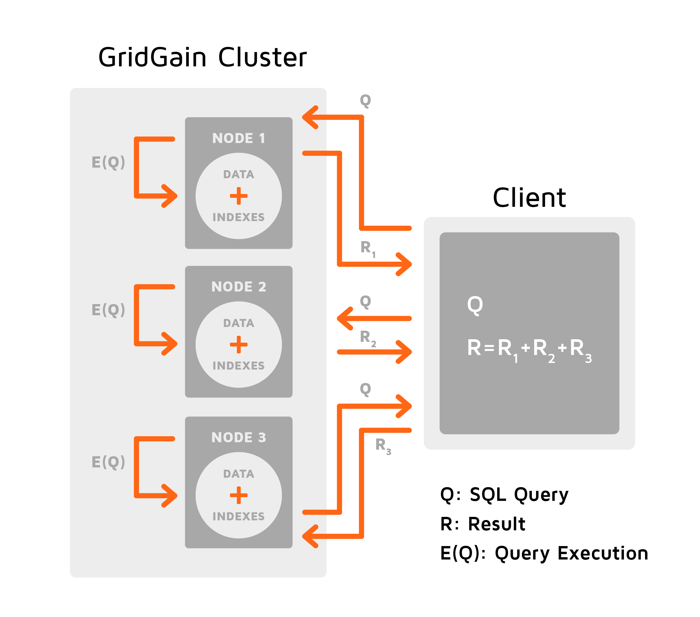
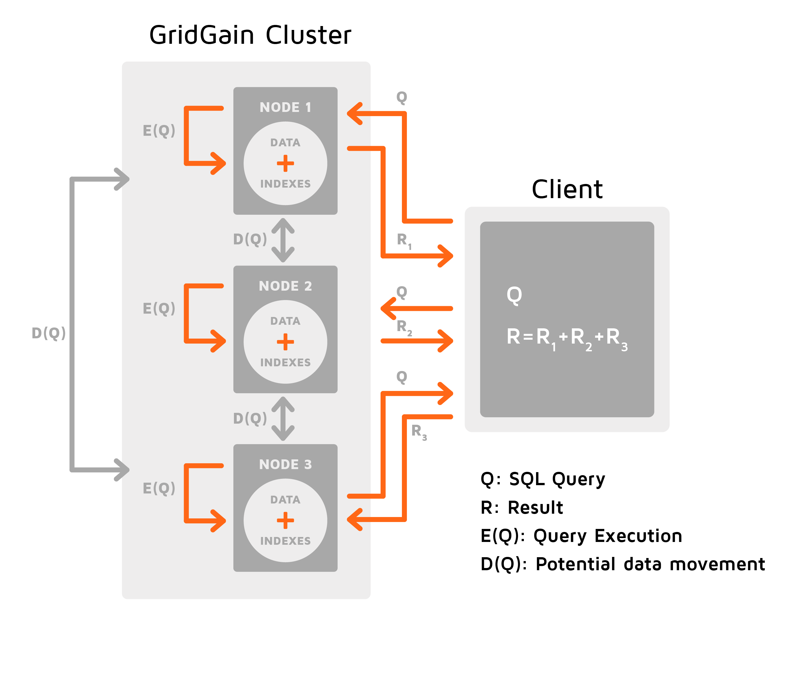

# SQL Joins

GridGain supports both `INNER` and `OUTER` `JOIN` clauses. To ensure that the joins are both functionally correct
and performant, it is important to understand the collocation model.

## Collocated Joins

If an SQL statement contains two or more tables, then these tables need to be collocated.
"Collocated" means that the related data of the two tables are stored on the same node.

The join between tables A and B is collocated if any of the following is true:

1. Either A or B (or both) is `REPLICATED`
2. The join is done on the partitioning column of both tables (affinity key)

A distributed join is an SQL statement with a join clause that combines two or more partitioned tables.
If the tables are joined on the partitioning column (affinity key), the join is called a _collocated join_.
Otherwise, it is called a _non-collocated join_.

Collocated joins are more efficient because they can be effectively distributed between the cluster nodes.

By default, GridGain treats each join query as if it is a collocated join and executes it accordingly.

The following image illustrates the procedure of executing a collocated join. A collocated join (`Q`) is sent to all the nodes that store the data matching the query condition. Then the query is executed over the local data set on each node (`E(Q)`). The results (`R`) are aggregated on the node that initiated the query (the client node).



### Limitations

Collocation joins have the following known limitations:

#### OUTER JOIN and REPLICATED Tables

There is currently a limitation in GridGain's support of `OUTER JOIN`. Given a `REPLICATED` table `R`
and a `PARTITIONED` table `P`, the following queries may not work correctly out-of-the-box and require special handling:

- `SELECT * FROM R LEFT JOIN P ON R.X = P.X`
- `SELECT * FROM P RIGHT JOIN R ON P.X = R.X`

To work around the limitation, the following setup is required:

- `P` and `R` need to have equal affinity functions (specifically, the same number of partitions);
- Caches for both `P` and `R` need to have equal [node filter](../configuring-caches/managing-data-distribution.md#node-filter);
- The join columns `R.X` and `P.X` must be the affinity keys of both tables;
note that unlike most cases this operation requires the `REPLICATED` table to have a specific affinity key;
- Non-collocated joins must be turned off (`setDistributedJoins(false)`).

If all of the above is true, then the JOIN can be performed correctly.

## Non-Collocated Joins


If your query is non-collocated, you have to enable the non-collocated mode of query execution by setting `SqlFieldsQuery.setDistributedJoins(true)`; otherwise, the results of the query execution may be incorrect.



If you often join tables, we recommend that you partition your tables on the same column (on which you join the tables).

Non-collocated joins should be reserved for cases when it is impossible to use collocated joins.


If you execute a query in a non-collocated mode, the SQL Engine executes the query locally on all the nodes that store the data matching the query condition. But because the data is not collocated, each node requests missing data (that is not present locally) from other nodes by sending either broadcast or unicast requests. This process is depicted on the image below.



If the join is done on the primary or affinity key, the nodes send `unicast` requests because they "know" the location of the missing data. Otherwise, nodes send `broadcast` requests. For performance reasons, both request types are aggregated into batches.

Example for `batched:unicast`:

```sql
FROM "PUBLIC"."PERSON" "__Z0"
    /* PUBLIC.PERSON.__SCAN_ */
INNER JOIN "PUBLIC"."ORGANIZATION" "ORG__Z1"
    /* batched:unicast PUBLIC._key_PK: ID = __Z0.ORGID */
```

Example for `batched:broadcast`: 

```sql
FROM "PUBLIC"."ORGANIZATION" "ORG__Z1"
    /* PUBLIC.ORGANIZATION.__SCAN_ */
INNER JOIN "PUBLIC"."PERSON" "__Z0"
    /* batched:broadcast PUBLIC.PERSON_ORGID_IDX: ORGID = ORG__Z1.ID */
```

Enable the non-collocated mode of query execution by setting a JDBC/ODBC parameter or, if you use SQL API, by calling `SqlFieldsQuery.setDistributedJoins(true)`.


If you use a non-collocated join on a column from a [replicated table](../../architecture/data-modeling/data-partitioning.md#replicated), the column must have an index.
Otherwise, you will get an exception.


### Limitations

The SQL query that contains subqueries has to fit into one map-reduce phase. So, if the subqueries of the query require their own phase of map-reduce, the query will fail. The below examples show what queries will work, and which will fail:

- When a query does not require a cycle of map-reduce, but the subquery does, it will work. For example:

  ```sql
  SELECT total_price / total_count as global_avg
  FROM (SELECT sum(order_count)
    AS total_count, sum(order_price)
    AS total_price FROM orders)
  ```

  In this case, the query itself is simple enough that it does not need a map-reduce cycle, so the data can be collected from other nodes.
- When the data is collocated, a query with subqueries relies on this collocation, and all required data is on the required node, it will work, for example:

  ```sql
  SELECT co.name AS country_name, ci.name AS city_name
  FROM countries co JOIN cities ci ON co.id = ci.countryId
  WHERE cities.people_cnt > (
      SELECT avg(cities.people_cnt) as avg_people_cnt
      FROM cities **WHERE cities.countryId = co.id**
  )
  ```

  In this case, there are two colocated tables countries and cities, and the subquery returns average amount people in the cities, colocated by countries. The tables are already colocated based on countries. As a result, the query is executed locally and works as expected.
- When the data is collocated, but aggregate functions inside subqueries require data from all nodes, the query will fail, for example:

  ```sql
  SELECT co.name AS country_name, ci.name AS city_name
  FROM countries co JOIN cities ci ON co.id = ci.countryId
  WHERE cities.people_cnt > (
      SELECT avg(cities.people_cnt) as avg_people_cnt
      FROM cities
  )
  ```

  In this case, there are two colocated tables countries and cities, and the subquery returns average amount people in the cities, but it does not rely on data colocation. As a result, GridGain has to collect data from all nodes first, requiring an extra map-reduce phase that cannot be executed, and the query fails.

<sub>_This page is: Copyright © 2026 MariaDB. All rights reserved._</sub>
