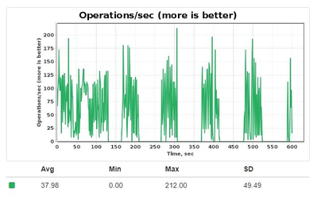

# Persistence Tuning

This article summarizes best practices for Ignite native persistence tuning.
If you are using an external (3rd party) storage for persistence needs, please refer to performance guides from the 3rd party vendor.

For additional information about checkpointing and write-ahead log (WAL), see [Native Persistence](../../architecture/storage/native-persistence.md).

## Adjusting Page Size

The `DataStorageConfiguration.pageSize` parameter should be no less than the lower of: the page size of your storage media (SSD, Flash, HDD, etc.) and the cache page size of your operating system.
The default value is 4KB.

The operating system's cache page size can be easily checked using
[system tools and parameters](https://unix.stackexchange.com/questions/128213/how-is-page-size-determined-in-virtual-address-space).

The page size of the storage device such as SSD is usually noted in the device specification. If the manufacturer does not disclose this information, try to run SSD benchmarks to figure out the number.
Many manufacturers have to adapt their drivers for 4 KB random-write workloads because a variety of standard
benchmarks use 4 KB by default. Intel confirms that 4 KB should be enough.


You should only change page size for new clusters without persistent data stored. If you need to change page size for existing cluster, recreate a cluster with required page size, or contact our support team for personalized assistance.


Once you pick the most optimal page size, apply it in your cluster configuration:



```xml
<bean class="org.apache.ignite.configuration.IgniteConfiguration">
    <property name="dataStorageConfiguration">
        <bean class="org.apache.ignite.configuration.DataStorageConfiguration">

            <!-- Set the page size to 8 KB -->
            <property name="pageSize" value="#{8 * 1024}"/>
        </bean>
    </property>
</bean>
```



```java
IgniteConfiguration cfg = new IgniteConfiguration();

// Durable memory configuration.
DataStorageConfiguration storageCfg = new DataStorageConfiguration();
        
// Changing the page size to 8 KB.
storageCfg.setPageSize(8192);

cfg.setDataStorageConfiguration(storageCfg);
```



```csharp
var cfg = new IgniteConfiguration
{
    DataStorageConfiguration = new DataStorageConfiguration
    {
        // Changing the page size to 4 KB.
        PageSize = 4096
    }
};
```



unsupported



## Keep WALs Separately

Consider using separate drives for data files and [Write-Ahead-Logging (WAL)](../../architecture/storage/native-persistence.md#write-ahead-log-wal). GridGain actively writes to both the data and WAL files. Also, other features (such as [Point-in-Time-Recovery](../../gridgain8-management/snapshots/point-in-time-recovery.md)) may also write to the WAL files, requiring even more resources. Thus, by having separate physical disk devices for each, you can double the overall write throughput.

The example below shows how to configure separate paths for the data storage, WAL, and WAL archive:



```xml
<bean class="org.apache.ignite.configuration.IgniteConfiguration">
    <property name="dataStorageConfiguration">
        <bean class="org.apache.ignite.configuration.DataStorageConfiguration">

            <!--
                Sets a path to the root directory where data and indexes are
                to be persisted. It's assumed the directory is on a separated SSD.
            -->
            <property name="storagePath" value="/opt/persistence"/>
            <property name="walPath" value="/opt/wal"/>
            <property name="walArchivePath" value="/opt/wal-archive"/>
        </bean>
    </property>
</bean>
```



```java
IgniteConfiguration cfg = new IgniteConfiguration();

// Configuring Native Persistence.
DataStorageConfiguration storeCfg = new DataStorageConfiguration();

// Sets a path to the root directory where data and indexes are to be persisted.
// It's assumed the directory is on a separated SSD.
storeCfg.setStoragePath("/ssd/storage");

// Sets a path to the directory where WAL is stored.
// It's assumed the directory is on a separated HDD.
storeCfg.setWalPath("/wal");

// Sets a path to the directory where WAL archive is stored.
// The directory is on the same HDD as the WAL.
storeCfg.setWalArchivePath("/wal/archive");

cfg.setDataStorageConfiguration(storeCfg);

// Starting the node.
Ignite ignite = Ignition.start(cfg);

```



```csharp
var cfg = new IgniteConfiguration
{
    DataStorageConfiguration = new DataStorageConfiguration
    {
        // Sets a path to the root directory where data and indexes are to be persisted.
        // It's assumed the directory is on a separated SSD.
        StoragePath = "/ssd/storage",
                    
        // Sets a path to the directory where WAL is stored.
        // It's assumed the directory is on a separated HDD.
        WalPath = "/wal",
                    
        // Sets a path to the directory where WAL archive is stored.
        // The directory is on the same HDD as the WAL.
        WalArchivePath = "/wal/archive"
    }
};
```



unsupported



## Increasing WAL Segment Size

The default WAL segment size (64 MB) may be inefficient in high load scenarios because it causes WAL to switch between segments too frequently and switching/rotation is a costly operation. Setting the segment size to a higher value may help reduce the number of switching operations. However, larger WAL segments often lead to longer fsyncs on rollovers. The resulting overall performance might be even worse than that achieved with frequent rollovers of smaller segments.

Consider increasing the WAL segment size only if:

- You see strong, direct evidence that the rollover is a performance bottleneck in your environment. To clarify: frequent rollover log messages are indirect evidence. Direct evidence is provided by.
- You have large objects and/or transactions that do not fit into the WAL segments of the default size.

See [Changing WAL Segment Size](../../architecture/storage/native-persistence.md#changing-wal-segment-size) for details.

## Increasing WAL Buffer Size

When working with large records, some of them may be too large to fit in the default WAL buffer. By default, it is configured to be a quarter of WAL segment size. This is sufficient for most use cases. Increasing the WAL Buffer size may lead to lower performance, but may be required when large records are in use.

Only consider increasing WAL buffer size to handle extra large transactions.

Here is how you can increase WAL buffer size:

```java
IgniteConfiguration cfg = new IgniteConfiguration();
DataStorageConfiguration storageCfg = new DataStorageConfiguration();
storageCfg.getDefaultDataRegionConfiguration().setPersistenceEnabled(true);

storageCfg.setWalBufferSize(64 * 1024 * 1024);

cfg.setDataStorageConfiguration(storageCfg);

Ignite ignite = Ignition.start(cfg);
```

## Changing WAL Mode

Consider other WAL modes as alternatives to the default mode. Each mode provides different degrees of reliability in
case of node failure and that degree is inversely proportional to speed, i.e. the more reliable the WAL mode, the
slower it is. Therefore, if your use case does not require high reliability, you can switch to a less reliable mode.

See [WAL Modes](../../architecture/storage/native-persistence.md#wal-modes) for more details.

## Disabling WAL

In some scenarios, [disabling the WAL](../../architecture/storage/native-persistence.md#disabling-wal) can help improve performance by reducing the number of disk-related operations. However, disabling WAL may lead to data loss in case of node or cluster failure. Buffered WAL writing modes (LOG_ONLY, BACKGROUND) aim to reduce the overhead caused by having WAL enabled, so in most scenarios it is better to leave WAL enabled.

If disabling WAL is necessary (for example, on slower drives), it is better to dynamically disable it for operations that create large load, and then re-enabling it afterwards to ensure cluster stability and data consistency:



```java
// Get the instance of the cache you plan to work on.
ignite.getOrCreateCache(cacheName);

try {
    // Disable WAL before starting a demanding operation.
    ignite.cluster().disableWal(cacheName);

    // Get the data streamer reference and stream data.
    try (IgniteDataStreamer<Integer, String> stmr = ignite.dataStreamer("myCache")) {
        // Stream entries.
        for (int i = 0; i < 100000; i++)
            stmr.addData(i, Integer.toString(i));
    }
} finally {
    // Enable WAL after the demanding operation is over.
    ignite.cluster().enableWal(cacheName);
}
```



```csharp
// Get the instance of the cache you plan to work on.
var cacheName = "myCache";

try {
    // Disable WAL before starting a demanding operation.
    ignite.GetCluster().DisableWal(cacheName);

    // Get the data streamer reference and stream data.
    using (var stmr = ignite.GetDataStreamer<int, string>("myCache"))
    {
        for (var i = 0; i < 1000; i++)
            stmr.Add(i, i.ToString());
    }
} finally {
    // Enable WAL after the demanding operation is over.
    ignite.GetCluster().EnableWal(cacheName);
}
```



unsupported



Doing this reduces the risk of disabling WAL, but does not completely remove it. If a node with data fails, or you have cluster-wide failure during the operation, it is still possible that this causes the loss of data, as WAL is normally used to safely recover in these scenarios.

Setting the `WALMode` property to `NONE` is generally not recommended, as it risks data on the cluster for a relatively minor performance benefit, and may lead to data corruption.

## Pages Writes Throttling

GridGain periodically starts the [checkpointing process](../../architecture/storage/native-persistence.md#checkpointing) that syncs dirty pages from memory to disk. A dirty page is a page that was updated in RAM but was not written to a respective partition file (an update was just appended to the WAL). This process happens in the background without affecting the application's logic.

However, if a dirty page, scheduled for checkpointing, is updated before being written to disk, its previous state is copied to a special region called a checkpointing buffer.
If the buffer gets overflowed, GridGain will stop processing all updates until the checkpointing is over.
As a result, write performance can drop to zero as shown in​ this diagram, until the checkpointing cycle is completed:



The same situation occurs if the dirty pages threshold is reached again while the checkpointing is in progress.
This will force GridGain to schedule one more checkpointing execution and to halt all the update operations until the first checkpointing cycle is over.

Both situations usually arise when either a disk device is slow or the update rate is too intensive.
To mitigate and prevent these performance drops, consider enabling the pages write throttling algorithm.
The algorithm brings the performance of update operations down to the speed of the disk device whenever the checkpointing buffer fills in too fast or the percentage of dirty pages soar rapidly.


**Pages Write Throttling in a Nutshell**

Refer to the [Ignite wiki page](https://cwiki.apache.org/confluence/display/IGNITE/Ignite+Persistent+Store+-+under+the+hood#IgnitePersistentStore-underthehood-PagesWriteThrottling)
maintained by Apache Ignite persistence experts to get more details about throttling and its causes.


The example below shows how to enable write throttling:



```xml
<bean class="org.apache.ignite.configuration.IgniteConfiguration">
    <property name="dataStorageConfiguration">
        <bean class="org.apache.ignite.configuration.DataStorageConfiguration">

            <property name="writeThrottlingEnabled" value="true"/>

        </bean>
    </property>
</bean>
```



```java
IgniteConfiguration cfg = new IgniteConfiguration();

// Configuring Native Persistence.
DataStorageConfiguration storeCfg = new DataStorageConfiguration();

// Enabling the writes throttling.
storeCfg.setWriteThrottlingEnabled(true);

cfg.setDataStorageConfiguration(storeCfg);
// Starting the node.
Ignite ignite = Ignition.start(cfg);
```



```csharp
var cfg = new IgniteConfiguration
{
    DataStorageConfiguration = new DataStorageConfiguration
    {
        WriteThrottlingEnabled = true
    }
};
```



unsupported



### Tuning Maximum Dirty Pages Ratio

GridGain creates a checkpoint once the share of dirty pages in a data region reaches a fixed ratio.

If throttling is disabled, the ratio is set to 0.66 (66% of the page pool) and cannot be changed. This avoids possible checkpoint buffer overflow.

When throttling is enabled, the ratio is configurable and also applies to the throttling curve. By default, the ratio is `0.75` (75% of the page pool). You can change this ratio with the `IGNITE_THROTTLE_MAX_DIRTY_PAGES_RATIO` system property. The property accepts a value greater than `0.5` and up to `0.99999`. Values outside this range are ignored, and GridGain falls back to the default `0.75` with a warning in the log.

## Adjusting Checkpointing Buffer Size

The size of the checkpointing buffer, explained in the previous section, is one of the checkpointing process triggers.

The default buffer size is calculated as a function of the [data region](../../gridgain8-usage/memory-configuration/data-regions.md) size:

| Data Region Size | Default Checkpointing Buffer Size |
|---|---|
| < 1 GB | MIN (256 MB, Data_Region_Size) |
| between 1 GB and 8 GB | Data_Region_Size / 4 |
| > 8 GB | 2 GB |

The default buffer size can be suboptimal for write-intensive workloads because the page write
throttling algorithm will slow down your writes whenever the size reaches the critical mark. To keep write
performance at the desired pace while the checkpointing is in progress, consider increasing
`DataRegionConfiguration.checkpointPageBufferSize` and enabling write throttling to prevent performance​ drops:



```xml
<bean class="org.apache.ignite.configuration.IgniteConfiguration">
    <property name="dataStorageConfiguration">
        <bean class="org.apache.ignite.configuration.DataStorageConfiguration">

            <property name="writeThrottlingEnabled" value="true"/>

            <property name="defaultDataRegionConfiguration">
                <bean class="org.apache.ignite.configuration.DataRegionConfiguration">
                    <!-- Enabling persistence. -->
                    <property name="persistenceEnabled" value="true"/>
                    <!-- Increasing the buffer size to 1 GB. -->
                    <property name="checkpointPageBufferSize" value="#{1024L * 1024 * 1024}"/>
                </bean>
            </property>

        </bean>
    </property>
</bean>
```



```java
IgniteConfiguration cfg = new IgniteConfiguration();

// Configuring Native Persistence.
DataStorageConfiguration storeCfg = new DataStorageConfiguration();
        
// Enabling the writes throttling.
storeCfg.setWriteThrottlingEnabled(true);

// Increasing the buffer size to 1 GB.
storeCfg.getDefaultDataRegionConfiguration().setCheckpointPageBufferSize(1024L * 1024 * 1024);

cfg.setDataStorageConfiguration(storeCfg);

// Starting the node.
Ignite ignite = Ignition.start(cfg);
```



```csharp
var cfg = new IgniteConfiguration
{
    DataStorageConfiguration = new DataStorageConfiguration
    {
        WriteThrottlingEnabled = true,
        DefaultDataRegionConfiguration = new DataRegionConfiguration
        {
            Name = DataStorageConfiguration.DefaultDataRegionName,
            PersistenceEnabled = true,
                        
            // Increasing the buffer size to 1 GB.
            CheckpointPageBufferSize = 1024L * 1024 * 1024
        }
    }
};
```



unsupported



In the example above, the checkpointing buffer size of the default region is set to 1 GB.

## Enabling Direct I/O

Usually, whenever an application reads data from disk, the OS gets the data and puts it in a file buffer cache first.
Similarly, for every write operation, the OS first writes the data in the cache and transfers it to disk later. To
eliminate this process, you can enable Direct I/O in which case the data is read and written directly from/to the
disk, bypassing the file buffer cache.

The Direct I/O module in GridGain is used to speed up the checkpointing process, which writes dirty pages from RAM to disk. Consider using the Direct I/O plugin for write-intensive workloads.


**Direct I/O and WALs**

Note that Direct I/O cannot be enabled specifically for WAL files. However, enabling the Direct I/O module provides
a slight benefit regarding the WAL files as well: the WAL data will not be stored in the OS buffer cache for too long;
it will be flushed (depending on the WAL mode) at the next page cache scan and removed from the page cache.


You can enable Direct I/O, move the `{gridgain_dir}/libs/optional/ignite-direct-io` folder to the upper level `libs/optional/ignite-direct-io` folder in your GridGain distribution or as a Maven dependency as described [here](../../gridgain8-usage/setup.md#enabling-modules).

You can use the `IGNITE_DIRECT_IO_ENABLED` system property to enable or disable the plugin at runtime.

Get more details from the [Ignite Direct I/O Wiki section](https://cwiki.apache.org/confluence/display/IGNITE/Ignite+Persistent+Store+-+under+the+hood#IgnitePersistentStore-underthehood-DirectI/O).

## Purchase Production-Level SSDs

Note that the performance of Ignite Native Persistence may drop after several hours of intensive write load due to
the nature of how
[SSDs are designed and operate](http://codecapsule.com/2014/02/12/coding-for-ssds-part-2-architecture-of-an-ssd-and-benchmarking).
Consider buying fast production-level SSDs to keep the performance high or switch to non-volatile memory devices like
Intel Optane Persistent Memory.

## SSD Over-provisioning

Performance of random writes on a 50% filled disk is much better than on a 90% filled disk because of the SSDs over-provisioning.

Consider buying SSDs with higher over-provisioning rates and make sure the manufacturer provides the tools to adjust it.


**Intel 3D XPoint**

Consider using 3D XPoint drives instead of regular SSDs to avoid the bottlenecks caused by a low over-provisioning
setting and constant garbage collection at the SSD level.
Read more [here](http://dmagda.blogspot.com/2017/10/3d-xpoint-outperforms-ssds-verified-on.html).


<sub>_This page is: Copyright © 2026 MariaDB. All rights reserved._</sub>
