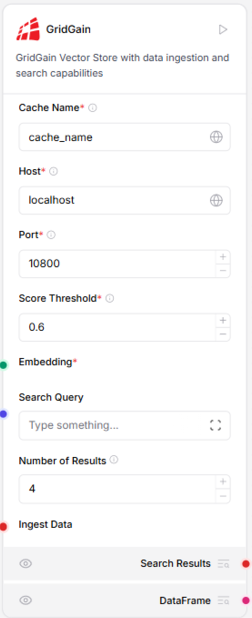
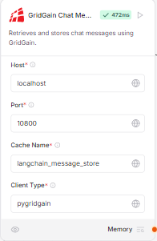

# Langflow Integration

GridGain provides Langflow components that can be used to supercharge your AI workflow with full power of GridGain. This version is based on Langflow 1.4.2 and can be used to start working with GridGain vector store components before they are available in the official Langflow release.

GridGain Langflow module is currently in early access. To use GridGain in Langflow, download the early access version and follow the steps below.

## Prerequisites

The following is required to install early access Langflow integration:

- uv 0.4 or newer. Installation instructions are available in the [ud documentation](https://docs.astral.sh/uv/getting-started/installation/);
- Node.js 22.12;
- npm 10.9.

## Using Early Access Version

GridGain provides early access version of Langflow components in a prebuilt Langflow fork that includes GridGain components. To use Langflow:

- Download the latest version from [GridGain website](https://www.gridgain.com/media/langflow/langflow-1.1.13.gridgain.3.zip).
- Unpack the downloaded archive.

After the archive is downloaded, you need to configure local version of Langflow

### Linux or MacOS Configuration

You can quickly configure a local langflow installation by using the provided makefile.

```bash
make init
```

Detailed instructions are available in the [Langflow Development Guide](https://github.com/langflow-ai/langflow/blob/main/DEVELOPMENT.md).

### Windows

Instead of running Langflow natively on Windows, we recommend running a Linux environment in WSL. If it is configured, you can start Langflow by performing the `make init` command. This command performs the following operations:

- Installs backend dependencies
- Installs frontend dependencies
- Builds frontend static files
- Initializes the project
- Starts the application

## Langflow Components

### GridGain Vector Store



Vector databases in Langflow store vector data, which backs AI workloads like chatbots and Retrieval Augmented Generation. Vector database components establish connections to existing vector databases or create in-memory vector stores for storing and retrieving vector data. GridGain vector store component implements a vector store by using GridGain.

#### Inputs

|Name|Type|Description|
|---|---|---|
|`cache_name`|`String`|Required. The name of the cache within GridGain where vectors will be stored.|
|`host`|`String`|Required. GridGain server host address.|
|`port`|`Integer`|Required. GridGain server port number.|
|`score_threshold`|`Float`|Required. Minimum similarity score threshold for search results. Default value: 0.6.|
|`ingest_data`|`Ingest Data`|Data to be ingested into the vector store.|
|`embedding`|`Embeddings`|Embedding model to use for vector creation.|
|`search_query`|`String`|Query string for similarity search.|
|`number_of_results`|`Integer`|Number of results to return in similarity search Default value: 4.|

#### Outputs

|Name|Type|Description|
|---|---|---|
|`vector_store`|GridGainVectorStore|Built GridGain vector store instance.|
|`search_results`|List[Data]|Results of the similarity search as a list of Data objects.|

### GridGainChatMemory Component



Memory components in Langflow store and retrieve chat messages by session_id. They are distinct from vector store components, because they are built specifically for storing and retrieving chat messages from external databases. Memory components provide access to their respective external databases as memory. This allows Large Language Models (LLMs) or agents to access external memory for persistence and context retention. This component creates a chat message history using GridGain, enabling storage and retrieval of chat messages using GridGain's distributed caching capabilities.

#### Inputs

|Name|Type|Description|
|---|---|---|
|`host`|String|Required. GridGain server host address. Default value: "localhost".|
|`port`|String|Required. GridGain server port number. Default value: "10800".|
|`cache_name`|String|Required. Name of the cache for storing messages. Default value: "langchain_message_store".|
|`session_id`|MessageText|Chat session ID. Uses current session ID if not provided.|
|`client_type`|String|Required. Type of client to use. Must be pyignite or pygridgain.|

#### Outputs

|Name|Type|Description|
|---|---|---|
|`message_history`|BaseChatMessageHistory|An instance of GridGainChatMessageHistory for the session.|

## Langflow Tutorial

GridGain provides a Langflow tutorial that shows how to use it to solve real world problems. Full tutorial is available in the  [Low-Code RAG Application Building with GridGain and Langflow](https://www.gridgain.com/docs/tutorials/vector/langflow) section.
