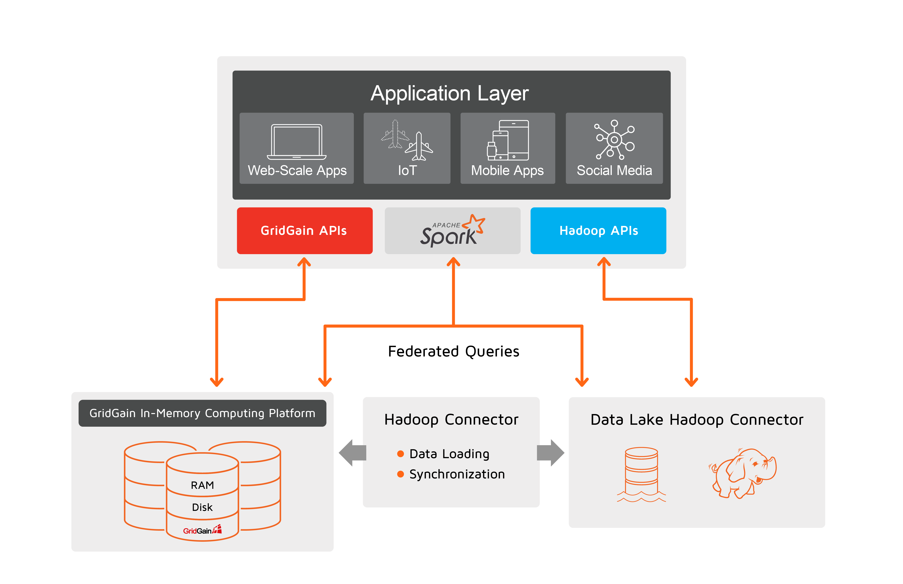

# Getting Started

Data lakes such as those powered by Hadoop are an excellent choice for analytics and reporting at scale. Hadoop scales horizontally and cost-effectively and fulfills long-running operations spanning big data sets.

The continual growth of real-time analytics use cases and a need to query both operational and historical data sets — where operations have to be completed in seconds rather than minutes, or milliseconds rather than seconds — has brought new challenges. Yet many continue to try to rely on data lakes for the new requirements, overlooking the fact that data lakes are designed for high-latency workloads and batch processing.

At the same time, regular complex analytics have to co-exist with new real-time workloads. For instance, Hadoop as a data lake has to stay in a refined architecture while offloading real-time operations to faster storage.

GridGain is a bridge into real-time analytics for data lakes including Hadoop. GridGain serves as an HTAP storage designated for low-latency and high-throughput operations while data lakes continue to be used for long-running OLAP workloads.

## GridGain Data Lake Accelerator

GridGain Data Lake Accelerator is a solution architecture that enables real-time analytics across operational and historical data silos for existing data lakes deployments. Below are the primary components of the solution:

**First**, with this architecture, GridGain is deployed as a separate distributed storage that keeps data preloaded from Hadoop required for low-latency operations and reports. The data sits in the GridGain multi-tiered storage that spans across RAM, disk, and Intel Optane Persistent Memory.

**Second**, the application layer uses the GridGain cluster directly. GridGain provides SQL and key-value APIs for standard data access patterns as well as compute (aka map reduce) and machine learning interfaces for data and compute-intensive in-memory calculations with minimal or no data movement over the network.

**Third**, whenever an application needs to run federated or cross-database queries where an operation joins data stored in both GridGain and Hadoop, it can use Apache Spark. GridGain is integrated with Spark, which natively supports Hive/Hadoop. Cross-database queries should be considered only for a limited number of scenarios when neither GridGain nor Hadoop contains the entire data set. See the [cross-database queries](cross-database-queries.md) section for more details.

### GridGain Hadoop Connector

**GridGain Hadoop Connector** is a set of tools that simplify GridGain and Hadoop cluster production deployments and maintenance. The pack helps with initial data loading from Hadoop to GridGain, bi-directional data synchronization between two, and changed data capture procedures. In particular:

- **Initial data loading from Hadoop to GridGain** - can be accomplished with Spark Loader, Hive Store, or Apache Sqoop Integration. If Apache Spark is already in use in your architecture then use Spark Loader as the default option. Hive Store better suits deployments without Spark, and it allows you to import a Hive schema and convert it to a GridGain configuration via GridGain Nebula. The Scoop integration is best for scenarios when neither Spark Loader nor Hive Store can be used for initial data loading.
- **Change data capture** - Apache Sqoop Integration is the preferred way to keep your Hadoop and GridGain clusters in sync. It works bi-directionally. Hive Store can be used to synchronize updates from GridGain to Hadoop only.
- **Cross-database queries** (aka. federated queries) - Spark DataFrames APIs can be used in cases where a data set needed for a certain business operation/query/report spans GridGain and Hadoop. Don't rely on this capability too much though, because Spark will transfer data over the network, reducing the performance. Try to have all the data needed for GridGain queries in the GridGain cluster and use the native APIs.

## Getting Started

- Download the latest GridGain Enterprise or Ultimate Edition: [http://gridgain.com/tryfree](http://gridgain.com/tryfree#gridgain8-datalake)
- If you're new to GridGain, follow the [GridGain Getting Started Guide](../../gridgain8-get-started/quick-start/README.md) to get your first cluster up and running.
- Decide which operations will be executed against GridGain. The best candidates are operations for which low-latency response time, high-throughput, and real-time analytics are required. Set up your GridGain cluster's memory and native persistence configuration, and begin data modeling. Hive Store can be used for model importing from Hive to GridGain.
- Accomplish initial data loading from Hadoop to GridGain.
- Start updating your applications layer. Decide which APIs to use for the GridGain cluster - the most widely used for this use case are SQL, Compute Grid (map-reduce framework), and Machine Learning with Deep Learning. Optimize your GridGain settings based on the chosen APIs.
- Enable synchronization between GridGain and Hadoop if needed. Refer to Apache Sqoop Integration or Hive Store.
