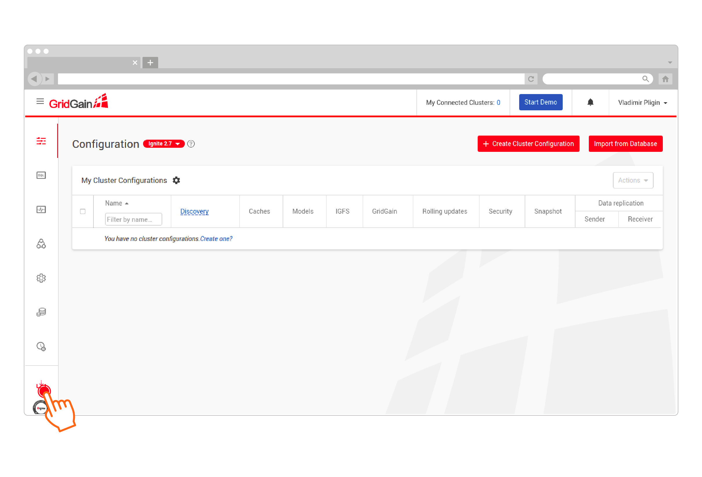
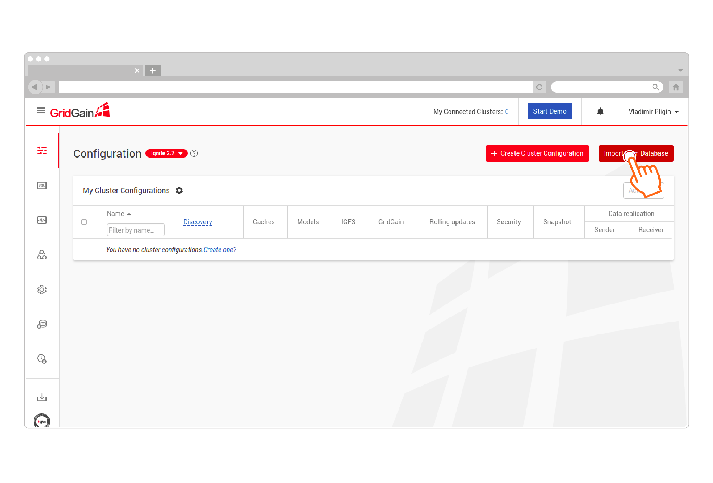
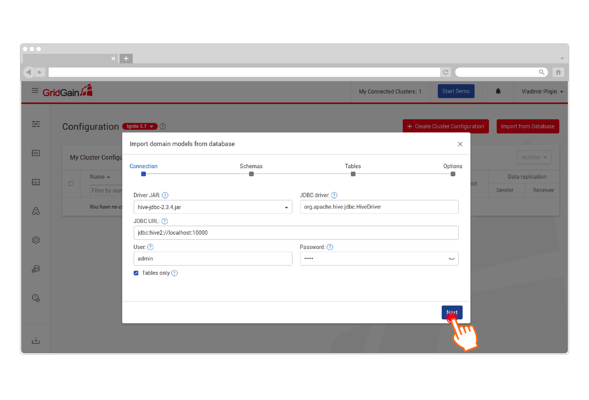
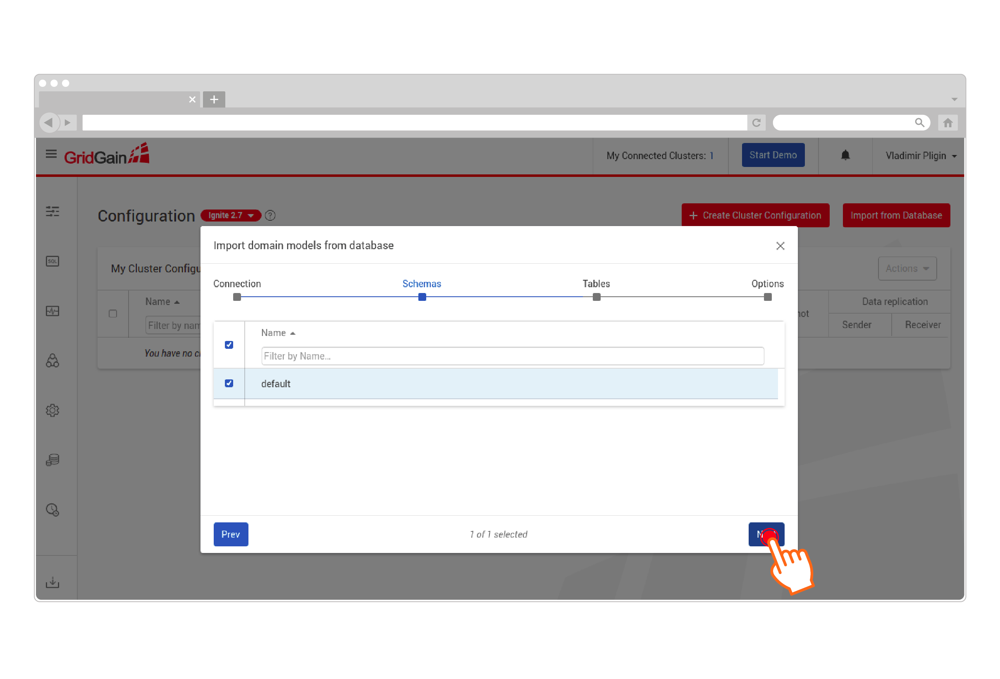
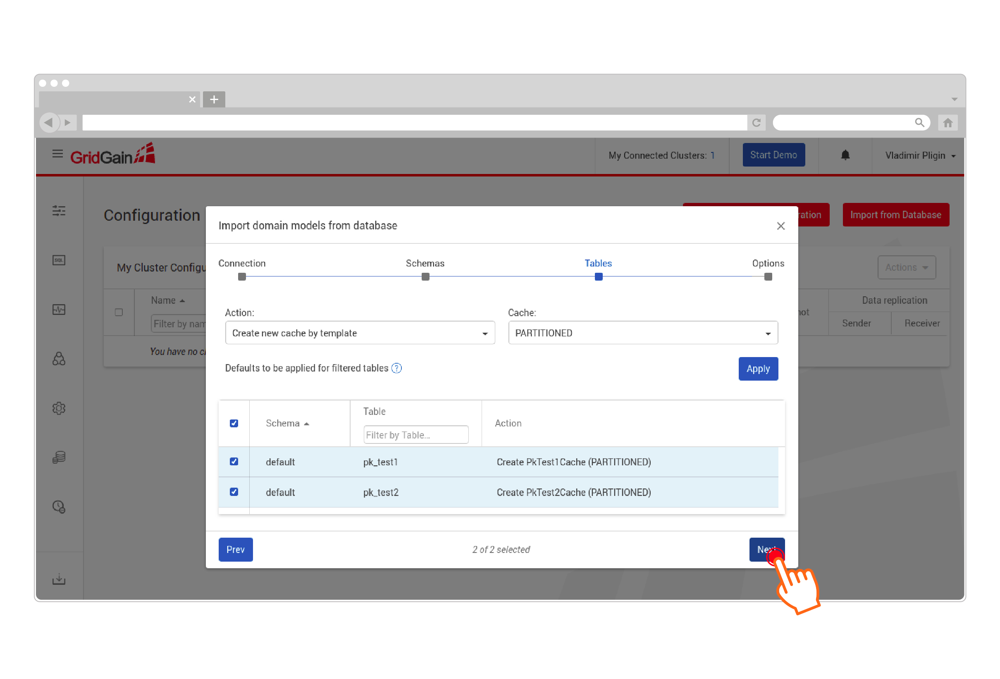
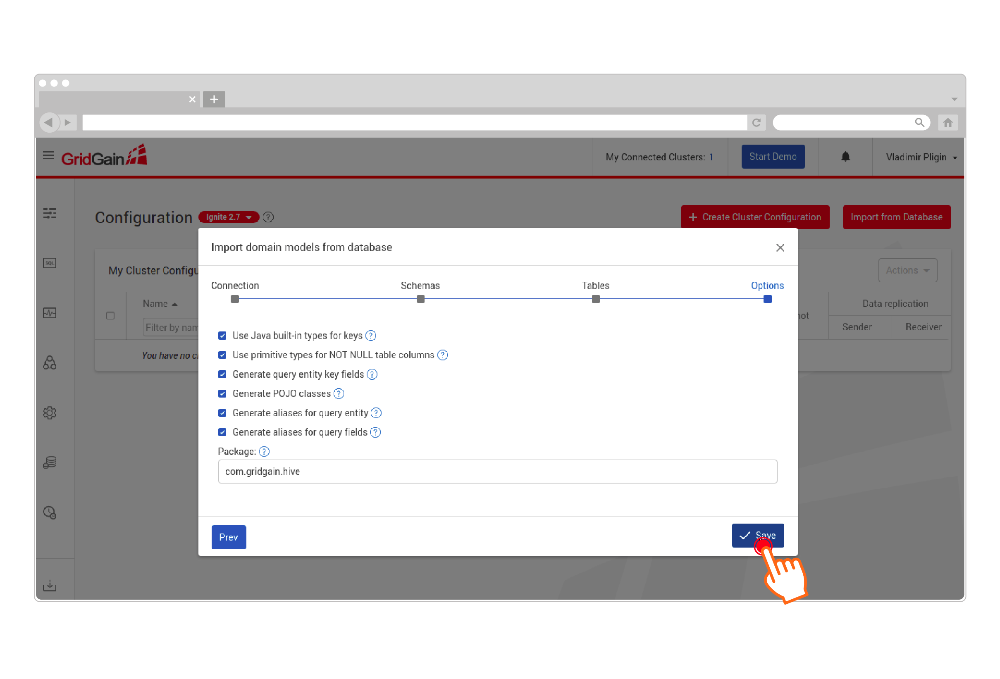
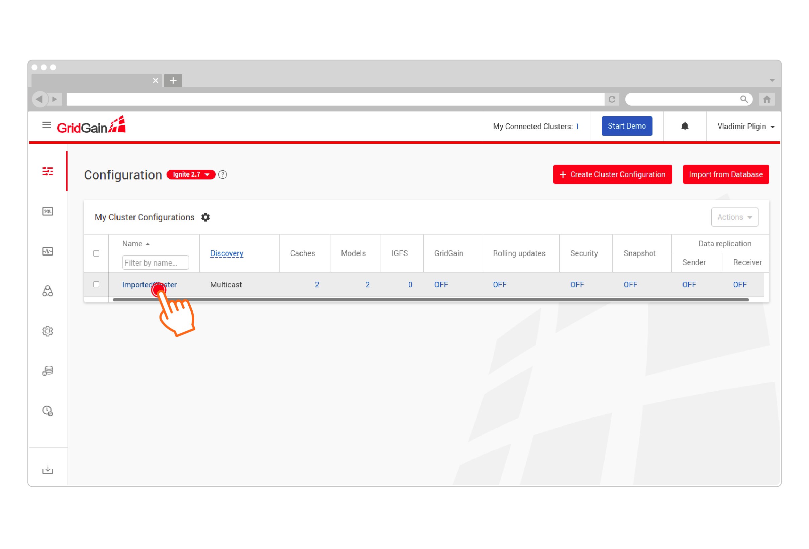
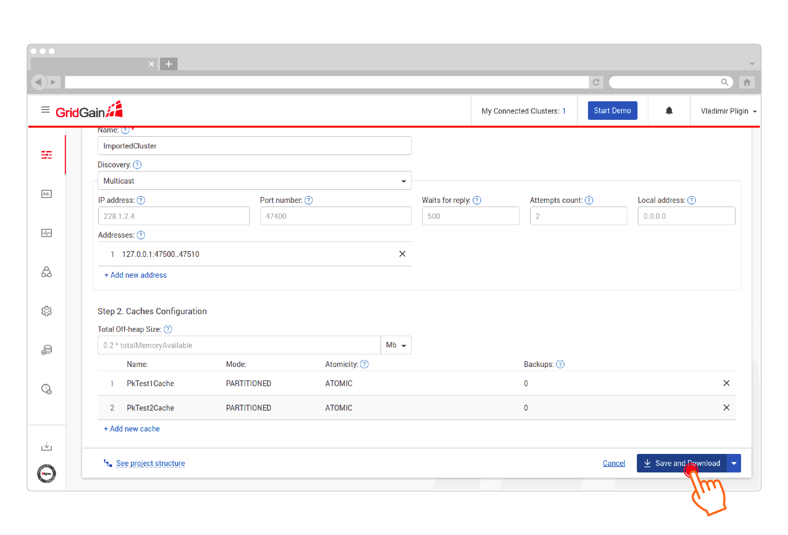

# Loading and Synchronizing With Hive Store

This document explains how to set up GridGain Hive Store and use it for:

- Schema importing
- Initial data loading
- Synchronization between GridGain and Hadoop

## Prerequisites

1. Install GridGain following this [Getting Started guide](getting-started.md).
2. Create an account in [GridGain Nebula](https://www.gridgain.com/docs/nebula/about/overview).
3. Ensure that the following versions are used: Apache Hadoop version 2.x and Apache Hive 2.x with configured transactions.
4. Run **hiveserver2** in order to enable JDBC connections to the Hive cluster.

Refer to the [official Apache Hive documentation](https://cwiki.apache.org/confluence/display/Hive/Hive+Transactions) about transaction manager and related properties.

You must also have the **transactional property** enabled at the table level, for example:

```sql
CREATE TABLE test_pk1 (
  id Integer,
  value String,
  PRIMARY KEY (id)  DISABLE NOVALIDATE
) STORED AS ORC TBLPROPERTIES ('transactional'='true');
```

## Schema Importing

1. Go to GridGain Nebula, sign up or sign in if you already have an account.
2. Download Web Agent from GridGain Nebula:

   
3. Configure Web Agent. The extracted package should contain the corresponding Hive JDBC driver in the jdbc-drivers directory. The driver's dependencies should be included in the java class path of the Web Agent. One possible solution is to place required jars in the Web Agent root directory.
4. Click Import from Database:

   
5. Configure your Hive JDBC connection to allow Web Agent to collect metadata from the target Hive installation:

   
6. Select schema(s) to import:

   
7. Select the desired tables and configure the cache template:

   
8. Configure the results of project generation:

   
9. Go to the generated configuration page:

   
10. Fill in the configuration fields and click Save and Download. GridGain Nebula will generate a maven project and implement the Hive CacheStore and cluster configurations:

    
11. Place the Hive JDBC driver in the application java classpath. Here's an example maven dependency:

    ```xml
    <dependency>
    	<groupId>org.apache.hive</groupId>
         <artifactId>hive-jdbc</artifactId>
         <version>2.3.4</version>
         <exclusions>
             <exclusion>
                <groupId>org.eclipse.jetty.aggregate</groupId>
                <artifactId>jetty-all</artifactId>
             </exclusion>
         </exclusions>
    </dependency>
    ```

    The JDBC driver should be loaded before GridGain caches start:

    ```java
    try {
        Class.forName("org.apache.hive.jdbc.HiveDriver");
    } catch (ClassNotFoundException e) {
        throw new IllegalStateException("No org.apache.hive.jdbc.HiveDriver", e);
    }
    ```
12. Edit the generated `secret.properties` file located in `src/main/resources/secret.properties` and add the Hive connection details.
13. Run `ServerNodeSpringStartup` or `ServerNodeCodeStartup` (the two classes use different types of configuration).

## Data Loading and Synchronization

This section shows how to use `HiveCacheJdbcPojoStore` for data loading and synchronization:

1. Add the corresponding GridGain Hadoop Connector dependency to the generated project pom:

   ```xml
    <dependency>
        <groupId>org.gridgain.plugins</groupId>
        <artifactId>gridgain-hive-store</artifactId>
        <version>8.10</version>
    </dependency>
   ```
2. Replace instances of `org.apache.ignite.cache.store.jdbc.CacheJdbcPojoStoreFactory` with `org.gridgain.cachestore.HiveCacheJdbcPojoStoreFactory`:

   ```java
   HiveCacheJdbcPojoStoreFactory cacheStoreFactory = new HiveCacheJdbcPojoStoreFactory();
   ```
3. Set `streamerEnabled` to true to enable more efficient data loading:

   ```java
   cacheStoreFactory.setStreamerEnabled(true);
   ```

## Write-through and read-through

Both `org.apache.ignite.cache.store.jdbc.CacheJdbcPojoStore` and `org.gridgain.cachestore.HiveCacheJdbcPojoStore` are based on the read-through and write-through cache capabilities.

Read more about these concepts in [Database Caching](https://ignite.apache.org/use-cases/caching/database-caching.html) and [Read-Through and Write-Through](../../gridgain8-development/persistence/external-storage.md).

The generated project will already contain the code that enables this functionality.

```java
CacheConfiguration ccfg = new CacheConfiguration();
ccfg.setReadThrough(true);
ccfg.setWriteThrough(true);
```
