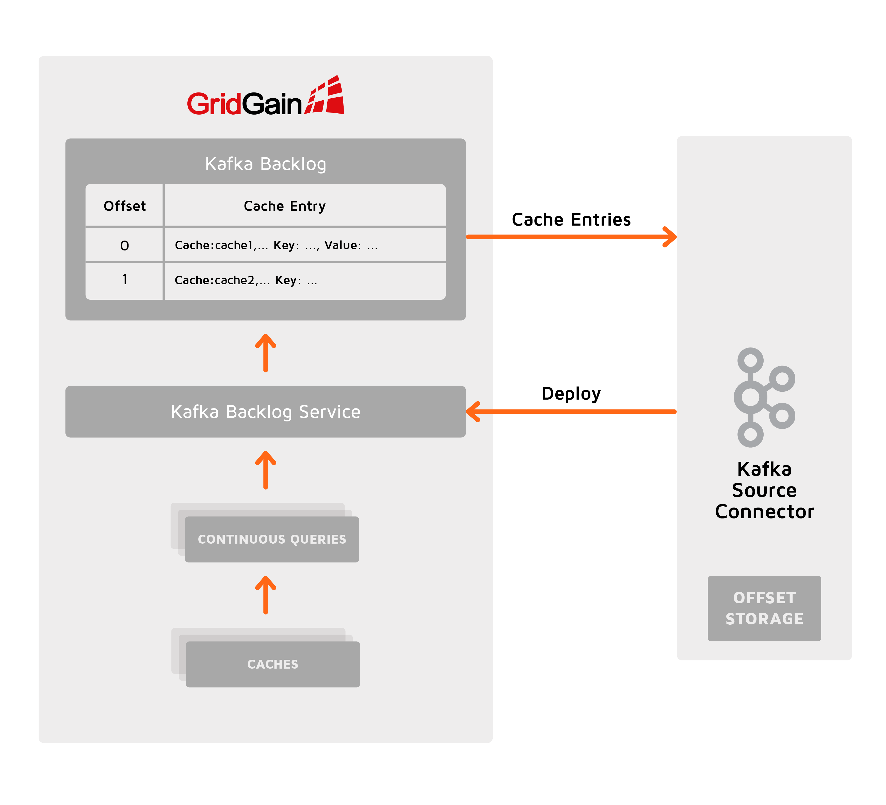

# Kafka Connector Architecture

## Source Connector

GridGain Source Connector loads data from Ignite caches into Kafka topics. The Connector monitors Ignite for new and deleted caches and adapts automatically.

### Parallelism

In Kafka a **partition** is a stream of key/value/timestamp records. Like any distributed system, Kafka distributes partitions among nodes to achieve high availability, scalability, and performance.
Kafka Connect architecture is hierarchical: a **Connector** splits input into partitions, creates multiple **Tasks**, and assigns one or many partitions to each task. The maximum number of tasks is configurable.

GridGain Source Connector treats **each Ignite cache as a partition**. In other words, the load is balanced by cache: having only one cache to load data from implies non-distributed (standalone) GridGain-Kafka Source Connector operation.

In Kafka, partitions are stored in **Topics** (that Kafka **Producers** write to and Kafka **Consumers** read from). Thus, the GridGain-Kafka Source Connector maps data between Ignite caches and Kafka topics.

### Failover, Rebalancing and Partition Offsets

**Rebalancing** refers to the re-assignment of Kafka connectors and tasks to **Workers** (JVM processes running on Kafka nodes). Rebalancing can happen when:

- Nodes join or leave a Kafka cluster.
- GridGain-Kafka Source Connector detects that an Ignite cache (a **partition** in Kafka terminology) was added or removed and requests to re-balance itself.

Kafka Connect provides source partition **offset** storage (do not mix with Kafka record offsets) to support resuming pulling data after rebalancing or restart due to a failure or for any other reason. Without offsets the Connector has to either re-load all data from the beginning or lose data generated during the Connector unavailability period. For example, Confluent’s File Source connector treats files as partitions and position within a file as an offset. As another example, the Confluent’s JDBC Connector treats database tables as partitions and the incremental or timestamp field value as an offset.

GridGain Source Connector takes a **cache** as a **partition** and there is no notion of an **offset** that would be applicable to a cache in general. Although real life Ignite data models might have caches with incremental keys or incremental value fields, that would not be as common as in relational or NoSQL data models. A Kafka connector requiring all caches to include incremental fields would severely limit applicability.

Thus, GridGain Kafka Connector exposes different policies to manage failover and rebalancing as a compromise between performance, resource consumption, and data delivery guarantees. The options are specified with the `failoverPolicy` configuration option.

#### None

Any Ignite cache updates that happen during the Connector downtime due to failover or rebalancing are lost. This option provides maximum performance at the cost of losing data.

#### Full Snapshot

Pull all data from the Ignite caches each time the Connector starts. Always loading all data after re-balancing or failover does not violate Kafka guarantees: injecting duplicate data into Kafka is allowed. However, Ignite is designed to store really big data and performing a full data reload every time the Connector restarts is not feasible unless all of the caches are small.

#### Backlog

Resume from the last committed offset.

The Connector creates a special Kafka Backlog cache in Ignite where data from all caches are replicated and assigned offsets. The Kafka Backlog cache is managed by Kafka Backlog Service, which survives Kafka Connector failures. The Connector pulls data from the Kafka Backlog committing the processed data offsets and resuming from the last committed offset after a failure or rebalancing. The Kafka Backlog Service is undeployed and the Kafka Backlog cache is destroyed when the Connector is gracefully stopped.

Configure `backlogMemoryRegionName` to customise Backlog Cache memory limits, persistence, and other storage options.

This option supports **exactly once** processing semantics but consumes additional Ignite resources to manage the Kafka backlog cache. This is also less efficient due to extra data marshalling and does not survive Ignite cluster restart.


**Configure Kafka Backlog Data Region in Ignite**

When Kafka Backlog is used to manage failover, you must configure a data region in Ignite dedicated to the Kafka Backlog. Configure an eviction policy for the data region to avoid the Backlog growing indefinitely. Set data region maximum size to a value large enough to avoid losing data in the worst case scenario. To understand the "worst case" scenario remember that there is no Kafka Backlog throttling: Ignite pushes entries to the Kafka Backlog at the speed the entries appear in the source caches. The Source Connector constantly polls the Kafka backlog and injects the data into Kafka. If Kafka does not catch up with the Ignite ingestion performance or Kafka becomes unavailable, the data might be evicted from the Backlog without being injected into Kafka. Thus, the Backlog data region maximum size must be enough to keep all data streamed into Kafka at the maximum rate during the longest possible downtime duration.
The default Backlog data region name is `kafka-connect` and you can use the `backlogMemoryRegionName` configuration setting to assign a different name.


### Dynamic Reconfiguration

Kafka Connector monitors new caches matching `cacheWhitelist` and `cacheBlacklist` created in Ignite and existing caches removed while the Connector is running. The Connector automatically re-configures itself and Kafka re-balances the work if a monitored cache is dynamically created or destroyed.

### Initial Data Load

The `shallLoadInitialData` configuration setting controls whether to load data already existing in Ignite caches at the time the Connector starts.

## Sink Connector

GridGain Sink Connector exports data from Kafka topics to Ignite caches. The caches are created in Ignite if missing.

### Parallelism

The Sink Connector starts one or more Tasks (the number of tasks is specified in the `tasks.max` configuration parameter) and distributes the tasks among the available Workers. Each task pulls data from topics specified in the `topics` configuration parameter, groups them into batches, and pushes batches to caches corresponding to the topics.

### Failover, Rebalancing and Partition Offsets

The Connect framework auto-commits offsets of the processed data and resumes pulling data from Kafka from the last committed offset if the Connector is restarted. This provides the "exactly once" processing guarantee.

## Common Features

### Serialization and Deserialization

Serialization happens when Source Connector injects records into Kafka. Deserialization happens when Sink Connector consumes records into Kafka.

Kafka separates serialization from Connectors. Use `key.converter` and `value.converter` Kafka Worker configuration settings to specify class name of a pluggable **Converter** module responsible for serialization.

GridGain Kafka Connector package includes `org.gridgain.kafka.IgniteBinaryConverter`, which serializes data using Ignite Binary marshaller. This Converter provides maximum performance for schema-less data since it is native for Ignite Binary Objects that the Connectors work with. `IgniteBinaryConverter` supports Kafka schema serialization and thus can be used when schemas are enabled.

Alternative converters from other vendors are available, which could provide a rich set of additional features like Schema registry with schema versioning.

### Filtering

Both the Source and Sink Connector allow filtering data pulled from or pushed to Ignite caches.

Use the `cacheFilter` configuration setting to specify the class name of a custom serializable `java.util.function.Predicate<org.gridgain.kafka.CacheEntry>` implementation.

### Transformations

Kafka **Single Message Transforms** (SMTs) allow configuration-based alterations of the messages structure and contents. Read the [Kafka documentation](http://kafka.apache.org/documentation.html#connect_transforms) to learn how to configure the SMTs.

### Data Schemas

See [Kafka Connector Data Schema](data-schema.md).

## Error Handling

Various errors may occur during the source or sink connector operation:

- Errors at the Kafka side
- Errors at the GridGain side, for example:
  - Source connector failed to infer the Kafka schema for a particular cache entry
  - Sink connector failed to write an incoming record due to a schema conflict at the recipient cluster
  - Connectivity issues between the sink connector and the GridGain cluster

By default, an error of any type will cause the connector to stop the task in which the error has occurred. Out-of-the-box, Kafka enables you to customize the Kafka-side error handling. Learn more from [this blog](https://www.confluent.io/blog/kafka-connect-deep-dive-error-handling-dead-letter-queues/).

Starting from GridGain 8.9.14, Kafka Connector provides the `errorHandlingPolicy` option that allows you to customize the GridGain-side errors handling for [sources](configuration.md#source-connector) and [sinks](configuration.md#sink-connector).
