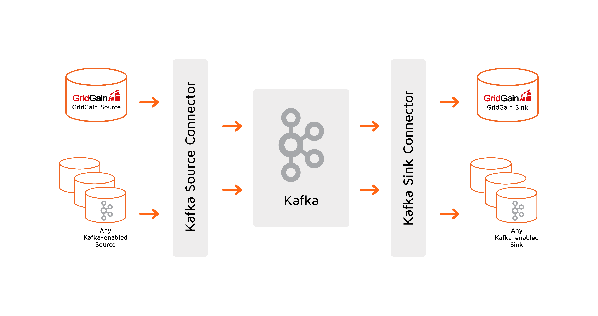

# Certified Kafka Connector

Kafka Connector integrates Kafka with Apache Ignite making it easy to add Apache Ignite to a Kafka pipeline-based system.

Kafka Connector is scalable and resilient and takes care of many integration challenges that otherwise would have to be manually addressed if you used Kafka Producer and Consumer APIs directly.

## Kafka Connector Features

- **Configuration-driven**: no coding, see [Kafka Connector Configuration](configuration.md) to learn about available configuration settings.
- **Scalable and resilient architecture**: review [Kafka Connector Architecture](architecture.md) to learn how Kafka Connector addresses performance, scalability, and fault tolerance requirements and get deeper understanding of the Kafka Connector internals.
- **Supports Ignite data schema**: review the [Kafka Connector Data Schema](data-schema.md) to see how Kafka Connector recognizes, preserves, and updates Ignite Data Schema to enable automated streaming of data from Ignite to numerous systems having Kafka Connectors like Cassandra, HDFS, relational databases, and much more.
- **DevOps-friendly**: review [Kafka Connector Monitoring](monitoring.md) to learn how to monitor Kafka Connector in production.
- **GridGain vs. Community Connector**: see [GridGain vs. Apache Ignite Kafka Connector](gridgain-vs-ignite-connector.md) to learn how GridGain Kafka Connector is different from the open source Apache Ignite Kafka Connector.

## Quick Start and Examples

Use [Kafka Connector Quick Start](quick-start.md) to learn how to install, configure, and run Kafka Connector and then review real examples:

Example: [Persisting Ignite Data in Relational Database with Kafka Connector](example-persisting-to-database.md)

Example: [Ignite Data Replication with Kafka Connector](example-data-replication.md)
