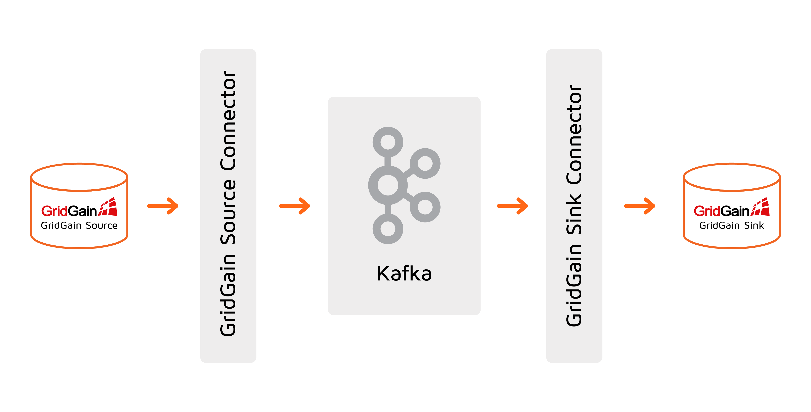
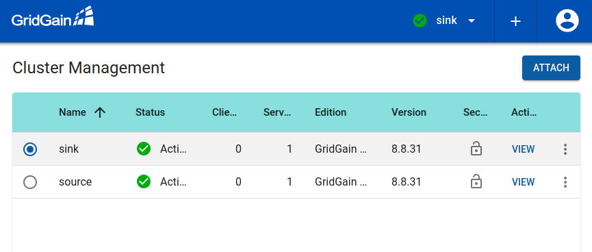
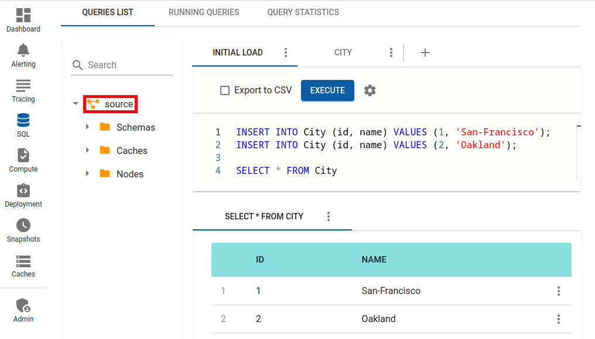
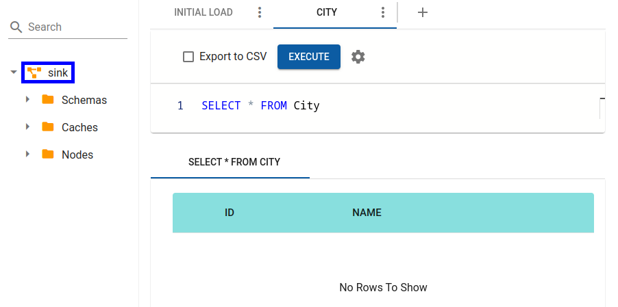
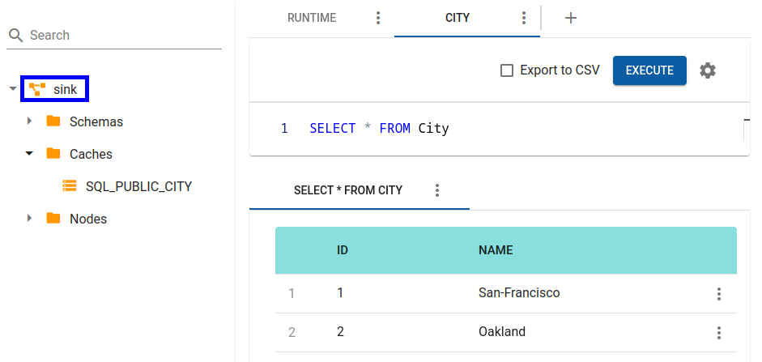
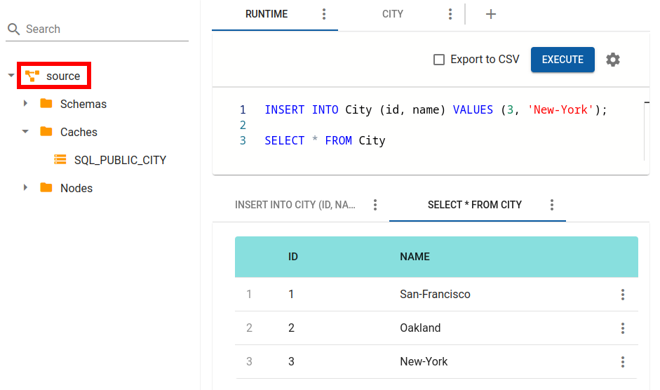
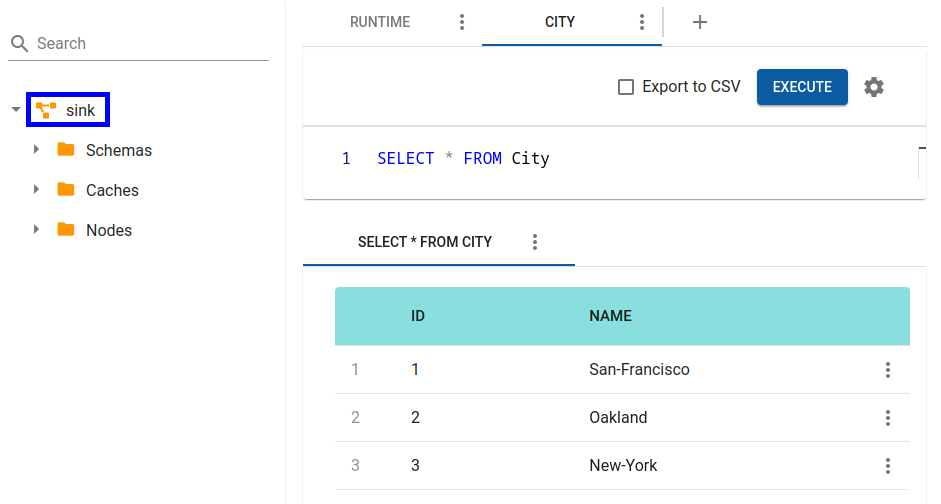
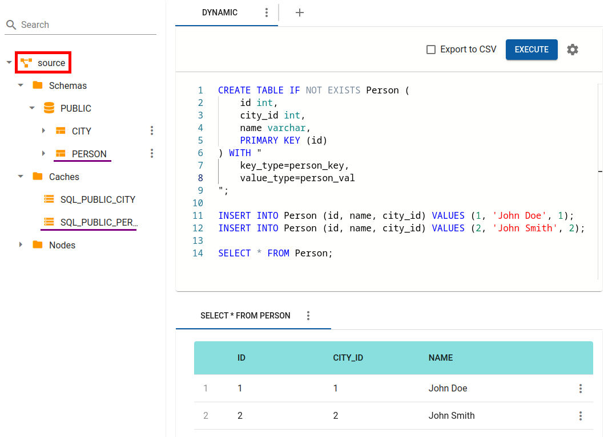
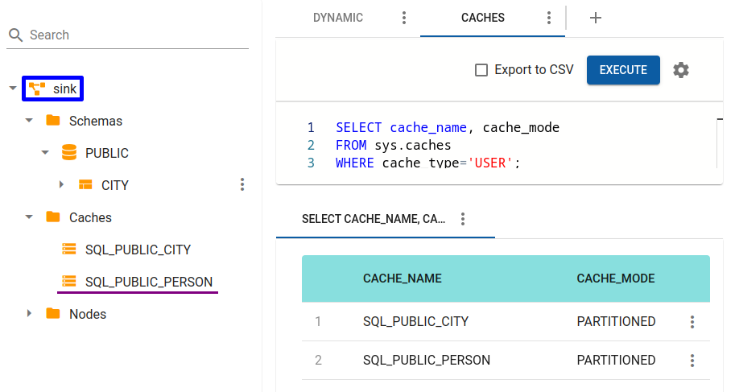
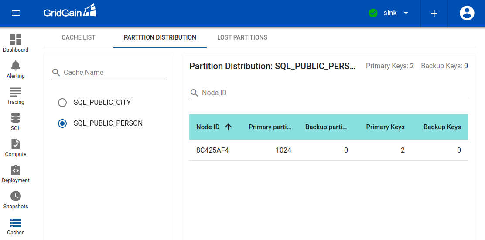

# Example: Ignite Data Replication with Kafka Connector

This example demonstrates how to configure and run both the Source and Sink connectors.



## Prerequisites

- [GridGain Enterprise or Ultimate version 8.8.31](https://www.gridgain.com/tryfree#gridgain8-ultimateedition) or later is installed. The `IGNITE_HOME` environment variable points to GridGain installation directory on every GridGain node.
- [Kafka 3.5.0](https://kafka.apache.org/downloads) is installed. The `KAFKA_HOME` environment variable points to Kafka installation directory on every node.
- **Optional:** [Control Center 2023.2](https://www.gridgain.com/tryfree#cloud) is available as an on-premise or cloud-based service.

## Step 1: Install GridGain Kafka Connector

### 1.1. Prepare GridGain Connector Package

The connector is in the `$IGNITE_HOME/integration/gridgain-kafka-connect` directory. Execute the following script on one of the GridGain nodes to pull the missing connector dependencies into the package:

```bash
cd $IGNITE_HOME/integration/gridgain-kafka-connect
./copy-dependencies.sh
```

### 1.2. Register GridGain Connector with Kafka

In this example, we assume `/opt/kafka/connect` is the Kafka connector installation directory.

For every Kafka Connect Worker:

1. Copy the GridGain Connector package directory you prepared in the previous step from the GridGain node to `/opt/kafka/connect` on the Kafka Connect worker.
2. Edit the Kafka Connect Worker configuration (`$KAFKA_HOME/config/connect-standalone.properties` for single-worker Kafka Connect cluster or `$KAFKA_HOME/config/connect-distributed.properties` for multiple node Kafka Connect cluster) to register the connector in the plugin path:

   
   ```
   plugin.path=/opt/kafka/connect/gridgain-kafka-connect
   ```
   

## Step 2: Start Ignite Clusters and Load Data

Our goal is to bootstrap environment with the following parts:

1. GridGain source cluster
2. GridGain sink cluster
3. GridGain Control Center (optional)

### 2.1. Prepare Source and Sink Clusters

Create the source and sink Ignite cluster configurations. The following configuration files allow running both clusters on the same host. Note that the sink cluster uses different port values for discovery and thin/ODBC/JDBC connections.


```xml
<?xml version="1.0" encoding="UTF-8"?>
<beans xmlns="http://www.springframework.org/schema/beans"
       xmlns:xsi="http://www.w3.org/2001/XMLSchema-instance"
       xmlns:util="http://www.springframework.org/schema/util"
       xsi:schemaLocation="
        http://www.springframework.org/schema/beans
        http://www.springframework.org/schema/beans/spring-beans.xsd
        http://www.springframework.org/schema/util
        http://www.springframework.org/schema/util/spring-util.xsd">
    <bean id="ignite.cfg" class="org.apache.ignite.configuration.IgniteConfiguration">
        <property name="igniteInstanceName" value="source" />
        <property name="consistentId" value="source" />

        <property name="discoverySpi">
            <bean class="org.apache.ignite.spi.discovery.tcp.TcpDiscoverySpi">
                <property name="ipFinder">
                    <bean class="org.apache.ignite.spi.discovery.tcp.ipfinder.vm.TcpDiscoveryVmIpFinder">
                        <property name="addresses">
                            <list>
                                <value>127.0.0.1:47500..47509</value>
                            </list>
                        </property>
                    </bean>
                </property>
            </bean>
        </property>

        <property name="cacheConfiguration">
            <list>
                <bean class="org.apache.ignite.configuration.CacheConfiguration">
                    <property name="name" value="SQL_PUBLIC_CITY"/>
                    <property name="sqlSchema" value="public"/>
                    <property name="queryEntities">
                        <bean class="org.apache.ignite.cache.QueryEntity">
                            <property name="tableName" value="city"/>
                            <property name="keyType" value="city_key"/>
                            <property name="valueType" value="city_val"/>
                            <property name="keyFields">
                                <set>
                                    <value>id</value>
                                </set>
                            </property>
                            <property name="fields">
                                <map>
                                    <entry key="id" value="java.lang.Integer"/>
                                    <entry key="name" value="java.lang.String"/>
                                </map>
                            </property>
                        </bean>
                    </property>
                </bean>
            </list>
        </property>

    </bean>
</beans>
```



```xml
<?xml version="1.0" encoding="UTF-8"?>
<beans xmlns="http://www.springframework.org/schema/beans"
       xmlns:xsi="http://www.w3.org/2001/XMLSchema-instance"
       xmlns:util="http://www.springframework.org/schema/util"
       xsi:schemaLocation="
        http://www.springframework.org/schema/beans
        http://www.springframework.org/schema/beans/spring-beans.xsd
        http://www.springframework.org/schema/util
        http://www.springframework.org/schema/util/spring-util.xsd">
    <bean id="ignite.cfg" class="org.apache.ignite.configuration.IgniteConfiguration">
        <property name="igniteInstanceName" value="sink" />
        <property name="consistentId" value="sink" />

        <property name="clientConnectorConfiguration">
            <bean class="org.apache.ignite.configuration.ClientConnectorConfiguration">
                <property name="port" value="10900"/>
            </bean>
        </property>

        <property name="discoverySpi">
            <bean class="org.apache.ignite.spi.discovery.tcp.TcpDiscoverySpi">
                <property name="localPort" value="47510" />
                <property name="ipFinder">
                    <bean class="org.apache.ignite.spi.discovery.tcp.ipfinder.vm.TcpDiscoveryVmIpFinder">
                        <property name="addresses">
                            <list>
                                <value>127.0.0.1:47510..47519</value>
                            </list>
                        </property>
                    </bean>
                </property>
            </bean>
        </property>

        <property name="cacheConfiguration">
            <list>
                <bean class="org.apache.ignite.configuration.CacheConfiguration">
                    <property name="name" value="SQL_PUBLIC_CITY"/>
                    <property name="sqlSchema" value="public"/>
                    <property name="queryEntities">
                        <bean class="org.apache.ignite.cache.QueryEntity">
                            <property name="tableName" value="city"/>
                            <property name="keyType" value="city_key"/>
                            <property name="valueType" value="city_val"/>
                            <property name="keyFields">
                                <set>
                                    <value>id</value>
                                </set>
                            </property>
                            <property name="fields">
                                <map>
                                    <entry key="id" value="java.lang.Integer"/>
                                    <entry key="name" value="java.lang.String"/>
                                </map>
                            </property>
                        </bean>
                    </property>
                </bean>
            </list>
        </property>

    </bean>
</beans>
```



If you are going to use Control Center for replication monitoring,  do not forget to [enable the agent module](https://app.gitbook.com/o/diTpXxF5WsbHqTReoBsS/s/kuTXWg0NDbRx6XUeYpGD/control-center/getting-started/connect/connect-gridgain-cluster#enabling-the-control-center-module).


Start the source Ignite cluster (assuming the Ignite configuration file is in the current directory):



```bash
$IGNITE_HOME/bin/ignite.sh ignite-server-source.xml

[15:47:30] Ignite node started OK (id=aae42b8b, instance name=source)
[15:47:30] Topology snapshot [ver=1, servers=1, clients=0, CPUs=8, heap=1.0GB]
```


```bash
> ignite.bat ignite-server-source.xml

[15:47:30] Ignite node started OK (id=aae42b8b, instance name=source)
[15:47:30] Topology snapshot [ver=1, servers=1, clients=0, CPUs=8, heap=1.0GB]
```



Start the Sink Ignite cluster:



```bash
$IGNITE_HOME/bin/ignite.sh ignite-server-sink.xml

[15:48:16] Ignite node started OK (id=b8dcc29b, instance name=sink)
[15:48:16] Topology snapshot [ver=1, servers=1, clients=0, CPUs=8, heap=1.0GB]
```


```bash
> ignite.bat ignite-server-sink.xml

[15:48:16] Ignite node started OK (id=b8dcc29b, instance name=sink)
[15:48:16] Topology snapshot [ver=1, servers=1, clients=0, CPUs=8, heap=1.0GB]
```



### 2.2. Attach Both Clusters to Control Center

Refer to [following article](https://app.gitbook.com/o/diTpXxF5WsbHqTReoBsS/s/kuTXWg0NDbRx6XUeYpGD/control-center/getting-started/connect/connect-gridgain-cluster#attaching-the-cluster-to-control-center) for the cluster attachment procedure.

You should end up having both clusters in the Control Center cluster list:



### 2.3. Load Data into Source Cluster

Load some data into the source Ignite cluster using SQL:



```bash
$IGNITE_HOME/bin/sqlline.sh --color=true --verbose=true -u jdbc:ignite:thin://127.0.0.1

jdbc:ignite:thin://127.0.0.1/> INSERT INTO City (id, name) VALUES (1, 'San-Francisco');
jdbc:ignite:thin://127.0.0.1/> INSERT INTO City (id, name) VALUES (2, 'Oakland');
```


```bash
> sqlline.bat --color=true --verbose=true -u jdbc:ignite:thin://127.0.0.1

jdbc:ignite:thin://127.0.0.1/> INSERT INTO City (id, name) VALUES (1, 'San-Francisco');
jdbc:ignite:thin://127.0.0.1/> INSERT INTO City (id, name) VALUES (2, 'Oakland');
```






Now you can ensure that no data were replicated either by querying the `city` table via `sqlline.sh` or by looking into the SQL view for the Sink cluster.



## Step 3: Start Kafka and GridGain Source and Sink Connectors

Start the Kafka cluster:



```bash
$KAFKA_HOME/bin/zookeeper-server-start.sh $KAFKA_HOME/config/zookeeper.properties
$KAFKA_HOME/bin/kafka-server-start.sh $KAFKA_HOME/config/server.properties
```


```bash
> zookeeper-server-start.bat %KAFKA_HOME%\config\zookeeper.properties
> kafka-server-start.bat %KAFKA_HOME%\config\server.properties
```



Create the GridGain Source and Sink Connector configuration files (replace `IGNITE_CONFIG_PATH` with the absolute path to the Ignite configuration created above):


```
name=gridgain-quickstart-source
connector.class=org.gridgain.kafka.source.IgniteSourceConnector
tasks.max=1

igniteCfg=<IGNITE_CONFIG_PATH>/ignite-server-source.xml
topicPrefix=quickstart-
```



```
name=gridgain-quickstart-sink
connector.class=org.gridgain.kafka.sink.IgniteSinkConnector
tasks.max=1

igniteCfg=<IGNITE_CONFIG_PATH>/ignite-server-sink.xml
topicPrefix=quickstart-
topics=quickstart-SQL_PUBLIC_PERSON,quickstart-SQL_PUBLIC_CITY
```


Start connectors (assuming the connector configuration files are in the current directory):

```bash
$KAFKA_HOME/bin/connect-standalone.sh $KAFKA_HOME/config/connect-standalone.properties connect-gridgain-source.properties connect-gridgain-sink.properties
```

## Step 4: Observe Initial Data Replication

Verify that both city entries were successfully replicated to the Sink cluster.



```bash
$IGNITE_HOME/bin/sqlline.sh --color=true --verbose=true -u jdbc:ignite:thin://127.0.0.1:10900

jdbc:ignite:thin://127.0.0.1/> SELECT * FROM city;
```


```bash
> sqlline.bat --color=true --verbose=true -u jdbc:ignite:thin://127.0.0.1:10900

jdbc:ignite:thin://127.0.0.1/> SELECT * FROM city;
```






## Step 5: Observe Runtime Data Replication

Add more cities to the Source cluster:



```bash
INSERT INTO City (id, name) VALUES (3, 'Chicago');
```






Check the `city` table in the Sink cluster again to see that new Chicago data has been replicated .



## Step 6: Observe Dynamic Cache Replication

Create a new `person` table in the Source cluster and load some data into it:



```bash
jdbc:ignite:thin://127.0.0.1/> CREATE TABLE IF NOT EXISTS Person (id int, city_id int, name varchar, PRIMARY KEY (id)) WITH "key_type=person_key,value_type=person_val";
jdbc:ignite:thin://127.0.0.1/> INSERT INTO Person (id, name, city_id) VALUES (1, 'John Doe', 1);
jdbc:ignite:thin://127.0.0.1/> INSERT INTO Person (id, name, city_id) VALUES (2, 'John Smith', 2);
```






Now check caches list in Sink cluster



```bash
jdbc:ignite:thin://127.0.0.1/> SELECT * FROM sys.caches;
```






If you take a look to list of SQL tables available in Sink cluster, you won't find `person` table.


The Kafka connector does not replicate SQL metadata.


You were able to read data in the Sink cluster via SQL because you had explicitly declared the SQL schema (QueryEntity) in the configuration files for both clusters.

To make sure that the `persons` entries were successfully replicated, use the **Caches** view in Control Center:



As you can see, the Sink cluster contains the same amount of keys that were inserted in the Source cluster.

You can also read these entries as BinaryObjects via ScanQuery run from the thin client:


```java
public class SinkClient {
    public static void main(String[] args) throws IgniteException {
        try (IgniteClient igniteClient = Ignition.startClient(new ClientConfiguration().setAddresses("localhost:10900"))) {
            ClientCache<BinaryObject, BinaryObject> cache = igniteClient.cache("SQL_PUBLIC_PERSON").withKeepBinary();

            for (Cache.Entry<BinaryObject, BinaryObject> e : cache.query(new ScanQuery<BinaryObject, BinaryObject>())) {
                BinaryObject key = e.getKey();
                BinaryObject val = e.getValue();

                System.out.println(
                        "id: " + key.field("id") + "  " +
                        "city_id: " + val.field("city_id") + "  " +
                        "name: " + val.field("name")
                );
            }
        }
    }
}
```


```bash
id: 2  city_id: 2  name: John Smith
id: 1  city_id: 1  name: John Doe
```
