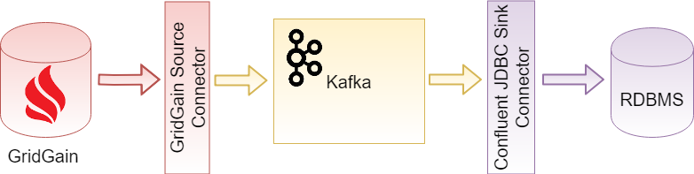
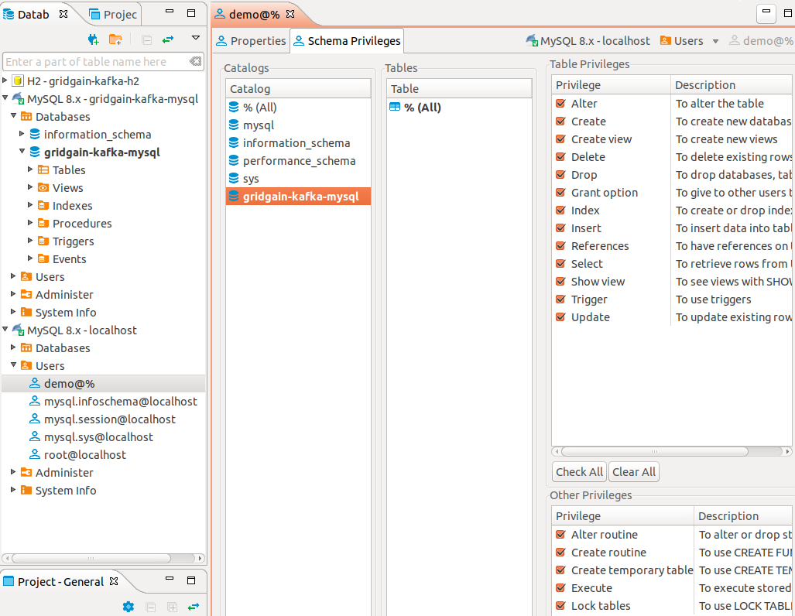
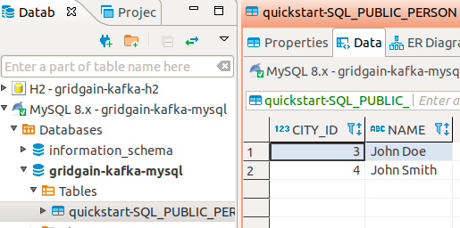
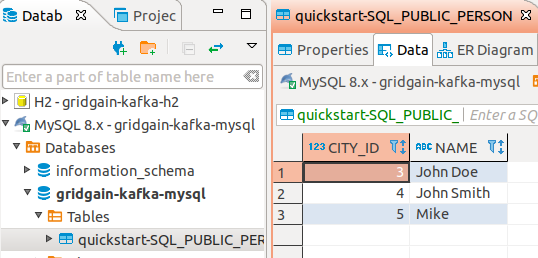
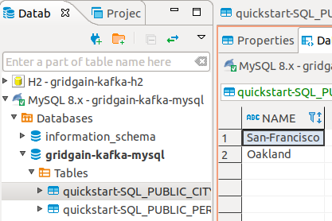

# Example: Persisting Ignite Data in Relational Database with Kafka Connector

The example demonstrates one-way GridGain-to-RDBMS data replication. GridGain Source Connector streams data from GridGain into Kafka with the data schema attached. JDBC Sink Connector streams the data from Kafka into relational tables using attached data schema.



## Prerequisites

- [GridGain Enterprise or Ultimate version 8.8.31](https://www.gridgain.com/tryfree#gridgain8-ultimateedition) or later is installed. The `IGNITE_HOME` environment variable points to GridGain installation directory on every GridGain node.
- [Kafka 3.5.0](https://kafka.apache.org/downloads) is installed. The `KAFKA_HOME` environment variable points to Kafka installation directory on every node.
- [MySQL Server 8](https://dev.mysql.com/downloads/mysql) is installed and running.
- [DBeaver](https://dbeaver.io/download) is used as a database management tool.

## Step 1: Install GridGain Source Connector

### 1.1. Prepare GridGain Connector Package

The connector is in the `$IGNITE_HOME/integration/gridgain-kafka-connect` directory. Execute this scripts on one of GridGain nodes to pull missing connector dependencies into the package:

```bash
cd $IGNITE_HOME/integration/gridgain-kafka-connect
./copy-dependencies.sh
```

### 1.2. Register GridGain Connector with Kafka

In this example we assume `/opt/kafka/connect` is the Kafka connectors installation directory.

For every Kafka Connect worker:

1. Copy GridGain Connector package directory you prepared on the previous step from the GridGain node to `/opt/kafka/connect` on the Kafka Connect worker.
2. Edit Kafka Connect Worker configuration (`$KAFKA_HOME/config/connect-standalone.properties` for single-worker Kafka Connect cluster or `$KAFKA_HOME/config/connect-distributed.properties` for multiple node Kafka Connect cluster) to register the connector on the plugin path:

   
   ```
   plugin.path=/opt/kafka/connect/gridgain-kafka-connect
   ```
   

## Step 2: Install JDBC Sink Connector

1. Download [Confluent JDBC Connector package](https://www.confluent.io/connector/kafka-connect-jdbc).
2. Unzip the package and rename the extracted directory to `confluentinc-kafka-connect-jdbc`.
3. In this example we use MySQL Server 8 as the RDBMS. Download the [MySQL Server JDBC Driver](https://dev.mysql.com/downloads/connector/j/8.0.html) and copy the driver JAR into the `confluentinc-kafka-connect-jdbc/lib` directory.

   For every Kafka Connect worker:

   1. Copy the JDBC Connector package directory `/opt/kafka/connect` to the Kafka Connect worker.
   2. Edit Kafka Connect Worker configuration (`$KAFKA_HOME/config/connect-standalone.properties` for single-worker Kafka Connect cluster or `$KAFKA_HOME/config/connect-distributed.properties` for multiple node Kafka Connect cluster) to register the connector on the plugin path:

      
      ```
      plugin.path=/opt/kafka/connect/gridgain-kafka-connect,/opt/kafka/connect/confluentinc-kafka-connect-jdbc
      ```
      

## Step 3: Configure and Start GridGain Cluster

In this example we will start only one GridGain server node.

1. Create the `ignite-server.xml` configuration file:

   
   ```xml
   <?xml version="1.0" encoding="UTF-8"?>
   <beans xmlns="http://www.springframework.org/schema/beans"
          xmlns:xsi="http://www.w3.org/2001/XMLSchema-instance"
          xmlns:util="http://www.springframework.org/schema/util"
          xsi:schemaLocation="
           http://www.springframework.org/schema/beans
           http://www.springframework.org/schema/beans/spring-beans.xsd
           http://www.springframework.org/schema/util
           http://www.springframework.org/schema/util/spring-util.xsd">
       <bean id="ignite.cfg" class="org.apache.ignite.configuration.IgniteConfiguration">
           <property name="discoverySpi">
               <bean class="org.apache.ignite.spi.discovery.tcp.TcpDiscoverySpi">
                   <property name="ipFinder">
                       <bean class="org.apache.ignite.spi.discovery.tcp.ipfinder.vm.TcpDiscoveryVmIpFinder">
                           <property name="addresses">
                               <list>
                                   <value>127.0.0.1:47500..47502</value>
                               </list>
                           </property>
                       </bean>
                   </property>
               </bean>
           </property>
       </bean>
   </beans>
   ```
   

2. Start GridGain node (the below command assumes you are in the directory where ignite-server.xml is located):

   ```bash
   $IGNITE_HOME/bin/ignite.sh ignite-server.xml

   ...
   [18:21:36] Ignite node started OK (id=8a01e443)
   [18:21:36] Topology snapshot [ver=1, servers=1, clients=0, CPUs=4, offheap=3.1GB, heap=1.0GB]
   ```

## Step 4: Create GridGain Tables and Add Some Data

In [GridGain Nebula](https://www.gridgain.com/docs/nebula/about/overview), go to the **Queries** page, create a table called Person, and add some data to the table:


```sql
CREATE TABLE IF NOT EXISTS Person (id int, city_id int, name varchar, PRIMARY KEY (id));
INSERT INTO Person (id, name, city_id) VALUES (1, 'John Doe', 3);
INSERT INTO Person (id, name, city_id) VALUES (2, 'John Smith', 4);
```


## Step 5: Initialize MySQL Database

In DBeaver connect to MySQL as administrator and:

1. Create database gridgain-kafka-mysql
2. Create user demo with password demo
3. Grant the demo user full privileges to the gridgain-kafka-mysql database.



## Step 6: Start Kafka Cluster

In this example we will start only one Kafka broker.

1. Start Zookeeper:

   ```bash
   $KAFKA_HOME/bin/zookeeper-server-start.sh $KAFKA_HOME/config/zookeeper.properties

   ...
   [2018-10-21 18:38:29,025] INFO Using org.apache.zookeeper.server.NIOServerCnxnFactory as server connection factory (org.apache.zookeeper.server.ServerCnxnFactory)
   [2018-10-21 18:38:29,030] INFO binding to port 0.0.0.0/0.0.0.0:2181 (org.apache.zookeeper.server.NIOServerCnxnFactory)
   ```

2. Start Kafka Broker:

   ```bash
   $KAFKA_HOME/bin/kafka-server-start.sh $KAFKA_HOME/config/server.properties

   ...
   [2018-10-21 18:40:06,998] INFO Kafka version : 2.0.0 (org.apache.kafka.common.utils.AppInfoParser)
   [2018-10-21 18:40:06,998] INFO Kafka commitId : 3402a8361b734732 (org.apache.kafka.common.utils.AppInfoParser)
   [2018-10-21 18:40:06,999] INFO [KafkaServer id=0] started (kafka.server.KafkaServer)
   ```

## Step 7: Configure and Start Kafka Connect Cluster

In this example we will start only one Kafka Connect worker.

### 7.1. Configure Kafka Connect Worker

In this example we need data schema attached to data so make sure you have the following properties in your Kafka Connect worker configuration (`$KAFKA_HOME/config/connect-standalone.properties` for single-worker Kafka Connect cluster or `$KAFKA_HOME/config/connect-distributed.properties` for multiple node Kafka Connect cluster):


```
key.converter=org.apache.kafka.connect.json.JsonConverter
value.converter=org.apache.kafka.connect.json.JsonConverter
key.converter.schemas.enable=true
value.converter.schemas.enable=true
```


### 7.2. Configure GridGain Source Connector

Create the `kafka-connect-gridgain-source.properties` configuration file (replace `IGNITE_CONFIG_PATH` with a path to your `ignite-server.xml`):


```
name=kafka-connect-gridgain-source
tasks.max=2
connector.class=org.gridgain.kafka.source.IgniteSourceConnector

igniteCfg=IGNITE_CONFIG_PATH/ignite-server.xml
topicPrefix=quickstart-
```


### 7.3. Configure JDBC Sink Connector

Create the `kafka-connect-mysql-sink.properties` configuration file:


```
name=kafka-connect-mysql-sink
tasks.max=2
connector.class=io.confluent.connect.jdbc.JdbcSinkConnector
topics=quickstart-SQL_PUBLIC_PERSON,quickstart-SQL_PUBLIC_CITY

connection.url=jdbc:mysql://localhost:3306/gridgain-kafka-mysql
connection.user=demo
connection.password=demo
auto.create=true
```


### 7.4. Start Kafka Connect Worker

The following command assumes you are in the directory where the source and sink connector configurations are located:

```bash
$KAFKA_HOME/bin/connect-standalone.sh $KAFKA_HOME/config/connect-standalone.properties kafka-connect-gridgain-source.properties kafka-connect-mysql-sink.properties
```

Check the source and sink connectors status. If everything is OK, you will see each connector running two tasks.
For example, if you have `curl` and `jq` available on a Kafka Connect worker, you can run:

```bash
curl http://localhost:8083/connectors/kafka-connect-gridgain-source | jq; \
curl http://localhost:8083/connectors/kafka-connect-mysql-sink | jq
```


```json
{
  "name": "kafka-connect-gridgain-source",
  "config": {
    "connector.class": "org.gridgain.kafka.source.IgniteSourceConnector",
    "name": "kafka-connect-gridgain-source",
    "igniteCfg": "/home/kukushal/Documents/gridgain-kafka-h2/ignite-server.xml",
    "topicPrefix": "quickstart-",
    "tasks.max": "2"
  },
  "tasks": [
    {
      "connector": "kafka-connect-gridgain-source",
      "task": 0
    },
    {
      "connector": "kafka-connect-gridgain-source",
      "task": 1
    }
  ],
  "type": "source"
}
{
  "name": "kafka-connect-mysql-sink",
  "config": {
    "connector.class": "io.confluent.connect.jdbc.JdbcSinkConnector",
    "connection.password": "demo",
    "connection.user": "demo",
    "tasks.max": "2",
    "topics": "quickstart-SQL_PUBLIC_PERSON,quickstart-SQL_PUBLIC_CITY",
    "name": "kafka-connect-mysql-sink",
    "auto.create": "true",
    "connection.url": "jdbc:mysql://localhost:3306/gridgain-kafka-mysql"
  },
  "tasks": [
    {
      "connector": "kafka-connect-mysql-sink",
      "task": 0
    },
    {
      "connector": "kafka-connect-mysql-sink",
      "task": 1
    }
  ],
  "type": "sink"
}
```


## Step 8: Observe Initial Data Load

In DBeaver, connect to the `gridgain-kafka-mysql` database and see the Sink Connector created table `quickstart-SQL_PUBLIC_PERSON` that already contains 2 entries:



## Step 9: Observe Runtime Data Load

Add more person data to the source cluster. In GridGain Nebula, execute this query:


```sql
INSERT INTO Person (id, name, city_id) VALUES (3, 'Mike', 5);
```


In DBeaver, get the latest `quickstart-SQL_PUBLIC_PERSON` table data and see the new entry appeared:



## Step 10: Observe Dynamic Reconfiguration

Create a new table called `City` in the source cluster and load some data into it. In GridGain Nebula, execute the query:


```sql
CREATE TABLE IF NOT EXISTS City (id int, name varchar, PRIMARY KEY (id));
INSERT INTO City (id, name) VALUES (3, 'San-Francisco');
INSERT INTO City (id, name) VALUES (4, 'Oakland');
```


In DBeaver, see the Sink Connector created the new `quickstart-SQL_PUBLIC_CITY` table containing the 2 entries:


