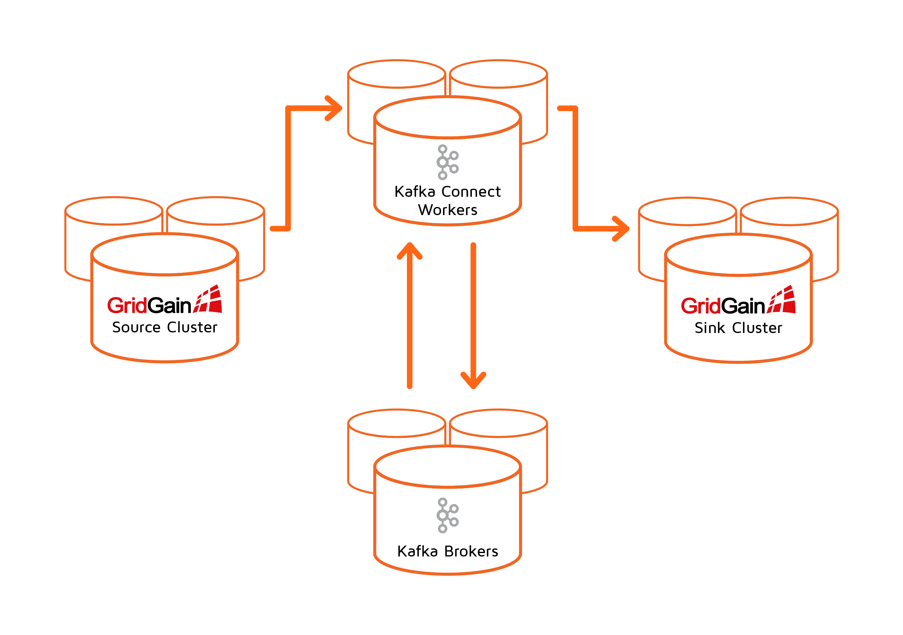

# Kafka Connector Quick Start

## Kafka Connect Ecosystem

There are different types of nodes in a distributed Kafka Connect ecosystem. This Kafka documentation uses the following terminology to refer to specific type of a cluster node:

- Kafka cluster nodes are called **Kafka Brokers**
- Kafka Connect cluster nodes are called **Kafka Connect Workers**
- GridGain cluster nodes are called **GridGain Servers**



## GridGain Kafka Connector Installation

Kafka Connector installation require 3 steps:

1. Prepare Connector Package
2. Register Connector with Kafka
3. Register Connector with GridGain

### Step 1: Prepare Connector Package

Kafka Connector is part of GridGain Enterprise or GridGain Ultimate version 8.8.x. The connector is located in the `integration/gridgain-kafka-connect` directory in the GridGain installation directory.

Pull missing connector dependencies into the package:

```bash
cd $IGNITE_HOME/integration/gridgain-kafka-connect
./copy-dependencies.sh
```

### Step 2: Register GridGain Connector with Kafka

For every Kafka Connect Worker:

1. Copy connector package directory to where you want Kafka Connectors to be located.
2. Edit Kafka Connect Worker configuration (`$KAFKA_HOME/config/connect-standalone.properties` for single-worker Kafka Connect cluster or `$KAFKA_HOME/config/connect-distributed.properties` for multiple node Kafka Connect cluster) to register the connector on the plugin path (replace `CONNECTORS_PATH` with directory where you copied the connector package):

   
   ```
   plugin.path=CONNECTORS_PATH/gridgain-kafka-connect
   ```
   

### Step 3: Register GridGain Connector with GridGain

On every GridGain server node copy the following JARs into the `$IGNITE_HOME/libs` directory:

- `gridgain-kafka-connect-{gg-version}.jar` (located on GridGain nodes in the `$IGNITE_HOME/integration/gridgain-kafka-connect/lib` directory)
- `connect-api-{kafka-version}.jar` and `kafka-clients-{kafka-version}.jar`, located on Kafka
- Connect workers in the `$KAFKA_HOME/libs` directory (or a later version, if you choose to use it)
- Copy the `ignite-slf4j` module from `libs/optional` to `libs`
- If Kafka Connect runs on JDK 17 or later, the following JVM properties must be added to your Kafka Connect configuration:

  ```bash
    --add-opens=java.base/java.nio=ALL-UNNAMED
    --add-opens=java.base/java.util=ALL-UNNAMED
  ```

## GridGain Kafka Connector Configuration

### SSL Configuration

The GridGain connector is agnostic of the underlying communication channels. To have a secure communication between the GridGain connector and other components, implement SSL using one of the following options:

- SSL between the GridGain cluster and GridGain connector - follow the [SSL/TLS guide](../../security/ssl-tls.md)
- SSL between Kafka and GridGain connector - use the [TLS authentication](https://docs.confluent.io/platform/current/security/authentication/mutual-tls/overview.html#kconnect-long)

### Source Properties

The only GridGain Source connector mandatory properties are the connector's name, class, and path to Ignite configuration describing how to connect to the source GridGain cluster. Here's what a minimal source connector configuration named "gridgain-kafka-connect-source" might look like:


```
name=gridgain-kafka-connect-source
connector.class=org.gridgain.kafka.source.IgniteSourceConnector
igniteCfg=IGNITE_CONFIG_PATH/ignite-server-source.xml
```


See [Source Connector Configuration](configuration.md#source-connector) for the full properties list.

### Sink Properties

The only GridGain Sink connector mandatory properties are the connector's name, class, list of topics to stream data from and a path to Ignite configuration describing how to connect to the sink GridGain cluster. Here's what a minimal source connector configuration named "gridgain-kafka-connect-sink" might look like:


```
name=gridgain-kafka-connect-sink
topics=topic1,topic2,topic3
connector.class=org.gridgain.kafka.sink.IgniteSinkConnector
igniteCfg=IGNITE_CONFIG_PATH/ignite-server-sink.xml
```


See [Sink Connector Configuration](configuration.md#sink-connector) for the full properties list.

## Running Kafka Connect Ecosystem

See [Installing and Configuring Kafka Connect](https://docs.confluent.io/current/connect/userguide.html#installing-and-configuring-kconnect-long) for detailed documentation. As a summary, you need to:

1. Configure and Install Kafka Connectors
2. Configure and start Zookeeper
3. Configure and start Kafka brokers
4. Configure and start Kafka Connect workers

We already reviewed how to configure and install Kafka connectors. Below are shell commands to run Kafka Connect ecosystem on the same host using default zookeeper, broker, and connect worker configuration files (normally you would run each node on a separate host):

```bash
$KAFKA_HOME/bin/zookeeper-server-start.sh $KAFKA_HOME/config/zookeeper.properties
$KAFKA_HOME/bin/kafka-server-start.sh $KAFKA_HOME/config/server.properties
$KAFKA_HOME/bin/connect-standalone.sh \
	$KAFKA_HOME/config/connect-standalone.properties \
	gridgain-kafka-connect-source.properties \
	gridgain-kafka-connect-sink.properties
```

## Managing Kafka Connectors

Each Kafka worker exposes REST API to manage Kafka Connectors (available on port `8083` by default). See [Kafka Connect REST Interface](https://docs.confluent.io/current/connect/references/restapi.html) for information on how to create, remove, pause, and resume connectors as well as see the status of the connectors and tasks.
