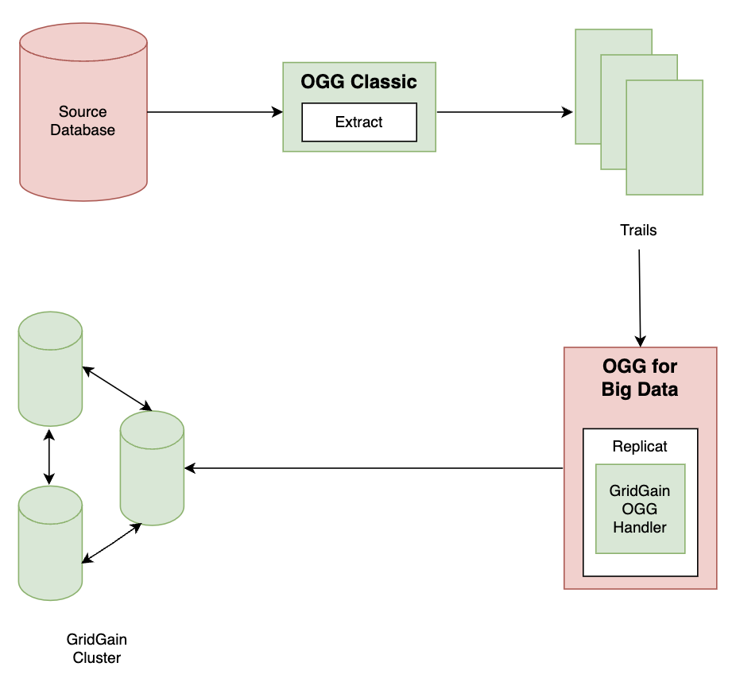

# GoldenGate Replication

Oracle GoldenGate integration provides a solution for real-time replication of all your GoldenGate compatible data-sources and your GridGain cluster. When GoldenGate replication is configured, GridGain automatically receives updates from the configured GoldenGate source database while at the same time transforming the data from source to GridGain-compatible cache objects. GoldenGate also enables high availability and disaster tolerance with core functionality that supports real-time data integration, while preserving performance and ensuring scalability.


**Compatibility**

GridGain is compatible with Oracle GoldenGate versions 19.1 and later. See the [list of supported GoldenGate data-sources](http://www.oracle.com/technetwork/middleware/goldengate/certify-100402.html).


## Components

Following are the main components of the GoldenGate Replication process:

- `Extractor` - the process that runs on the source system - the data-capture mechanism of GoldenGate. It can be configured for both initial loading of the source data, as well as to synchronize the changed data on the source with the target. This can also be configured to propagate the DDL changes on those databases that support DDL changes.
- `Trails` - series of files that GoldenGate stores on disks. These files are written to and read from by the Extract processes. Depending on the configuration, these trail files can exist on the source as well as on the target systems.
- `GridGainHandler` - a [Java adapter for Oracle GoldenGate](https://docs.oracle.com/goldengate/bd1221/gg-bd/GBDIN/GUID-EDFEF2A7-ADBA-4B1A-87F1-AEFD2061AE9D.htm#GBDIN101). More specifically, it is a class/library for Oracle GoldenGate's Big Data middleware that handles updates and saves transactions to GridGain.

The following diagram illustrated the GoldenGate replication.

## Features

### Batching

Updates from the source database can be performed in different modes. If the replication is done in `tx` mode, updates are first accumulated by the transaction and then populated to cache in batches.

### Failover

[GridGain Handler](gridgain-handler.md) supports failover. If the GoldenGate handle fails during processing or replication stops for some reason, GridGain Handler restarts processing from the last successfully processed transaction.

### Conflict Resolution

In `active-active` scenarios, updates to a key in the cache occurring from multiple sources is called a conflict. To ensure a consistent conflict resolution across different data centers, users can plug in their own implementation of conflict resolver. See [Conflicts Resolution](../../gridgain8-management/conflict-resolution.md) for more information.
