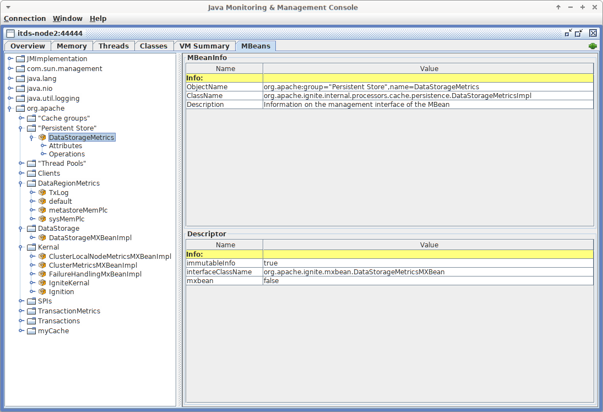

# JMX Metrics

## Overview

GridGain exposes a large number of metrics useful for monitoring your cluster or application.
You can use JMX and a monitoring tool, such as JConsole, or [GridGain Control Center]({tools}/control-center) to access these metrics via JMX.
You can also access them programmatically.

On this page, we've collected the most useful metrics and grouped them into various common categories based on the monitoring task.


A newer system, called [Generic Metrics](generic-metrics.md), is now available.


## Understanding MBean's ObjectName

Every JMX Mbean has an [ObjectName](https://docs.oracle.com/javase/8/docs/api/javax/management/ObjectName.html).
The ObjectName is used to identify the bean.
The ObjectName consists of a domain and a list of key properties, and can be represented as a string as follows:

```
domain: key1 = value1 , key2 = value2
```

All GridGain metrics have the same domain: `org.apache.<classloaderId>` where the classloader ID is optional (omitted if you set `IGNITE_MBEAN_APPEND_CLASS_LOADER_ID=false`). In addition, each metric has two properties: `group` and `name`.
For example:

```
org.apache:group=SPIs,name=TcpDiscoverySpi
```

This MBean provides various metrics related to node discovery.

The MBean ObjectName can be used to identify the bean in UI tools like JConsole.
For example, JConsole displays MBeans in a tree-like structure where all beans are first grouped by domain and then by the 'group' property:



## Monitoring and Changing Cluster State

A GridGain cluster can be in one of the three states: `ACTIVE`, `ACTIVE_READ_ONLY`, and `INACTIVE`.

When you start a pure in-memory cluster (no persistent data regions) for the first time, the cluster is in the `ACTIVE` state.
When you start a cluster with persistent data regions for the first time, the cluster is `INACTIVE`.

- `INACTIVE`: All operations are prohibited.

  When you change the cluster state from active to `INACTIVE` (deactivation), the cluster deallocates all memory resources.

- `ACTIVE`: This is the normal mode of the cluster. You can execute any operation.

- `ACTIVE_READ_ONLY`: The read-only mode. Only read operations are allowed.

  Any attempt to create a cache or modify the data in an existing cache results in an `IgniteClusterReadOnlyException` exception.
  DDL or DML statements that modify the data are prohibited as well.

You can change the cluster state in multiple ways:

- [Control script](../cli-tool/README.md):

  ```shell
  control.sh --set-state ACTIVE_READ_ONLY
  ```

- [REST command](../rest-api/README.md):

  ```
  http://localhost:8080/ignite?cmd=setstate&state=ACTIVE_READ_ONLY
  ```

- Programmatically:

  
  
  ```java
  Ignite ignite = Ignition.start();
  ignite.cluster().state(ClusterState.ACTIVE_READ_ONLY);
  ```
  

  
  ```csharp
  Ignite ignite = Ignition.start(); 
  ignite.GetCluster().SetActive(true);
  ```
  

  
  ```cpp
  Ignite ignite = Ignition::Start(igniteConfiguration); 
  ignite.GetCluster().SetActive(true);
  ```
  
  

- JMX Bean:

  **Mbean's Object Name:**

  ```
  group="Kernel",name=IgniteKernal
  ```

  |Operation|Description|
  |---|---|
  |`clusterState()`|Get the current cluster state.|
  |`clusterState(String, boolean)`|Set the cluster state.|

The `clusterState` operation will soon be deprecated and replaced with the `clusterState` attribute.

## Monitoring the Amount of Data

If you do not use [Native persistence](../../architecture/storage/native-persistence.md) (i.e., all your data is kept in memory), you would want to monitor RAM usage.
If you use Native persistence, in addition to RAM, you should monitor the size of the data storage on disk.

The size of the data loaded into a node is available at different levels of aggregation. You can monitor for:

- The total size of the data the node keeps on disk or in RAM. This amount is the sum of the size of each configured data region (in the simplest case, only the default data region) plus the sizes of the system data regions.
- The size of a specific [data region](../../gridgain8-usage/memory-configuration/data-regions.md) on that node. The data region size is the sum of the sizes of all cache groups.
- The size of a specific cache/cache group on that node, including the backup partitions.

These metrics can be enabled/disabled for each level separately and are exposed via different JMX beans listed below.

### Allocated Space vs. Actual Size of Data

There is no way to get the exact size of the data (neither in RAM nor on disk). Instead, there are two ways to estimate it.

You can get the size of the space *allocated* for storing the data.
(The "space" here refers either to the space in RAM or on disk depending on whether you use Native persistence or not.)
Space is allocated when the size of the storage gets full and more entries need to be added.
However, when you remove entries from caches, the space is not deallocated.
It is reused when new entries need to be added to the storage on subsequent write operations. Therefore, the allocated size does not decrease when you remove entries from the caches.
The allocated size is available at the level of data storage, data region, and cache group metrics.
The metric is called `TotalAllocatedSize`.

You can also get an estimate of the actual size of data by multiplying the number of [data pages](../../architecture/memory-architecture.md#data-pages) in use by the fill factor. The fill factor is the ratio of the size of data in a page to the page size, averaged over all pages. The number of pages in use and the fill factor are available at the level of data [region metrics](#data-region-size).

Add up the estimated size of all data regions to get the estimated total amount of data on the node.

### Monitoring RAM Memory Usage

The amount of data in RAM can be monitored for each data region through the following MBeans:

**Mbean's Object Name:**

```
group=DataRegionMetrics,name=<Data Region name>
```

|Attribute|Type|Description|Scope|
|---|---|---|---|
|PagesFillFactor|float|The average size of data in pages as a ratio of the page size. When Native persistence is enabled, this metric is applicable only to the persistent storage (i.e. pages on disk).|Node|
|TotalUsedPages|long|The number of data pages that are currently in use. When Native persistence is enabled, this metric is applicable only to the persistent storage (i.e. pages on disk).|Node|
|PhysicalMemoryPages|long|The number of the allocated pages in RAM.|Node|
|PhysicalMemorySize|long|The size of the allocated space in RAM in bytes.|Node|

If you have multiple data regions, add up the sizes of all data regions to get the total size of the data on the node.

### Monitoring Storage Size

Persistent storage, when enabled, saves all application data on disk.
The total amount of data each node keeps on disk consists of the persistent storage (application data), the [WAL files](../../architecture/storage/native-persistence.md#write-ahead-log-wal), and [WAL Archive](../../architecture/storage/native-persistence.md#wal-archive) files.

#### Persistent Storage Size

To monitor the size of the persistent storage on disk, use the following metrics:

**Mbean's Object Name:**

```
group="Persistent Store",name=DataStorageMetrics
```

|Attribute|Type|Description|Scope|
|---|---|---|---|
|TotalAllocatedSize|long|The size of the space allocated on disk for the entire data storage (in bytes). Note that when Native persistence is disabled, this metric shows the total size of the allocated space in RAM.|Node|
|WalTotalSize|long|Total size of the WAL files in bytes, including the WAL archive files.|Node|
|WalArchiveSegments|int|The number of WAL segments in the archive.|Node|

|Operation|Description|
|---|---|
|enableMetrics|Enable collection of metrics related to the persistent storage at runtime.|
|disableMetrics|Disable metrics collection.|

#### Data Region Size

For each configured data region, GridGain creates a separate JMX Bean that exposes specific information about the region. Metrics collection for data regions are disabled by default. You can [enable it in the data region configuration, or via JMX at runtime](../../gridgain8-management/monitoring/configuring-metrics.md#disabling-data-region-metrics) (see the Bean's operations below).

The size of the data region on a node comprises the size of all partitions (including backup partitions) that this node owns for all caches in that data region.

Data region metrics are available in the following MBean:

**Mbean's Object Name:**

```
group=DataRegionMetrics,name=<Data Region name>
```

|Attribute|Type|Description|Scope|
|---|---|---|---|
|TotalAllocatedSize|long|The size of the space allocated for this data region (in bytes). Note that when Native persistence is disabled, this metric shows the total size of the allocated space in RAM.|Node|
|PagesFillFactor|float|The average amount of data in pages as a ratio of the page size.|Node|
|TotalUsedPages|long|The number of data pages that are currently in use.|Node|
|PhysicalMemoryPages|long|The number of data pages in this data region held in RAM.|Node|
|PhysicalMemorySize|long|The size of the allocated space in RAM in bytes.|Node|

|Operation|Description|
|---|---|
|enableMetrics|Enable metrics collection for this data region.|
|disableMetrics|Disable metrics collection for this data region.|

#### Cache Group Size

If you don't use [cache groups](../../gridgain8-usage/configuring-caches/cache-groups.md), each cache will be its own group.
There is a separate JMX bean for each cache group.
The name of the bean corresponds to the name of the group.

**Mbean's Object Name:**

```
group="Cache groups",name=<Cache group name>
```

|Attribute|Type|Description|Scope|
|---|---|---|---|
|TotalAllocatedSize|long|The amount of space allocated for the cache group on this node.|Node|

## Monitoring Checkpointing Operations

Checkpointing may slow down cluster operations.
You may want to monitor how much time each checkpoint operation takes, so that you can tune the properties that affect checkpointing.
You may also want to monitor the disk performance to see if the slow-down is caused by external reasons.

See [Pages Writes Throttling](../../ha-and-performance/performance-tuning/persistence-tuning.md#pages-writes-throttling) and [Checkpointing Buffer Size](../../ha-and-performance/performance-tuning/persistence-tuning.md#adjusting-checkpointing-buffer-size) for performance tips.

**Mbean's Object Name:**

```
group="Persistent Store",name=DataStorageMetrics
```

|Attribute|Type|Description|Scope|
|---|---|---|---|
|DirtyPages|long|The number of pages in memory that have been changed but not yet synchronized to disk. Those are written to disk during next checkpoint.|Node|
|LastCheckpointDuration|long|The time in milliseconds it took to create the last checkpoint.|Node|
|CheckpointBufferSize|long|The size of the checkpointing buffer.|Global|

## Monitoring Rebalancing

[Rebalancing](../../architecture/rebalancing/data-rebalancing.md) is the process of moving partitions between the cluster nodes so that the data is always distributed in a balanced manner. Rebalancing is triggered when a new node joins, or an existing node leaves the cluster.

If you have multiple caches, they are rebalanced sequentially.
There are several metrics that you can use to monitor the progress of the rebalancing process for a specific cache.

**Mbean's Object Name:**

```
group=<cache name>,name=org.apache.ignite.internal.processors.cache.CacheLocalMetricsMXBeanImpl
```

|Attribute|Type|Description|Scope|
|---|---|---|---|
|RebalancingStartTime|long|This metric shows the time when rebalancing of local partitions started for the cache. This metric returns 0 if the local partitions do not participate in the rebalancing. The time is returned in milliseconds.|Node|
|EstimatedRebalancingFinishTime|long|Expected time of completion of the rebalancing process.|Node|
|KeysToRebalanceLeft|long|The number of keys on the node that remain to be rebalanced.  You can monitor this metric to learn when the rebalancing process finishes.|Node|

## Monitoring Topology

Topology refers to the set of nodes in a cluster. There are a number of metrics that expose the information about the topology of the cluster. If the topology changes too frequently or has a size that is different from what you expect, you may want to look into whether there are network problems.

**Mbean's Object Name:**

```
group=Kernel,name=ClusterMetricsMXBeanImpl
```

|Attribute|Type|Description|Scope|
|---|---|---|---|
|TotalServerNodes|long|The number of server nodes in the cluster.|Global|
|TotalClientNodes|long|The number of client nodes in the cluster.|Global|
|TotalBaselineNodes|long|The number of nodes that are registered in the [baseline topology](../../architecture/baseline-topology.md). When a node goes down, it remains registered in the baseline topology and you need to remote it manually.|Global|
|ActiveBaselineNodes|long|The number of nodes that are currently active in the baseline topology.|Global|

**Mbean's Object Name:**

```
group=SPIs,name=TcpDiscoverySpi
```

|Attribute|Type|Description|Scope|
|---|---|---|---|
|Coordinator|String|The node ID of the current coordinator node.|Global|
|CoordinatorNodeFormatted|String|Detailed information about the coordinator node. `TcpDiscoveryNode [id=e07ad289-ff5b-4a73-b3d4-d323a661b6d4, consistentId=fa65ff2b-e7e2-4367-96d9-fd0915529c25, addrs=[0:0:0:0:0:0:0:1%lo, 127.0.0.1, 172.25.4.200], sockAddrs=[itds-node2.gridgain.local/172.25.4.200:47500, /0:0:0:0:0:0:0:1%lo:47500, /127.0.0.1:47500], discPort=47500, order=2, intOrder=2, lastExchangeTime=1568187777249, loc=false, ver=8.7.5#20190520-sha1:d159cd7a, isClient=false]`|Global|

## Monitoring Caches

Cache-related metrics. For each cache, GridGain creates two JMX MBeans that expose the metrics specific to the cache. One MBean shows cluster-wide information about the cache, such as the total number of entries in the cache. The other MBean shows local information about the cache, such as the number of entries of the cache that are located on the local node.

**Global Cache Mbean's Object Name:**

```
group=<Cache_Name>,name="org.apache.ignite.internal.processors.cache.CacheClusterMetricsMXBeanImpl"
```

|Attribute|Type|Description|Scope|
|---|---|---|---|
|CacheSize|long|The total number of entries in the cache across all nodes.|Global|

**Local Cache Mbean's Object Name:**

```
group=<Cache Name>,name="org.apache.ignite.internal.processors.cache.CacheLocalMetricsMXBeanImpl"
```

|Attribute|Type|Description|Scope|
|---|---|---|---|
|CacheSize|long|The number of entries of the cache that are stored on the local node.|Node|

## Monitoring Transactions

Note that if a transaction spans multiple nodes (i.e., if the keys that are changed as a result of the transaction execution are located on multiple nodes), the counters increase on each node. For example, the 'TransactionsCommittedNumber' counter increases on each node where the keys affected by the transaction are stored.

**Mbean's Object Name:**

```
group=TransactionMetrics,name=TransactionMetricsMxBeanImpl
```

|Attribute|Type|Description|Scope|
|---|---|---|---|
|LockedKeysNumber|long|The number of keys locked on the node.|Node|
|TransactionsCommittedNumber|long|The number of transactions that have been committed on the node|Node|
|TransactionsRolledBackNumber|long|The number of transactions that were rolled back.|Node|
|OwnerTransactionsNumber|long|The number of transactions initiated on the node.|Node|
|TransactionsHoldingLockNumber|long|The number of open transactions that hold a lock on at least one key on the node.|Node|

## Monitoring Data Center Replication

The metrics below can be used to monitor data center replication:

**Mbean's Object Name:**

```
group="Data center replication",name="Receiver hub"
```

|Attribute|Type|Description|Scope|
|---|---|---|---|
|BatchesReceived|int|Total size of batches received from remote DC <dcID>.|Node|
|EntriesReceived|long|Total number of entries received from remote DC <dcID>.|Node|
|BytesReceived|long|Total number of batches received from remote DC <dcID>.|Node|
|BytesAcked|long|Total size of batches acked from remote DC in bytes.|Node|
|EntriesAcked|long|Total number of entries acked from remote DC.|Node|
|BatchesAcked|int|Total number of batches acked from remote DC.|Node|
|BatchesSent|int|Number of batches waiting to be stored in cache.|Node|
|EntriesSent|long|Number of entries waiting to be stored in cache.|Node|
|BytesSent|long|Number of entries waiting to be stored in cache.|Node|
|AverageBatchAckTime|double|Average time in milliseconds between sending batch to receiver cache nodes and successfully storing it.|Node|

**Mbean's Object Name:**

```
group="Data center replication",name="Sender hub"
```

|Attribute|Type|Description|Scope|
|---|---|---|---|
|BytesReceived|long|Total size of batches in bytes received by the sender from data nodes.|Node|
|EntriesReceived|long|Total number of entries were received by the sender from data nodes.|Node|
|BatchesReceived|int|Total number of batches received by the sender from data nodes.|Node|
|BatchesSent|int|Number of sent batches.|Node|
|EntriesSent|long|Number of sent entries.|Node|
|BytesSent|long|Number of sent bytes.|Node|
|BatchesAcked|int|Number of acknowledged batches.|Node|
|EntriesAcked|long|Number of acknowledged sent entries.|Node|
|BytesAcked|long|Number of acknowledged bytes.|Node|
|BatchesError|int|Number of sent batches that caused an error.|Node|
|EntriesError|long|Number of sent entries that caused an error.|Node|
|BytesError|long|Number of sent bytes that caused an error.|Node|
|AverageBatchAckTime|double|Total time in milliseconds between sending batches for the first time and receiving acknowledgement.|Node|

## Monitoring Client Connections

Metrics related to JDBC/ODBC or thin client connections.

**Mbean's Object Name:**

```
group=Clients,name=ClientListenerProcessor
```

|Attribute|Type|Description|Scope|
|---|---|---|---|
|Connections|java.util.List\<String>|A list of strings, each string containing information about a connection: `JdbcClient [id=4294967297, user=<anonymous>, rmtAddr=127.0.0.1:39264, locAddr=127.0.0.1:10800]`|Node|

|Operation|Description|
|---|---|
|dropConnection (id)|Disconnect a specific client.|
|dropAllConnections|Disconnect all clients.|

## Monitoring Message Queues

When thread pools queues' are growing, it means that the node cannot keep up with the load, or there was an error while processing messages in the queue.
Continuous growth of the queue size can lead to OOM errors.

### Communication Message Queue

The queue of outgoing communication messages contains communication messages that are waiting to be sent to other nodes.
If the size is growing, it means there is a problem.

**Mbean's Object Name:**

```
group=SPIs,name=TcpCommunicationSpi
```

|Attribute|Type|Description|Scope|
|---|---|---|---|
|OutboundMessagesQueueSize|int|The size of the queue of outgoing communication messages.|Node|
|UnacknowledgedMessagesQueueSize|int|The number of unacknowledged messages in all communication connections of the node.|Node|

### Discovery Messages Queue

The queue of discovery messages.

**Mbean's Object Name:**

```
group=SPIs,name=TcpDiscoverySpi
```

|Attribute|Type|Description|Scope|
|---|---|---|---|
|MessageWorkerQueueSize|int|The size of the queue of discovery messages that are waiting to be sent to other nodes.|Node|
|AvgMessageProcessingTime|long|Average message processing time.|Node|

<sub>_This page is: Copyright © 2026 MariaDB. All rights reserved._</sub>
