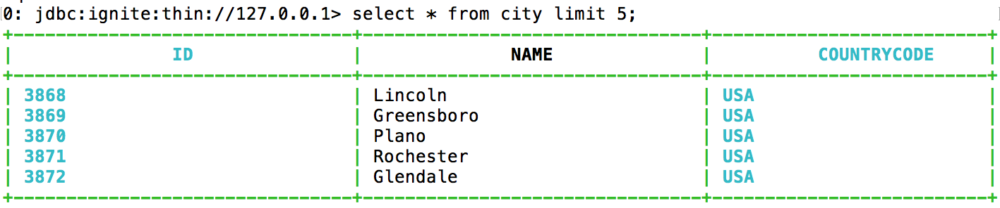

# Operational Commands

## COPY INTO

### Description

Imports data from an external source into a table or exports data to a file from the table. The table the data is imported into must exist.


You must [enable the 'gridgain-bulkload' module](../../gridgain8-usage/setup.md#enabling-modules).



This feature is only available in Enterprise and Ultimate editions.


```sql
COPY FROM source
INTO target
FORMAT formatType
[ formatTypeOptions ]
[ PROPERTIES ( 'propName'='propValue' [,...]) ]
```

### Parameters

- `source` - the full path to the file to import the data data from (if `target` is a table). Then name of the table and the list of columns to export the data from (if `target` is a file). If the source is a table, you can further narrow down the selection by using a query.
- `target` - the table and table columns when importing data to the table. The path to the file when exporting data.
- `formatType` - the format of the file to work with:
  - `CSV`
  - `PARQUET`
  - `ICEBERG`
- `properties` - case-sensitive configuration properties:
  - `s3.client-region` - when using S3 storage, the region to store the data in.
  - `s3.access-key-id` - when using S3 storage, the AWS access key. Optional. If you omit both `s3.access-key-id` and `s3.secret-access-key`, the default AWS credentials provider is used.
  - `s3.secret-access-key` - when using S3 storage, the AWS secret key. Optional, but must be specified if `s3.access-key-id` is specified.
  - `s3.endpoint` - when using S3 storage, overrides the S3 endpoint URL. Set this to use an S3-compatible service instead of AWS S3.
  - For Iceberg format:
    - The [catalog properties](https://iceberg.apache.org/docs/latest/configuration/#catalog-properties) are supported.
    - The `table-identifier` property describes Apache Iceberg TableIdentifier names. The names can be dot-separated. For example, `db_name.table_name` or `table`.
    - The Apache Iceberg `warehouse` path can be defined explicitly as a `'warehouse'='path'` property, or implicitly as a source/target `COPY FROM source INTO target`. If both ways are defined, the explicit property is used.
- `formatTypeOptions` - parameters related to the selected file format:
  - `delimiter` -  the field delimiter for CSV files; default delimiter is `,`. Delimiter syntax is `'char'`. Any alphanumeric character can be a delimiter.
  - `header` - for CSV files only; if set to `true`, specifies that the created file should contain a header line with column names. Column names of the table are used to create the header line.
  - `pattern` - the file pattern used when importing partitioned Parquet tables in the regular expression format. The regular expression must be enclosed in `'` signs. For example, `'.*'` imports all files. Partitioned column will not be imported.

### Examples

Import data from columns `name` and `age` of a CSV file with header into Table1 columns `name` and `age`:

```sql
/* Import data from CSV with column headers */
COPY FROM '/path/to/dir/data.csv'
INTO Table1 (name, age)
FORMAT CSV
```

Import data from the first two columns of a CSV file without header into Table1 columns `name` and `age`:

```sql
/* Import data from CSV without column headers  */
COPY FROM '/path/to/dir/data.csv'
INTO Table1 (name, age)
```

Export data from Table1 to a CSV file:

```sql
/* Export data to CSV */
COPY FROM (SELECT name, age FROM Table1)
INTO  '/path/to/dir/data.csv'
FORMAT CSV
```

Export data from Table1 to a CSV file:

```sql
/* Export data to CSV */
COPY FROM Table1 (name, age)
INTO  '/path/to/dir/data.csv'
FORMAT CSV
```

Import CSV file from AWS S3 into Table1:

```sql
/* Import CSV file from s3 */
COPY FROM 's3://mybucket/data.csv'
INTO Table1 (name, age)
FORMAT CSV
DELIMITER '|'
PROPERTIES('s3.access-key-id' = 'keyid', 's3.secret-access-key' = 'secretkey', 's3.client-region' = 'eu-central-1')
```

A simple example of exporting data to Iceberg. For working with local file system you can use HadoopCatalog that does not need to connect to a Hive MetaStore.

```sql
COPY FROM Table1 (id,name,height)
INTO '/tmp/person.i/'
FORMAT ICEBERG
PROPERTIES ('table-identifier'='person', 'catalog-impl'='org.apache.iceberg.hadoop.HadoopCatalog')
```

Export data into Iceberg on AWS S3:

```sql
COPY FROM person (id,name,height)
INTO 's3://iceberg-warehouse/glue-catalog'
FORMAT ICEBERG
PROPERTIES(
    'table-identifier'='iceberg_db_1.person',
    'io-impl'='org.apache.iceberg.aws.s3.S3FileIO',
    'catalog-impl'='org.apache.iceberg.aws.glue.GlueCatalog',
    's3.client-region'='eu-central-1',
    's3.access-key-id'='YOUR_KEY',
    's3.secret-access-key'='YOUR_SECRET'
    )
```


Glue catalog requires the table identifier pattern `db_name.table_name - [a-z0-9_]` (all letters must be in low case with underscores and no spaces). It can be disabled by setting the `glue.skip-name-validation` property to `true` to skip validation. When database name and table name validation are skipped, there is no guarantee that downstream systems would all support the names.


Imports data from partitioned Parquet database:

```sql
COPY FROM '/tmp/partitioned_table_dir'
INTO city (id, name, population)
FORMAT PARQUET
PATTERN '.*'
```

Where the Parquet table looks like this:

```
partitioned_table_dir/
├─ CountryCode=USA/
│  ├─ 000000_0.parquet
├─ CountryCode=FR/
│  ├─ 000000_0.parquet
```

## SET STREAMING

### Description

Streams data in bulk to an SQL table in your GridGain cluster. When streaming is enabled, the JDBC/ODBC driver packs your commands in batches and sends them to the server (GridGain cluster). On the server side, the batch is converted into a stream of cache update commands, which are distributed asynchronously between the server nodes. Performing this asynchronously increases peak throughput because at any given time all cluster nodes are busy with data loading.

```sql
SET STREAMING [OFF|ON];
```

### Usage

To stream data into your GridGain cluster, prepare a file with the `SET STREAMING ON` command followed by `INSERT` commands for the data to be loaded. For example:

```sql
SET STREAMING ON;

INSERT INTO City(ID, Name, CountryCode, District, Population) VALUES (1,'Kabul','AFG','Kabol',1780000);
INSERT INTO City(ID, Name, CountryCode, District, Population) VALUES (2,'Qandahar','AFG','Qandahar',237500);
INSERT INTO City(ID, Name, CountryCode, District, Population) VALUES (3,'Herat','AFG','Herat',186800);
INSERT INTO City(ID, Name, CountryCode, District, Population) VALUES (4,'Mazar-e-Sharif','AFG','Balkh',127800);
INSERT INTO City(ID, Name, CountryCode, District, Population) VALUES (5,'Amsterdam','NLD','Noord-Holland',731200);
-- More INSERT commands --
```


Before executing the above statements, you must have the tables created in the cluster. Run `CREATE TABLE` commands, or provide these commands as part of the file that is used for inserting data, before the `SET STREAMING ON` command, like this:


```sql
CREATE TABLE City (
  ID INT(11),
  Name CHAR(35),
  CountryCode CHAR(3),
  District CHAR(20),
  Population INT(11),
  PRIMARY KEY (ID, CountryCode)
) WITH "template=partitioned, backups=1, affinityKey=CountryCode, CACHE_NAME=City, KEY_TYPE=demo.model.CityKey, VALUE_TYPE=demo.model.City";

SET STREAMING ON;

INSERT INTO City(ID, Name, CountryCode, District, Population) VALUES (1,'Kabul','AFG','Kabol',1780000);
INSERT INTO City(ID, Name, CountryCode, District, Population) VALUES (2,'Qandahar','AFG','Qandahar',237500);
INSERT INTO City(ID, Name, CountryCode, District, Population) VALUES (3,'Herat','AFG','Herat',186800);
INSERT INTO City(ID, Name, CountryCode, District, Population) VALUES (4,'Mazar-e-Sharif','AFG','Balkh',127800);
INSERT INTO City(ID, Name, CountryCode, District, Population) VALUES (5,'Amsterdam','NLD','Noord-Holland',731200);
-- More INSERT commands --
```

### Known Limitations

While streaming mode allows you to load data much faster than other data loading techniques, it has some limitations:

- Only `INSERT` commands are allowed; any attempt to execute `SELECT` or any other DML or DDL command will cause an exception.
- Due to streaming mode's asynchronous nature, you cannot know update counts for every statement executed; all JDBC/ODBC commands returning update counts will return 0.

### Example

Use the world.sql file that is shipped with the latest GridGain distribution. It can be found in the `{gridgain_dir}/examples/sql/` directory. You can use the `run` command from [SQLLine](../tools/sqlline.md), as shown below:

```bash
!run /apache_ignite_version/examples/sql/world.sql
```

After executing the above command and **closing the JDBC connection**, all data will be loaded into the cluster and ready to be queried.



## KILL QUERY

### Description

Cancel a running query. When a query is canceled with the `KILL` command, all parts of the query running on all other nodes are canceled too.

```sql
KILL QUERY {ASYNC} '<query_id>'
```

### Parameters

- `ASYNC` - an optional parameter, which returns control immediately without waiting for the cancellation to finish
- `query_id` - retrieved via the SQL_QUERIES [system view](../monitoring/system-views.md#sql_queries)

## KILL CONTINUOUS

### Description

Cancel a running continuous query.

```sql
KILL CONTINUOUS '<node_id>' '<routine_id>'
```

### Parameters

- `node_id` - the id of the source node of the continuous query. Retrieved via the CONTINUOUS_QUERIES [system view](../monitoring/system-views.md#continuous_queries).
- `routine_id` - the continuous query ID. retrieved via the CONTINUOUS_QUERIES [system view](../monitoring/system-views.md#continuous_queries).

## COPY


This `COPY` syntax is no longer supported. Use [COPY INTO](#copy-into) instead.


Copy data from a CSV file into a SQL table.

```sql
COPY FROM '/path/to/local/file.csv'
INTO tableName (columnName, columnName, ...) FORMAT CSV [CHARSET '<charset-name>']
```

### Parameters

- `'/path/to/local/file.csv'` - the actual path to the CSV file
- `tableName` - the name of the table to copy the data to
- `columnName` - the name of a column corresponding to a column in the CSV file

### Example

```sql
COPY FROM '/path/to/local/file.csv' INTO city (
  ID, Name, CountryCode, District, Population) FORMAT CSV
```

In the above command, substitute `/path/to/local/file.csv` with the actual path to your CSV file. For instance, you can use `city.csv` that is shipped with the latest GridGain distribution. You can find it in your `{gridgain_dir}/examples/src/main/resources/sql/` directory.

<sub>_This page is: Copyright © 2026 MariaDB. All rights reserved._</sub>
