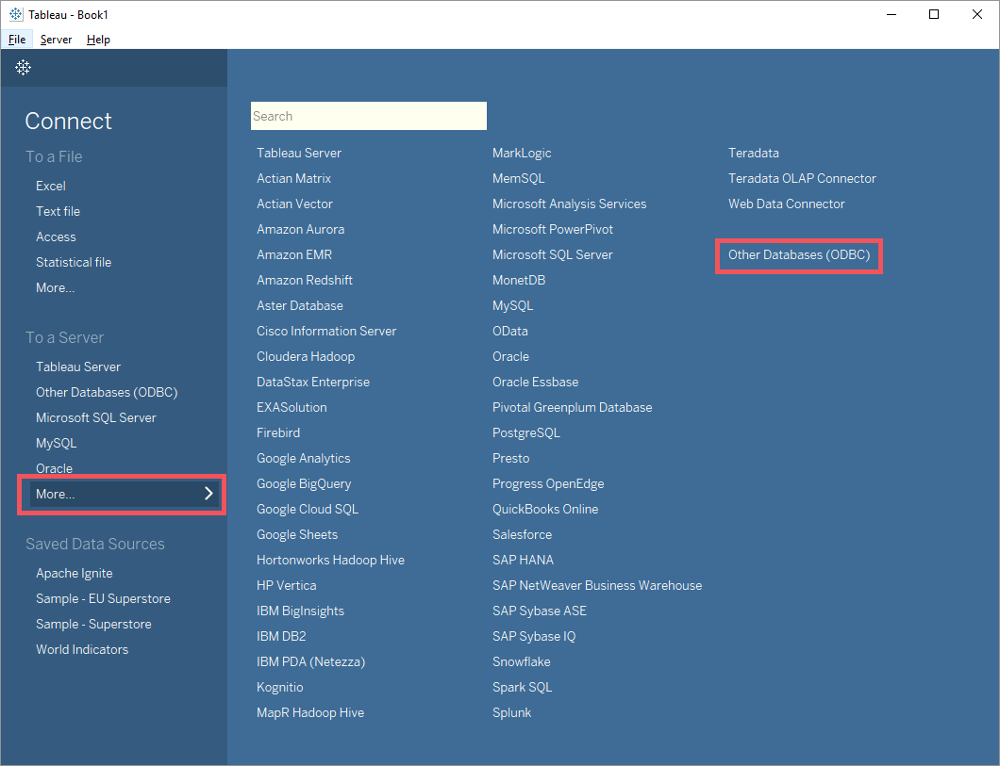
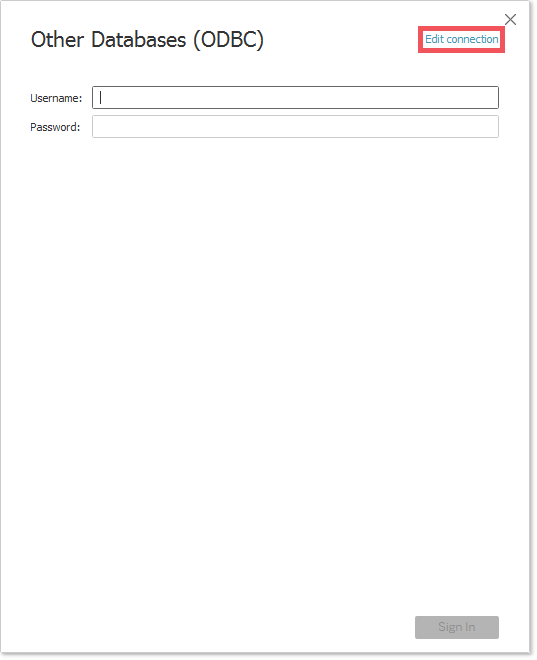
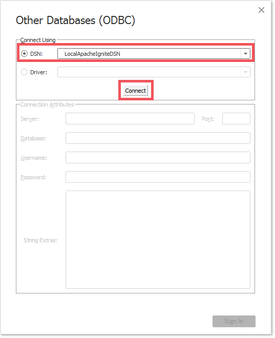
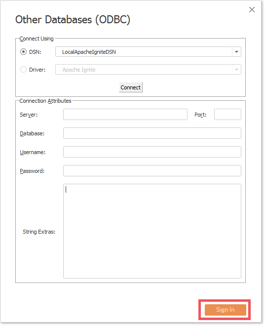
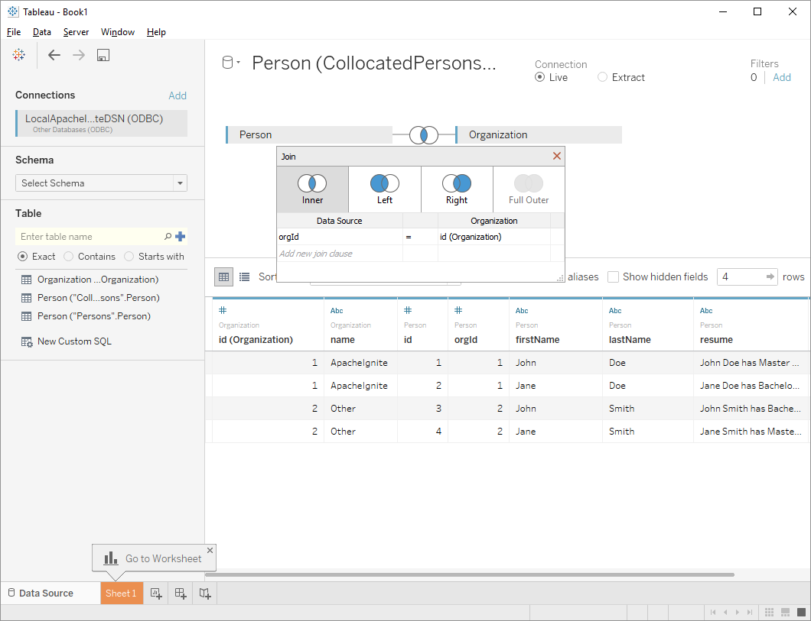
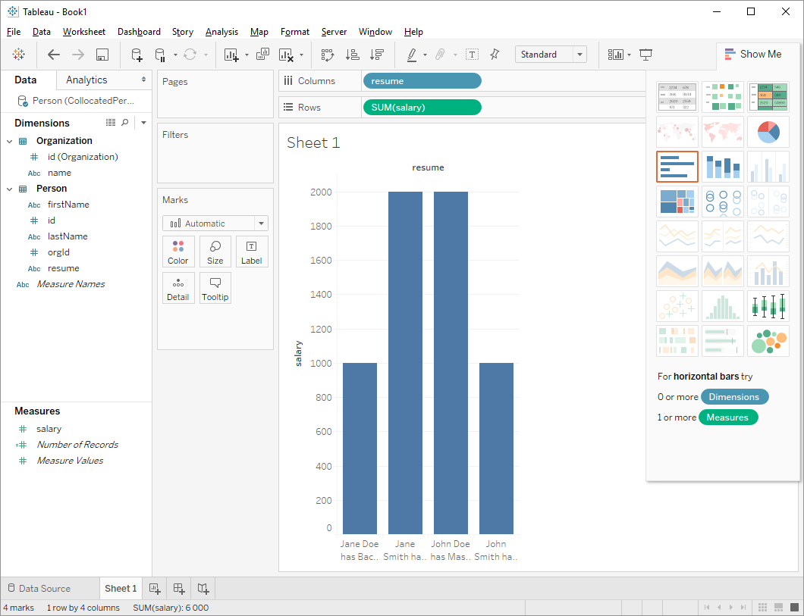

# Tableau

## Overview

Tableau is an interactive data-visualization tool focused on business intelligence. It uses ODBC API to connect to a variety of databases and data platforms in order to analyze data stored there.

GridGain and Apache Ignite are shipped with their own implementation of the ODBC driver which makes it possible to connect from Tableau and analyze the data stored in a distributed GridGain or Ignite cluster.

## Installation and Configuration

To connect to your cluster from Tableau, you need to do the following:

- Download and install Tableau Desktop. Refer to an official Tableau documentation located on the product's [main website](http://www.tableau.com).
- Install the ODBC driver on a Windows or Unix-based operating system. The detailed instructions can be found on the driver's [configuration page]({connectors}/sql/odbc/odbc-driver).
- Finalize the driver configuration by [setting up a (Data Source Name)]({connectors}/sql/odbc/connection-string-dsn). Tableau will connect to the DSN configured at this step.
- The ODBC driver communicates to the cluster over an `ODBC processor`. Make sure that this component is enabled on the [cluster side]({connectors}/sql/odbc/odbc-driver#cluster-configuration).

Once that's done, it's time to connect to the cluster and analyze data located there.

## Connecting to the Cluster

1. Launch the Tableau application and find the **Other Databases (ODBC)** setting located under **Connect -> To a Server -> More...**.

   

2. Click **Edit connection**.

   

3. Set the **DSN** property to the name you configured before. In the example below it's `LocalApacheIgniteDSN`. Once this is done, click the **Connect** button.

   

4. Tableau will try to check the connection by opening a temporal one. If the validation succeeds, the **Sign In** button as well as additional connection related fields will become active. Click **Sign In** to finalize the connection process.

   

## Data Querying and Analysis

Once the connection is successfully established between the cluster and Tableau, the data can be queried and analyzed in a variety of ways supported by Tableau. For more details, refer to the [official Tableau documentation](http://www.tableau.com/learn/training).

_This page is: Copyright © 2026 MariaDB. All rights reserved._
