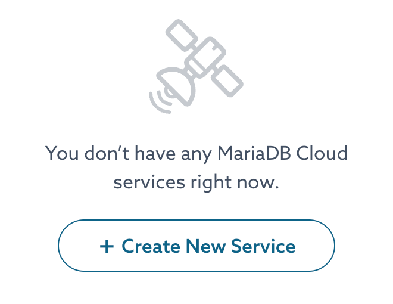
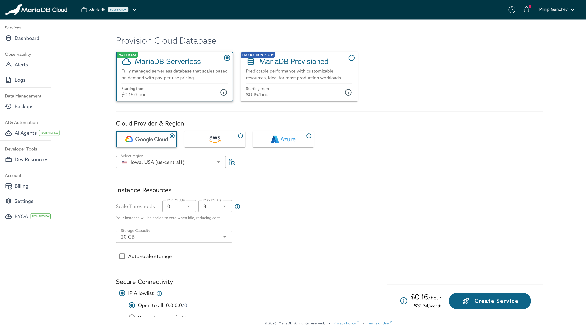
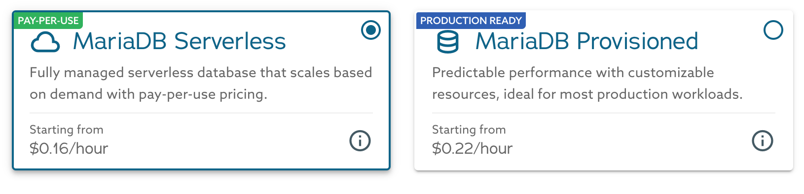
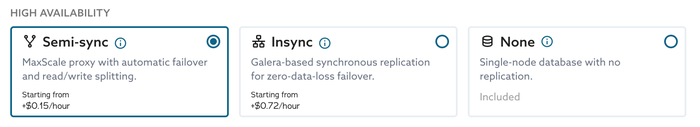
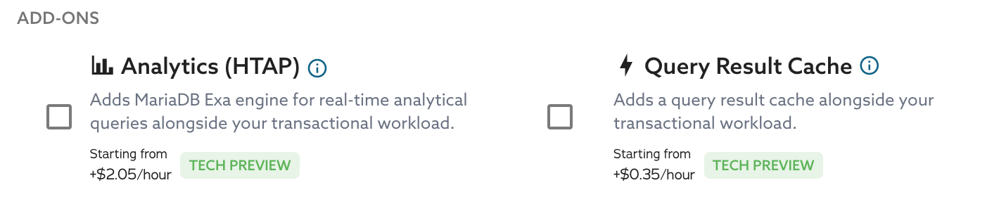
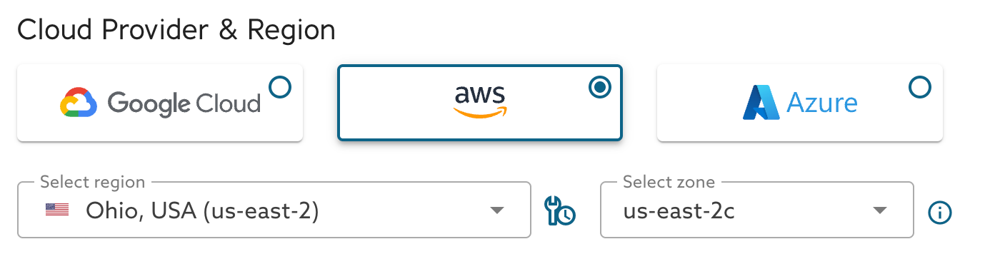
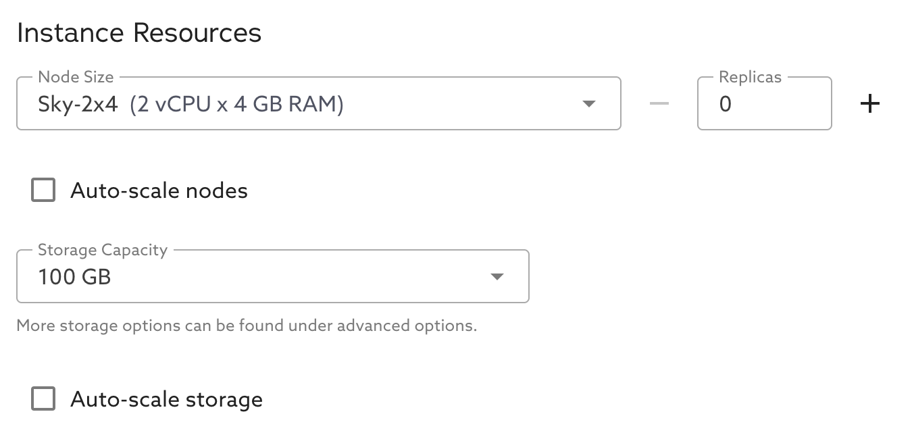
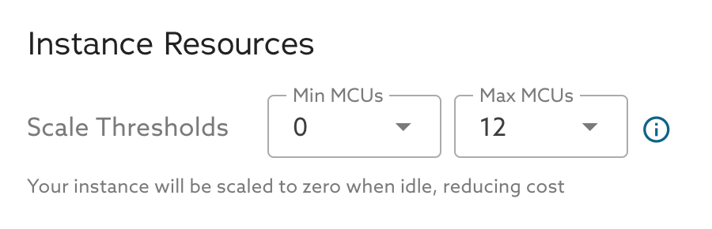
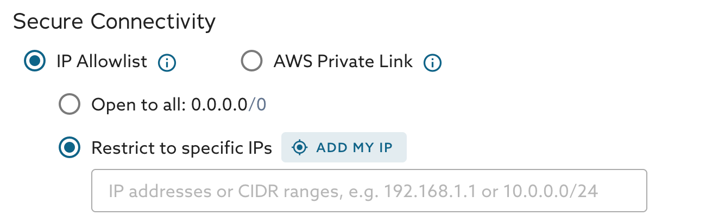
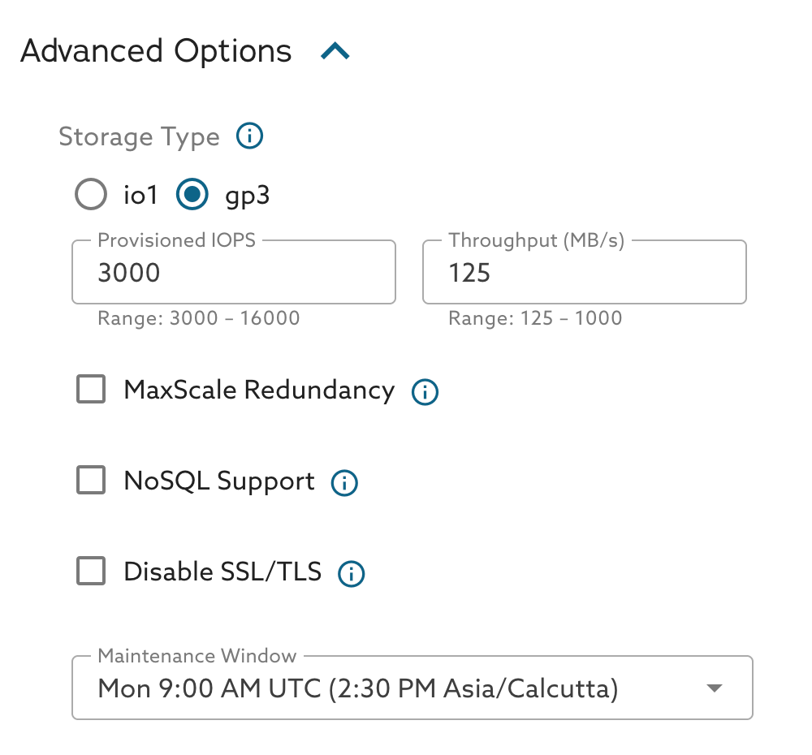

# Launch Page

The **Provision Cloud Database** page creates a new MariaDB Cloud service from a
single page. As you build the configuration, a sticky footer shows a live
estimate of the hourly and monthly cost before you deploy. Open it with
**Create New Service** from the Portal Dashboard.

<figure><figcaption>
Create New Service on the Dashboard
</figcaption></figure>

<figure><figcaption>
Provision Cloud Database page (Serverless)
</figcaption></figure>

## Topology

Choose the service topology:

* **MariaDB Serverless** (Pay-Per-Use) — a fully managed database that scales on
  demand. Best for variable traffic and cost optimization.
* **MariaDB Provisioned** (Production Ready) — predictable performance with
  customizable resources. Best for production workloads that need consistent
  performance.

<figure><figcaption>
Topology selection
</figcaption></figure>

## High Availability

For provisioned services, select a high-availability mode:

* **Semi-sync** — a MaxScale proxy with automatic failover and read/write
  splitting. Recommended for most production workloads.
* **Insync** — Galera synchronous replication across all nodes for
  zero-data-loss failover. Suited to compliance-critical workloads.
* **None** — a single node with no replication. Not recommended for production.

<figure><figcaption>
High Availability modes
</figcaption></figure>

## Add-ons

* **Analytics (HTAP)** — adds the MariaDB Exa engine for real-time analytical
  queries alongside your transactional workload. Requires Semi-sync HA.
* **Query Result Cache** — adds an in-memory query result cache alongside your
  transactional workload. See
  [Query Cache Using GridGain 8](../quickstart/query-cache-gridgain-8.md).

Both add-ons are currently available as a _Tech Preview_.

<figure><figcaption>
Add-ons
</figcaption></figure>

## Cloud provider & region

Select the cloud provider (Google Cloud, AWS, or Azure), then the region and —
for provisioned services — an availability zone. Each region has a scheduled
maintenance window. Available regions vary by account.

<figure><figcaption>
Cloud provider, region, and availability zone
</figcaption></figure>

## Instance resources

For **provisioned** services, choose the node size (for example,
`Sky-2x8` — 2 vCPU × 8 GB RAM), the number of replicas, and, if needed,
horizontal or vertical auto-scaling.

<figure><figcaption>
Instance resources (Provisioned)
</figcaption></figure>

For **serverless** services, set the MCU thresholds. One MCU (MariaDB Compute
Unit) equals 0.5 vCPU + 2 GB memory. Setting **Min MCUs** to 0 lets the service
scale to zero when idle to reduce cost, with a brief startup delay on the next
connection.

<figure><figcaption>
Scale thresholds (Serverless)
</figcaption></figure>

Set the storage capacity and, if needed, enable storage auto-scaling.

## Secure connectivity

Choose how the service accepts connections:

* **IP Allowlist** — open to all, or restrict access to specific IP addresses or
  CIDR ranges (use **Add my IP** to add your current address).
* **Private Link** — connect privately from your own VPC using AWS Private Link,
  Google Cloud Private Service Connect, or Azure Private Link.

<figure><figcaption>
Secure connectivity
</figcaption></figure>

## Basic attributes

Select the **MariaDB Version** (with a link to its release notes) and enter a
**Service Name**.

## Advanced options

Optionally configure storage type, provisioned IOPS and throughput, MaxScale
redundancy, NoSQL (MongoDB®-compatible) support, an SSL/TLS toggle, and the
maintenance window.

<figure><figcaption>
Advanced options
</figcaption></figure>


Some options — Insync high availability, the Analytics (HTAP) add-on,
auto-scaling, Private Link, MaxScale redundancy, and a custom maintenance
window — require the **Power** or **Power Plus** service tier.


## Create the service

Click **Create Service**. The new service appears on the Portal Dashboard, and a
[notification](notifications.md) is sent when launch begins and when it
completes.

<figure><figcaption>
Estimated cost and Create Service
</figcaption></figure>

_This page is: Copyright © 2026 MariaDB. All rights reserved._
