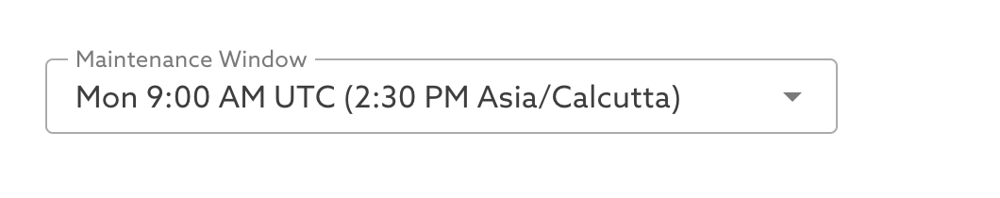
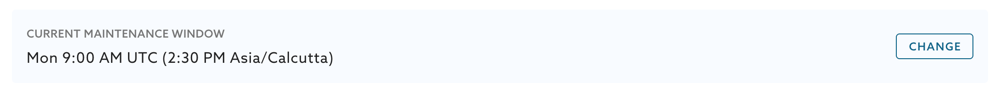
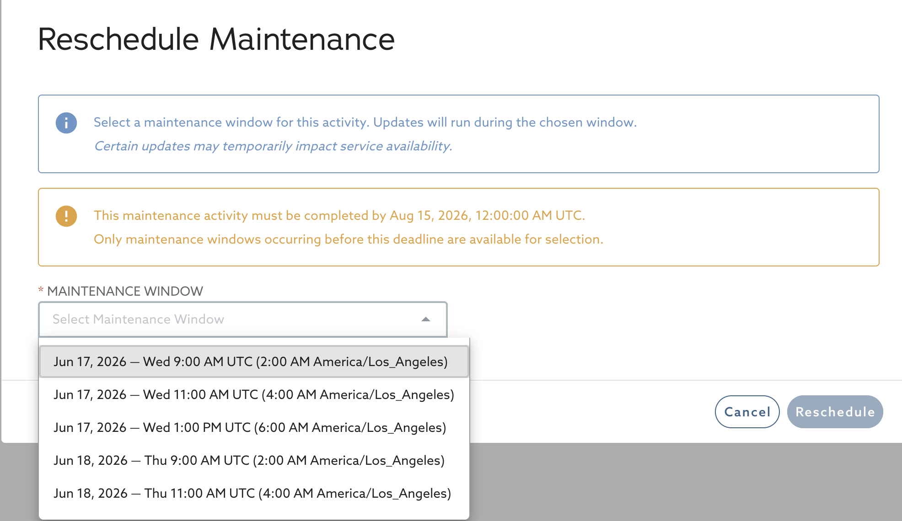
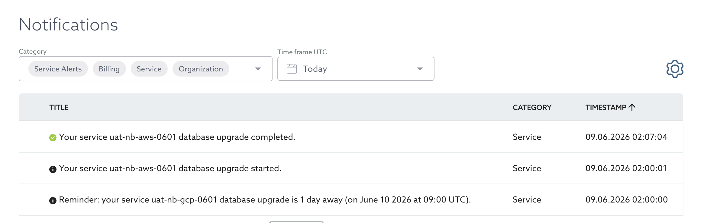

# Maintenance Management

MariaDB Cloud uses a comprehensive, policy-driven maintenance management framework to ensure your managed database services remain secure, reliable, and performant. This framework provides predictability, transparency, and control, allowing you to view upcoming maintenance, understand its scope, and schedule activities to minimize impact on your operations.

By staying current with these upgrades, you ensure continued access to the latest features, security updates, and cloud provider support.

## Understanding Maintenance Classifications

Maintenance activities are categorized into two primary types to clearly indicate the nature of the update:

* **Infrastructure Maintenance**: Updates to the underlying infrastructure layers that host your database.
  * **Why it's required**: Cloud providers (AWS, GCP, Azure) enforce strict upgrade schedules. Outdated infrastructure versions may not receive critical security updates, and cloud providers eventually discontinue support for older versions.
* **Database Security Maintenance**: Updates focused on the MariaDB database software itself. This encompasses minor version upgrades, engine patches, critical CVE remediation, and security hardening configurations.

## Priority Levels and Enforcement

Each maintenance activity is assigned a priority level that dictates its scheduling rules:

* **Recommended**: Updates that improve system stability or address lower-risk issues. These remain in the _Available_ state until you act. You may schedule or defer these within allowed limits.
* **Required**: Updates necessary to maintain system security, cloud provider compliance, or platform reliability. These feature a **target completion date**. You can defer required maintenance temporarily, but it will be automatically and forcibly applied in your last available maintenance window prior to the target completion date.


Updates addressing immediate, severe security vulnerabilities cannot be deferred and will be scheduled in the first available window.


## Maintenance Lifecycle

Each maintenance activity progresses through a defined set of states, which you can track in the Portal:

* **Available**: The initial state. The update is visible and ready for you to act on.
* **Scheduled**: The update is assigned to a specific maintenance window.
* **Deferred**: The update has been postponed within the allowed limits.
* **In Progress**: The update is currently being applied.
* **Completed**: The update has finished successfully.

A complete history of all maintenance actions — including your own reschedules and manual executions — is retained for auditability, compliance, and troubleshooting. See [Maintenance Windows](../reference/maintenance-windows.md) for the full scheduling policy.

## Topology-Aware Impact and Downtime

The impact of maintenance depends on your database topology. While data remains intact and unchanged during all upgrades, service availability varies:

* **Single-Node Topologies**: Maintenance activities requiring a restart will result in a brief temporary downtime, typically lasting 2–5 minutes. A downtime warning is displayed before confirmation in the Portal.
* **Multi-Node Topologies (Replicas)**: Maintenance is performed using rolling updates to minimize impact. There is no full-service downtime. The service will only experience a brief interruption while connections are cycled on the Load Balancer.


**Safety guarantees**: Database version upgrades are upward-only (no downgrades) and run with strong safety checks — compatibility validation before the upgrade begins and integrity checks during execution. If an upgrade fails, the service is automatically rolled back to its previous state.


## Managing Maintenance via the Portal

You can manage all infrastructure and database maintenance directly from the MariaDB Cloud Portal.

### Configuring Your Maintenance Window

You can select your preferred 1-hour weekly maintenance window (in UTC) when launching a new service, under **Advanced Options**:

<figure><figcaption>
Maintenance Window selector at service launch
</figcaption></figure>


Every service is assigned a default maintenance window automatically, scheduled during off-peak hours for your region. You can override it at launch — or at any time afterward — to match your preferred low-traffic period. Existing services already have a default window assigned. For the full policy, see [Maintenance Windows](../reference/maintenance-windows.md).


To view or modify your assigned window after launch, open the **Maintenance** tab on your Service detail page. Your current window is shown at the top — click **Change** to select a different one:

<figure><figcaption>
Current maintenance window on the Maintenance tab
</figcaption></figure>

### Viewing and Applying Maintenance

Services with pending maintenance will prominently display an alerting banner on their Service Card.

To take action, navigate to your Service detail page and click the **Maintenance** tab:

1. Here, you can view the lifecycle state of all activities: **Available**, **Scheduled**, **Deferred**, **In Progress**, and **Completed**.
2. For **Available** items, review the upgrade details and expected impact. You can choose to **Apply Now** for immediate execution, or **Schedule** it for an upcoming 1-hour weekly maintenance window.
3. For **Scheduled** items, you can use the **Reschedule** action to move the execution to another window, up to the allowed limit (and prior to any target completion date).
4. Monitor the upgrade progress via real-time status updates in the Portal, service monitoring panels, and your organization's [Notifications](notifications.md) page.

When you schedule or reschedule an activity, you choose from your service's upcoming maintenance windows. For **Required** maintenance, only windows before the target completion date are offered:

<figure><figcaption>
Rescheduling a maintenance activity
</figcaption></figure>

### Maintenance Notifications

MariaDB Cloud sends advance reminders **1 week**, **1 day**, and **1 hour** before a scheduled activity, plus updates when an activity is scheduled, changed, or completed. If an upgrade fails or is interrupted, MariaDB's support team is automatically alerted so the issue is addressed promptly. See [Notifications](notifications.md) for details and delivery channels.

<figure><figcaption>
Maintenance events on the Notifications page
</figcaption></figure>

## Managing Maintenance via the API

Maintenance can also be managed programmatically for enterprise workflows. The maintenance and maintenance-window endpoints are published in the [MariaDB Cloud API Reference Guide](../reference/mariadb-cloud-api-reference-guide/), generated from the MariaDB Cloud OpenAPI specification. At a high level, the available operations let you:

* **Retrieve maintenance lists**: Fetch the list of maintenance activities for a service, including upcoming, pending, in-progress, and completed items.
* **Apply maintenance**: Immediately execute one or more _Available_ activities ("apply now").
* **Schedule or reschedule**: Schedule activities into a maintenance window, or move a previously scheduled activity to a different window, up to the allowed limit.
* **Manage windows**: Retrieve the available maintenance windows and set the 1-hour UTC window for an individual service.

API responses include the key attributes of each item, such as priority, classification, lifecycle state, and target completion date. For authentication and getting started, see the [MariaDB Cloud REST API Reference](../reference/rest-api-reference.md).

## Frequently Asked Questions

**Q: When is the best time to upgrade?** A: Plan according to your configured 1-hour weekly maintenance windows, typically during periods of low traffic for your application.

**Q: Can I schedule an upgrade for later?** A: Yes. Unlike the previous legacy system, you can now schedule available maintenance for an upcoming eligible window, or reschedule scheduled maintenance up to your allowed limits.

**Q: How will I be notified about upcoming maintenance?** A: You receive advance reminders at 1 week, 1 day, and 1 hour before a scheduled activity, plus notifications when an activity is scheduled, changed, or completed. Notifications are delivered in-product and through your configured notification channels.

**Q: What happens if I don't apply a "Required" upgrade by the deadline?** A: To maintain cloud provider compliance, MariaDB's security compliance SLA, and platform stability, MariaDB Cloud will automatically perform the upgrade in the final maintenance window prior to the target completion date.

**Q: Will my data be affected during the upgrade?** A: No. Maintenance activities only update the infrastructure or database engine software — your data remains intact and unchanged. Database upgrades additionally run compatibility and integrity checks, and automatically roll back if an upgrade fails.

**Q: Can I opt out of infrastructure or security upgrades entirely?** A: No, these upgrades are mandatory to maintain SOC 2 compliance, security standards, and cloud provider support.

_This page is: Copyright © 2026 MariaDB. All rights reserved._
