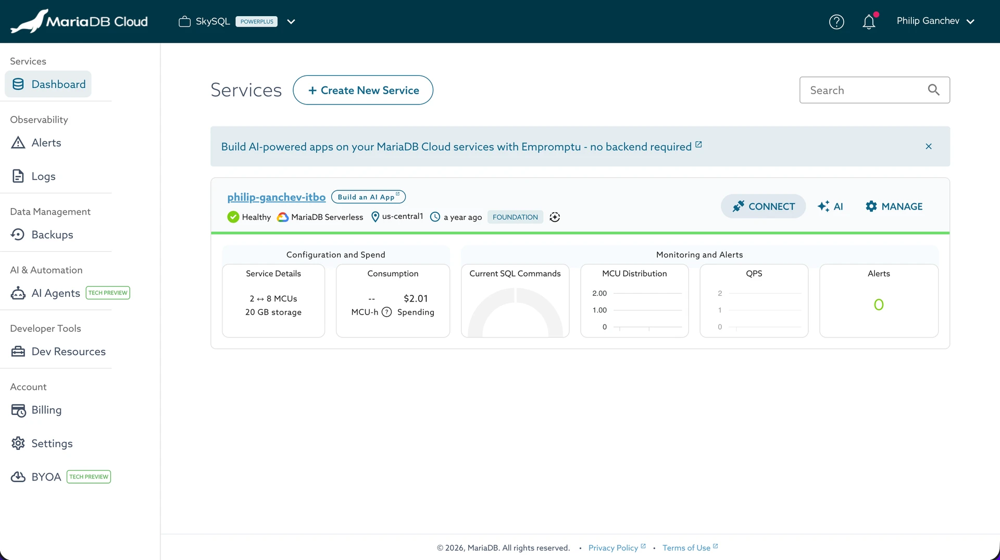
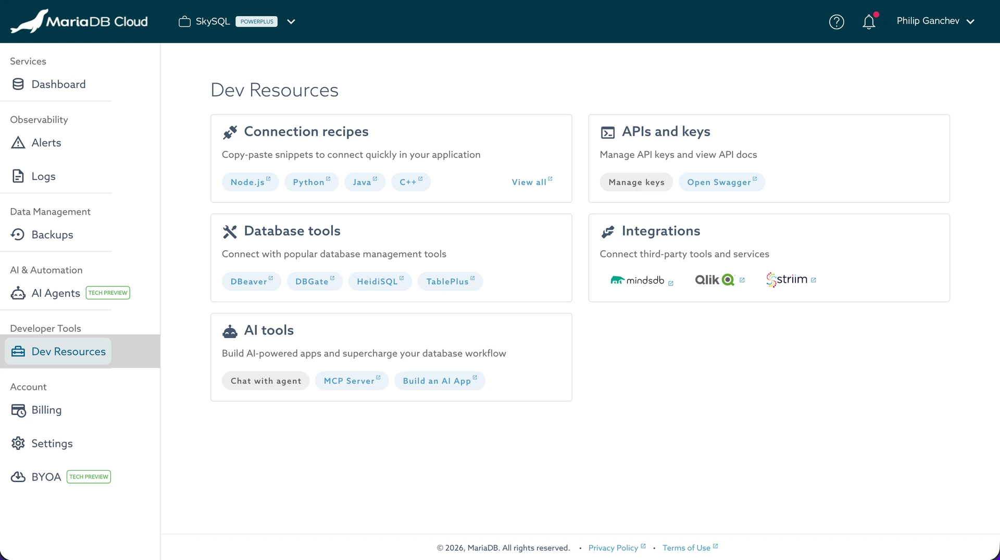

# Empromptu Partner Integration

<!-- DRAFT (DOCS-6285): UI strings and behavior source-verified against
     skysql-ui-client v4.8.2 (MCDEV-3926). Ships behind the enable-empromptu
     feature flag; do not publish until it is enabled in production
     (MCDEV-4027 / MCDEV-4028). See research/DOCS-6285.md. -->

With the partnership between MariaDB and [Empromptu](https://empromptu.ai/), you can build AI-powered applications directly on your MariaDB Cloud databases:

* Empromptu is a no-code platform for building full-stack, AI-native applications through a conversational builder and AI agents that handle data ingestion, application logic, and deployment.
* The integration is bi-directional. You can start in MariaDB Cloud and click through to Empromptu with one of your database services already selected, or you can start in Empromptu and have your finished application deployed on MariaDB Cloud Serverless.
* No backend code is required, and no connection strings or credentials need to be copied between the two products.

This page includes links to Empromptu documentation and interfaces.

### Why Empromptu and MariaDB Cloud?

Empromptu builds production-ready AI features — such as AI-powered assistants, document processing, and predictive analytics — that run on real backends rather than throwaway prototypes. Those applications need a reliable, fully managed SQL database.

MariaDB Cloud Serverless provides that database on demand. It scales automatically with your workload and requires no capacity planning, so an application built on Empromptu has a managed MariaDB database behind it from the first request. For more about the underlying service, see "[MariaDB Cloud Serverless](../../readme/serverless.md)".

### How the Integration Works

The two products are linked in both directions:

<table><thead><tr><th width="180">Direction</th><th>What happens</th></tr></thead><tbody><tr><td>MariaDB Cloud to Empromptu</td><td>From the MariaDB Cloud portal, you click through to the Empromptu builder. Your database service is passed along, so the builder starts with that service already selected as the application's data source.</td></tr><tr><td>Empromptu to MariaDB Cloud</td><td>When you build an application in Empromptu, it is deployed on MariaDB Cloud Serverless on the Free Developer Tier by default.</td></tr></tbody></table>

### Building an App From MariaDB Cloud

The MariaDB Cloud portal offers three entry points into the Empromptu builder:

* **Dashboard banner** — A banner appears above the service list on the dashboard: "Build AI-powered apps on your MariaDB Cloud services with Empromptu - no backend required". Select the banner to open Empromptu. Select the close icon to dismiss it.
* **Service card** — Each service card shows a **Build an AI App** button next to the service name. The button appears only when the service is in the `Ready` state.
* **Dev Resources page** — The **AI tools** card on the Dev Resources page includes a **Build an AI App** button, alongside the **Chat with agent** and **MCP Server** buttons.

The **Build an AI App** button on a service card passes that service to Empromptu along with a starter prompt, so the builder opens in a new tab with the data source already chosen. The dashboard banner and the Dev Resources button open the Empromptu home page instead, without preselecting a service.

<figure><figcaption>
The Empromptu banner and the <strong>Build an AI App</strong> button on the dashboard
</figcaption></figure>

<figure><figcaption>
The <strong>Build an AI App</strong> button on the <strong>AI tools</strong> card of the Dev Resources page
</figcaption></figure>


Empromptu always opens in a new browser tab. Your MariaDB Cloud session is unaffected.


### Deploying an Empromptu App on MariaDB Cloud Serverless

Applications built in Empromptu are deployed on MariaDB Cloud Serverless. By default they use the Free Developer Tier, which every MariaDB Cloud account includes and which is capped at 10 MCU-hours per month.

For details of the tier and its limits, see "[MariaDB Cloud Serverless](../../readme/serverless.md)".

### Account and Sign-In

The integration uses OAuth with PKCE to establish trust between Empromptu and MariaDB Cloud, so you authorize access with your existing MariaDB ID rather than sharing a password or database credentials with Empromptu.

If you do not yet have a MariaDB Cloud account, see "[Quickstart](../../quickstart/)" for how to create a MariaDB ID and launch your first database service.

### Billing

The integration does not include a billing integration. Each product bills you for its own usage: MariaDB bills you for MariaDB Cloud usage, and Empromptu bills you separately for Empromptu usage.

Applications deployed from Empromptu start on the MariaDB Cloud Serverless Free Developer Tier. If your usage reaches the limits of that tier, Empromptu prompts you to sign in to MariaDB Cloud and add a payment method to continue.


Usage and billing for your MariaDB Cloud databases are always managed in the MariaDB Cloud portal, not on the Empromptu platform. See "[Billing](../../cloud-usage/billing.md)".


### Next Steps

* [Empromptu](https://empromptu.ai/)
* [MariaDB Cloud Serverless](../../readme/serverless.md)
* [Quickstart](../../quickstart/)
* [Billing](../../cloud-usage/billing.md)
* [AI Agents & Copilot](../../cloud-ai/README.md)

_This page is: Copyright © 2026 MariaDB. All rights reserved._
