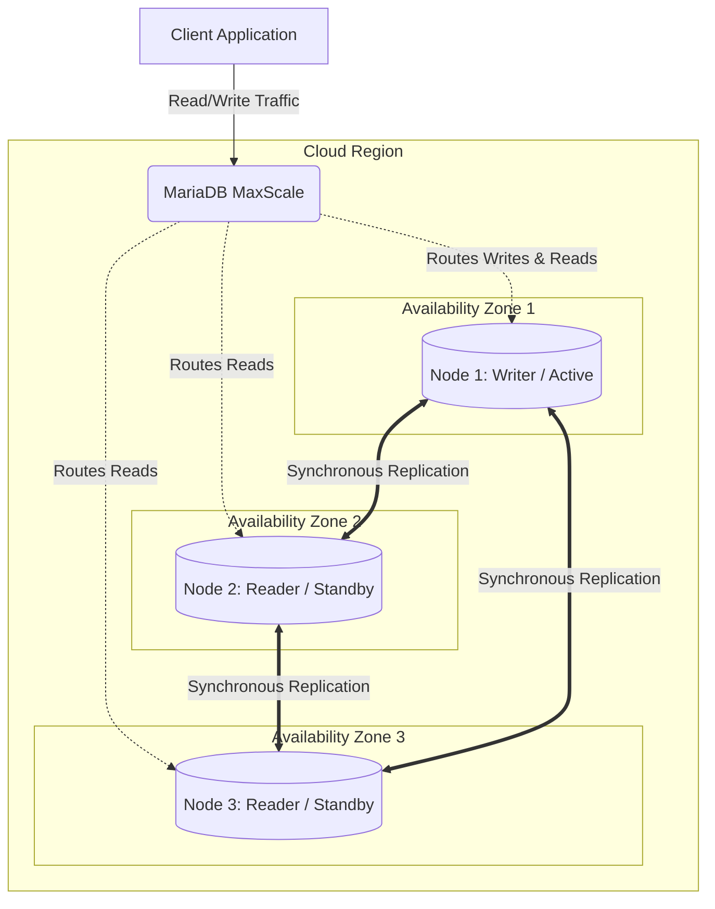
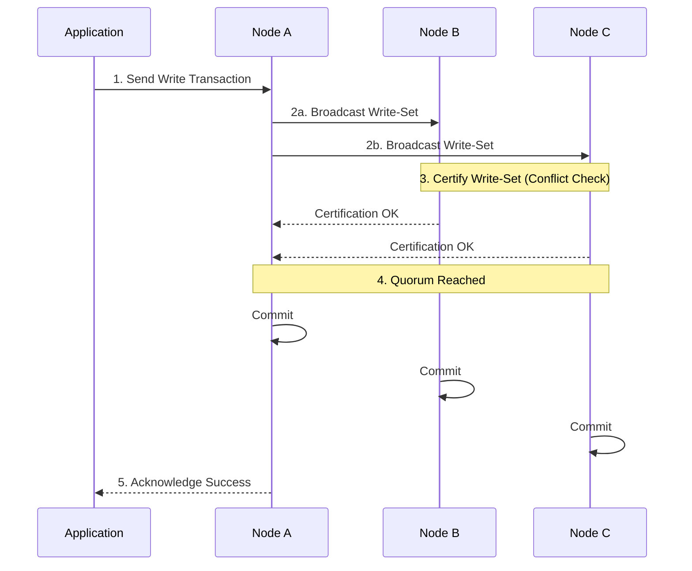
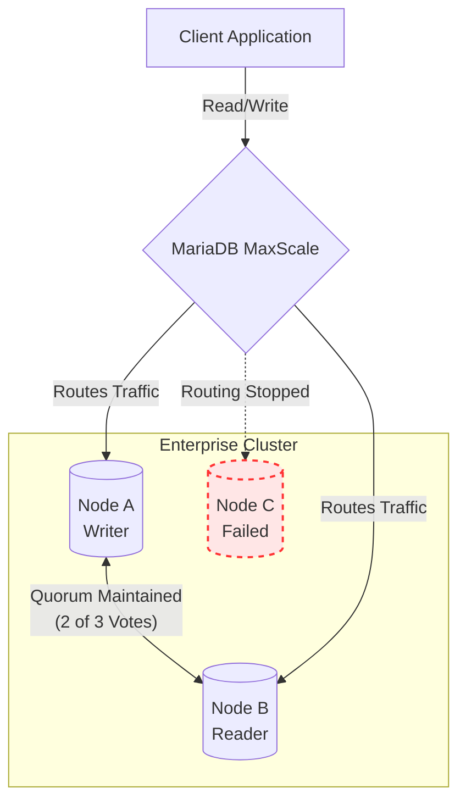
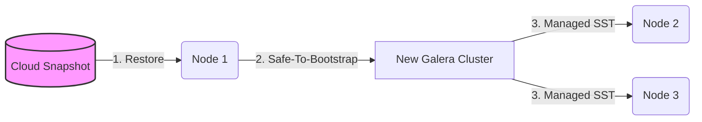

# Enterprise Cluster


**Tech Preview Advisory:** MariaDB Enterprise Cluster is now available as a _Tech Preview_. During this phase, support for this configuration is limited, and some advanced features may be unavailable.


Enterprise Cluster allow you to run highly available database deployments using a synchronous architecture instead of relying on standard asynchronous replication. While the underlying technology supports multi-primary writes, during the Tech Preview, MariaDB MaxScale is configured to route all write traffic to a single active writer node to ensure maximum stability.

MariaDB Cloud typically uses an asynchronous primary/replica model, which provides excellent scalability and read performance for most workloads. However, you might need a different configuration if your business or application requires strict data consistency and zero data loss failover. With Enterprise Clusters, your MariaDB Cloud deployment utilizes synchronous replication, allowing multi-primary write capabilities and strong consistency guarantees while preserving our core value proposition of automation and operational simplicity.

## How it works

An Enterprise cluster is a specialized, highly available environment within MariaDB Cloud designed for workloads that cannot tolerate replica lag.

* Synchronous replication: Data is replicated synchronously across all nodes using write-set certification, ensuring transactions are committed everywhere simultaneously.
* Single-writer routing: MariaDB MaxScale is configured to route all write traffic to a single active writer node at any given time to prevent transaction conflicts. Reads can be load-balanced across the remaining nodes.
* Automated failover: If a node fails, MariaDB MaxScale automatically routes traffic to the remaining healthy nodes without customer intervention or data loss.
* Quorum management: The cluster automatically maintains a voting system (quorum) to prevent split-brain scenarios and preserve data integrity during network partitions.

## Why use Enterprise Cluster

Consider using Enterprise Cluster if you have specific business needs or strict application requirements, such as:

* Regulated industries: If you operate in finance, healthcare, or other sectors requiring deterministic behavior during failures and absolute data consistency (RPO 0).
* Active-active OLTP systems: If your SaaS platform or legacy enterprise application was architected around multi-primary Enterprise Cluster semantics on-premise and requires a lift-and-shift to the cloud.
* Zero tolerance for replica lag: If your application logic fails when reading stale data and requires immediate consistency across all database nodes.
* Automated operations: If you want the benefits of a complex synchronous cluster but need the operational burden (patching, upgrades, and failover) abstracted away into a fully managed service.

## Who is eligible for Enterprise Cluster

It is a premium deployment topology designed for advanced, mission-critical workloads. You can provision a Enterprise cluster if:

* You are subscribed to the PowerPlus tier on MariaDB Cloud.
* You are deploying in Amazon Web Services (AWS), Google Cloud, or Microsoft Azure.


A detailed comparison of the feature sets across our service tiers is available in the [MariaDB Cloud pricing documentation](../reference/pricing.md).


## When to use the regular Replicated deployment

Enterprise Cluster inherently introduces slight commit latency because all nodes must acknowledge a write before it is finalized. Furthermore, unsafe or highly sensitive Enterprise Cluster configuration variables are strictly system-managed to ensure stability.

In most cases, if your application is highly write-intensive, distributed across large geographic distances, or can tolerate standard asynchronous replication lag, you can meet your performance requirements by utilizing a standard Replicated topology.


If you are unsure whether your workload requires synchronous replication with Enterprise Cluster or standard asynchronous replication, contact our team for a sizing and architecture review.


## Enterprise Cluster pricing and billing

Enterprise Cluster follows the standard unit compute, storage, and backup pricing for the PowerPlus tier. This means that databases running either standard Replicated or Enterprise Cluster topologies with a similar node size, count, and storage will incur the same base cost.

Data transfer charges for replication traffic are passed through similarly to other topologies.

## Enterprise Cluster architecture

Enterprise Cluster are designed for high availability, fault tolerance, and uniform operational behavior. When deployed, the cluster provisions a set of uniform nodes distributed across your chosen cloud infrastructure. At the edge of the cluster sits MariaDB MaxScale, which acts as the intelligent routing and high-availability layer for your database traffic.

To maximize resiliency, multi-node clusters can be spread across multiple Availability Zones within a single cloud region.

As illustrated above, MaxScale receives read and write connections from your application and can route them to any of the available primary nodes. Because all nodes participate in synchronous replication, data is kept strictly consistent across all availability zones.

If a single node or an entire zone fails, MaxScale immediately redirects traffic to the surviving nodes. As long as a mathematical majority of nodes remain online, the cluster maintains "quorum" and ensures uninterrupted, writable database service without manual intervention.

Enterprise Cluster consists of a minimum of 3 and a maximum of 5 nodes to maintain this quorum. (A single-node cluster option is available strictly for dev/test purposes). When deployed, instances start at 4 vCPU and 16 GB RAM.

### Synchronous Replication Write Path

Unlike asynchronous replication where the primary commits first and replicas catch up later, Enterprise Cluster requires certification from the cluster before a transaction is finalized.

### Node Failure and Quorum Resolution

Because Enterprise ClusterEnterprise Cluster relies on a mathematical majority to maintain cluster state, it automatically handles node failures without manual intervention or data loss.

If a node goes offline unexpectedly, MariaDB MaxScale detects the failure and immediately stops routing application traffic to it. The remaining active nodes check their voting pool; as long as more than half of the cluster remains online (e.g., 2 out of 3 nodes), the cluster maintains "quorum" and continues accepting reads and writes.

Once the failed node is recovered or replaced by the managed service, it automatically rejoins the cluster, synchronizes its state using a State Snapshot Transfer (SST) or Incremental State Transfer (IST), and resumes accepting traffic from MaxScale.

### Configuration & Monitoring

MariaDB Cloud exposes a curated, safe subset of `wsrep_` variables (such as those controlling flow control and certification) through the Configuration Manager. Monitoring dashboards automatically include cluster status, node health, quorum state, and transaction conflict alerts.

## Enterprise Cluster service backups

Because Enterprise Cluster uses synchronous replication, backup and restore operations must be cluster-aware to preserve consistency and avoid data divergence.

* Snapshots (Only): During the Tech Preview, Enterprise Cluster clusters support only cloud-native snapshots. Because Enterprise Cluster ensures write-set consistency, a snapshot from any single healthy node safely represents the entire cluster state.


Full (physical) backups, logical backups, and Point-in-Time Recovery (PITR) are not supported in this release.


## Cluster Restores

To ensure safe re-formation, restores are initialized on a single node to bootstrap the cluster, followed by automated transfers to bring additional nodes online.

## Dev tools for Enterprise Cluster

You can manage, provision, and scale your Enterprise Cluster using standard MariaDB Cloud methods, including the MariaDB Cloud Portal and REST APIs.&#x20;


Terraform Provider support is not available during the Tech Preview phase.&#x20;


Enterprise Cluster is presented as a distinct deployment topology alongside Single Node and Replicated topologies, providing a unified management experience.

## Related pages

* MariaDB Cloud PowerPlus Tier Pricing
* Migrating from On-Premises Enterprise Cluster
* Configuring `wsrep` Variables in MariaDB Cloud
