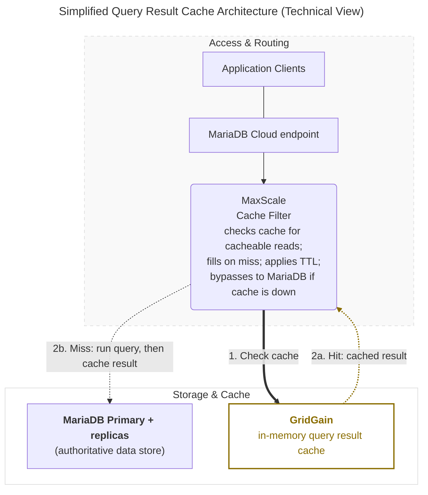

# Query Result Cache

Query Result Cache is a provisioning **add-on** for MariaDB Provisioned services that adds an in-memory cache for SQL query results. Repeated read queries are served from the cache instead of the underlying database, reducing read latency for read-intensive workloads with high query reuse. The add-on integrates with the Semi-Sync HA topology and uses the same MaxScale endpoint, so applications continue connecting to the existing MariaDB Cloud endpoint.


This feature requires **Semi-Sync HA** and **MaxScale 25.10.3 or later**, is available on Power and PowerPlus tiers only, and cannot be enabled on trial accounts.


## Architecture Overview

The cache is positioned between MaxScale and MariaDB. MaxScale intercepts cacheable reads and checks the cache before querying the database; MariaDB remains the authoritative data store for all writes and for any read that is not served from cache. The cache engine is GridGain, running as a single in-memory node that is managed entirely by the platform.

### Simplified Technical View



### Core Components

#### **MaxScale Cache Filter**

The endpoint and routing layer. It classifies cacheable reads, performs the cache lookup, applies the configured TTL when it fills the cache, and **fails through** to MariaDB on a miss or when the cache is unavailable.

#### **MariaDB Server**

The **OLTP** (online transactional processing) engine and the **authoritative data store**. All writes, and all reads that are not served from cache, run here. It is unchanged by adding the cache.

#### **GridGain (Cache Engine)**

A single-node, in-memory query result store. It holds cached `SELECT` results only, has **no persistence**, and is reachable only from MaxScale inside the service.

### Freshness and Consistency

#### **TTL-Bounded Freshness**

Cached results are **time-bounded**, not invalidated on every write. Each cached result lives for at most the configured hard TTL (`queryresultcache_mxs_hard_ttl`, see [Configuration Reference](query-cache-gridgain-8.md#configuration-reference)), after which it is refreshed from the database on the next read.

#### **No Read-Your-Own-Writes From Cache**

The cache does not guarantee you will see a write you just made until the TTL expires and the result is refilled. Queries that must always reflect the latest write are **not** good caching candidates.

#### **Cache-Miss Fallthrough**

On a miss, MaxScale forwards the query to MariaDB, returns the result to the client application, and stores it for subsequent identical queries.

#### **Cache-Bypass Failover**

If the cache becomes unreachable, MaxScale routes reads directly to MariaDB. There are **no application errors**. You only lose the caching speed-up until the cache recovers. Because the cache is a single in-memory node with no persistence, losing it means a **cold cache, not data loss**; it re-warms as queries re-execute. A rolling restart behaves the same way: no errors, only a temporary drop in hit rate.

## Launching a Query Result Cache Service

Query Result Cache is enabled on a **MariaDB Provisioned** service that uses **Semi-Sync HA**. You can enable it at launch or add it to an existing service later.

### Via MariaDB Cloud Portal (UI)

1. In the [MariaDB Cloud portal](https://cloud.mariadb.com/), launch a new **Provisioned** service or open an existing one.
2. Under **High Availability**, choose **Semi-sync**, which Query Result Cache requires.
3. Under **Add-ons**, enable **Query Result Cache**.
4. Under **Instance Resources**, choose a **Cache Node Size** (**Sky-4x16** to **Sky-16x128**, Intel/AMD only).
5. Optionally, under **Advanced Options**, set the cache **TTL** and **Minimum Query Duration**.

A new service starts permissive: with no rules set, every query the cache can hold is cached. Set [caching rules](query-cache-gridgain-8.md#caching-rules) from **Manage** → **Query Result Cache** once the service is ready — start with the volatile-function exclusion described there.

<figure><figcaption></figcaption></figure>

_Launch - Enable Query Result Cache_

### Via MariaDB Cloud REST API

For **API keys**, client IP **allow list**, checking service **`ready`** status, and fetching **credentials**, follow [Launch DB using the REST API](launch-db-using-the-rest-api.md). The [MariaDB Cloud REST API reference](../reference/rest-api-reference.md) and [API docs](https://apidocs.skysql.com/) cover the full request model.

**Query Result Cache fields** — On `POST /provisioning/v1/services`, set **`"cache_backend": "QueryResultCache"`** to provision the cache on top of the replicated **es-replica** (Semi-Sync HA) topology. Use **`amd64`** for `architecture` and a supported cache size, consistent with the portal. Optionally set `queryresultcache_size`, `queryresultcache_replicas`, `queryresultcache_mxs_hard_ttl`, `queryresultcache_mxs_min_query_duration`, and `queryresultcache_rules` (see [Configuration Reference](query-cache-gridgain-8.md#configuration-reference)).

Example (adjust `tier`, `region`, `availability_zone`, `size`, `version`, and add **`allow_list`** or other required keys per the launch guide):

```bash
curl --location 'https://api.skysql.com/provisioning/v1/services' \
  --header 'Content-Type: application/json' \
  --header "X-API-Key: ${API_KEY}" \
  --data '{
  "tier": "power",
  "service_type": "transactional",
  "topology": "es-replica",
  "provider": "aws",
  "region": "us-east-2",
  "availability_zone": "us-east-2b",
  "name": "query-result-cache-test",
  "nodes": 1,
  "size": "sky-4x32",
  "architecture": "amd64",
  "storage": 100,
  "version": "11.4.10-7.1-standard",
  "ssl_enabled": true,
  "cache_backend": "QueryResultCache",
  "queryresultcache_size": "sky-4x32",
  "queryresultcache_replicas": 1
}'
```

**Discover available cache sizes** — list the valid `queryresultcache_size` values for a provider and topology:

```bash
curl --location \
  'https://api.skysql.com/provisioning/v1/sizes?type=queryresultcache&provider=aws&topology=es-replica' \
  --header "X-API-Key: ${API_KEY}" | jq
```

**Add, modify, or remove the cache on an existing service** — use the `queryresultcache` sub-resource. Each call returns `202 Accepted`; the service moves to `pending_modifying` (or `pending_scale` when you resize an existing cache), then back to `ready`. The service must be `ready` before you call it.



```bash
# If queryresultcache_size is omitted, it defaults from the server size.
curl --location --request PATCH \
  "https://api.skysql.com/provisioning/v1/services/${SERVICE_ID}/queryresultcache" \
  --header 'Content-Type: application/json' --header "X-API-Key: ${API_KEY}" \
  --data '{"queryresultcache_size": "sky-4x32"}'
```



```bash
curl --location --request PATCH \
  "https://api.skysql.com/provisioning/v1/services/${SERVICE_ID}/queryresultcache" \
  --header 'Content-Type: application/json' --header "X-API-Key: ${API_KEY}" \
  --data '{"queryresultcache_mxs_hard_ttl": 300}'
```



```bash
curl --location --request PATCH \
  "https://api.skysql.com/provisioning/v1/services/${SERVICE_ID}/queryresultcache" \
  --header 'Content-Type: application/json' --header "X-API-Key: ${API_KEY}" \
  --data '{"queryresultcache_size": "sky-8x64"}'
```



```bash
# MariaDB and MaxScale keep running normally.
curl --location --request DELETE \
  "https://api.skysql.com/provisioning/v1/services/${SERVICE_ID}/queryresultcache" \
  --header "X-API-Key: ${API_KEY}"
```



Omitting a field on `PATCH` keeps its stored value.

## Managing the Cache

Manage the cache from the service's **MANAGE** menu → **Manage Query Result Cache**. The dialog has two tabs.

On **Capacity & tuning**:

* **Enable or disable** the cache with the **Enable Query Result Cache** checkbox.
* **Change the TTL** in **TTL**, from 5 to 600 seconds (default 120).
* **Change the Minimum Query Duration**, from 1 to 60000 milliseconds (default 100). Queries that finish faster than this are not cached.
* **Resize the cache node** by selecting a size from **Sky-4x16** up to **Sky-16x128** to scale up or down.

On **Caching rules**, edit the rules that decide which queries are cached and who may read cached entries. See [Caching Rules](query-cache-gridgain-8.md#caching-rules) below. The cache must already be enabled before you can set rules.

<figure><figcaption></figcaption></figure>

_Manage Query Result Cache_

The same operations are available through the REST API. See [Via MariaDB Cloud REST API](query-cache-gridgain-8.md#via-mariadb-cloud-rest-api) above.

## Caching Rules

`queryresultcache_rules` is a JSON document that decides **which** queries are stored in the cache and **which users** may read cached entries. The default is `{}` — no rules, so nothing is excluded on the basis of what a query does.


**Rules are the only thing that keeps volatile results out of the cache.** The cache does not inspect a query to judge whether its result is safe to reuse. With no `store` rules, a query calling `NOW()`, `CURDATE()`, `RAND()`, `UUID()`, or `LAST_INSERT_ID()` has its result cached like any other, and every identical query is served that same value until the hard TTL expires.

Excluding those functions is the recommended first rule on any new service. See [Rule Examples](query-cache-gridgain-8.md#rule-examples), or pick **Everything except queries that use volatile functions** in the portal's guided editor.


Rules do not replace the other limits. A result is stored only when **all** of these pass:

1. **Store rules** (`store[]`) allow it — an empty document allows everything.
2. **Use rules** (`use[]`) allow the requesting user to read cached entries — empty means all users.
3. The backend query took at least `queryresultcache_mxs_min_query_duration` (default 100 ms).
4. The result is at or below the 1 MB per-entry limit.
5. The query is not running inside a transaction. Queries in transactions are never cached.
6. The cached entry has not passed its hard TTL.

### Setting Rules in the Portal

Open **Manage** → **Query Result Cache** → **Caching rules**. The editor has two modes, and a tester alongside them.

**Guided** mode covers the common cases without writing JSON. Under **What gets stored in the cache**, choose one of:

* **Every query that can be cached** — the default. No filtering of any kind, including queries whose results go stale the moment they are computed.
* **Everything except queries that use volatile functions** — the recommended starting point, since results from those never stay correct for long. `NOW`, `CURDATE`, `CURTIME`, `RAND`, `UUID`, and `SLEEP` are excluded for you; `SYSDATE`, `CURRENT_TIMESTAMP`, `LAST_INSERT_ID`, and `CONNECTION_ID` are offered as well. The set folds into one pattern, so each function you add narrows the cache further.
* **Only queries matching a pattern I give** — one pattern matched against the raw SQL text, as **Starts with**, **Contains**, or **Matches regex (RE2)**.

Under **Who can read from the cache**, list the database users allowed to read cached entries. Leave it empty to let every user read from the cache.

**Raw JSON** mode takes the full rules document described below. Guided mode is a deliberate subset, so the editor switches you to Raw JSON when a saved document is more specific than guided mode can represent — several rule sets, more than one `store` rule, an attribute or pattern guided mode cannot show, or `use` rules beyond a plain list of users.

Both modes show the **Resulting rules** — exactly what gets sent when you save — and flag rules that will not do what they appear to do. **Test a query** checks the rules currently in the editor, not the ones already saved.


Saving rules does not restart your service. Allow a few minutes for new rules to take effect. **Reset to default** clears every rule so the service caches every cacheable query again; it does not disable the cache or remove any nodes.


### Rule Grammar

The document is a single JSON object, or a non-empty array of objects, up to 64 KiB. The only allowed keys are `store` and `use`. Each entry is `{"attribute": "…", "op": "…", "value": "…"}`, with all three required and no extra keys.

| Section | Allowed `attribute`                | Allowed `op`                 |
| ------- | ---------------------------------- | ---------------------------- |
| `store` | `query`, `database`, `table`, `column` | `=`, `!=`, `like`, `unlike` |
| `use`   | `user`                             | `=`, `!=`, `like`, `unlike`  |

For the exact-match operators `=` and `!=`, a `database` value must not contain a dot, a `table` value may contain at most one, and a `column` value at most two.


**`store[]` is first-match-wins OR, not AND.** Each store entry you add **widens** what gets cached. There is no way to require that several conditions all hold.

**`like` and `unlike` values are RE2 regular expressions.** PCRE2-only syntax — lookahead, lookbehind, backreferences, possessive quantifiers, and recursion — is rejected. You cannot express a conjunction with a lookahead.

**`table`, `column`, and `database` matchers test existence, not universality.** A `JOIN` that mentions a listed table can still be cached even when another table in the same `JOIN` was meant to be excluded.



Do not write a "`SELECT`s only" rule such as `^SELECT`. It also drops cacheable `SELECT` statements that begin with a comment or a common table expression.


### Rule Examples



```json
{}
```

Nothing is excluded by rule. Results of volatile functions are cached too — see the warning above.



```json
{
  "store": [
    { "attribute": "query", "op": "unlike", "value": "(?i)\\b(now|curdate|rand|uuid|sleep)\\b" }
  ]
}
```



```json
{
  "use": [
    { "attribute": "user", "op": "=", "value": "app_user" }
  ]
}
```



### Applying Rules

Update rules with a `PATCH` to the `queryresultcache` sub-resource:

```bash
curl --location --request PATCH \
  "https://api.skysql.com/provisioning/v1/services/${SERVICE_ID}/queryresultcache" \
  --header 'Content-Type: application/json' --header "X-API-Key: ${API_KEY}" \
  --data '{"queryresultcache_rules":{"store":[{"attribute":"query","op":"unlike","value":"(?i)\\b(now|rand|uuid)\\b"}]}}'
```

A rules-only change does not restart MaxScale. Allow up to about two minutes after the service returns to `ready` for new rules to take effect. Changing the TTL or the minimum query duration does restart MaxScale.

### Validating and Testing Rules

Two endpoints check a rules document without saving anything:



```bash
curl --location --request POST \
  'https://api.skysql.com/provisioning/v1/queryresultcache/rules/validate' \
  --header 'Content-Type: application/json' --header "X-API-Key: ${API_KEY}" \
  --data '{"queryresultcache_rules":{"store":[{"attribute":"query","op":"unlike","value":"(?i)\\b(now|rand)\\b"}]}}'
```

Returns `valid` and any `warnings` — for example, when the document holds ten or more `store` and `use` entries combined.



```bash
curl --location --request POST \
  'https://api.skysql.com/provisioning/v1/queryresultcache/rules/test' \
  --header 'Content-Type: application/json' --header "X-API-Key: ${API_KEY}" \
  --data '{"queryresultcache_rules":{"store":[{"attribute":"query","op":"unlike","value":"(?i)\\b(now|rand)\\b"}]},"query":"SELECT 1 FROM orders"}'
```

Returns `would_store`, plus `matched_rule` when a `store` entry decided it.



The tester evaluates `store` rules against the query text only. `would_store` is `null` when a `database`, `table`, or `column` rule would be needed to decide, because that needs the SQL to be parsed. When the document also has `use` rules, `unevaluated` includes `user` — the tester does not evaluate users, so cache reads may still be restricted in ways it does not show.

## Configuration Reference

| Field                                       | Meaning                                                                         | Values                                                                    |
| ------------------------------------------- | ------------------------------------------------------------------------------- | ------------------------------------------------------------------------- |
| `cache_backend`                             | Enables Query Result Cache                                                      | `QueryResultCache`                                                        |
| `queryresultcache_size`                     | Cache node size (its own catalog, `type=queryresultcache`)                      | `sky-4x16`, `sky-4x32`, `sky-8x32`, `sky-8x64`, `sky-16x64`, `sky-16x128` |
| `queryresultcache_replicas`                 | Number of cache nodes                                                           | Must be `1` (locked in Tech Preview)                                      |
| `queryresultcache_mxs_hard_ttl`             | Cache freshness bound, in seconds                                               | 5–600, default 120                                                        |
| `queryresultcache_mxs_min_query_duration`   | Minimum backend execution time, in milliseconds, before a result is cached      | 1–60000, default 100                                                      |
| `queryresultcache_rules`                    | Caching rules document. `{}` caches everything the other settings allow          | Object or array of objects, up to 64 KiB                                  |

A `GET` on the service also returns two read-only fields: `queryresultcache_available`, which reports whether the cache can be newly enabled on that service, and `queryresultcache_unavailable_reason`, which explains why it cannot. A service that already has the cache enabled stays available even if its MaxScale is older than 25.10.3.

### Cache Sizes

Cache sizes are **not** server sizes. For example, `sky-2x8` is a valid server size but not a valid `queryresultcache_size`. When you add the cache without specifying a size, it defaults from the server size:

| MariaDB server size             | Default cache size |
| ------------------------------- | ------------------ |
| Up to and including `sky-8x64`  | `sky-4x16`         |
| `sky-16x64` to `sky-32x256`     | `sky-8x32`         |
| Larger                          | `sky-16x64`        |

You can still choose any size from the cache catalog.

### Common API Errors

| Case                                                             | Response                                                             |
| ---------------------------------------------------------------- | -------------------------------------------------------------------- |
| Modify or remove while the service is not `ready`                | `409 Conflict`                                                       |
| Empty request body / no effective change                         | `400` "query result cache configuration is unchanged"                |
| `queryresultcache_replicas` other than `1`                       | `400` "queryresultcache\_replicas must be 1"                         |
| Invalid `queryresultcache_size` (including server-size names)    | `400` "invalid queryresultcache\_size"                               |
| TTL out of range                                                 | `400` "queryresultcache\_mxs\_hard\_ttl must be between 5 and 600"   |
| Minimum query duration out of range                              | `400` "queryresultcache\_mxs\_min\_query\_duration must be between 1 and 60000" |
| Invalid rules document                                           | `400` "queryresultcache\_rules is invalid"                           |
| MaxScale older than 25.10.3 when enabling                        | `400` "query result cache requires MaxScale 25.10.3 or later"        |
| Architecture other than `amd64`                                  | `400` "query result cache is not supported for the requested architecture" |
| Trial account                                                    | `400` "query result cache is not available on trial accounts"        |
| Remove when the cache is not enabled                             | `409` "query result cache is not enabled on this service"            |

## Observability

When the cache is enabled, the service's **Monitoring** view gains a **Query Result Cache** dashboard (select it in the top-right of the Monitoring tab). It shows the health of the cache over the selected time interval:

<figure><figcaption></figcaption></figure>

_Monitoring - Query Result Cache_

| Panel                          | What it shows                                                                        |
| ------------------------------ | ------------------------------------------------------------------------------------ |
| Cache Hit Ratio                | Ratio of cache hits to total lookups (gets); the main measure of cache effectiveness |
| Cache Throughput               | Cache gets, hits, and misses per second                                              |
| Cache Entries                  | Number of entries currently held in the cache                                        |
| Off-Heap Used                  | Percentage of the cache node's off-heap memory in use                                |
| Data Region Memory             | Memory allocated to the cache against its maximum size                               |
| Evictions / sec, Eviction Rate | Cache entries evicted per second (an indicator of memory pressure)                   |

For the full list of panels, see [Service Monitoring Panels](../cloud-usage/service-monitoring-panels.md). The same metrics are also available through the [Observability](../cloud-management/observability.md) API.


A low or zero hit rate usually means the TTL is too short for your workload, the minimum query duration is too high, the result sets are too large to cache, the queries run inside transactions, or your rules are too strict. A rising eviction rate, or Data Region Memory sitting near its maximum, means the cache is undersized for your hot dataset. Consider a larger `queryresultcache_size`.


## Known Issues and Limitations

The Tech Preview scopes Query Result Cache to the following:

* **Requires Semi-Sync HA.** The cache is not available on the Insync (Galera) or None HA options, or on Serverless.
* **Requires MaxScale 25.10.3 or later** to enable. Services that already have the cache are unaffected.
* **Freshness is TTL-bounded.** Cached results may be stale for up to the configured hard TTL because there is no per-write invalidation.
* **Large results are not cached.** Result sets larger than the per-entry limit (1 MB) are retrieved directly from MariaDB instead of being cached.
* **Queries in transactions are not cached.**
* **Single cache node.** `queryresultcache_replicas` is locked to 1. Cached data is not replicated. If the cache node becomes unavailable, requests are served from MariaDB until the cache is repopulated.
* **Single availability zone.** The cache runs in the same AZ as MaxScale; multi-AZ is planned for a later phase.
* **No persistence or backups** for the cache; it is in-memory only.
* **No autoscaling.** The initial release supports a single cache node only. The node can be vertically resized independently of the MariaDB Server.
* **Fixed memory layout.** The JVM heap and off-heap memory allocation are determined by the selected node size and cannot be customized.
* **No direct GridGain access.** GridGain is not exposed to customers. Direct access to GridGain features such as key-value operations, SQL, Compute, Transactions, or Data Streamer is not supported. The GridGain version is managed by the platform and is not user-configurable.

<sub>_This page is: Copyright © 2026 MariaDB. All rights reserved._</sub>
