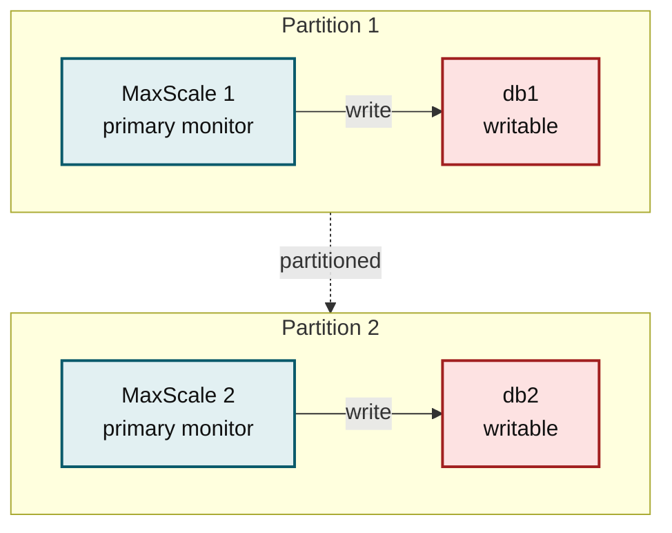
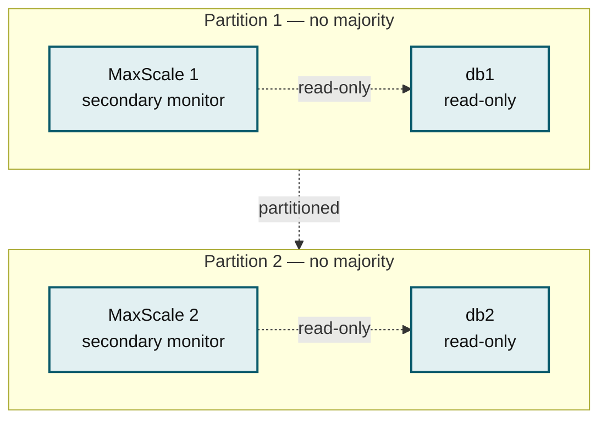
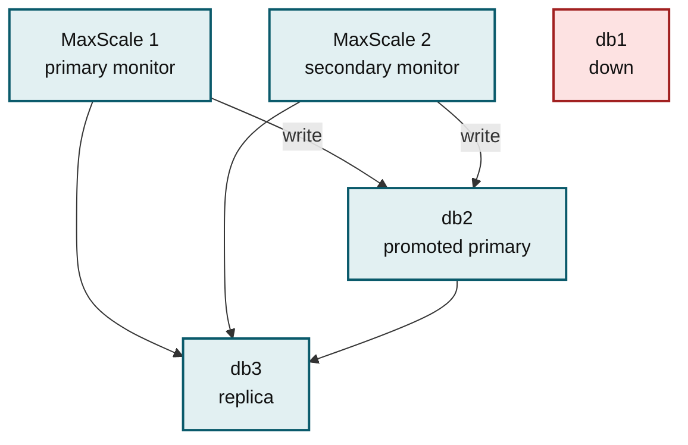
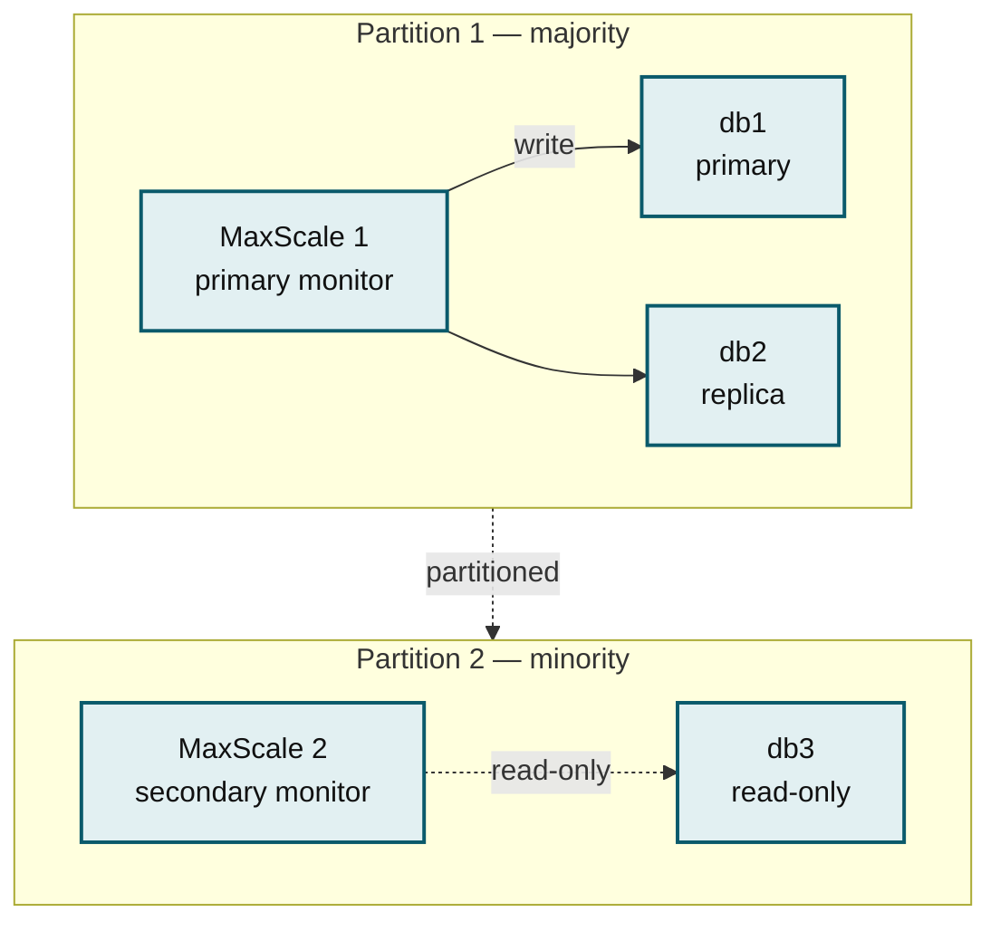
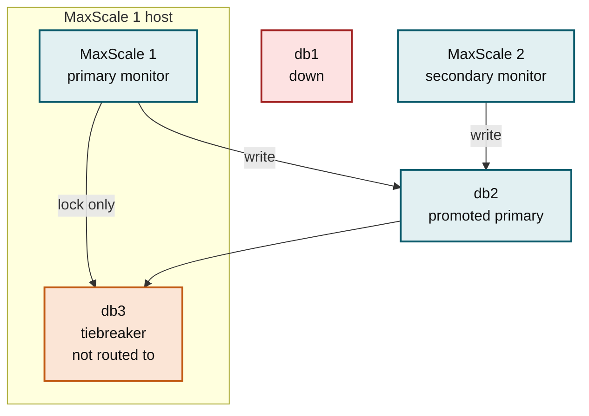
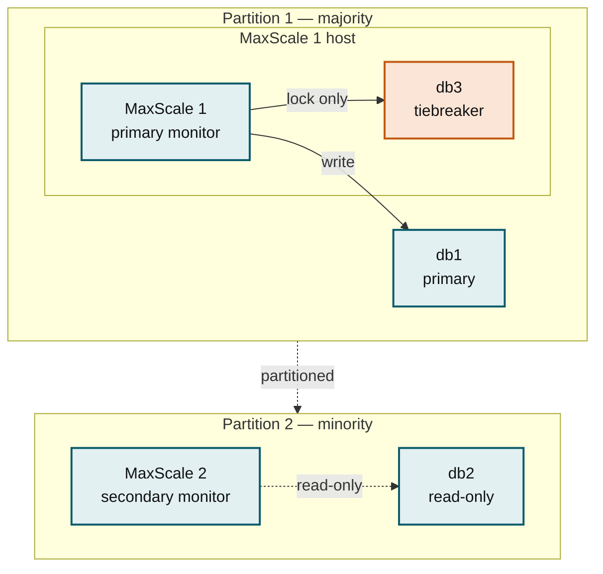
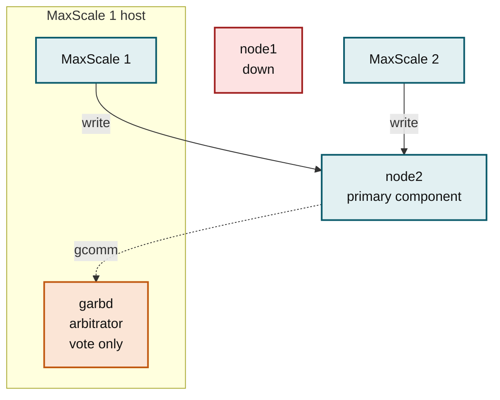

# Deployment Topologies for Multiple MaxScales

Running two MaxScale instances removes MaxScale as a single point of failure, and [cooperative locking](failover-with-multiple-maxscales.md) keeps the two instances from diverging the cluster. What cooperative locking cannot do is invent servers: `cooperative_monitoring_locks=majority_of_all`, the only mode that survives a network partition, needs a majority of the configured servers to be reachable. How many servers you deploy, and where, therefore decides what the pair actually survives.

This page compares four topologies for a two-MaxScale deployment, from the cheapest to the ones that tolerate a partition, and shows how co-locating a third database node on a MaxScale server gets three-node safety at close to two-node hardware cost.


This page assumes you have read [Failover With Multiple MaxScales](failover-with-multiple-maxscales.md). The lock arithmetic, the master lock, and the semisynchronous-replication requirement of `majority_of_all` are explained there and only referenced here.


## Comparing the Topologies

| Topology | Hosts | Survives one database node down | Survives a network partition |
| -------- | ----- | ------------------------------- | ---------------------------- |
| [2 databases + 2 MaxScales](deployment-topologies-for-multiple-maxscales.md#two-databases-and-two-maxscales) | 4 | No | No |
| [3 databases + 2 MaxScales](deployment-topologies-for-multiple-maxscales.md#three-databases-and-two-maxscales) | 5 | Yes | Yes |
| [2 databases + 2 MaxScales + co-located tiebreaker](deployment-topologies-for-multiple-maxscales.md#two-databases-two-maxscales-and-a-co-located-tiebreaker) | 4 | Yes | Yes |
| [2 Galera nodes + 2 MaxScales + co-located arbitrator](deployment-topologies-for-multiple-maxscales.md#two-galera-nodes-two-maxscales-and-a-co-located-arbitrator) | 4 | Yes | Yes |

The first three use [MariaDB Monitor](../reference/maxscale-monitors/mariadb-monitor.md) with `cooperative_monitoring_locks`. The fourth uses [Galera Monitor](../reference/maxscale-monitors/galera-monitor.md) and relies on a different mechanism entirely — see [How the Galera Case Differs](deployment-topologies-for-multiple-maxscales.md#how-the-galera-case-differs).

## Two Databases and Two MaxScales

The minimum deployment: two database servers, two MaxScale servers, four hosts. It removes MaxScale as a single point of failure and nothing else. Neither locking mode makes it partition-tolerant, and the reason is the lock arithmetic.

Majority is `servers / 2 + 1`. With two servers in the count, that is two locks — every server, every time.

### With majority_of_running

Majority is counted over the servers each instance can currently reach. During a partition each instance reaches one server, needs `1 / 2 + 1 = 1` lock, and gets it. Both instances declare themselves the primary monitor, both mark a primary, and both accept writes — on different servers.



_Both sides reach a local majority, so both accept writes and the cluster diverges._

Divergence is not recoverable: one of the two write streams has to be discarded and the server rebuilt by hand.

### With majority_of_all

Majority is counted over all configured servers, so it is always two locks whether or not both servers are up. No single side of a partition can reach two, and neither can either instance when one server is simply down. The pair goes read-only.



_With two configured servers, both are required for a majority, so no side of a partition is writable._

The cluster is consistent, which is the point, but it is also unavailable for writes as soon as either server is lost — a partition and a routine reboot look the same from here. MaxScale logs why, naming the shortfall: it holds one lock of the two required and reports how many could not be acquired because the server is down.


Do not run `majority_of_all` over two servers if write availability matters. The mode is safe there but it has no fault tolerance at all: any one server down means no writes.


## Three Databases and Two MaxScales

Adding a third database server is the direct fix. Majority over three configured servers is `3 / 2 + 1 = 2`, so `majority_of_all` tolerates the loss of one server: the two survivors are a majority, and the instance that can lock both keeps performing cluster operations and accepting writes.



_With three configured servers, two locks are a majority, so one node can be lost._

The same count decides a partition. Only the side holding two of the three servers can act; the other side releases its locks and serves reads only.



_Only the majority side is writable, so there is never more than one write stream._

The cost is a fifth host, and a third server sized to serve production traffic.

## Two Databases, Two MaxScales, and a Co-located Tiebreaker

The majority count does not care what a server is for — only that the monitor can reach it and take a lock on it. That makes the third server cheap: run a small MariaDB instance on one of the MaxScale servers, keep it out of query routing, and let it exist only to be the third vote.

The result is three configured servers on four hosts. `majority_of_all` behaves exactly as it does in the three-server topology, at the hardware cost of the two-server one.



_db1 is down, and the surviving full server plus the tiebreaker are a majority._

During a partition the tiebreaker's location decides which side wins, because it is reachable only from the host it runs on. If the partition leaves MaxScale 1 with the old primary, MaxScale 1 holds the tiebreaker's lock and the old primary's, which is two of three, and keeps writing. MaxScale 2 is left with one server, releases its lock, and serves reads.



_The MaxScale that can reach the tiebreaker has the majority._

The other partitions work out the same way. If the MaxScale 1 host is isolated, it loses both a MaxScale and the tiebreaker at once, but MaxScale 2 is then left with db1 and db2 — still two of three — and takes over. If the MaxScale 2 host is isolated, MaxScale 1 sees all three servers. In every case exactly one instance is writable.

### Configuring the Tiebreaker

The tiebreaker is an ordinary MariaDB server replicating from the primary. Three things make it a tiebreaker rather than a third production node.

**Include it in the monitor.** Locking is on by default for every monitored server, so listing it is all that is needed. Do not add it to [servers\_no\_cooperative\_monitoring\_locks](../reference/maxscale-monitors/mariadb-monitor.md#servers_no_cooperative_monitoring_locks) — that setting would remove it from the majority count, which is the one thing it is there for.

**Keep it out of query routing.** Give the service an explicit `servers` list naming only the full servers. Do not use `cluster=`, which takes the service's targets from the monitor and would include the tiebreaker.

**Keep it out of promotion.** A server sharing a host with MaxScale is a poor primary. [servers\_no\_promotion](../reference/maxscale-monitors/mariadb-monitor.md#servers_no_promotion) excludes it from failover and from automatic primary selection at startup and on topology changes.


```ini
[db1]
type=server
address=10.0.0.1
port=3306

[db2]
type=server
address=10.0.0.2
port=3306

[db3]
type=server
address=127.0.0.1
port=3306

[TheMonitor]
type=monitor
module=mariadbmon
servers=db1,db2,db3
cooperative_monitoring_locks=majority_of_all
servers_no_promotion=db3
auto_failover=true
auto_rejoin=true

[Read-Write-Service]
type=service
router=readwritesplit
servers=db1,db2
```


Use the same configuration on both instances, except that `db3`'s address is the tiebreaker host's address as seen from each instance.


`majority_of_all` guarantees consistency only with semisynchronous replication configured so the primary never falls back to asynchronous replication — see the [semisynchronous-replication requirement](failover-with-multiple-maxscales.md#old-primary-in-the-minority-partition). MariaDB needs an acknowledgment from one replica, and the tiebreaker can be the one that supplies it, so set `rpl_semi_sync_slave_enabled=ON` on the tiebreaker too. Otherwise a partition that isolates the primary with only the tiebreaker for company leaves the primary unable to get an acknowledgment from anywhere.



Co-location concentrates failures. The MaxScale 1 host now carries two of the deployment's five roles, so losing it costs a MaxScale and the third vote together. The topology still survives that, but it has no margin left afterwards: the remaining two servers are exactly the majority that `majority_of_all` requires. Where a fifth host is affordable, the three-server topology has the better failure budget.


## Two Galera Nodes, Two MaxScales, and a Co-located Arbitrator

The same pattern extends to Galera. Two Galera nodes are an even-sized cluster and cannot form a quorum after losing one node, so a third vote is needed there too — and a [Galera arbitrator](../../galera-cluster/galera-management/configuration/galera-arbitrator-daemon-garbd.md) supplies one without a third database host. The arbitrator daemon, `garbd`, joins the cluster as a full voting member with the default `pc.weight` of 1, but holds no data and is never a state-snapshot donor. It can be co-hosted with other applications, so one of the MaxScale servers will do.

Two nodes plus an arbitrator is three votes. Losing one node leaves two, which is a majority, and the surviving node stays in the primary component and keeps accepting writes.



_The arbitrator is the third vote, so the surviving node keeps its quorum._

A partition resolves the same way, and again the arbitrator's location decides it: the side that can reach the arbitrator has two votes of three, stays in the primary component, and accepts writes. The isolated node drops out of the primary component and refuses queries, so the MaxScale on that side has nothing to route to.

### How the Galera Case Differs

The topology and the cost are the same as the tiebreaker case, but the mechanism is not, and the difference matters when you configure it.

* **The arbitrator is not a MaxScale server.** `garbd` is a separate daemon with no SQL interface, so the monitor cannot query it or take a lock on it. Do not list it in the monitor's `servers`; the monitor sees two servers, not three.
* **There is no lock majority.** `cooperative_monitoring_locks` is a MariaDB Monitor setting. Galera Monitor does not have it, and does not need it: by default it selects the node with the lowest `wsrep_local_index` as the primary, which is a property of the cluster rather than of the monitor, so two MaxScale instances independently reach the same answer.
* **The vote is Galera's, not MaxScale's.** The arbitrator votes in the Galera primary-component quorum. Galera itself takes a minority component out of service, so there is no second write stream for the MaxScale instances to disagree about. Divergence is prevented a layer below MaxScale.
* **The arbitrator sees all replication traffic.** It receives the same write-set stream as a full node, without storing it. Put it on a link that can carry that stream, and secure it with TLS from the same cluster CA as the nodes.

## Choosing a Topology

* **Two databases and two MaxScales** is enough only when MaxScale failure is the risk you are protecting against and database-side fault tolerance is not. Use `majority_of_running`, and accept that a partition can diverge the cluster.
* **Three databases and two MaxScales** is the topology to deploy when a fifth host is affordable. It tolerates one server down or a partition, with a full server's worth of read capacity for the third vote and no correlated failures.
* **A co-located tiebreaker** buys the same tolerance on four hosts. Choose it when the fifth host is the obstacle, and place the tiebreaker on the MaxScale server whose side of a likely partition you want to survive.
* **A Galera arbitrator** is the equivalent for a two-node Galera cluster, and the same placement logic applies.

Whichever you choose, `majority_of_all` needs semisynchronous replication to make its guarantee real. Verify which instance is the primary monitor with `maxctrl show monitors`, and per-server lock state in the server-specific **lock\_held** field.

## See Also


[failover-with-multiple-maxscales.md](failover-with-multiple-maxscales.md)



[failure-tolerant-replication-and-failover.md](failure-tolerant-replication-and-failover.md)



[configuring-the-galera-monitor.md](configuring-the-galera-monitor.md)



[galera-arbitrator-daemon-garbd.md](../../galera-cluster/galera-management/configuration/galera-arbitrator-daemon-garbd.md)


<sub>_This page is licensed: CC BY-SA / Gnu FDL_</sub>
