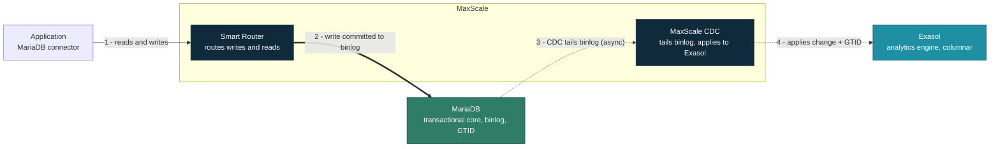
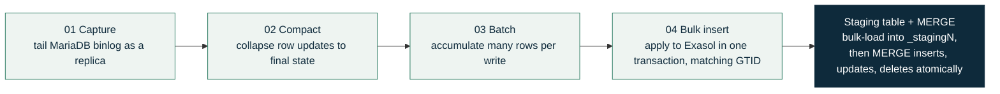

# MariaDB MaxScale Exasolrouter


This functionality is available from MaxScale 25.10.1.


> In MaxScale configuration, this module is referred to as `exasolrouter`. For documentation purposes, it is styled as `Exasolrouter` to enhance readability.

## Description

The [Exasolrouter](../reference/maxscale-routers/maxscale-exasolrouter.md) module is primarily intended to be used in combination with SmartRouter within hybrid transactional/analytical processing (HTAP) environments, where:

* **Write queries** are routed to MariaDB
* **Read queries** are routed to either MariaDB or Exasol, based on runtime performance measurements

The Exasolrouter module can also be used in standalone mode to expose Exasol through a MariaDB client protocol listener. In this configuration, MaxScale acts as a protocol bridge between MariaDB clients and the Exasol ODBC driver. This mode is primarily designed for debugging or specialized deployments.

SmartRouter measures query performance using canonical query forms (with constants replaced by placeholders). When a new canonical query is encountered, the preferred backend is based on measured response times and periodically reevaluates its decision.

For a detailed explanation of the routing algorithm, see [SmartRouter](../reference/maxscale-routers/maxscale-smartrouter.md#cluster-selection-how-queries-are-routed).

This architecture allows applications to use a single connection endpoint for both Online Transactional Processing (OLTP) and analytics workloads without application-level routing logic.

## Prerequisites

* MariaDB MaxScale **25.10.1 or later** must be installed.\
  See the [installation guide](../maxscale-quickstart-guides/mariadb-maxscale-installation-guide.md) if required.
* MaxScale running on x86\_64 architecture
  * The Exasolrouter module uses the Exasol ODBC driver to establish communication with Exasol.
  * The Exasol ODBC driver currently requires x86\_64.
  * So, MaxScale must run on x86\_64 when using `exasolrouter`.
* Operational MariaDB deployment
* Operational Exasol deployment
* Network connectivity between MaxScale, MariaDB, and Exasol

Typical ports used across the deployment:

| Component | Port | Purpose |
| --------- | ---- | ------- |
| MariaDB   | 3306 | Client + replication |
| MaxScale  | 3306 | Default read/write listener |
| MaxScale  | 3310 | SmartRouter |
| MaxScale  | 3311 | Exasolrouter |
| MaxScale  | 8989 | REST API / GUI |
| Exasol    | 8563 | Exasol client SQL |
| Exasol    | 8443 | Admin console |
| Exasol    | 2581 | BucketFS |

At minimum, open MariaDB 3306; MaxScale 3306 and 3310; and Exasol 8563.

## Configuring the Exasolrouter in MariaDB MaxScale

### Step 1. Install the Exasol ODBC driver on the MaxScale host.

The `Exasolrouter` leverages Exasol’s native ODBC connector to deliver optimal performance and full functionality.<br>


The Exasol ODBC driver ships with the `maxscale-exasol` package at `/usr/lib64/maxscale/exasol/current/libexaodbc.so`. On most installations you can use that path directly and skip the manual download below. Referencing the driver through the `current` symlink keeps the configuration working across driver updates. Download the driver manually only if it is not already present on your MaxScale host.


* Go to the [Exasol ODBC download page](https://downloads.exasol.com/clients-and-drivers/odbc) and select the driver version that matches the operating system of the MaxScale host.
* Download the appropriate Exasol ODBC driver for your operating system (x86\_64 architecture is required).
* Install the downloaded driver according to the platform-specific installation instructions.

Replace the version number in the commands below with the version you downloaded:

```
curl https://x-up.s3.amazonaws.com/7.x/26.2.6/Exasol_ODBC-26.2.6-Linux_x86_64.tar.gz \
-o Exasol_ODBC-26.2.6-Linux_x86_64.tar.gz
tar -xvf Exasol_ODBC-26.2.6-Linux_x86_64.tar.gz
chmod -R 755 Exasol_ODBC-26.2.6-Linux_x86_64
```

### Step 2. Create the required users in both MariaDB and Exasol.

**MariaDB User**\
\
If you do not already have a MaxScale monitor and service user, create one using the following commands. These grants allow MaxScale to monitor the health of the MariaDB node and handle user authentication.

```
mariadb -e "DROP USER IF EXISTS maxuser@'%'"
mariadb -e "CREATE USER maxuser@'%' IDENTIFIED BY 'aBcd123%'"
mariadb -e "GRANT SUPER, RELOAD, REPLICATION CLIENT, REPLICATION SLAVE, SHOW DATABASES ON *.* TO maxuser@'%'"
mariadb -e "GRANT SELECT ON mysql.db TO maxuser@'%'"
mariadb -e "GRANT SELECT ON mysql.user TO maxuser@'%'"
mariadb -e "GRANT SELECT ON mysql.roles_mapping TO maxuser@'%'"
mariadb -e "GRANT SELECT ON mysql.tables_priv TO maxuser@'%'"
mariadb -e "GRANT SELECT ON mysql.columns_priv TO maxuser@'%'"
mariadb -e "GRANT SELECT ON mysql.proxies_priv TO maxuser@'%'"
mariadb -e "GRANT SELECT ON mysql.procs_priv TO maxuser@'%'"

```

**Exasol User**\
\
It is considered best practice to avoid using the `sys` user for application access. Instead, create a dedicated user with the appropriate privileges.\
\
If `exaplus` utility is not available in your PATH or if you are not confirm where this utility is located on your system, you can locate it using the following command:

```
sudo su
find / -name exaplus
```

This command searches your entire system and suppresses permission-denied errors. A typical path looks like:

```
/home/mariadbexa/.ccc/x/u/branchr/db+Titzi90-patch-2-e01f9219-64r/install/opt/exasol/db-2025.2.0/bin/Console/exaplus
```

Replace the IP address, port, and passwords to match your environment:

```
exaplus -c 127.0.0.1/nocertcheck:8563 -u sys -p syspassword \
--sql "CREATE USER admin_user IDENTIFIED BY \"aBc123%%\";"

exaplus -c 127.0.0.1/nocertcheck:8563 -u sys -p syspassword \
--sql "GRANT CREATE SESSION, CREATE TABLE, SELECT ANY TABLE, \
INSERT ANY TABLE, UPDATE ANY TABLE, DELETE ANY TABLE TO admin_user;"
```

**Important**: For all connections to Exasol, the Exasolrouter uses a **single service user**. Exasol does not currently receive user‑level authentication from MariaDB clients.

### Step 3. Configure the MaxScale server and monitor.

Define the MariaDB server that will handle primary OLTP workloads. Replace the IP address and password to match your environment:

```
maxctrl create server mariadb1 address=127.0.0.1 port=3306 protocol=MariaDBBackend;
maxctrl create monitor mariadb_monitor mariadbmon \
  servers=mariadb1 \
  user=maxuser \
  password=aBcd123% \
  monitor_interval=1s ;
```

### Step 4. Configure the MaxScale Exasolrouter.

Create the Exasolrouter service. This service contains the connection information for Exasol, including the ODBC driver path and credentials.<br>

```
maxctrl create service mariadb_exasolrouter exasolrouter \
  user=maxuser \
  password=aBcd123% \
  preprocessor=internal \
  connection_string='DRIVER=/usr/lib64/maxscale/exasol/current/libexaodbc.so;EXAHOST=102.22.2.22:8563;UID=admin_user;PWD=aBc123%%;FINGERPRINT=NOCERTCHECK' 
```

Replace the following placeholders with values that match your actual environment:

* `DRIVER`: Full path to `libexaodbc.so` — the bundled driver at `/usr/lib64/maxscale/exasol/current/libexaodbc.so`, or the path from Step 1 if you downloaded it manually
* `EXAHOST`: Your Exasol host and port
* `UID` and `PWD`: The Exasol user credentials created in Step 2

### Step 5. Configure the MaxScale SmartRouter.

The SmartRouter integrates the MariaDB server with the Exasolrouter and is responsible for distributing queries between the two backends.\
\
Replace the password to match your environment:

```
maxctrl create service mariadb_smartrouter smartrouter \
  user=maxuser \
  password='aBcd123%' \
  targets=mariadb1,mariadb_exasolrouter \
  master=mariadb1
```

\
The `master` parameter designates the cluster that receives all write operations. In this configuration, all writes are directed to MariaDB.

### Step 6: Configure the MaxScale service and listeners.

Create a listener that defines the port on which MaxScale will accept client connections for the SmartRouter service.\
\
Replace the port number if a different port is required:

```
maxctrl create listener mariadb_smartrouter mariadb_smartrouter_listener 3306
```

### Step 7: Test and verify the configuration.

This step provides guidance on verifying whether the Exasol and SmartRouter components are connected and functioning correctly. It also explains how to enable logging for verification purposes and outlines data synchronization requirements.

*   Connecting to the service.

    First, verify that you can connect to MaxScale on the configured listener port:<br>

    <pre><code><strong>mariadb \
    </strong>  -h &#x3C;maxscale-ip> \
      -P &#x3C;mariadb exa port> \
      -u &#x3C;user> \
      -p 
    </code></pre>

    \
    Replace:

    * `<maxscale-ip>` with the IP address of your MaxScale host.
    * `<exa-listener-port>` with the port you configured for the `exasolrouter` listener.
    * `<username>` with a valid MariaDB username that MaxScale can authenticate.<br>

    To perform a very basic connectivity test:<br>

    ```
    mariadb \
    -h <maxscale-ip> \
    -P <mariadb exa port> \
    -u <user> \
    -p -e “select 1 as connected”
    ```

    \
    If the connection is established successfully, the result will return as `connected = 1`. This confirms that the client can reach MaxScale and that the router is actively listening.
*   Enabling debug logs for verification\
    \
    To verify which backend (MariaDB or Exasol) executed a query and inspect routing decisions, enable debug and info logging in MaxScale, and then tail the main logs:<br>

    ```
    maxctrl alter maxscale log_debug true
    maxctrl alter maxscale log_info true
    ```

    \
    Then, monitor the MaxScale log:<br>

    ```
    tail -f /var/log/maxscale/maxscale.log
    ```

    \
    When SmartRouter re-measures a query, you will see log output messages similar to:<br>

    ```
    2026-02-13 18:14:49   info   : (3) [smartrouter] (mariadb_smartrouter); Trigger re-measure, schedule 2min, perf: mariadb1, 15.2181s, SELECT DISTINCT( IF( domain_new IS NOT NULL, domain_new, IF( username ...
    2026-02-13 18:15:04   info   : (3) [smartrouter] (mariadb_smartrouter); Update perf: from mariadb1, 15.2181s to mariadb1, 14.5416s, SELECT DISTINCT( IF( domain_new IS NOT NULL, domain_new, IF( username ...
    ```

    \
    These messages indicate which backend is being evaluated.\
    \
    Another way to determine how a query was executed is by using the [Hint Filter](../reference/maxscale-filters/maxscale-hintfilter.md). You can force routing to a specific backend by adding a SQL comment.
* Data synchronization

  The Exasolrouter routes queries but does not copy data between MariaDB and Exasol. For SmartRouter to return correct results from Exasol, the same data must exist in both systems. To keep Exasol in sync automatically, set up Change Data Capture as described in [Synchronizing data to Exasol with Change Data Capture (CDC)](#synchronizing-data-to-exasol-with-change-data-capture-cdc) below. For quick testing, you can instead load the same dataset into both systems manually.

## Synchronizing data to Exasol with Change Data Capture (CDC)

The Exasolrouter does not replicate data — it only routes queries. To keep Exasol continuously in sync with MariaDB, configure MaxScale's [binlogrouter](../reference/maxscale-routers/maxscale-binlogrouter.md) with Change Data Capture (CDC) to Exasol.

binlogrouter connects to the MariaDB cluster as a replica and reads its binary log. Committed changes are compacted, batched, and bulk-loaded into Exasol staging tables, then applied to the target tables with a `MERGE` in GTID order, so Exasol reflects committed writes with minimal lag. Replication is asynchronous.



_Solid arrows show the synchronous write path; dotted arrows show asynchronous CDC replication._

Internally, the pipeline runs in four stages, then applies each batch to Exasol through a staging table and a `MERGE`:




CDC to Exasol uses the Exasol ODBC driver shipped in the `maxscale-exasol` package, and is part of the same MaxScale Exasol integration described at the top of this page.


### Step 1. Enable binary logging on MariaDB.

binlogrouter replicates from the MariaDB binary log, so MariaDB must use row-based logging with full row metadata. Add the following under the `[mariadbd]` section of the MariaDB configuration file (for example, `/etc/mysql/mariadb.conf.d/50-server.cnf`):

```
[mariadbd]
server_id           = 1
log_bin             = mariadb-bin
binlog_format       = ROW
binlog_row_metadata = FULL
```

Restart MariaDB and confirm binary logging is active:

```
sudo systemctl restart mariadb
mariadb -e "SHOW MASTER STATUS"
```

The `maxuser` created earlier already holds the `REPLICATION SLAVE` and `REPLICATION CLIENT` grants that binlogrouter needs to read the binary log.

### Step 2. Create the CDC user in Exasol.

The CDC pipeline creates staging tables and merges changes into the target tables, so the Exasol user used by CDC needs privileges to create and modify tables. Create a dedicated user rather than reusing `sys`:

```
exaplus -c 127.0.0.1/nocertcheck:8563 -u sys -p syspassword \
--sql "CREATE USER cdc_user IDENTIFIED BY \"aBc123%%\";"

exaplus -c 127.0.0.1/nocertcheck:8563 -u sys -p syspassword \
--sql "GRANT CREATE SESSION, CREATE TABLE, SELECT ANY TABLE, \
INSERT ANY TABLE, UPDATE ANY TABLE, DELETE ANY TABLE TO cdc_user;"
```

### Step 3. Create the binlogrouter CDC service.

Create a binlogrouter service that replicates from the MariaDB cluster and applies changes to Exasol over ODBC. It reuses the `mariadb_monitor` created earlier so it always follows the current primary. Replace the host, credentials, and driver path to match your environment:

```
maxctrl create service binlog_cdc_service binlogrouter \
  user=maxuser \
  password=aBcd123% \
  cluster=mariadb_monitor \
  select_master=true \
  server_id=7000 \
  expire_log_minimum_files=2 \
  expire_log_duration=96h \
  odbc_connection_str='DRIVER=/usr/lib64/maxscale/exasol/current/libexaodbc.so;EXAHOST=<exasol-host>:8563;UID=cdc_user;PWD=aBc123%%;FINGERPRINT=NOCERTCHECK;ANSIDATAENCODING=UTF-8;ANSIARGENCODING=UTF-8'
```

Key settings:

* `cluster` and `select_master` — binlogrouter follows whichever node the monitor reports as primary, and re-points automatically after a failover.
* `server_id` — MaxScale's identity in the replication topology. It must be unique across all MariaDB servers and MaxScale instances.
* `expire_log_minimum_files` and `expire_log_duration` — how long the locally stored binary logs are retained (here, at least 2 files, purged after 96 hours).
* `odbc_connection_str` — the Exasol ODBC connection used to apply changes, using the `cdc_user` credentials from Step 2. Referencing the driver through the `current` symlink keeps the configuration working across driver updates.

By default, the pipeline creates target tables automatically from incoming `CREATE TABLE` statements (`odbc_create_table_from_sql`) and stops on error (`odbc_stop_on_error`). To replicate only specific tables, set `odbc_include_tables` to a comma-separated list; leaving it unset replicates all tables.


The bulk-load pipeline's throughput is controlled by `odbc_perf_batch_size` (default 200 MB), `odbc_perf_max_idle_rows` (default 400000), `odbc_perf_max_buffered_rows` (default 750000), and `odbc_perf_ncycles` (default and maximum 4). The defaults suit most workloads; raise the batch size for more throughput, or lower `odbc_perf_ncycles` if memory use is high.


### Step 4. Verify replication.

After the service starts, changes committed to MariaDB should appear in Exasol within a short delay. Insert a row in MariaDB, then query it through the SmartRouter listener to confirm the pipeline is flowing. Enable info logging (see Step 7 above) to watch the pipeline apply batches.


CDC has no automatic failover. If the MaxScale instance running the CDC service goes down, CDC does not automatically start on another MaxScale node. Because the GTID position is persisted, CDC safely resumes from where it stopped when the service restarts, with no data loss.


## Behavior during Backend Unavailability

SmartRouter automatically connects to the designated master (MariaDB) in the event that Exasol is unavailable (for example, due to a network outage or unavailability). To maintain availability for OLTP activities, all reads and writes will only be sent to MariaDB.

In a full deployment, each layer handles its own failure:

| Layer | Failure handling |
| ----- | ---------------- |
| MariaDB | Automatic primary promotion — the monitor detects a failed primary and promotes the replica with the highest GTID. binlogrouter re-points to the new primary through `select_master=true`, CDC keeps writing, and the application sees no change because MaxScale holds the single endpoint. |
| MaxScale | Two nodes, no single point of failure — the connector fails over between them (for example, `sequential://mxs1:3306,mxs2:3306`). Cooperative monitoring ensures only one node acts at a time; no keepalived or application reconnect logic is required. |
| Exasol | A reserve node stands by and takes over on failure. If the failed node returns within 10 minutes, only a re-sync is needed; after 10 minutes, data segments are copied to the reserve node. Redundancy level 2 (best practice) mirrors each segment to a neighbor. |


The CDC pipeline itself has no automatic failover: if the MaxScale instance running the CDC service goes down, CDC does not automatically start on another node. Because the GTID position is persisted, CDC safely resumes from where it stopped when the service restarts, with no data loss.


## Known Limitations

The MariaDB MaxScale–Exasol integration includes some limitations. It includes:

* Exasol access is limited to a single service user (unlike MariaDB, which required per user authentication)
* The SQL preparser does not support all MariaDB functions.
* The following function mappings are necessary:
  * `FROM_UNIXTIME()` → `FROM_POSIX_TIME()`
  * `DATE_FORMAT` → `TO_CHAR`
* The following interactive statements are not the primary focus and may not behave as expected:
  * `SHOW TABLES`
  * `Use database`
  * `DESCRIBE table`
  * DDL statements

## See Also

* [MaxScale Exasolrouter](../reference/maxscale-routers/maxscale-exasolrouter.md)
* [MaxScale SmartRouter](../reference/maxscale-routers/maxscale-smartrouter.md)
* [MaxScale Binlogrouter](../reference/maxscale-routers/maxscale-binlogrouter.md)
* [Hint Filter](../reference/maxscale-filters/maxscale-hintfilter.md)
