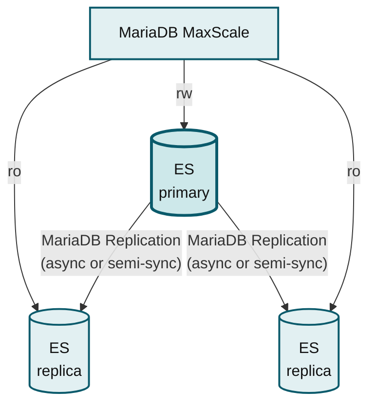
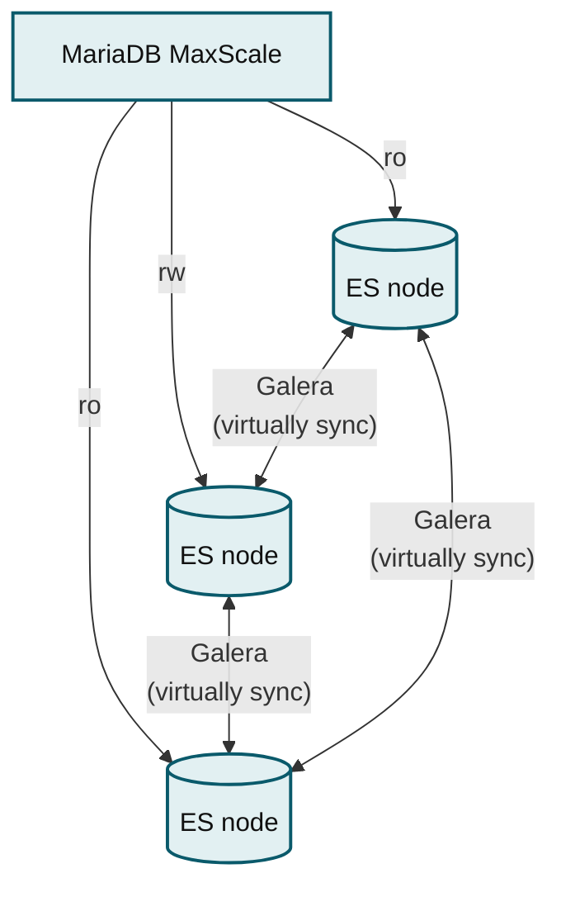
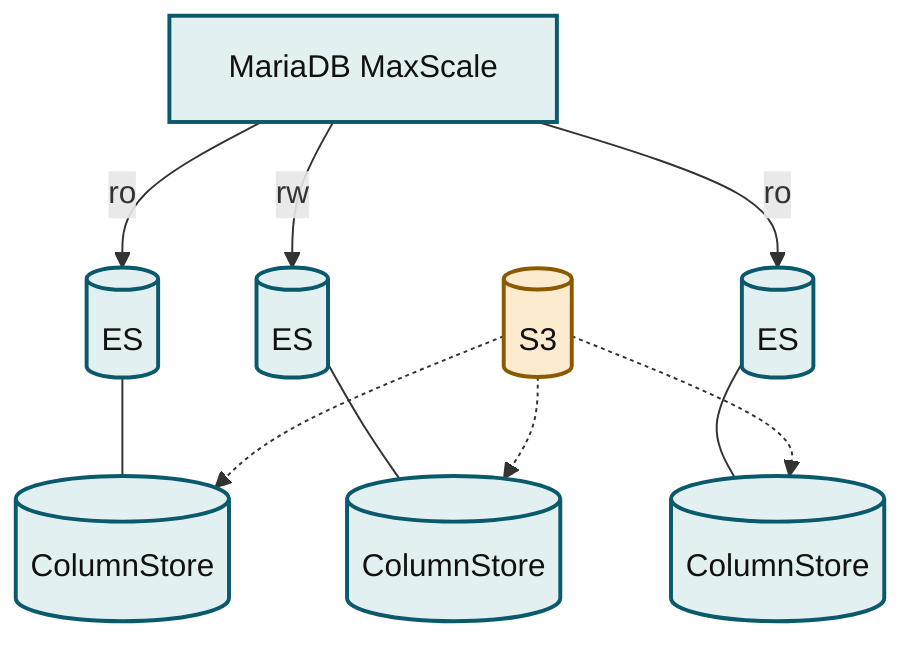
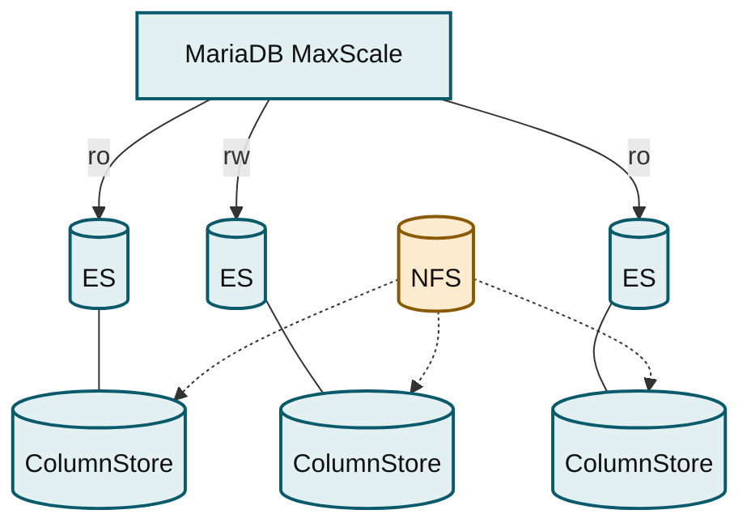
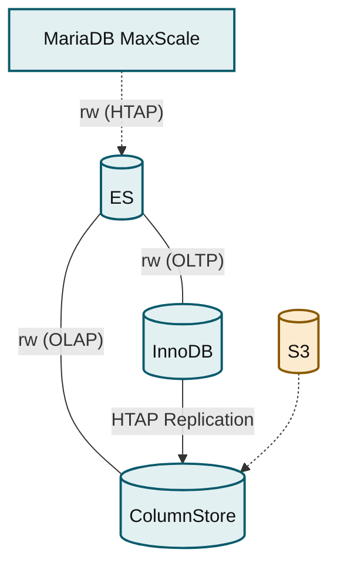

# MariaDB Platform Use Cases

_This section outlines various topologies for MariaDB deployment, emphasizing flexibility and configurations to meet diverse use cases. Key topologies include Primary/Replica for transactional workloads with features like asynchronous replication and failover management, and Galera Cluster offering a multi-primary architecture with synchronous replication. Both topologies leverage MaxScale for scaling and are compatible with Enterprise Server 10.3+ and MaxScale 2.5+. The guide also introduces the ColumnStore Object Storage for analytical processing, focusing on OLAP and data warehousing needs._

MariaDB products can be deployed in many different topologies, arrangements of products and components to achieve a purpose. MariaDB products can also be deployed to form other topologies, leverage advanced product capabilities, or combine the capabilities of multiple topologies.

Topologies are the arrangement of nodes and links to achieve a purpose. This documentation describes a few of the many topologies that can be deployed using MariaDB database products.

We group topologies by workload (transactional, analytical, hybrid) and technologies (Enterprise Spider). Single-node topologies are listed separately.

To help you select the correct topology:

* Each topology is named and this name is used consistently throughout the documentation.
* A thumbnail diagram provides a small-scale summary of the topology's architecture.
* Finally, we provide a list of the benefits of the topology.

Although multiple topologies are listed on this page, the listed topologies are not the only options. MariaDB products are flexible, configurable, and extensible, so it possible to deploy different topologies that combine the capabilities of multiple topologies listed on this page. The topologies listed on this page are primarily intended to be representative of the most commonly requested use cases.

In the diagrams, ES is short for Enterprise Server.

## Transactional (OLTP)

### Primary/Replica

MariaDB Replication offers high availability through asynchronous or semi-synchronous methods. It supports automatic failover via MaxScale (2.5+) and read scaling. New nodes require manual provisioning from backup. This solution is available with Enterprise Server 10.3+.

**Add note about primary/replica vs. master/slave**

_MaxScale routes reads to two replicas and writes to a primary, which replicates to both replicas._

<ul><li><strong>MariaDB Replication</strong></li><li>Highly available</li><li>Asynchronous or semi-synchronous replication</li><li>Automatic failover via MaxScale</li><li>Manual provisioning of new nodes from backup</li><li>Scales reads via MaxScale</li><li>Enterprise Server 10.3+, MaxScale 2.5+</li></ul>

### Galera Cluster

MariaDB Enterprise Cluster, powered by Galera, provides a highly available, multi-primary solution for transactional/OLTP workloads using the InnoDB storage engine. It features virtually synchronous, certification-based replication, automated node provisioning (IST/SST), and scales reads via MaxScale. It's compatible with Enterprise Server 10.3+ and MaxScale 2.5+.

_MaxScale routes to three ES nodes that replicate synchronously with each other as a Galera cluster._

<ul><li><strong>Multi-Master Cluster Powered by Galera for Transactional/OLTP Workloads</strong></li><li>InnoDB Storage Engine</li><li>Highly available</li><li>Virtually synchronous, certification-based replication</li><li>Automated provisioning of new nodes (IST/SST)</li><li>Scales reads via MaxScale</li><li>
Enterprise Server 10.3+, MariaDB Enterprise Cluster

(powered by Galera), MaxScale 2.5+
</li></ul>

### Analytical (OLAP, Data Warehousing, DSS)

#### ColumnStore Object Storage

MariaDB Enterprise ColumnStore offers a highly available, columnar storage engine with S3-compatible object storage for data warehousing and analytics. It features automatic failover via MaxScale and CMAPI, read scaling through MaxScale, and efficient bulk data import. It's supported on Enterprise Server 10.5 and 10.6 with corresponding ColumnStore and MaxScale versions.

_MaxScale routes to three ES/ColumnStore nodes, all sharing S3-compatible object storage._

<ul><li><strong>Columnar storage engine with S3-compatible object storage</strong></li><li>Highly available</li><li>Automatic failover via MaxScale and CMAPI</li><li>Scales reads via MaxScale</li><li>Bulk data import</li><li>Enterprise Server 10.5, Enterprise ColumnStore 5, MaxScale 2.5</li><li>Enterprise Server 10.6, Enterprise ColumnStore 23.02, MaxScale 22.08</li></ul>

#### ColumnStore Shared Local Storage

MariaDB Enterprise ColumnStore, utilizing shared local storage, delivers a highly available columnar solution. It features automatic failover via MaxScale and CMAPI, scales reads through MaxScale, and enables bulk data imports. This setup is compatible with Enterprise Server 10.5 and 10.6, alongside specific Enterprise ColumnStore and MaxScale versions.

_MaxScale routes to three ES/ColumnStore nodes, all sharing NFS storage._

<ul><li><strong>Columnar storage engine with shared local storage</strong></li><li>Highly available</li><li>Automatic failover via MaxScale and CMAPI</li><li>Scales reads via MaxScale</li><li>Bulk data import</li><li>Enterprise Server 10.5, Enterprise ColumnStore 5, MaxScale 2.5</li><li>Enterprise Server 10.6, Enterprise ColumnStore 23.02, MaxScale 22.08</li></ul>

### Hybrid Workloads

#### HTAP

MariaDB's single-stack solution handles hybrid transactional/analytical workloads by combining ColumnStore for analytics with S3-compatible object storage and InnoDB for transactions. It supports cross-engine JOINs for comprehensive queries. This offering is available with Enterprise Server 10.5 or 10.6, paired with specific Enterprise ColumnStore and MaxScale versions.

_MaxScale routes HTAP traffic to one ES node, which fans out to ColumnStore and InnoDB with replication between them._

<ul><li><strong>Single-stack hybrid transactional/analytical workloads</strong></li><li>ColumnStore for analytics with scalable S3-compatible object storage</li><li>InnoDB for transactions</li><li>Cross-engine JOINs</li><li>Enterprise Server 10.5, Enterprise ColumnStore 5, MaxScale 2.5</li><li>Enterprise Server 10.6, Enterprise ColumnStore 23.02, MaxScale 22.08</li></ul>


