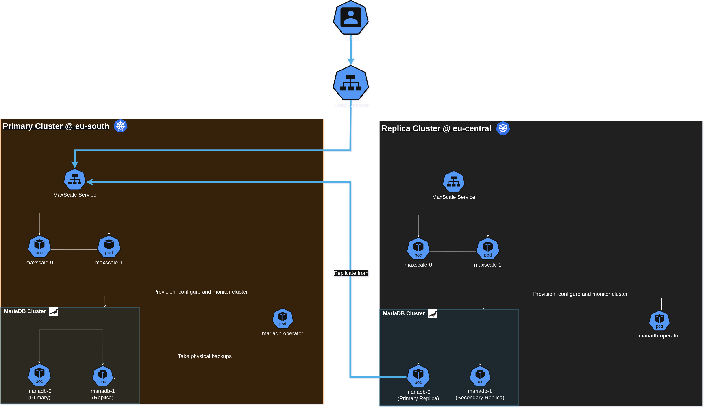

# MariaDB Enterprise Kubernetes Operator 26.06

**Release date**: 30 June 2026

MariaDB Enterprise Kubernetes Operator 26.06 introduces two major additions: **multi-cluster replication** (Tech Preview), which connects independent MariaDB clusters across Kubernetes environments via replication, enabling multi-region deployments and blue-green upgrades; and **FIPS 140-3 Mode**, allowing the operator and the MariaDB and MaxScale instances it manages to run in FedRAMP-compliant environments. Refer to the sections below for additional functionality introduced in this release.

If you're updating from a previous version, **please follow the [UPDATE GUIDE](../../tools/mariadb-enterprise-operator/updates/update-26.06.md)** to ensure a safe transition.

### Multi-cluster replication


Multi-cluster replication is available as a **Tech Preview**. It is not recommended for production use yet.

MariaDB Enterprise Kubernetes Operator 26.06 introduces multi-cluster replication, a new capability that connects independent MariaDB clusters across Kubernetes environments via replication. It builds on top of existing replication and Galera topologies, adding an inter-cluster replication layer where one cluster acts as the primary and the others as replicas—each maintaining its own internal HA mechanism. The operator manages the full replication lifecycle: provisioning clusters, bootstrapping replicas from physical backups, configuring replication connections, and performing cluster-level switchover.

Multi-cluster replication can be deployed either across multiple Kubernetes clusters (for multi-region disaster recovery and regional failover) or within a single cluster (for blue-green upgrades with zero downtime and no data loss).

Refer to the [multi-cluster documentation](../../tools/mariadb-enterprise-operator/topologies/multi-cluster.md) for more details.

### FIPS 140-3 Mode

MariaDB Enterprise Kubernetes Operator 26.06 introduces support for operating in FIPS 140-3 mode. When enabled, the operator ensures that all its cryptographic operations and TLS communications adhere to strict FIPS standards using NIST-approved cryptographic modules.

For the operands, the operator automatically handles OpenSSL FIPS configuration for each MariaDB and MaxScale instance: it generates a FIPS OpenSSL ConfigMap and mounts it into the Pod to ensure they stay compliant.

For details on enabling and configuring FIPS mode, please refer to the [FIPS 140-3 documentation](../../tools/mariadb-enterprise-operator/security/fips.md).

### Automatic primary switchover on Kubernetes node drain

In production Kubernetes environments, planned maintenance like node drains is a common operation. MariaDB Enterprise Kubernetes Operator 26.06 introduces automatic primary switchover on Kubernetes node drain, a new feature designed to improve high availability during these events. This capability automatically triggers a primary switchover when a primary pod is gracefully terminated, ensuring that write availability is maintained with minimal disruption. This release focuses on making MariaDB clusters on Kubernetes more resilient to routine administrative tasks.

Refer to the [replication documentation](../../tools/mariadb-enterprise-operator/topologies/replication.md#primary-graceful-shutdown-switchover) for more details.

### Maintenance Mode

MariaDB Enterprise Kubernetes Operator 26.06 introduces maintenance mode, giving operators fine-grained control over database behavior during planned maintenance windows. When enabled via `spec.maintenance.enabled: true`, three composable controls become available: **cordon** removes the MariaDB Pods from service endpoints to block new connections; **drain** gracefully terminates long-running client connections after a configurable grace period; and **read-only** prevents write operations while allowing reads to continue. Maintenance mode is compatible with all topologies and is particularly useful for coordinating traffic cutover before a [multi-cluster](../../tools/mariadb-enterprise-operator/topologies/multi-cluster.md) switchover.

Refer to the [maintenance documentation](../../tools/mariadb-enterprise-operator/maintenance.md) for more details.

### Root Password Rotation

MariaDB Enterprise Kubernetes Operator 26.06 introduces root password rotation. When the value of the `Secret` referenced by `spec.rootPasswordSecretKeyRef` is updated, the operator connects to the server using the previous password, issues `ALTER USER` to apply the new password, and propagates the change to all dependent components. Rotation is deferred until the cluster is in a stable, healthy state, so in-progress operations such as backups or scaling are never interrupted.

Refer to the [root password rotation documentation](../../tools/mariadb-enterprise-operator/security/root-password-rotation.md) for more details.

### Minimal and standard container images

MariaDB Enterprise Kubernetes Operator 26.06 provides both minimal and standard container images for MariaDB Enterprise Server and MaxScale. The **standard** images include the full set of features and components, while the **minimal** images contain only the essential packages needed to run the database or proxy, resulting in a smaller attack surface and reduced image size. Operators can select the image variant that best fits their security and operational requirements by specifying the appropriate image tag.

Refer to the [MariaDB Enterprise Server Tiered Images](../../tools/mariadb-enterprise-operator/docker-images.md#mariadb-enterprise-server-tiered-images) documentation for more details.

### Platform and component versions

The current release has been tested with the following versions:

| Platform/Component        | Version      |
| ------------------------- | ------------ |
| Kubernetes                | 1.36         |
| OpenShift                 | 4.18.6       |
| MariaDB Enterprise Server | 11.8.6-3.2   |
| MaxScale                  | 25.10.2      |




