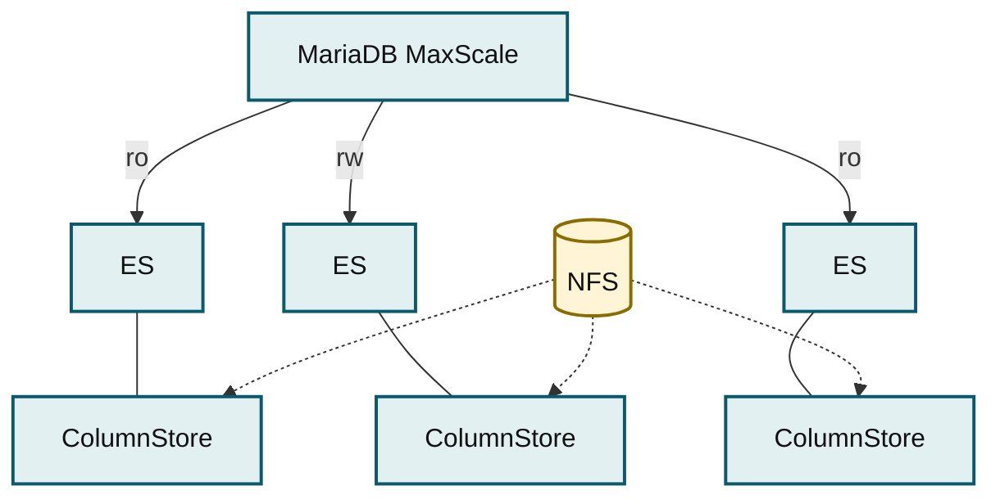

# Topologies Overview

MariaDB products can be deployed in many different topologies. The topologies described in this section are representative. MariaDB products can be deployed to form other topologies, leverage advanced product capabilities, or combine the capabilities of multiple topologies.

Topologies are the arrangement of nodes and links to achieve a purpose. This documentation describes a few of the many topologies that can be deployed using MariaDB database products.

We group topologies by workload (transactional, analytical, hybrid) and technologies (Enterprise Spider). Single-node topologies are listed separately.

To help you select the correct topology:

* Each topology is named and this name is used consistently throughout the documentation.
* A thumbnail diagram provides a small-scale summary of the topology's architecture.
* Finally, we provide a list of the benefits of the topology.

Although multiple topologies are listed on this page, the listed topologies are not the only options. MariaDB products are flexible, configurable, and extensible, so it possible to deploy different topologies that combine the capabilities of multiple topologies listed on this page. The topologies listed on this page are primarily intended to be representative of the most commonly requested use cases.

## Transactional (OLTP)

### Primary/Replica Topology

| Diagram | Features                                                                                                                                                                                                                                                                                                         |
| ------- | ---------------------------------------------------------------------------------------------------------------------------------------------------------------------------------------------------------------------------------------------------------------------------------------------------------------- |
|         | 
<strong>MariaDB Replication</strong>
<ul><li>Highly available</li><li>Asynchronous or semi-synchronous replication</li><li>Automatic failover via MaxScale</li><li>Manual provisioning of new nodes from backup</li><li>Scales reads via MaxScale</li><li>Enterprise Server 10.3+, MaxScale 2.5+</li></ul> |

### Galera Cluster Topology

| Diagram | Features                                                                                                                                                                                                                                                                                                                                                                                                                               |
| ------- | -------------------------------------------------------------------------------------------------------------------------------------------------------------------------------------------------------------------------------------------------------------------------------------------------------------------------------------------------------------------------------------------------------------------------------------- |
|         | 
<strong>Galera Cluster Topology Multi-Primary Cluster Powered by Galera for Transactional/OLTP Workloads</strong>
<ul><li>InnoDB Storage Engine</li><li>Highly available</li><li>Virtually synchronous, certification-based replication</li><li>Automated provisioning of new nodes (IST/SST)</li><li>Scales reads via MaxScale Enterprise Server 10.3+, MariaDB Enterprise Cluster (powered by Galera), MaxScale 2.5+</li></ul> |

### Analytical (OLAP, Data Warehousing, DSS)

### ColumnStore Object Storage Topology

| Diagram | Features                                                                                                                                                                                                                                                                                                                                                                             |
| ------- | ------------------------------------------------------------------------------------------------------------------------------------------------------------------------------------------------------------------------------------------------------------------------------------------------------------------------------------------------------------------------------------ |
|         | 
<strong>Columnar storage engine with S3-compatible object storage</strong>
<ul><li>Highly available</li><li>Automatic failover via MaxScale and CMAPI</li><li>Scales reads via MaxScale</li><li>Bulk data import</li><li>Enterprise Server 10.5, Enterprise ColumnStore 5, MaxScale 2.5</li><li>Enterprise Server 10.6, Enterprise ColumnStore 23.02, MaxScale 22.08</li></ul> |

### ColumnStore Shared Local Storage Topology

_MaxScale routes to a three-node ColumnStore cluster sharing NFS storage._

<strong>Columnar storage engine with shared local storage</strong>
<ul><li>Highly available</li><li>Automatic failover via MaxScale and CMAPI</li><li>Scales reads via MaxScale</li><li>Bulk data import</li><li>Enterprise Server 10.5, Enterprise ColumnStore 5, MaxScale 2.5</li><li>Enterprise Server 10.6, Enterprise ColumnStore 23.02, MaxScale 22.08</li></ul>

## Hybrid Workloads

### HTAP Topology

| Diagram | Features                                                                                                                                                                                                                                                                                                                                                      |
| ------- | ------------------------------------------------------------------------------------------------------------------------------------------------------------------------------------------------------------------------------------------------------------------------------------------------------------------------------------------------------------- |
|         | <ul><li>Single-stack hybrid transactional/analytical workloads</li><li>ColumnStore for analytics with scalable S3-compatible object storage</li><li>InnoDB for transactions• Cross-engine JOINs</li><li>Enterprise Server 10.5, Enterprise ColumnStore 5, MaxScale 2.5</li><li>Enterprise Server 10.6, Enterprise ColumnStore 23.02, MaxScale 22.08</li></ul> |

## Spider Topologies

### Spider Federated Topology

| Diagram | Features                                                                                                                                                                                                                                                                                                                                                                                                                       |
| ------- | ------------------------------------------------------------------------------------------------------------------------------------------------------------------------------------------------------------------------------------------------------------------------------------------------------------------------------------------------------------------------------------------------------------------------------ |
|         | <ul><li>Read from and write to tables on remote ES nodes</li><li>Spider Node uses Spider storage engine for Federated Spider Tables</li><li>Federated Spider Table is a "virtual" table• Spider uses MariaDB foreign data wrapper to query Data Table on Data Node</li><li>Data Node uses non-Spider storage engine for Data Tables</li><li>Supports transactions</li><li>Enterprise Server 10.3+, Enterprise Spider</li></ul> |

### Spider Sharded Topology

| Diagram | Features                                                                                                                                                                                                                                                                                                                                                                                                                                                  |
| ------- | --------------------------------------------------------------------------------------------------------------------------------------------------------------------------------------------------------------------------------------------------------------------------------------------------------------------------------------------------------------------------------------------------------------------------------------------------------- |
|         | <ul><li>Shard tables for horizontal scalability</li><li>Spider Node uses Spider storage engine for Sharded Spider Tables</li><li>Sharded Spider Table is a partitioned "virtual" table</li><li>Spider uses MariaDB foreign data wrapper to query Data Tables on Data Nodes for each partition</li><li>Data Node uses non-Spider storage engine for Data Tables</li><li>Supports transactions</li><li>Enterprise Server 10.3+, Enterprise Spider</li></ul> |

## Single Node Topologies

* [Deploy Single Node Topologies](single-node-topologies/)


