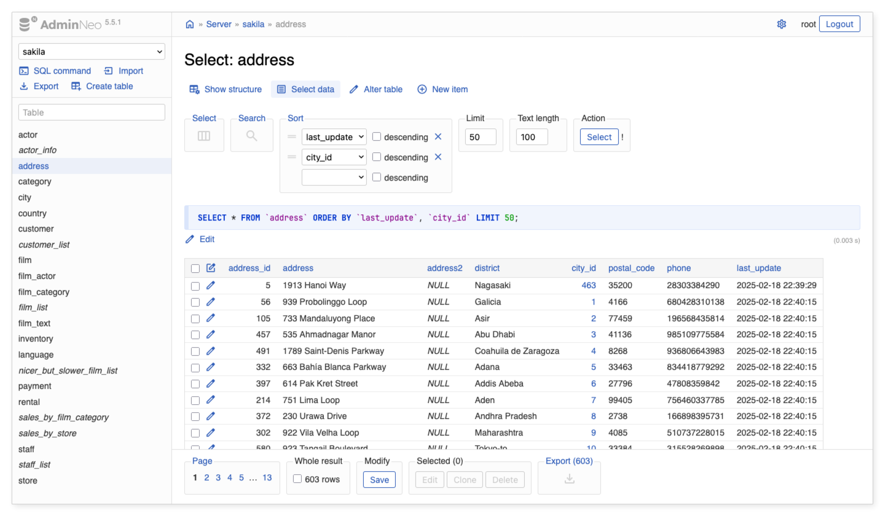

# AdminNeo


AdminNeo is third-party software, not developed or maintained by MariaDB and not included with MariaDB Server. MariaDB doesn't test, validate, or support it. Refer to its own documentation and license terms.


[AdminNeo](https://www.adminneo.org/) is a database management tool written in PHP and used through a web browser. It consists of a single file that you deploy to a web server with PHP.

AdminNeo is based on the [Adminer](adminer.md) project, with a redesigned user interface and a refactored code base.

## Key features

* Clean, modern user interface.
* Managing the structure of databases and tables.
* Data manipulation and searching.
* Exporting and importing databases and data.
* Executing batch SQL commands.
* Extensibility through plugins and customizations.

## Supported databases

AdminNeo supports MariaDB through the MySQL driver. Other database systems: PostgreSQL, MS SQL, SQLite, Oracle, MongoDB, SimpleDB, 
Elasticsearch (beta) and ClickHouse (alpha).

## License

AdminNeo is dual-licensed under the Apache License 2.0 and GPL 2.

_This page is licensed: CC BY-SA / Gnu FDL_


