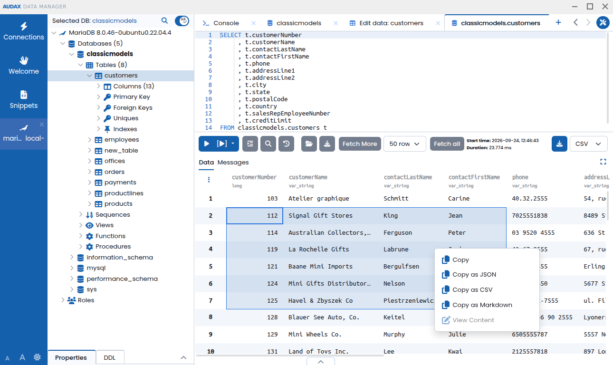

# Audax Data Manager


Audax Data Manager is third-party software, not developed or maintained by MariaDB and not included with MariaDB Server. MariaDB doesn't test, validate, or support it. Refer to its own documentation and license terms.


[Audax Data Manager](https://www.commandprompt.com/products/audax-data-manager/) is a modern SQL editor database management toolkit.

Audax Data Manager supports MariaDB along many other databases.

## Features:

**Desktop or Browser-based:** Runs as desktop application or can be installed as a webapp and used in a browser.

**Modern Interface:** The UI is optimized to be easy to use efficient to navigate.

**Multiple Workspaces:** Connect to and manage multiple databases at once in a clean, tabbed interface.

**Secure:** Sensitive information like DB passwords, SSH keys etc. is stored in an encrypted form and protected by Master Password.

**Schema and Table Editors:** Create/alter tables and manage data using intuitive and clean UI.

**Entity Relationship Diagrams:** view table relationships as an ERD.

**Fuzzy Search:** jump straight to any database object without manual drill-down.

**Smart SQL Editor:** Context-aware code completion, error annotations, powerful search and replace.

**Light or Dark:** Different themes to choose from.

**Tabbed Workspace:** Keep multiple editors and other tools open and easily switch between them.

**Quick Search:** Easily find an object in DB Explorer using a fuzzy search dialog.

**Tunneling:** Connect to your databases via SSH tunnel if it is not directly accessible.

## Links:

Product Page [www.commandprompt.com/products/audax-data-manager](https://www.commandprompt.com/products/audax-data-manager/)  
Github Project [https://github.com/commandprompt/audax-data-manager](https://github.com/commandprompt/audax-data-manager/

_This page is licensed: CC BY-SA / Gnu FDL_


