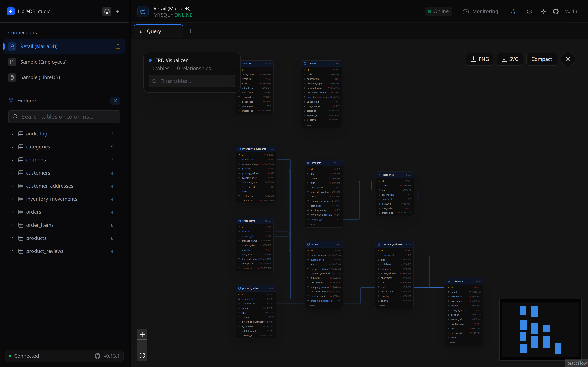

# LibreDB Studio


LibreDB Studio is third-party software, not developed or maintained by MariaDB and not included with MariaDB Server. MariaDB doesn't test, validate, or support it. Refer to its own documentation and license terms.


[LibreDB Studio](https://github.com/libredb/libredb-studio) is a SQL IDE used through a web browser. It is deployed next to the database rather than installed on a workstation: a container image, a Helm chart, an OpenShift operator, or an npm package embedded in another application.

## Key features

* SQL editor with schema-aware autocompletion, based on Monaco.
* Entity-relationship diagrams generated from the live schema.
* Schema comparison between two databases, with the migration SQL generated from the difference.
* Visual query plans built from `EXPLAIN FORMAT=JSON`.
* Server metrics, slow query, and session views.
* OIDC single sign-on, role-based access control, and a query audit trail.

## MariaDB support

LibreDB Studio connects to MariaDB with the `mysql2` driver, over the protocol both servers share. Select MySQL as the connection type. Schema browsing, query execution, entity-relationship diagrams, schema comparison, and `EXPLAIN FORMAT=JSON` plans were tested against MariaDB 12.3.

The metrics and slow query views read `performance_schema`, which MariaDB doesn't enable by default. Cache hit ratio, queries per second, and buffer pool usage are reported as unavailable until the server is started with `performance_schema=ON`. The deadlock counter is the exception, because it comes from `Innodb_deadlocks`. Nothing else in the interface depends on `performance_schema`.

## Supported databases

Besides MariaDB: MySQL, PostgreSQL, Oracle, Microsoft SQL Server, SQLite, MongoDB, Redis, Couchbase, ClickHouse, Apache Druid, Elasticsearch, OpenSearch, Apache Trino, and Apache Cassandra.

## License

LibreDB Studio is licensed under the MIT License.

_This page is licensed: CC BY-SA / Gnu FDL_


