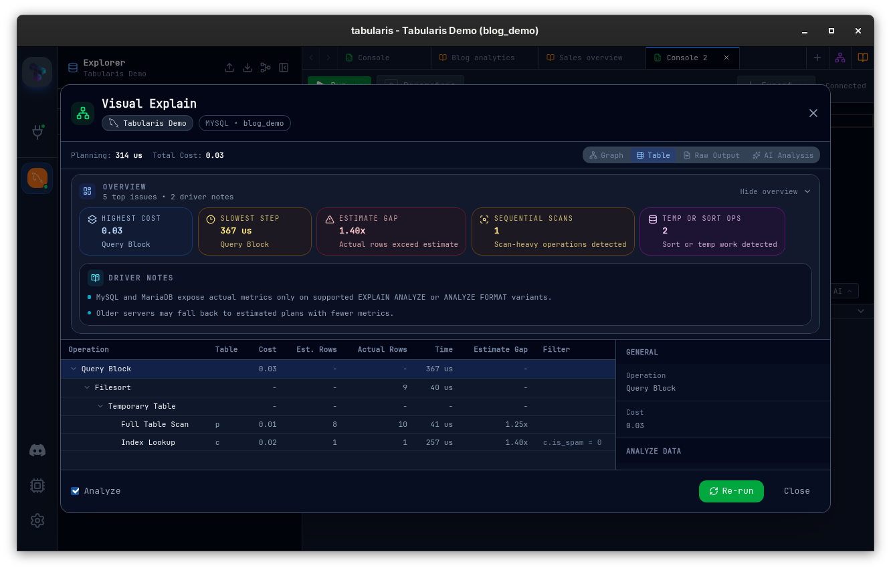

# Tabularis


Tabularis is third-party software, not developed or maintained by MariaDB and not included with MariaDB Server. MariaDB doesn't test, validate, or support it. Refer to its own documentation and license terms.


[Tabularis](https://tabularis.dev) is a desktop SQL workspace for Windows, macOS, and Linux, released under the Apache License 2.0. It installs through WinGet, Homebrew, Snap, Flatpak, and the AUR, or from the installers on the [releases page](https://github.com/TabularisDB/tabularis/releases).

## Key features

* Schema explorer for tables, columns, indexes, foreign keys, views, stored routines, and triggers, with inline editing from the sidebar.
* SQL editor based on Monaco, with autocompletion, multi-statement execution, and results in separate tabs.
* Visual EXPLAIN: execution plans rendered as an interactive graph, a table, or the raw server output.
* Interactive entity-relationship diagrams, for the whole schema or a selection of tables.
* Visual query builder with drag-and-drop JOINs, filters, and aggregates.
* SQL notebooks that mix SQL and Markdown cells, reference other cells' results, and render bar, line, and pie charts.
* Data grid with inline and batch editing, a JSON cell editor, and export to CSV or JSON.
* SQL dump and import, plus user and privilege management.
* SSH tunneling, TLS, and optional password storage in the operating system keychain.
* Built-in MCP server so AI agents can read the schema and run queries. Text-to-SQL is optional and works with local models through Ollama as well as cloud providers.

## MariaDB support

MariaDB is one of the three built-in drivers, alongside PostgreSQL and SQLite, so no plugin is needed. Select MySQL/MariaDB as the connection type. Tabularis detects a MariaDB server from its version string and picks the `EXPLAIN` variant accordingly: `EXPLAIN FORMAT=JSON` for an estimated plan, and `ANALYZE FORMAT=JSON` (MariaDB 10.1 and later) when the plan should include actual row counts and timings. Tables created `WITH SYSTEM VERSIONING` are recognised in the schema explorer.

## Supported databases

Besides MariaDB and MySQL, PostgreSQL and SQLite are built in. Plugins add ClickHouse, DuckDB, Microsoft SQL Server, MongoDB, Redis, Elasticsearch, DynamoDB, IBM Db2, IBM Informix, Oracle, Google BigQuery, Firestore, Cloudflare D1, and libSQL/Turso, among others.

## License

Tabularis is licensed under the Apache License 2.0.

_This page is licensed: CC BY-SA / Gnu FDL_


