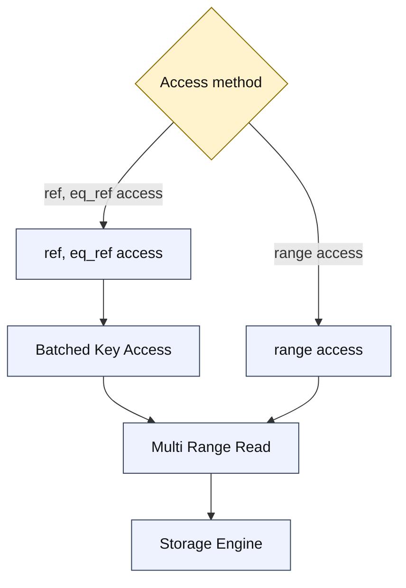

# Multi Range Read Optimization

Multi Range Read is an optimization aimed at improving performance for IO-bound queries that need to scan lots of rows.

Multi Range Read can be used with

* `range` access
* `ref` and `eq_ref` access, when they are using [Batched Key Access](../query-optimizer/block-based-join-algorithms.md#batch-key-access-join)

as shown in this diagram:



_Possible ways to use MRR: range access, or ref/eq\_ref access via Batched Key Access, both feed into Multi Range Read._

## The Idea

### Case 1: Rowid Sorting for Range Access

Consider a range query:

```sql
EXPLAIN SELECT * FROM tbl WHERE tbl.key1 BETWEEN 1000 AND 2000;
+----+-------------+-------+-------+---------------+------+---------+------+------+-----------------------+
| id | select_type | table | type  | possible_keys | key  | key_len | ref  | rows | Extra                 |
+----+-------------+-------+-------+---------------+------+---------+------+------+-----------------------+
|  1 | SIMPLE      | tbl   | range | key1          | key1 | 5       | NULL |  960 | Using index condition |
+----+-------------+-------+-------+---------------+------+---------+------+------+-----------------------+
```

When this query is executed, disk IO access pattern will follow the red line in this figure:


Execution will hit the table rows in random places, as marked with the blue line/numbers in the figure.

When the table is sufficiently big, each table record read will need to actually go to disk (and be served from buffer pool or OS cache), and query execution will be too slow to be practical. For example, a 10,000 RPM disk drive is able to make 167 seeks per second, so in the worst case, query execution will be capped at reading about 167 records per second.

SSD drives do not need to do disk seeks, so they will not be hurt as badly, however the performance will still be poor in many cases.

Multi-Range-Read optimization aims to make disk access faster by sorting record read requests and then doing one ordered disk sweep. If one enables Multi Range Read, `EXPLAIN` will show that a "`Rowid-ordered scan`" is used:

```sql
SET optimizer_switch='mrr=ON';
Query OK, 0 rows affected (0.06 sec)

EXPLAIN SELECT * FROM tbl WHERE tbl.key1 BETWEEN 1000 AND 2000;
+----+-------------+-------+-------+---------------+------+---------+------+------+-------------------------------------------+
| id | select_type | table | type  | possible_keys | key  | key_len | ref  | rows | Extra                                     |
+----+-------------+-------+-------+---------------+------+---------+------+------+-------------------------------------------+
|  1 | SIMPLE      | tbl   | range | key1          | key1 | 5       | NULL |  960 | Using index condition; Rowid-ordered scan |
+----+-------------+-------+-------+---------------+------+---------+------+------+-------------------------------------------+
1 row in set (0.03 sec)
```

and the execution will proceed as follows:


Reading disk data sequentially is generally faster, because

* Rotating drives do not have to move the head back and forth
* One can take advantage of IO-prefetching done at various levels
* Each disk page will be read exactly once, which means we won't rely on disk cache (or buffer pool) to save us from reading the same page multiple times.

The above can make a huge difference on performance. There is also a catch, though:

* If you're scanning small data ranges in a table that is sufficiently small so that it completely fits into the OS disk cache, then you may observe that the only effect of MRR is that extra buffering/sorting adds some CPU overhead.
* `LIMIT n` and `ORDER BY ... LIMIT n` queries with small values of `n` may become slower. The reason is that MRR reads data in disk order, while `ORDER BY ... LIMIT n` wants first `n` records in index order.

### Case 2: Rowid Sorting for Batched Key Access

Batched Key Access can benefit from rowid sorting in the same way as range access does. If one has a join that uses index lookups:

```sql
EXPLAIN SELECT * FROM t1,t2 WHERE t2.key1=t1.col1;
+----+-------------+-------+------+---------------+------+---------+--------------+------+-------------+
| id | select_type | table | type | possible_keys | key  | key_len | ref          | rows | Extra       |
+----+-------------+-------+------+---------------+------+---------+--------------+------+-------------+
|  1 | SIMPLE      | t1    | ALL  | NULL          | NULL | NULL    | NULL         | 1000 | Using where |
|  1 | SIMPLE      | t2    | ref  | key1          | key1 | 5       | test.t1.col1 |    1 |             |
+----+-------------+-------+------+---------------+------+---------+--------------+------+-------------+
2 rows in set (0.00 sec)
```

Execution of this query will cause table `t2` to be hit in random locations by lookups made through `t2.key1=t1.col`. If you enable Multi Range and Batched Key Access, you will get table `t2` to be accessed using a `Rowid-ordered scan`:

```sql
SET optimizer_switch='mrr=ON';
Query OK, 0 rows affected (0.06 sec)

SET join_cache_level=6;
Query OK, 0 rows affected (0.00 sec)

EXPLAIN SELECT * FROM t1,t2 WHERE t2.key1=t1.col1;
+----+-------------+-------+------+---------------+------+---------+--------------+------+--------------------------------------------------------+
| id | select_type | table | type | possible_keys | key  | key_len | ref          | rows | Extra                                                  |
+----+-------------+-------+------+---------------+------+---------+--------------+------+--------------------------------------------------------+
|  1 | SIMPLE      | t1    | ALL  | NULL          | NULL | NULL    | NULL         | 1000 | Using where                                            |
|  1 | SIMPLE      | t2    | ref  | key1          | key1 | 5       | test.t1.col1 |    1 | Using join buffer (flat, BKA join); Rowid-ordered scan |
+----+-------------+-------+------+---------------+------+---------+--------------+------+--------------------------------------------------------+
2 rows in set (0.00 sec)
```

The benefits will be similar to those listed for `range` access.

An additional source of speedup is this property: if there are multiple records in `t1` that have the same value of `t1.col1`, then regular Nested-Loops join will make multiple index lookups for the same value of `t2.key1=t1.col1`. The lookups may or may not hit the cache, depending on how big the join is. With Batched Key Access and Multi-Range Read, no duplicate index lookups will be made.

### Case 3: Key Sorting for Batched Key Access

Let us consider again the nested loop join example, with `ref` access on the second table:

```sql
EXPLAIN SELECT * FROM t1,t2 WHERE t2.key1=t1.col1;
+----+-------------+-------+------+---------------+------+---------+--------------+------+-------------+
| id | select_type | table | type | possible_keys | key  | key_len | ref          | rows | Extra       |
+----+-------------+-------+------+---------------+------+---------+--------------+------+-------------+
|  1 | SIMPLE      | t1    | ALL  | NULL          | NULL | NULL    | NULL         | 1000 | Using where |
|  1 | SIMPLE      | t2    | ref  | key1          | key1 | 5       | test.t1.col1 |    1 |             |
+----+-------------+-------+------+---------------+------+---------+--------------+------+-------------+
```

Execution of this query plan will cause random hits to be made into the index `t2.key1`, as shown in this picture:


In particular, on step #5 we'll read the same index page that we've read on step #2, and the page we've read on step #4 will be re-read on step#6. If all pages you're accessing are in the cache (in the buffer pool, if you're using InnoDB, and in the key cache, if you're using MyISAM), this is not a problem. However, if your hit ratio is poor and you're going to hit the disk, it makes sense to sort the lookup keys, like shown in this figure:


This is roughly what `Key-ordered scan` optimization does. In EXPLAIN, it looks as follows:

```sql
SET optimizer_switch='mrr=ON,mrr_sort_keys=ON';
Query OK, 0 rows affected (0.00 sec)

SET join_cache_level=6;
Query OK, 0 rows affected (0.02 sec)
EXPLAIN SELECT * FROM t1,t2 WHERE t2.key1=t1.col1\G
*************************** 1. row ***************************
           id: 1
  select_type: SIMPLE
        TABLE: t1
         type: ALL
possible_keys: a
          KEY: NULL
      key_len: NULL
          ref: NULL
         ROWS: 1000
        Extra: USING WHERE
*************************** 2. row ***************************
           id: 1
  select_type: SIMPLE
        TABLE: t2
         type: ref
possible_keys: key1
          KEY: key1
      key_len: 5
          ref: test.t1.col1
         ROWS: 1
        Extra: USING JOIN buffer (flat, BKA JOIN); KEY-ordered Rowid-ordered scan
2 rows in set (0.00 sec)
```

((TODO: a note about why sweep-read over InnoDB's clustered primary index scan (which is, actually the whole InnoDB table itself) will use `Key-ordered scan` algorithm, but not `Rowid-ordered scan` algorithm, even though conceptually they are the same thing in this case))

## Buffer Space Management

As was shown above, Multi Range Read requires sort buffers to operate. The size of the buffers is limited by system variables. If MRR has to process more data than it can fit into its buffer, it will break the scan into multiple passes. The more passes are made, the less is the speedup though, so one needs to balance between having too big buffers (which consume lots of memory) and too small buffers (which limit the possible speedup).

### Range Access

When MRR is used for `range` access, the size of its buffer is controlled by the [mrr\_buffer\_size](../system-variables/server-system-variables.md#mrr_buffer_size) system variable. Its value specifies how much space can be used for each table. For example, if there is a query which is a 10-way join and MRR is used for each table, `10*@@mrr_buffer_size` bytes may be used.

### Batched Key Access

When Multi Range Read is used by Batched Key Access, then buffer space is managed by BKA code, which will automatically provide a part of its buffer space to MRR. You can control the amount of space used by BKA by setting

* [join\_buffer\_size](../system-variables/server-system-variables.md#join_buffer_size) to limit how much memory BKA uses for each table, and
* [join\_buffer\_space\_limit](../system-variables/server-system-variables.md#join_buffer_space_limit) to limit the total amount of memory used by BKA in the join.

## Status Variables

There are three status variables related to Multi Range Read:

| Variable name                                                                                            | Meaning                                                                   |
| -------------------------------------------------------------------------------------------------------- | ------------------------------------------------------------------------- |
| [Handler\_mrr\_init](../system-variables/server-status-variables.md#handler_mrr_init)                    | Counts how many Multi Range Read scans were performed                     |
| [Handler\_mrr\_key\_refills](../system-variables/server-status-variables.md#handler_mrr_key_refills)     | Number of times key buffer was refilled (not counting the initial fill)   |
| [Handler\_mrr\_rowid\_refills](../system-variables/server-status-variables.md#handler_mrr_rowid_refills) | Number of times rowid buffer was refilled (not counting the initial fill) |

Non-zero values of `Handler_mrr_key_refills` and/or `Handler_mrr_rowid_refills` mean that Multi Range Read scan did not have enough memory and had to do multiple key/rowid sort-and-sweep passes. The greatest speedup is achieved when Multi Range Read runs everything in one pass, if you see lots of refills it may be beneficial to increase sizes of relevant buffers [mrr\_buffer\_size](../system-variables/server-system-variables.md#mrr_buffer_size) [join\_buffer\_size](../system-variables/server-system-variables.md#join_buffer_size) and [join\_buffer\_space\_limit](../system-variables/server-system-variables.md#join_buffer_space_limit)

### Effect on Other Status Variables

When a Multi Range Read scan makes an index lookup (or some other "basic" operation), the counter of the "basic" operation, e.g. [Handler\_read\_key](../system-variables/server-status-variables.md#handler_read_key), will also be incremented. This way, you can still see total number of index accesses, including those made by MRR. [Per-user/table/index statistics](../query-optimizations/statistics-for-optimizing-queries/user-statistics.md) counters also include the row reads made by Multi Range Read scans.

### Why Using Multi Range Read Can Cause Higher Values in Status Variables

Multi Range Read is used for scans that do full record reads (i.e., they are not "Index only" scans). A regular non-index-only scan will read

1. an index record, to get a rowid of the table record
2. a table record\
   Both actions will be done by making one call to the storage engine, so the effect of the call will be that the relevan `Handler_read_XXX` counter will be incremented BY ONE, and [Innodb\_rows\_read](../system-variables/innodb-status-variables.md) will be incremented BY ONE.

Multi Range Read will make separate calls for steps #1 and #2, causing TWO increments to `Handler_read_XXX` counters and TWO increments to `Innodb_rows_read` counter. To the uninformed, this looks as if Multi Range Read was making things worse. Actually, it doesn't - the query will still read the same index/table records, and actually Multi Range Read may give speedups because it reads data in disk order.

## Tuning `mrr_buffer_size`

Multi Range Read only pays off when it can sort a whole batch of row references in one pass, so [mrr\_buffer\_size](../system-variables/server-system-variables.md#mrr_buffer_size) is a workload-dependent setting rather than a value to raise across the board. Before increasing it, confirm that the affected query actually uses MRR, that the buffer really is the limiting factor, and that the server has the memory headroom for the larger allocation at the concurrency the workload runs at.

### Tuning Decision Flow

```mermaid
flowchart TD
  accTitle: Decision flow for tuning mrr_buffer_size
  accDescr { This flowchart walks through tuning mrr_buffer_size. Start by identifying the affected query and collecting a baseline. If the query has no MRR-suitable access pattern, tune the query or indexes instead. If MRR is not enabled, enable it for the session or use an MRR hint. If EXPLAIN does not show a Rowid-ordered scan and Handler_mrr_init does not increase, mrr_buffer_size has no effect. If the MRR refill counters are zero, the buffer already holds the whole scan and a larger value cannot help. If the data is already resident in the buffer pool, the benefit is limited. Otherwise check memory headroom and concurrency, then test progressively at session level through 512 KB, 1 MB, 2 MB and 4 MB. Keep a gain that is specific to one workload at session level; consider a global change only when the gain is consistent across representative workloads and memory headroom is sufficient. Monitor after any change, and settle on the smallest value that gives a consistent improvement. }
  A(["Identify the affected query and collect a baseline"]) --> B{"Does the query use an MRR-suitable access pattern, such as a range scan or a large IN list?"}
  B -->|"No"| B1["MRR cannot help. Tune the query, its indexes, or the optimizer statistics instead"]
  B -->|"Yes"| C{"Is MRR enabled for the query?"}
  C -->|"No"| C1["Set mrr=on for the session, or add an MRR hint, then re-check"]
  C1 --> D
  C -->|"Yes"| D{"Does EXPLAIN show a Rowid-ordered or Key-ordered scan, and does Handler_mrr_init increase?"}
  D -->|"No"| D1["MRR is not used, so mrr_buffer_size has no effect on this query"]
  D -->|"Yes"| E{"Is Handler_mrr_key_refills or Handler_mrr_rowid_refills non-zero?"}
  E -->|"No"| E1["The buffer already holds the whole scan, so a larger value cannot help"]
  E -->|"Yes"| F{"Is the data already resident in the InnoDB buffer pool?"}
  F -->|"Yes"| F1["Benefit is limited: the extra sorting costs CPU without saving I/O"]
  F -->|"No"| G["Check memory headroom and concurrency: Threads_running, free RAM, swap usage"]
  G --> H{"Is memory pressure a concern at this concurrency?"}
  H -->|"Yes"| H1["Leave the global value at the default and test at session level only"]
  H1 --> I
  H -->|"No"| I["Test progressively at session level: 512 KB, then 1 MB, 2 MB, 4 MB"]
  I --> J{"Measurable, repeatable improvement, with the refill counters at zero and no CPU or memory regression?"}
  J -->|"No"| J1["Revert to the previous value and investigate other tuning"]
  J -->|"Yes"| K{"Is the gain specific to one application or workload?"}
  K -->|"Yes"| K1["Keep the larger value at session level, for that workload only"]
  K -->|"No"| L{"Is the gain consistent across representative workloads, with sufficient memory headroom?"}
  L -->|"No"| K1
  L -->|"Yes"| M["A global change may be considered after controlled validation"]
  M --> N["Monitor after the change: query time, Threads_running, memory and swap, CPU and disk I/O, buffer pool metrics"]
  K1 --> N
  N --> O(["Settle on the smallest value that gives a consistent improvement"])

  classDef box fill:#eef2ff,stroke:#33415c,stroke-width:1px,color:#111;
  classDef decision fill:#fff3cd,stroke:#8a6d00,stroke-width:1px,color:#111;
  classDef stop fill:#f1f3f5,stroke:#495057,stroke-width:1px,color:#111;
  class B,C,D,E,F,H,J,K,L decision;
  class A,C1,G,I,M,N,O box;
  class B1,D1,E1,F1,H1,J1,K1 stop;
```



_Decision flow for tuning `mrr_buffer_size`: confirm MRR is used, confirm the buffer is the limit, weigh memory against concurrency, then test at session level before considering a global change._

The examples in this section use a 100,000-row InnoDB table with a non-unique secondary index, which is enough to make the optimizer pick `range` access with MRR:

```sql
CREATE TABLE tbl (
  id     INT PRIMARY KEY,
  key1   INT,
  filler CHAR(200),
  KEY (key1)
) ENGINE=InnoDB;

INSERT INTO tbl SELECT seq, seq*7919 % 100000, 'x' FROM seq_1_to_100000;
ANALYZE TABLE tbl;
```

### Check That MRR Is Enabled

MRR is **off by default**: `mrr`, `mrr_sort_keys`, and `mrr_cost_based` are all absent from the default [optimizer\_switch](../system-variables/server-system-variables.md#optimizer_switch). Check the current setting before anything else:

```sql
SELECT @@optimizer_switch, @@mrr_buffer_size;
```

Only `mrr=on` is required for the optimizer to consider MRR. The other two flags change how it decides:

* `mrr_sort_keys=on` additionally enables Key-ordered scans.
* `mrr_cost_based=on` makes the choice cost-based. With the default `mrr_cost_based=off`, MRR is used whenever it is applicable, which is what you want while testing. Turning it on makes MRR less likely to be chosen, and the MRR cost model is not sufficiently tuned for that to be recommended.

To enable MRR for a single session:

```sql
SET SESSION optimizer_switch='mrr=on';
```

From MariaDB 12.0, the [MRR() and NO\_MRR()](../optimizer-hints/index-level-hints.md#mrr-no_mrr) optimizer hints control MRR per query, without changing `optimizer_switch` at all.

### Confirm That the Query Uses MRR

`EXPLAIN` names the strategy in the `Extra` column, and `EXPLAIN FORMAT=JSON` reports it as `mrr_type`:

```sql
SET SESSION optimizer_switch='mrr=on';

EXPLAIN SELECT COUNT(filler) FROM tbl WHERE key1 BETWEEN 1000 AND 8000;
+------+-------------+-------+-------+---------------+------+---------+------+------+-------------------------------------------+
| id   | select_type | table | type  | possible_keys | key  | key_len | ref  | rows | Extra                                     |
+------+-------------+-------+-------+---------------+------+---------+------+------+-------------------------------------------+
|    1 | SIMPLE      | tbl   | range | key1          | key1 | 5       | NULL | 7001 | Using index condition; Rowid-ordered scan |
+------+-------------+-------+-------+---------------+------+---------+------+------+-------------------------------------------+

EXPLAIN FORMAT=JSON SELECT COUNT(filler) FROM tbl WHERE key1 BETWEEN 1000 AND 8000;
{
  "query_block": {
    "select_id": 1,
    "cost": 8.24703808,
    "nested_loop": [
      {
        "table": {
          "table_name": "tbl",
          "access_type": "range",
          "possible_keys": ["key1"],
          "key": "key1",
          "key_length": "5",
          "used_key_parts": ["key1"],
          "loops": 1,
          "rows": 7001,
          "cost": 8.24703808,
          "filtered": 100,
          "index_condition": "tbl.key1 between 1000 and 8000",
          "mrr_type": "Rowid-ordered scan"
        }
      }
    ]
  }
}
```

The plan is only a prediction. [Handler\_mrr\_init](../system-variables/server-status-variables.md#handler_mrr_init) tells you whether MRR actually ran:

```sql
FLUSH STATUS;
SELECT COUNT(filler) FROM tbl WHERE key1 BETWEEN 1000 AND 8000;
SHOW STATUS LIKE 'Handler_mrr_init';
+------------------+-------+
| Variable_name    | Value |
+------------------+-------+
| Handler_mrr_init | 1     |
+------------------+-------+
```

If `Handler_mrr_init` stays at zero, MRR did not run and `mrr_buffer_size` has no effect on the query.


MariaDB never prints `Using MRR` — that is the MySQL wording. MariaDB shows `Rowid-ordered scan`, `Key-ordered scan`, or `Key-ordered Rowid-ordered scan`. The fields `using_mrr` and `rowid_ordered` come from [Optimizer Trace](../query-optimizer/optimizer-trace/README.md), not from `EXPLAIN FORMAT=JSON`.


### Confirm That the Buffer Is the Limiting Factor

This is the measurement that decides whether raising `mrr_buffer_size` can help at all. When a scan does not fit in the buffer, MRR breaks it into several sort-and-sweep passes and counts each refill in [Handler\_mrr\_key\_refills](../system-variables/server-status-variables.md#handler_mrr_key_refills) and [Handler\_mrr\_rowid\_refills](../system-variables/server-status-variables.md#handler_mrr_rowid_refills).

With the buffer at its 8 KB minimum, a 7,000-row range scan needs four passes:

```sql
SET SESSION mrr_buffer_size = 8192;
FLUSH STATUS;
SELECT COUNT(filler) FROM tbl WHERE key1 BETWEEN 1000 AND 8000;
SHOW STATUS LIKE 'Handler_mrr%';
+---------------------------+-------+
| Variable_name             | Value |
+---------------------------+-------+
| Handler_mrr_init          | 1     |
| Handler_mrr_key_refills   | 0     |
| Handler_mrr_rowid_refills | 3     |
+---------------------------+-------+
```

At 1 MB the same scan runs in a single pass:

```sql
SET SESSION mrr_buffer_size = 1048576;
FLUSH STATUS;
SELECT COUNT(filler) FROM tbl WHERE key1 BETWEEN 1000 AND 8000;
SHOW STATUS LIKE 'Handler_mrr%';
+---------------------------+-------+
| Variable_name             | Value |
+---------------------------+-------+
| Handler_mrr_init          | 1     |
| Handler_mrr_key_refills   | 0     |
| Handler_mrr_rowid_refills | 0     |
+---------------------------+-------+
```

Once both refill counters read zero, the buffer already holds the entire scan and increasing it further cannot improve the query. Non-zero refills are the signal that a larger buffer has something to gain.

### When a Larger Buffer Helps, and When It Does Not

A larger buffer lets MRR order more row references per pass, which turns random reads into a more sequential sweep. That matters when:

* The query uses `range` access over a range large enough to overflow the current buffer.
* The refill counters above are non-zero.
* The working set is not fully cached in the InnoDB buffer pool, so the reads reach storage.
* The workload is reporting or analytical, with relatively low concurrency.

It makes little or no difference when:

* MRR is not selected for the query, or the access pattern is not MRR-suitable.
* The refill counters are already zero.
* The data is already resident in the buffer pool, in which case the extra sorting only adds CPU work.
* Storage is NVMe or similar, where avoiding seeks buys much less.
* The query is `ORDER BY ... LIMIT n` with a small `n` — MRR reads in disk order, not index order, so it can be slower.

### Weigh Memory Against Concurrency

`mrr_buffer_size` is a **per-table, per-scan** limit, not a per-session one. A single 10-way join that uses MRR on every table can therefore use `10 * @@mrr_buffer_size`, so the total across the server scales with both concurrency and plan shape: 4 MB across 200 concurrent MRR scans is already around 800 MB of potential allocation, and more if those scans sit inside multi-table joins.

Before raising the global value, check the concurrency the server actually runs at and the headroom available:

```sql
SHOW STATUS LIKE 'Threads_running';
```

Also review free system memory, swap activity, InnoDB buffer pool size, and any other per-connection buffers already configured. High concurrency combined with a large `mrr_buffer_size` can put the server under memory pressure for a gain that only a few queries see.

### Test at Session Level First

Change the value for one session, and compare against the baseline over several runs of a representative workload:

```sql
SET SESSION mrr_buffer_size = 524288;
```

Increase in steps — 512 KB, 1 MB, 2 MB, 4 MB — rather than jumping to a large value, and stop at the first step where the refill counters reach zero. Beyond that point the buffer is no longer the constraint. At each step, measure at least:

* Query execution time, over repeated runs.
* The MRR refill counters.
* CPU usage and disk I/O.
* Rows examined and returned.
* Memory usage and `Threads_running` under realistic concurrency.

Treat a new value as beneficial only when the improvement is both measurable and repeatable, and the resource cost is acceptable.

### Session Values Versus a Global Change

Keep the global value conservative and raise it per session for the applications or batch jobs that demonstrate a clear benefit:

```sql
SET SESSION mrr_buffer_size = 4194304;
```

An improvement seen by one application is not a reason to make that value global — different workloads have different optimal values, and the memory cost applies to every session. Consider `SET GLOBAL` only when the improvement is consistent across workloads that represent the wider environment, memory headroom is sufficient at the real concurrency, and no CPU, I/O, or memory regression shows up under controlled validation.

### Do Not Confuse MRR With Batched Key Access

The two use different buffers, and tuning the wrong one has no effect:

| Access pattern | Buffer controlled by |
| -------------- | -------------------- |
| MRR for `range` access | [mrr\_buffer\_size](../system-variables/server-system-variables.md#mrr_buffer_size) |
| MRR under [Batched Key Access](../query-optimizer/block-based-join-algorithms.md#batch-key-access-join) for `ref` and `eq_ref` joins | [join\_buffer\_size](../system-variables/server-system-variables.md#join_buffer_size) and [join\_buffer\_space\_limit](../system-variables/server-system-variables.md#join_buffer_space_limit) |

A slow join that uses index lookups is a BKA question, not an `mrr_buffer_size` one. And in either case, a larger buffer is not a substitute for fixing the query, the indexes, or the optimizer statistics.


In short: confirm MRR is used by the affected query, confirm the refill counters are non-zero, weigh the workload's memory and concurrency, and test progressively at session level. Use the smallest value that gives a consistent improvement without excessive resource consumption.


## Multi Range Read Factsheet

* Multi Range Read is used by
  * `range` access method for range scans.
  * [Batched Key Access](../query-optimizer/block-based-join-algorithms.md#batch-key-access-join) for joins
* Multi Range Read can cause slowdowns for small queries over small tables, so it is disabled by default.
* There are two strategies, and you can tell which one is used by checking the `Extra` column in `EXPLAIN` output:
  * Rowid-ordered scan
  * Key-ordered scan
* All three MRR [optimizer\_switch](../system-variables/server-system-variables.md#optimizer_switch) flags are off by default, and you can switch them ON:
  * `mrr=on` - enable MRR and rowid ordered scans
  * `mrr_sort_keys=on` - enable Key-ordered scans (you must also set `mrr=on` for this to have any effect)
  * `mrr_cost_based=on` - enable cost-based choice whether to use MRR. Currently not recommended, because cost model is not sufficiently tuned yet.

## Differences from MySQL

* MySQL supports only `Rowid ordered scan` strategy, which it shows in `EXPLAIN` as `Using MRR`.
* EXPLAIN in MySQL shows `Using MRR`, while in MariaDB it may show
  * `Rowid-ordered scan`
  * `Key-ordered scan`
  * `Key-ordered Rowid-ordered scan`
* MariaDB uses [mrr\_buffer\_size](../system-variables/server-system-variables.md#mrr_buffer_size) as a limit of MRR buffer size for `range` access, while MySQL uses [read\_rnd\_buffer\_size](../system-variables/server-system-variables.md#read_rnd_buffer_size).
* MariaDB has three MRR counters: [Handler\_mrr\_init](../system-variables/server-status-variables.md#handler_mrr_init), [Handler\_mrr\_key\_refills](../system-variables/server-status-variables.md#handler_mrr_key_refills), and [Handler\_mrr\_rowid\_refills](../system-variables/server-status-variables.md#handler_mrr_rowid_refills), while MySQL has only `Handler_mrr_init`, and it will only count MRR scans that were used by BKA. MRR scans used by range access are not counted.

##

<sub>_This page is licensed: CC BY-SA / Gnu FDL_</sub>


