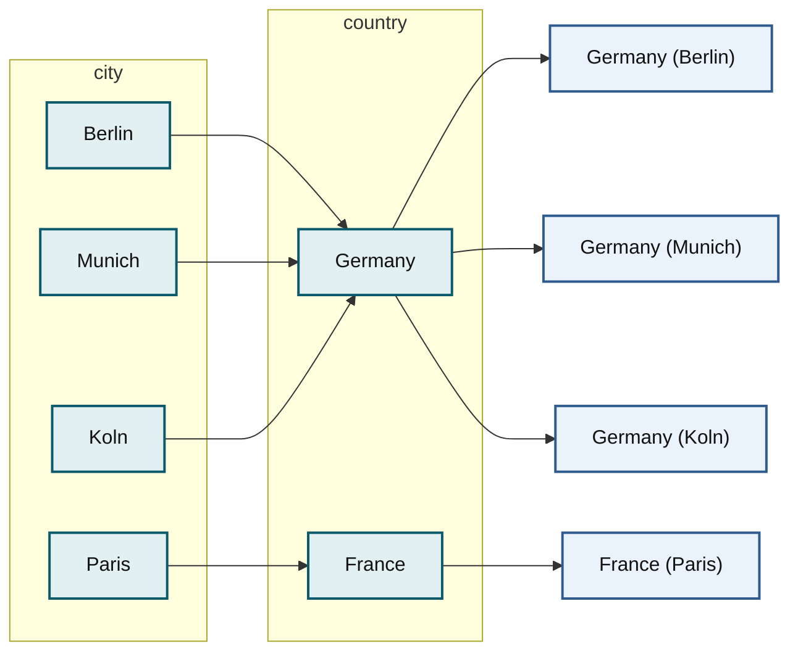
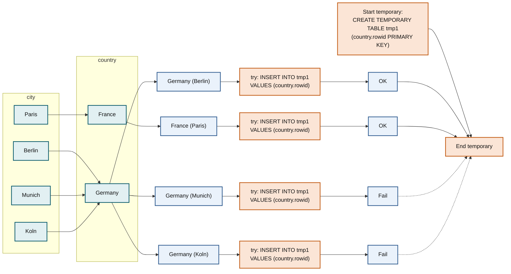

# Duplicate Weedout Strategy

`DuplicateWeedout` is an execution strategy for [Semi-join subqueries](../subquery-optimizations/semi-join-subquery-optimizations.md).

## The idea

The idea is to run the semi-join (a query with uses `WHERE X IN (SELECT Y FROM ...)`) as if it were a regular inner join, and then eliminate the duplicate record combinations using a temporary table.

Suppose, you have a query where you're looking for countries which have more than 33% percent of their population in one big city:

```sql
SELECT * 
FROM Country 
WHERE 
   Country.code IN (SELECT City.Country
                    FROM City 
                    WHERE 
                      City.Population > 0.33 * Country.Population AND 
                      City.Population > 1*1000*1000);
```

First, we run a regular inner join between the `City` and `Country` tables:



_The inner join between `city` and `country` produces a duplicate `Germany` row for each of its three big cities._

Now, lets put `DuplicateWeedout` into the picture:



_`DuplicateWeedout` inserts each candidate row's `country.rowid` into a temporary table with a primary key; the insert fails for rows that would duplicate `Germany`, so only one `Germany` row survives._

## DuplicateWeedout in action

The `Start temporary` and `End temporary` from the last diagram are shown in the `EXPLAIN` output:

```sql
EXPLAIN SELECT * FROM Country WHERE Country.code IN 
  (select City.Country from City where City.Population > 0.33 * Country.Population 
   AND City.Population > 1*1000*1000)\G
*************************** 1. row ***************************
           id: 1
  select_type: PRIMARY
        TABLE: City
         type: RANGE
possible_keys: Population,Country
          KEY: Population
      key_len: 4
          ref: NULL
         ROWS: 238
        Extra: USING INDEX CONDITION; Start temporary
*************************** 2. row ***************************
           id: 1
  select_type: PRIMARY
        TABLE: Country
         type: eq_ref
possible_keys: PRIMARY
          KEY: PRIMARY
      key_len: 3
          ref: world.City.Country
         ROWS: 1
        Extra: USING WHERE; End temporary
2 rows in set (0.00 sec)
```

This query will read 238 rows from the `City` table, and for each of them will make a primary key lookup in the `Country` table, which gives another 238 rows. This gives a total of 476 rows, and you need to add 238 lookups in the temporary table (which are typically _much_ cheaper since the temporary table is in-memory).

If we run the same query with semi-join optimizations disabled, we'll get:

```sql
EXPLAIN SELECT * FROM Country WHERE Country.code IN 
  (select City.Country from City where City.Population > 0.33 * Country.Population 
    AND City.Population > 1*1000*1000)\G
*************************** 1. row ***************************
           id: 1
  select_type: PRIMARY
        TABLE: Country
         type: ALL
possible_keys: NULL
          KEY: NULL
      key_len: NULL
          ref: NULL
         ROWS: 239
        Extra: USING WHERE
*************************** 2. row ***************************
           id: 2
  select_type: DEPENDENT SUBQUERY
        TABLE: City
         type: index_subquery
possible_keys: Population,Country
          KEY: Country
      key_len: 3
          ref: func
         ROWS: 18
        Extra: USING WHERE
2 rows in set (0.00 sec)
```

This plan will read `(239 + 239*18) = 4541` rows, which is much slower.

## Factsheet

* `DuplicateWeedout` is shown as "Start temporary/End temporary" in `EXPLAIN`.
* The strategy can handle correlated subqueries.
* But it cannot be applied if the subquery has meaningful `GROUP BY` and/or aggregate functions.
* `DuplicateWeedout` allows the optimizer to freely mix a subquery's tables and the parent select's tables.
* There is no separate @@optimizer\_switch flag for `DuplicateWeedout`. The strategy can be disabled by switching off all semi-join optimizations with `SET @@optimizer_switch='optimizer_semijoin=off'` command.

## See Also

* [Subquery Optimizations Map](../subquery-optimizations/subquery-optimizations-map.md)

<sub>_This page is licensed: CC BY-SA / Gnu FDL_</sub>


