# Subquery Optimizations Map

Below is a map showing all types of subqueries allowed in the SQL language, and\
the optimizer strategies available to handle them.

* Uncolored areas represent different kinds of subqueries, for example:
  * Subqueries that have form `x IN (SELECT ...)`
  * Subqueries that are in the `FROM` clause
  * .. and so forth
* The size of each uncolored area roughly corresponds to how important (i.e.\
  frequently used) that kind of subquery is. For\
  example, `x IN (SELECT ...)` queries are the most important,\
  and `EXISTS (SELECT ...)` are relatively unimportant.
* Colored areas represent optimizations/execution strategies that are applied\
  to handle various kinds of subqueries.
* The color of optimization indicates which version of MySQL/MariaDB it was\
  available in (see legend below)

```mermaid
flowchart TB
    accTitle: Map of subquery kinds and the optimization strategies available for each
    accDescr {
      Six groups represent kinds of subqueries: "x IN / x=ANY (SELECT ...)", "EXISTS (SELECT ...)", "x NOT IN (SELECT ...)", "scalar-context (SELECT ...)", "FROM (SELECT ...)", and "x CMP ALL/ANY (SELECT ...)".
      The "x IN / x=ANY" group splits into two related sub-groups, Semi-join subqueries and Non-semi-join subqueries, linked by a two-way relationship since either path can apply.
      Semi-join subqueries are handled by one of: Convert to inner join, First Match, LooseScan, Duplicate Weedout, or Materialization.
      Non-semi-join subqueries under "x IN / x=ANY", and separately under "x NOT IN", are handled by Straightforward execution, Materialization, NULL-aware Materialization, or plus Subquery caching.
      "EXISTS (SELECT ...)" subqueries are handled by Straightforward execution, the EXISTS-to-IN transformation, or plus Subquery caching.
      "scalar-context (SELECT ...)" subqueries are handled by Straightforward execution or plus Subquery caching.
      "FROM (SELECT ...)" derived-table subqueries are handled by Merge into parent SELECT, Materialize, derived-with-keys, or GROUP BY Split Materialized.
      "x CMP ALL/ANY (SELECT ...)" subqueries, where CMP is one of less-than, less-than-or-equal, greater-than, or greater-than-or-equal, are handled by Straightforward execution, plus Subquery caching, or Rewrite to SELECT MIN/MAX.
    }

    subgraph INANY["x IN (SELECT ...), x=ANY(SELECT ...)"]
        direction LR
        subgraph SEMI["Semi-join subqueries"]
            direction TB
            subgraph SJP["Semi-join processing"]
                direction TB
                CONV["Convert to<br/>inner join"]:::proc
                FM["First Match"]:::proc
                LS["LooseScan"]:::proc
                DW["Duplicate Weedout"]:::proc
                SJMAT["Materialization"]:::file
            end
        end
        subgraph NSJ["Non-semi-join subqueries"]
            direction TB
            NSJ1["Straightforward execution"]:::node
            NSJ2["Materialization"]:::file
            NSJ3["NULL-aware<br/>Materialization"]:::file
            NSJ4["+Subquery caching"]:::node
        end
        SEMI <--> NSJ
    end

    subgraph EX["EXISTS (SELECT ...)"]
        direction TB
        EX1["Straightforward execution"]:::node
        EX2["EXISTS -> IN"]:::proc
        EX3["+Subquery caching"]:::node
    end

    subgraph NotInSubq["x NOT IN (SELECT ...)"]
        direction TB
        NI1["Straightforward execution"]:::node
        NI2["Materialization"]:::file
        NI3["NULL-aware Materialization"]:::file
        NI4["+Subquery caching"]:::node
    end

    subgraph SCALAR["scalar-context (SELECT ...)"]
        direction TB
        SC1["Straightforward execution"]:::node
        SC2["+Subquery caching"]:::node
    end

    subgraph FROMSQ["FROM (SELECT ...)"]
        direction TB
        FR1["Merge into parent SELECT"]:::proc
        FR2["Materialize"]:::file
        FR3["derived-with-keys"]:::file
        FR4["GROUP BY: Split Materialized"]:::proc
    end

    subgraph CMP["x CMP ALL/ANY(SELECT ...)<br/>where CMP is &lt;,&lt;=,&gt;,&gt;="]
        direction TB
        CM1["Straightforward execution"]:::node
        CM2["+Subquery caching"]:::node
        CM3["Rewrite to<br/>(SELECT MIN/MAX...)"]:::proc
    end

    classDef node fill:#e2f0f2,stroke:#0a5a6b,stroke-width:2px,color:#111;
    classDef proc fill:#fbe5d6,stroke:#c15911,stroke-width:2px,color:#111;
    classDef file fill:#eaf2fb,stroke:#2f5b8f,stroke-width:2px,color:#111;
```

_Map of the kinds of subqueries the optimizer recognizes and the strategies available to handle each one._

Some things are not on the map:

* MariaDB doesn't evaluate expensive subqueries when doing optimization\
  (this means, EXPLAIN is always fast). MySQL 5.6 has made a progress in this regard, but its optimizer will still evaluate certain kinds of subqueries (for example, scalar-context subqueries used in range predicates)

## Links to pages about individual optimizations:

* [IN->EXISTS](non-semi-join-subquery-optimizations.md#the-in-to-exists-transformation)
* [Subquery Caching](subquery-cache.md)
* [Semi-join optimizations](semi-join-subquery-optimizations.md)
  * [Table pullout](table-pullout-optimization.md)
  * [FirstMatch](../optimization-strategies/firstmatch-strategy.md)
  * [Materialization, +scan, +lookup](../optimization-strategies/semi-join-materialization-strategy.md)
  * [LooseScan](../optimization-strategies/loosescan-strategy.md)
  * [DuplicateWeedout execution strategy](../optimization-strategies/duplicateweedout-strategy.md)
* Non-semi-join [Materialization](non-semi-join-subquery-optimizations.md#materialization-for-non-correlated-in-subqueries) (including NULL-aware and partial matching)
* Derived table optimizations
  * [Derived table merge](../optimizations-for-derived-tables/derived-table-merge-optimization.md)
  * [Derived table with keys](../optimizations-for-derived-tables/derived-table-with-key-optimization.md)

## See also

* [Subquery optimizations in MariaDB 5.3](https://app.gitbook.com/s/aEnK0ZXmUbJzqQrTjFyb/community-server/old-releases/5.3/changes-improvements-in-mariadb-5-3#subquery-optimizations)

_This page is licensed: CC BY-SA / Gnu FDL_


