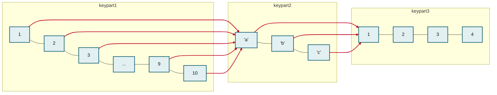
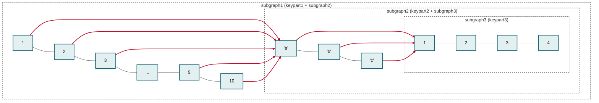

# optimizer\_max\_sel\_arg\_weight

## Basics

As mentioned in the [Range Optimizer](range-optimizer.md), ranges on multiple key parts can create a combinatorial amount of ranges.

`optimizer_max_sel_arg_weight` setting is a limit to reduce the number of ranges generated by\
dropping restrictions on higher key parts if the number of ranges becomes too high.

(Note that there is also `optimizer_max_sel_args` which limits the number of intermediary\
SEL\_ARG objects that can be created. This is a different limitation)

## Combinatorial number of ranges

Let's reuse the example from the [Range Optimizer](range-optimizer.md) page.

```sql
CREATE TABLE t2 (
  keypart1 INT,
  keypart2 VARCHAR(100),
  keypart3 INT,
  INDEX idx(keypart1, keypart2, keypart3)
);
```

```sql
SELECT * FROM t2 
WHERE
  keypart1 IN (1,2,3,4,5,6,7,8,9,10) AND keypart2 IN ('a','b', 'c') AND keypart3 IN (1,2,3,4);
```

Range optimizer will produce 10 \* 3 \* 4 = 120 ranges.

```sql
SELECT * FROM information_schema.optimizer_trace\G
```

```
//...
                    "range_scan_alternatives": [
                      {
                        "index": "idx",
                        "ranges": [
                          "(1,a,1) <= (keypart1,keypart2,keypart3) <= (1,a,1)",
                          "(1,a,2) <= (keypart1,keypart2,keypart3) <= (1,a,2)",
                          "(1,a,3) <= (keypart1,keypart2,keypart3) <= (1,a,3)",
                          "(1,a,4) <= (keypart1,keypart2,keypart3) <= (1,a,4)",
                          "(1,b,1) <= (keypart1,keypart2,keypart3) <= (1,b,1)",
                          //... # 114 lines omitted ...
                           "(3,b,3) <= (keypart1,keypart2,keypart3) <= (3,b,3)",
                          "(3,b,4) <= (keypart1,keypart2,keypart3) <= (3,b,4)",
                         ],
```

This number is fine but if your IN-list are thousands then the number of ranges can in the millions which may cause excessive CPU or memory usage (Note: this however is avoided in some cases when [IN-predicate is converted into subquery](../query-optimizations/subquery-optimizations/conversion-of-big-in-predicates-into-subqueries.md). But there are cases when that is not done)

## SEL\_ARG graph

Internally, the Range Optimizer builds this kind of graph:



_The SEL\_ARG graph built for `keypart1 IN (1,2,...,10) AND keypart2 IN ('a','b','c') AND keypart3 IN (1,2,3,4)`. Black links chain adjacent intervals on the same key part; red links connect a key part to the next key part._

Vertical black lines connect adjacent "intervals" on the same key part.\
Red lines connect a key part to a subsequent key part.

To produce ranges, one walks this graph by starting from left most corner.\
Walking right "attaches" the ranges on one key part to another to form multi-part ranges. One must mind that [Not all combinations produce multi-part ranges](range-optimizer.md#not-all-comparisons-produce-ranges), though.

Walking top-to-bottom produces adjacent ranges.

## Weight of SEL\_ARG graph

How do we limit the number of ranges?\
We should remove the parts of SEL\_ARG graph that describe ranges on big key parts.\
That way, we can still build ranges, although we will build fewer ranges that may contain more rows.

Due to the way the graph is constructed, we cannot tell how many ranges it would produce, so\
we introduce a parameter "weight" which is easy to compute and is roughly proportional to the number of\
ranges we estimate to produce.



_The same graph annotated with the nested subgraphs used to compute its weight: subgraph3 (keypart3) sits inside subgraph2 (keypart2 + subgraph3), which sits inside subgraph1 (keypart1 + subgraph2)._

Here is how the weight is computed:

* The weight of subgraph3 is just the number of nodes, 4.
* The weight of subbraph2 the number of nodes for keypart2 (3), and the weight of subgraph1 multiplied by 3 since there are 3 references to it.
* The weight of subgraph1 is the number of nodes for keypart1 (10) plus the weight of subgraph2 multiplied by 10 since there are 10 references to it.

Here the total weight is 160 which has the same order of magnitude as the number of ranges.

SEL\_ARG graphs are constructed for all parts of WHERE clause and are AND/ORed according to the AND/OR structure of the WHERE clause (after normalization). If the optimizer notices that it has produced a SEL\_ARG graph that exceeds the maximum weight, the parts of the graph describing higher key parts are removed until the weight is within the limit.

## Example of effect of limiting weight

Continuing with our example:

```sql
-- This is very low, don't use in production:
SET @@optimizer_max_sel_arg_weight=50;
SELECT * FROM t2 WHERE keypart1 IN (1,2,3,4,5,6,7,8,9,10) AND keypart2 IN ('a','b', 'c') AND keypart3 IN (1,2,3,4);
SELECT * FROM information_schema.optimizer_trace\G
```

shows

```json
"range_scan_alternatives": [
                      {
                        "index": "idx",
                        "ranges": [
                          "(1,a) <= (keypart1,keypart2) <= (1,a)",
                          "(1,b) <= (keypart1,keypart2) <= (1,b)",
                         // (30 lines in total)
                          "(10,b) <= (keypart1,keypart2) <= (10,b)",
                          "(10,c) <= (keypart1,keypart2) <= (10,c)"
                        ],
```

One can see that now the range list is much smaller, 30 lines instead of 120. This was achieved by discarding the restrictions on `keypart3`.

<sub>_This page is licensed: CC BY-SA / Gnu FDL_</sub>


