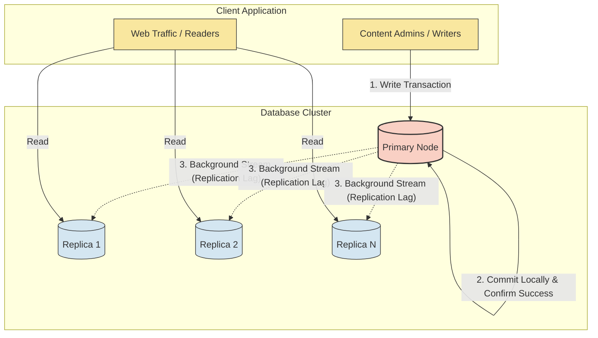
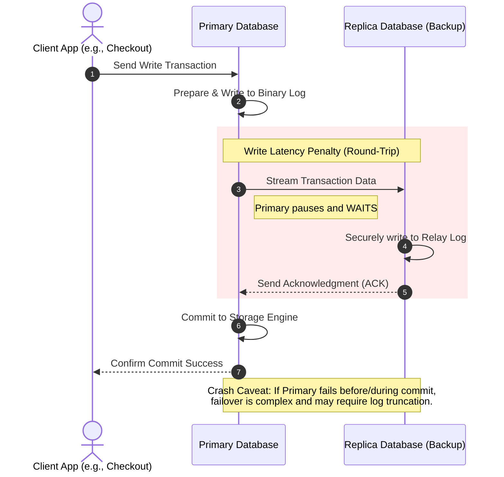
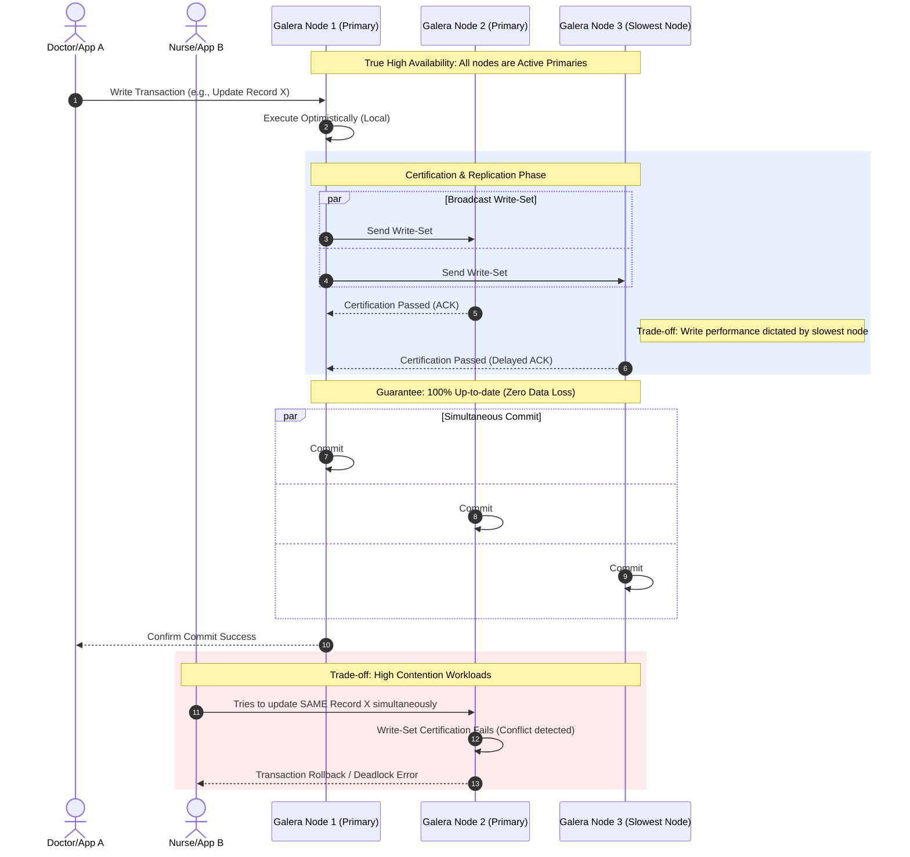
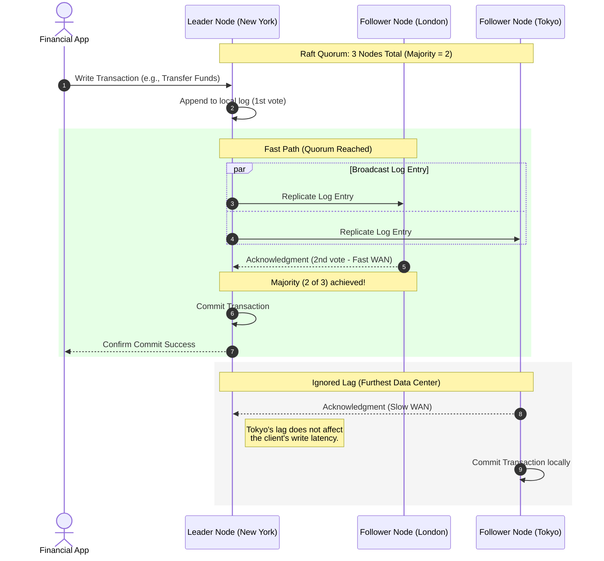

# Choosing a Replication Strategy

Choosing the right replication strategy in MariaDB is less about the underlying technology itself and more about which specific "pain point" your architecture needs to solve: preventing downtime, accelerating slow reads, securing data across distances, or aggregating data for analytics.

This guide helps you determine which replication method and format to choose for your cluster, and what trade-offs you will make.

## Overview of Replication Methods

Before mapping out specific use cases, it is important to understand the four primary replication protocols available in the MariaDB ecosystem:

### Asynchronous Replication (Primary-Replica)

The standard method where the primary node commits a transaction locally and streams it to replicas in the background. This method is ideal for read-heavy applications, such as a high-traffic news website where a single primary database handles content updates while multiple replicas serve read-only web traffic to millions of visitors.\
While a momentary delay before a new article appears on all servers is an acceptable trade-off for massive read scalability, this inherent replication lag means users might occasionally read stale data. Furthermore, if the primary server crashes before the background stream catches up, the most recent updates will be permanently lost.

### Semisynchronous Replication

A middle ground where the primary waits for at least one replica to acknowledge receipt of the data before confirming a commit. This setup is well-suited for systems like an e-commerce checkout spanning two nearby data centers, where ensuring at least one backup server has securely logged a transaction prevents a "lost order" if the primary loses power.

However, this increased data integrity comes with a strict write latency penalty while the primary waits for the round-trip acknowledgment from the replica. Additionally, if the primary crashes, failover can be complex and might still involve data loss or require truncating the binary log, depending on the server's specific wait configuration.

### Virtually Synchronous Replication (Galera Cluster)

A multi-primary solution where all active nodes must receive and accept a transaction before it commits, guaranteeing zero data loss and true high availability. This is the "gold standard" for environments like a critical healthcare records system hosted within a single enterprise data center, where every updated record is applied simultaneously across all nodes so users always see 100% up-to-date information.

The trade-off for this consistency is that write performance is entirely dictated by the slowest node in the cluster. Additionally, high-contention workloads with multiple clients writing to the same rows on different nodes can result in frequent transaction rollbacks or cluster deadlocks.

### Quorum Replication (MariaDB Enterprise Cluster)

A Raft-based solution that requires acknowledgment from a _majority_ of nodes (a quorum) rather than all of them, providing robust fault tolerance with faster write performance across wide-area networks.

For example, a globally distributed financial application spanning data centers in New York, London, and Tokyo only needs agreement from two of the three regions to commit data, keeping the application fast by effectively ignoring the network lag of the furthest data center.

### Replication Methods Comparison Matrix

| Replication Method      | Write Performance                         | Data Safety (Node Crash)                           | Automatic Failover                         | Ideal Architectural Fit                                          |
| ----------------------- | ----------------------------------------- | -------------------------------------------------- | ------------------------------------------ | ---------------------------------------------------------------- |
| Asynchronous            | Fastest (No waiting for replicas)         | High Risk (Potential data loss if primary crashes) | No (Requires external tools like MaxScale) | Read-heavy applications and distant Disaster Recovery.           |
| Semisynchronous         | Fast (Waits for only 1 replica)           | Low Risk (Data is backed up before commit)         | No (Requires external tools like MaxScale) | Environments needing strong data safety without full clustering. |
| Virtually Sync (Galera) | Slowest (Dictated by the slowest node)    | Zero Data Loss (All nodes are identical)           | Yes (Built-in cluster membership)          | Local High Availability (Single Data Center).                    |
| Quorum (Raft)           | Fast / Moderate(Dictated by the majority) | Zero Data Loss(Majority quorum agreed)             | Yes (Automated leader election)            | Geo-Distributed High Availability (Multi-Data Center).           |

## Choosing a Strategy by Use Case

Identify your primary architectural challenge below to discover the best-fit replication topology.

### High Availability (HA) & Fault Tolerance


Zero data loss and automatic failover. If one server dies, another takes over instantly without impacting the application.


* Galera Cluster (Virtually Synchronous): The "gold standard" for local high availability. It is a synchronous, multi-primary solution where every node has the exact same data at the same time.
  * _Trade-off:_ Write latency is dictated by the slowest node, as all active nodes must acknowledge the transaction.
* MariaDB Enterprise Cluster (Quorum/Raft): _(Enterprise Technical Preview)_ Designed for environments that need HA but cannot afford Galera's write latency. It requires acknowledgment from only a _majority_ (quorum) of nodes to commit a write, effectively ignoring network lag from the slowest data centers.
* Semisynchronous Replication: A middle ground where the primary server waits for at least one replica to acknowledge receipt of the data before confirming a "success" to the client. It prevents data loss during a crash without the full performance overhead of Galera.

### Read Scaling & Performance


The application has thousands of users browsing (reading) but only a few writing, and you need to offload the read workload to maintain performance.


* Primary-Replica (Asynchronous): One "Primary" handles all data changes, while changes are streamed in the background to multiple "Replicas" that handle the read queries. This offers the highest performance for scaling high-traffic apps.
  * Trade-off: You risk momentary replication lag and potential data loss if the primary crashes before streaming its latest updates.

### Geographic Distribution & Disaster Recovery


You need a "Plan B" in a different geographic region to survive a total data center outage, or you need a safeguard against catastrophic human error.


* Hybrid Replication (Geo-DR): Combines methods for the best of both worlds. A synchronous Galera Cluster is used locally for High Availability, while standard asynchronous replication streams data to a distant Disaster Recovery (DR) replica over a WAN.
* Delayed Replication (Human Error DR): A replica that intentionally stays a set amount of time (e.g., one hour) behind the primary. If a user accidentally runs a destructive command like `DROP TABLE`, you can recover the lost data from the delayed replica before the mistake replicates across your infrastructure.

### Data Aggregation & Analytics


To pull data from many different live production databases into one centralized location for reporting, without slowing down your production apps.


* Multi-Source Replication: One replica is configured to receive data streams from several different primary servers concurrently. This is perfect for populating a centralized Data Warehouse where you can run heavy analytical queries entirely isolated from your live production environments.

## The Role of MariaDB MaxScale

Managing replication topologies manually can be highly complex. MariaDB MaxScale is an advanced database proxy that sits between your application and your database cluster to automate traffic routing and failover across any replication method:

* In Asynchronous / Semisynchronous Setups: MaxScale acts as a traffic cop, automatically routing `SELECT`queries to your replicas and `INSERT`/`UPDATE` queries to your primary. If the primary fails, MaxScale can automatically promote a replica and reroute traffic without application downtime.
* In Galera Cluster Setups: MaxScale transparently masks node failures or evictions by routing traffic only to healthy nodes. It can also perform intelligent read/write splitting across the cluster to optimize overall throughput.
* In MariaDB Enterprise Cluster Setups: MaxScale automatically detects the current Raft leader to ensure writes are routed appropriately, while load balancing read queries across the follower nodes.


MaxScale is a commercial MariaDB Enterprise product, which should be factored into your architectural decision-making. For technical implementation details, refer to the MaxScale documentation.


### Quick Comparison Decision Matrix

| Architectural Goal          | Recommended Solution        | Consistency Type              | Key Trade-off / Benefit                                                   |
| --------------------------- | --------------------------- | ----------------------------- | ------------------------------------------------------------------------- |
| No Downtime (Local HA)      | Galera Cluster              | Synchronous                   | Guarantees zero data loss, but slower writes.                             |
| No Downtime (Geo HA)        | MariaDB Enterprise Cluster  | Quorum (Raft)                 | Faster writes across WAN, none                                            |
| Data Safety (Middle Ground) | Semisynchronous Replication | Semisynchronous               | Prevents data loss during crash, but introduces a slight latency penalty. |
| Read Scaling                | Primary-Replica + MaxScale  | Asynchronous                  | Maximum performance, but risks replication lag.                           |
| Disaster Recovery (WAN)     | Hybrid Replication          | Sync (Local) / Async (Remote) | Safely bridges data centers, but setup is complex.                        |
| Reporting / BI              | Multi-Source Replication    | Asynchronous                  | Safely aggregates data without impacting production.                      |
| Human Error Recovery        | Delayed Replication         | Asynchronous (Delayed)        | Saves against accidental `DROP TABLE`executions.                          |

## Choosing a Binary Log Format

Once you select your replication strategy, you must configure how data changes are recorded in the MariaDB binary log. For most high-availability architectures, Row-Based Replication (RBR) or Mixed Format is required to ensure absolute data consistency across replicas.

Statement-Based Replication (SBR) should generally be avoided in HA setups due to reliability concerns, acting only as a fallback for specific bulk-update operations.
