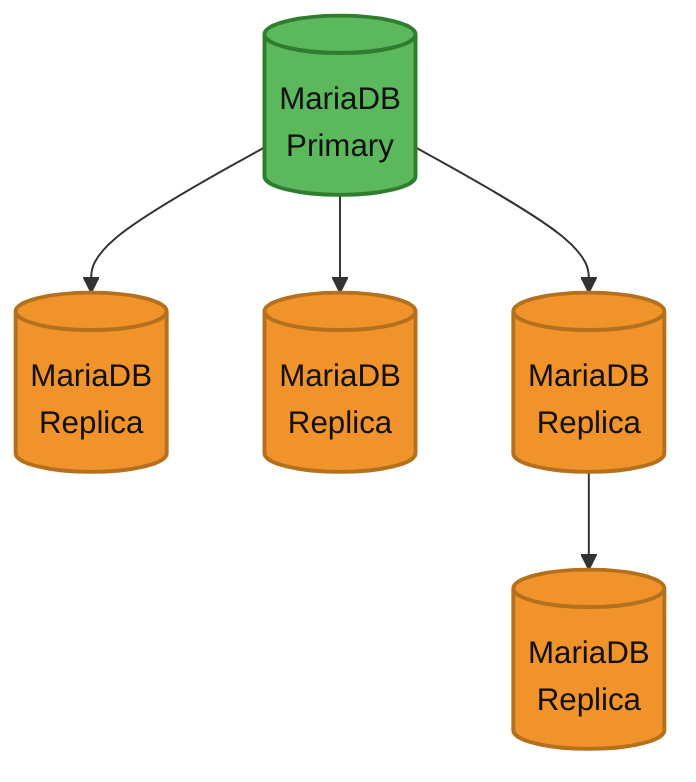
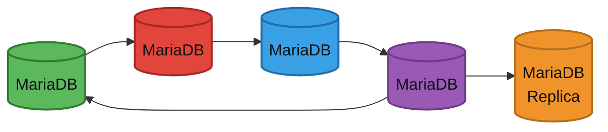
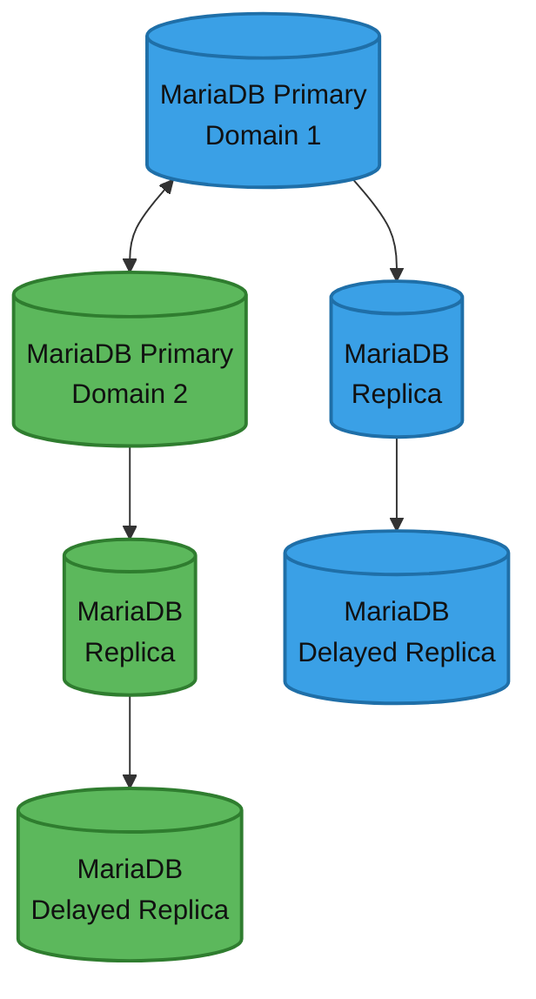
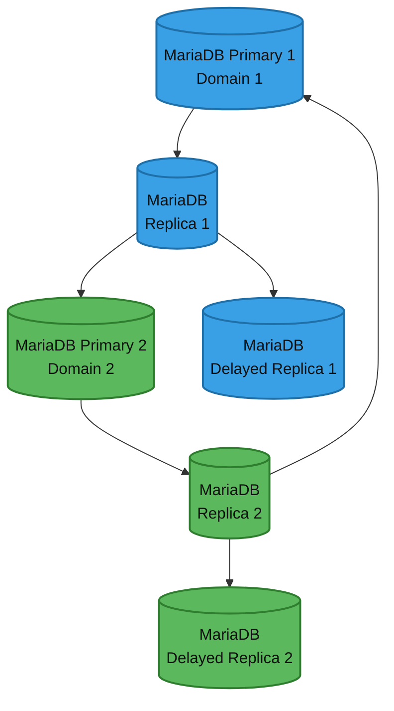
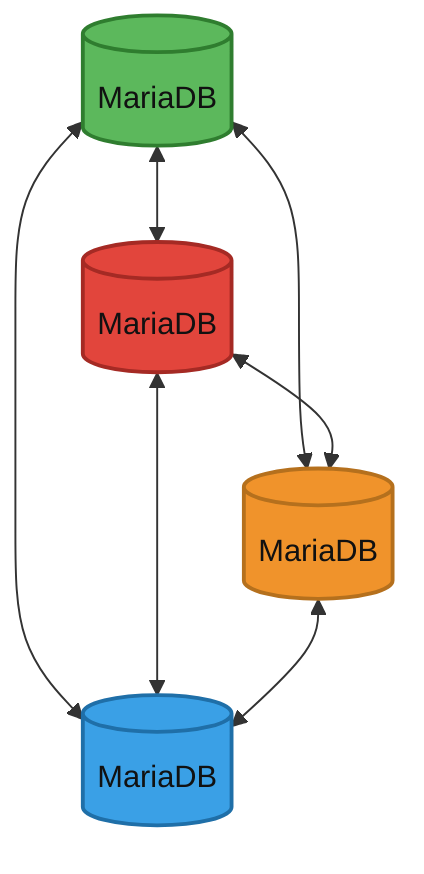
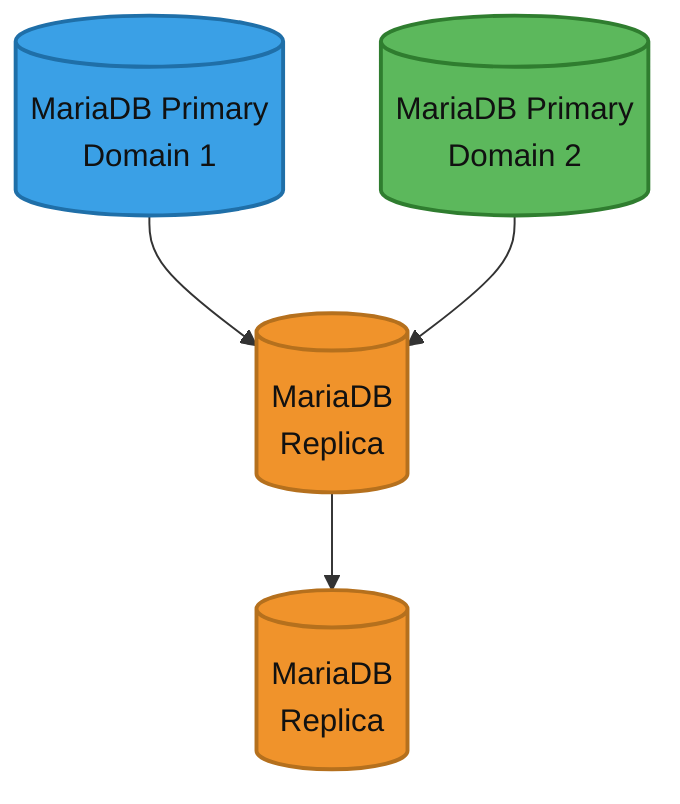

# Replication Overview


In MariaDB 11.8, the default character set and collation have changed. This has implications on replicating to older replicas, particularly replicas running MariaDB 10.6 or older.

See [this section](../../reference/data-types/string-data-types/character-sets/setting-character-sets-and-collations.md#default-character-set-and-collation-changes) for details, and how to configure MariaDB 11.8+ primaries to replicate to older replicas.


## Overview

Replication is a feature allowing the contents of one or more servers (called primaries) to be mirrored on one or more servers (called replicas).

You can exert control over which data to replicate. All databases, one or more databases, or tables within a database can each be selectively replicated.

The main mechanism used in replication is the [binary log](../../server-management/server-monitoring-logs/binary-log/). If binary logging is enabled, all updates to the database (data manipulation and data definition) are written into the binary log as binlog events. Replicas read the binary log from each primary in order to access the data to replicate. A [relay log](../../server-management/server-monitoring-logs/binary-log/relay-log.md) is created on the replica, using the same format as the binary log, and this is used to perform the replication. Old relay log files are removed when no longer needed.

A replica server keeps track of the position in the primary's binlog of the last event applied on the replica. This allows the replica server to re-connect and resume from where it left off after replication has been temporarily stopped. It also allows a replica to disconnect, be cloned and then have the new replica resume replication from the same primary.

Primaries and replicas do not need to be in constant communication with each other. It's quite possible to take servers offline or disconnect from the network, and when they come back, replication will continue where it left off.

## Replication Formats

There are three kinds of replication format – essentially, they're binary log formats, and therefore documented on this page: [Binary Log Formats](../../server-management/server-monitoring-logs/binary-log/binary-log-formats.md):

* Statement-based replication (SBR)
* Row-based replication (RBR)
* Mixed replication

## Replication Uses

Replication is used in a number of common scenarios. Uses include:

* Scalability. By having one or more replicas, reads can be spread over multiple servers, reducing the load on the primary. The most common scenario for a high-read, low-write environment is to have one primary, where all the writes occur, replicating to multiple replicas, which handle most of the reads.
* Data analysis. Analyzing data may have too much of an impact on a primary server, and this can similarly be handled on a replica, while the primary continues unaffected by the extra load.
* Backup assistance. [Backups](../../server-usage/backup-and-restore/) can more easily be run if a server is not actively changing the data. A common scenario is to replicate the data to a replica, which is then disconnected from the primary with the data in a stable state. Backup is then performed from this server. See [Replication as a Backup Solution](../../server-usage/backup-and-restore/replication-as-a-backup-solution.md).
* Distribution of data. Instead of being connected to a remote primary, it's possible to replicate the data locally and work from this data instead.

## Common Replication Setups

### Standard Replication

_Standard replication: one primary fans out to multiple replicas; a replica can chain to a further downstream replica._

* Provides infinite read scale out.
* Provides high-availability by upgrading replica to primary.
* [Setting up standard replication](setting-up-replication.md)

### Ring Replication

_Ring replication: each primary replicates to the next in a closed loop; here one node also feeds a replica._

* Provides read and write scaling.
* Doesn’t handle conflicts.
* If one primary fails, replication stops.
* [More about Multi-master ring replication](multi-master-ring-replication.md)

### Ring Replication with slaves

_Multi-master ring with replicas: two primaries replicate to each other; each also has a replica and a delayed replica._

* Provides read and write scaling.
* Doesn’t handle conflicts.
* If one primary fails, replication stops.
* [More about Multi-master ring replication](multi-master-ring-replication.md)

### Ring Replication with replication through slaves

_Multi-master ring relayed through replicas: each replica forwards to the other domain's primary, closing the ring._

* Provides read and write scaling.
* Doesn’t handle conflicts.
* If one primary fails, replication stops.
* [More about Multi-master ring replication](multi-master-ring-replication.md)

### Star Replication

_Star replication: every primary replicates with every other, so all nodes converge to the same data._

* Provides read and write scaling.
* Doesn’t handle conflicts.
* Have to use replication filters to avoid duplication of data.
* [MariaDB Galera Cluster](../../architecture/topologies/galera-cluster/README.md), which is a [virtually synchronous](https://app.gitbook.com/s/3VYeeVGUV4AMqrA3zwy7/readme/about-galera-replication) multi-primary (multi-master) cluster for MariaDB, has a similar configuration and can handle conflicts.

### Multi-Source Replication

_Multi-source replication: one replica pulls from two primaries on separate domains and applies them in parallel._

* Allows you to combine data from different sources.
* Different domains executed independently in parallel on all replicas.
* [More about Multi-Source replication](multi-source-replication.md)

## Cross-Version Replication Compatibility

The following table describes replication compatibility between different MariaDB Community Server versions. In general, the replica should be of the same or a later version than the primary. The constraint also applies to minor/patch releases:

| Replica ↓ / Primary → | [MariaDB 10.4](https://app.gitbook.com/s/aEnK0ZXmUbJzqQrTjFyb/community-server/old-releases/10.4/what-is-mariadb-104) | [MariaDB 10.5](https://app.gitbook.com/s/aEnK0ZXmUbJzqQrTjFyb/community-server/old-releases/10.5/what-is-mariadb-105) | [MariaDB 10.6](https://app.gitbook.com/s/aEnK0ZXmUbJzqQrTjFyb/community-server/10.6/what-is-mariadb-106) | [MariaDB 10.11](https://app.gitbook.com/s/aEnK0ZXmUbJzqQrTjFyb/community-server/10.11/what-is-mariadb-1011) | [MariaDB 11.4](https://app.gitbook.com/s/aEnK0ZXmUbJzqQrTjFyb/community-server/11.4/what-is-mariadb-114) | [MariaDB 11.8](https://app.gitbook.com/s/aEnK0ZXmUbJzqQrTjFyb/community-server/11.8/what-is-mariadb-118) | [MariaDB 12.3](https://app.gitbook.com/s/aEnK0ZXmUbJzqQrTjFyb/community-server/12.3/mariadb-12.3-changes-and-improvements) | [MariaDB 13.0](https://app.gitbook.com/s/aEnK0ZXmUbJzqQrTjFyb/community-server/13.0/mariadb-13.0-changes-and-improvements) |
| --- | --- | --- | --- | --- | --- | --- | --- | --- |
| [MariaDB 10.4](https://app.gitbook.com/s/aEnK0ZXmUbJzqQrTjFyb/community-server/old-releases/10.4/what-is-mariadb-104) | ✅ | ⛔ | ⛔ | ⛔ | ⛔ | ⛔ | ⛔ | ⛔ |
| [MariaDB 10.5](https://app.gitbook.com/s/aEnK0ZXmUbJzqQrTjFyb/community-server/old-releases/10.5/what-is-mariadb-105) | ✅ | ✅ | ⛔ | ⛔ | ⛔ | ⛔ | ⛔ | ⛔ |
| [MariaDB 10.6](https://app.gitbook.com/s/aEnK0ZXmUbJzqQrTjFyb/community-server/10.6/what-is-mariadb-106) | ✅ | ✅ | ✅ | ⛔ | ⛔ | ⛔ | ⛔ | ⛔ |
| [MariaDB 10.11](https://app.gitbook.com/s/aEnK0ZXmUbJzqQrTjFyb/community-server/10.11/what-is-mariadb-1011) | ✅ | ✅ | ✅ | ✅ | ⛔ | ⛔ | ⛔ | ⛔ |
| [MariaDB 11.4](https://app.gitbook.com/s/aEnK0ZXmUbJzqQrTjFyb/community-server/11.4/what-is-mariadb-114) | ✅ | ✅ | ✅ | ✅ | ✅ | ⛔ | ⛔ | ⛔ |
| [MariaDB 11.8](https://app.gitbook.com/s/aEnK0ZXmUbJzqQrTjFyb/community-server/11.8/what-is-mariadb-118) | ✅ | ✅ | ✅ | ✅ | ✅ | ✅ | ⛔ | ⛔ |
| [MariaDB 12.3](https://app.gitbook.com/s/aEnK0ZXmUbJzqQrTjFyb/community-server/12.3/mariadb-12.3-changes-and-improvements) | ✅ | ✅ | ✅ | ✅ | ✅ | ✅ | ✅ | ⛔ |
| [MariaDB 13.0](https://app.gitbook.com/s/aEnK0ZXmUbJzqQrTjFyb/community-server/13.0/mariadb-13.0-changes-and-improvements) | ✅ | ✅ | ✅ | ✅ | ✅ | ✅ | ✅ | ✅ |

* ✅: This combination is supported.
* ⛔: This combination is not supported.

Note: where it is not officially supported to replicate to a server with a lesser minor version, replication can still be safe for:

* DMLs logged in ROW binlog\_format, and
* DMLS logged in STATEMENT format and DDLs where neither use features that do not yet exist on the replica

provided the configurations for each server allow for consistent behavior in the execution of the events (i.e. the execution of the event should not be reliant on newer configuration variables, character sets/collations, etc, that don't exist on the replica). Additionally note, if binlog\_format=MIXED, it may be possible that the higher-versioned server (primary) may consider it safe to log a transaction using STATEMENT binlog format, while the older-versioned replica categorizes it as unsafe, which will result in an error while the replica tries to execute the transaction. See [this page](unsafe-statements-for-statement-based-replication.md#unsafe-statements) for more details on unsafe statements.

The table shows the general version constraint only; it does not mean that every listed combination is separately tested. Individual releases can introduce changes that affect replication — for example, new data types, changed defaults, or changes to how statements are written to the binary log. Before setting up replication between different versions, review the release notes (the "Changes & Improvements" page) for the versions involved. Any change that affects cross-version replication compatibility is called out there.


**MariaDB Enterprise Server:** The table above applies to MariaDB Community Server. MariaDB Enterprise Server releases are based on a Community Server version with additional backported features, so cross-version replication combinations are not separately tested for Enterprise Server. The same general rule applies — a replica should run the same or a later version than its primary — but before replicating between different Enterprise Server versions, or between Enterprise Server and Community Server, review the [MariaDB Enterprise Server release notes](https://app.gitbook.com/s/aEnK0ZXmUbJzqQrTjFyb/enterprise-server/all-releases) for the versions involved for any changes that affect replication.


For replication compatibility details between MariaDB and MySQL, see [MariaDB versus MySQL - Compatibility: Replication Compatibility](https://app.gitbook.com/s/aEnK0ZXmUbJzqQrTjFyb/community-server/about/compatibility-and-differences/mariadb-vs-mysql-compatibility#replication-compatibility).

## See Also

* [Setting Up Replication](setting-up-replication.md)
* [Replication Compatibility Between MariaDB and MySQL](https://app.gitbook.com/s/aEnK0ZXmUbJzqQrTjFyb/community-server/about/compatibility-and-differences/mariadb-vs-mysql-compatibility#replication-compatibility)
* [MariaDB Galera Cluster and M/S replication](https://www.youtube.com/watch?v=Nd0nvltLPdQ) (video)

_This page is licensed: CC BY-SA / Gnu FDL_


