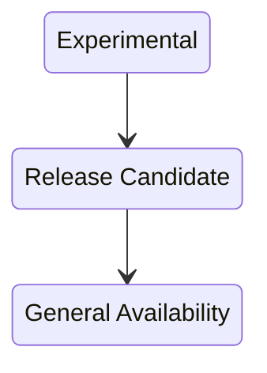
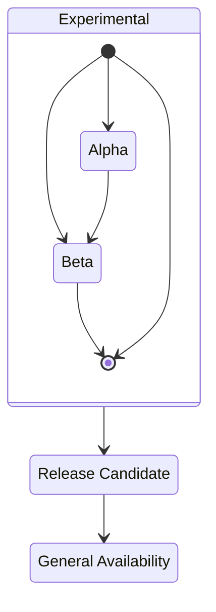

# Writing Plugins for MariaDB



## About

Generally speaking, writing plugins for MariaDB is very similar to writing plugins for MySQL.

## Authentication Plugins

See [Pluggable Authentication](../../plugins/authentication-plugins/pluggable-authentication-overview.md).

## Storage Engine Plugins

Storage engines can extend `CREATE TABLE` syntax with optional\
index, field, and table attribute clauses. See [Extending CREATE TABLE](storage-engines-storage-engine-development/engine-defined-new-tablefieldindex-attributes.md) for more information. See also [Storage Engine Development](storage-engines-storage-engine-development/).

## Information Schema Plugins

Information Schema plugins can have their own [FLUSH](../../sql-statements/administrative-sql-statements/flush-commands/flush.md) and [SHOW](../../sql-statements/administrative-sql-statements/show/) statements. See [FLUSH and SHOW for Information Schema plugins](information-schema-plugins-show-and-flush-statements.md).

## Encryption Plugins

[Encryption plugins](encryption-plugin-api.md) in MariaDB are used for the [data at rest encryption](../../../security/encryption/data-at-rest-encryption/) feature. They are responsible for both key management and for the actual encryption and decryption of data.

## Function Plugins

Function plugins add new SQL functions to MariaDB. Unlike the old [UDF API](../../../server-usage/user-defined-functions/), function plugins can do almost anything that a built-function can.

## Plugin Declaration Structure

The MariaDB plugin declaration differs from\
the MySQL plugin declaration in the following ways:

1. it has no useless 'reserved' field (the very last field in the MySQL plugin declaration)
2. it has a 'maturity' declaration
3. it has a field for a text representation of the version field

MariaDB can load plugins that only have the MySQL plugin declaration but both `PLUGIN_MATURITY` and `PLUGIN_AUTH_VERSION` will show up as 'Unknown' in the [INFORMATION\_SCHEMA.PLUGINS table](../../system-tables/information-schema/information-schema-tables/plugins-table-information-schema.md).

For compiled-in (not dynamically loaded) plugins, the presence of the MariaDB plugin declaration is mandatory.

### Example Plugin Declaration

The MariaDB plugin declaration looks like this:

```c
/* MariaDB plugin declaration */
maria_declare_plugin(example)
{
   MYSQL_STORAGE_ENGINE_PLUGIN, /* the plugin type (see include/mysql/plugin.h) */
   &example_storage_engine_info, /* pointer to type-specific plugin descriptor   */
   "EXAMPLEDB", /* plugin name */
   "John Smith",  /* plugin author */
   "Example of plugin interface", /* the plugin description */
   PLUGIN_LICENSE_GPL, /* the plugin license (see include/mysql/plugin.h) */
   example_init_func,   /* Pointer to plugin initialization function */
   example_deinit_func,  /* Pointer to plugin deinitialization function */
   0x0001 /* Numeric version 0xAABB means AA.BB version */,
   example_status_variables,  /* Status variables */
   example_system_variables,  /* System variables */
   "0.1 example",  /* String version representation */
   MariaDB_PLUGIN_MATURITY_EXPERIMENTAL /* Maturity (see include/mysql/plugin.h)*/
}
maria_declare_plugin_end;
```

## Maturity Guidelines For Plugins

The maturity level selection criteria differ based on how the plugin is released.

> [!NOTE]
> New features or sufficiently big code changes to a plugin should lead to:
> * an increase of the plugin version
> * knocking the maturity level down.

### Static plugins

Static plugins and other server features share the [server release cycle](https://mariadb.com/docs/release-notes/community-server/about/release-model).



* First, a plugin is experimental
* After at least 1.5 months of testing and bugfixing it is released as gamma (RC). This transition can take longer, in 3 month increments: 4.5 months, 7.5 months, etc. This goes on until the quality is deemed acceptable.
* After 3 more months of testing and bugfixing the plugin is released as stable (GA)

### Dynamic Plugins

Dynamic plugins released together with the server must follow a unified maturity criteria.
For plugins released separately this is a guideline.



* first a plugin is experimental
* after at least 1.5 months (or more, in 3 month increments, until the quality is deemed acceptable) it becomes gamma. Meanwhile it can transition through alpha and beta as the maintainer wants (e,g. it can start directly from beta)
* after at least 3 more months (or more, in 3 month increments) it becomes stable

<sub>_This page is licensed: CC BY-SA / Gnu FDL_</sub>


