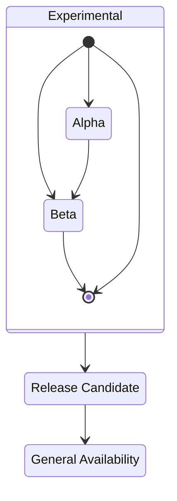

# Writing Plugins for MariaDB



## About

Generally speaking, writing plugins for MariaDB is very similar to writing plugins for MySQL.

## Authentication Plugins

See [Pluggable Authentication](../../plugins/authentication-plugins/pluggable-authentication-overview.md).

## Storage Engine Plugins

Storage engines can extend `CREATE TABLE` syntax with optional
index, field, and table attribute clauses. See [Extending CREATE TABLE](storage-engines-storage-engine-development/engine-defined-new-tablefieldindex-attributes.md) for more information. See also [Storage Engine Development](storage-engines-storage-engine-development/).

## Information Schema Plugins

Information Schema plugins can have their own [FLUSH](../../sql-statements/administrative-sql-statements/flush-commands/flush.md) and [SHOW](../../sql-statements/administrative-sql-statements/show/) statements. See [FLUSH and SHOW for Information Schema plugins](information-schema-plugins-show-and-flush-statements.md).

## Encryption Plugins

[Encryption plugins](encryption-plugin-api.md) in MariaDB are used for the [data at rest encryption](../../../security/encryption/data-at-rest-encryption/) feature. They are responsible for both key management and for the actual encryption and decryption of data.

## Function Plugins

Function plugins add new SQL functions to MariaDB. Unlike the old [UDF API](../../../server-usage/user-defined-functions/), a function plugin supplies a complete `Item` subclass — the same representation the server uses for its own native functions — so it defines its own return type, argument handling, and evaluation, and can do almost anything a built-in function can.

Several functions that look built-in are implemented this way, including `UUID()`, `UUID_V4()`, `UUID_V7()` and `SYS_GUID()`, the `INET_ATON()`, `INET6_NTOA()` and `IS_IPV4()` family, and `CURSOR_REF_COUNT()`.

### The Plugin Descriptor

The API is declared in `include/mysql/plugin_function.h`. The type-specific descriptor for a function plugin is a `Plugin_function` object wrapping a pointer to a `Create_func` builder:

```c
static Plugin_function
  plugin_descriptor_function_sysconst_test(&Create_func_sysconst_test::s_singleton);
```

The builder is what the parser calls to construct the function's `Item` each time the function appears in a statement.

### Function Names and Precedence

The plugin name **is** the SQL function name. When the parser meets a function name it does not recognize, it looks for a plugin of type `FUNCTION` registered under exactly that name. A plugin therefore provides exactly one SQL function; to add several functions, declare several plugins.

Built-in functions take precedence. The server searches its native function registry first and consults function plugins only when the name is not already taken, so a function plugin cannot override or replace a built-in function.

### Declaring the Plugin

Use the ordinary [plugin declaration](#plugin-declaration-structure), with `MariaDB_FUNCTION_PLUGIN` as the type and the `Plugin_function` descriptor as the info pointer:

```c
maria_declare_plugin(sysconst_test)
{
  MariaDB_FUNCTION_PLUGIN,                   // the plugin type
  &plugin_descriptor_function_sysconst_test, // type-specific descriptor
  "sysconst_test",                           // plugin name, and the SQL function name
  "MariaDB Corporation",                     // plugin author
  "Function SYSCONST_TEST()",                // the plugin description
  PLUGIN_LICENSE_GPL,                        // the plugin license
  0,                                         // pointer to plugin initialization function
  0,                                         // pointer to plugin deinitialization function
  0x0100,                                    // numeric version 0xAABB means AA.BB version
  NULL,                                      // status variables
  NULL,                                      // system variables
  "1.0",                                     // string version representation
  MariaDB_PLUGIN_MATURITY_EXPERIMENTAL       // maturity
}
maria_declare_plugin_end;
```

A complete worked example, covering both a function taking no arguments and functions taking arguments, is in the source tree at `plugin/func_test/plugin.cc`. It is built only as a test component, so it is not present in a normal server installation.

### Viewing Function Plugins

Function plugins appear in [SHOW PLUGINS](../../sql-statements/administrative-sql-statements/show/show-plugins.md) with a `Type` of `FUNCTION`, and the functions they provide are listed in the [Information Schema SQL\_FUNCTIONS table](../../system-tables/information-schema/information-schema-tables/information-schema-sql_functions-table.md) alongside built-in functions.

Function plugins are initialized early in server startup, before storage engine plugins.

## Plugin Declaration Structure

The MariaDB plugin declaration differs from
the MySQL plugin declaration in the following ways:

1. it has no useless 'reserved' field (the very last field in the MySQL plugin declaration)
2. it has a 'maturity' declaration
3. it has a field for a text representation of the version field

MariaDB can load plugins that only have the MySQL plugin declaration but both `PLUGIN_MATURITY` and `PLUGIN_AUTH_VERSION` will show up as 'Unknown' in the [INFORMATION\_SCHEMA.PLUGINS table](../../system-tables/information-schema/information-schema-tables/plugins-table-information-schema.md).

For compiled-in (not dynamically loaded) plugins, the presence of the MariaDB plugin declaration is mandatory.

### Example Plugin Declaration

The MariaDB plugin declaration looks like this:

```c
/* MariaDB plugin declaration */
maria_declare_plugin(example)
{
   MYSQL_STORAGE_ENGINE_PLUGIN, /* the plugin type (see include/mysql/plugin.h) */
   &example_storage_engine_info, /* pointer to type-specific plugin descriptor   */
   "EXAMPLEDB", /* plugin name */
   "John Smith",  /* plugin author */
   "Example of plugin interface", /* the plugin description */
   PLUGIN_LICENSE_GPL, /* the plugin license (see include/mysql/plugin.h) */
   example_init_func,   /* Pointer to plugin initialization function */
   example_deinit_func,  /* Pointer to plugin deinitialization function */
   0x0001 /* Numeric version 0xAABB means AA.BB version */,
   example_status_variables,  /* Status variables */
   example_system_variables,  /* System variables */
   "0.1 example",  /* String version representation */
   MariaDB_PLUGIN_MATURITY_EXPERIMENTAL /* Maturity (see include/mysql/plugin.h)*/
}
maria_declare_plugin_end;
```

## Maturity Guidelines For Plugins

### Plugin Maturity At a Glance


```mermaid
stateDiagram-v2
    state "Release Candidate" as RC
    state "General Availability" as GA
    state "Experimental" as Exp {
      [*] --> Alpha
      [*] --> Beta
      Alpha --> Beta
      Beta --> [*]
      [*] --> [*]
    }
    Exp --> RC
    RC --> GA
```

### Plugin Maturity Guidelines


New features or sufficiently big code changes to a plugin should lead to:

* an increase of the plugin version
* knocking the maturity level down.


* First a plugin is Alpha
* After at least 1.5 months (or more, in 3 month increments, until the quality is deemed acceptable) it becomes Gamma. Meanwhile it can transition through Beta as the maintainer wants (e,g. it can start directly from beta)
* After at least 3 more months (or more, in 3 month increments — depending on the bug inflow) it becomes Stable

If a plugin must be statically compiled into the server, it is a subject to an additional limitation — its maturity cannot be lower than the server's.

## Beta Plugins In GA Releases

If a plugin contribution is added directly at beta maturity to a GA release series, it will not be removed from that release series. However, we reserve the right to exclude a plugin from future release series if it is unmaintained (for example, if it stops receiving bug fixes).

<sub>_This page is licensed: CC BY-SA / Gnu FDL_</sub>


