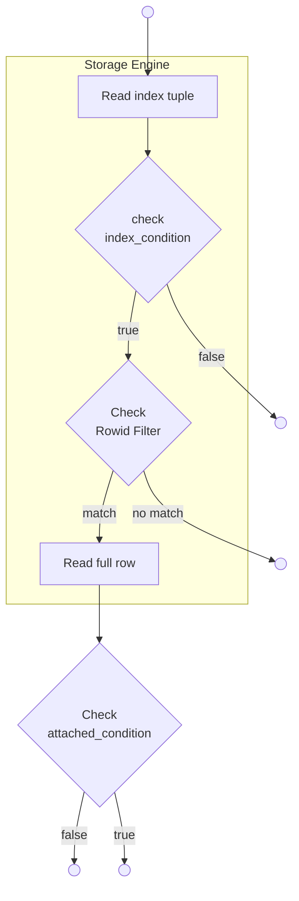
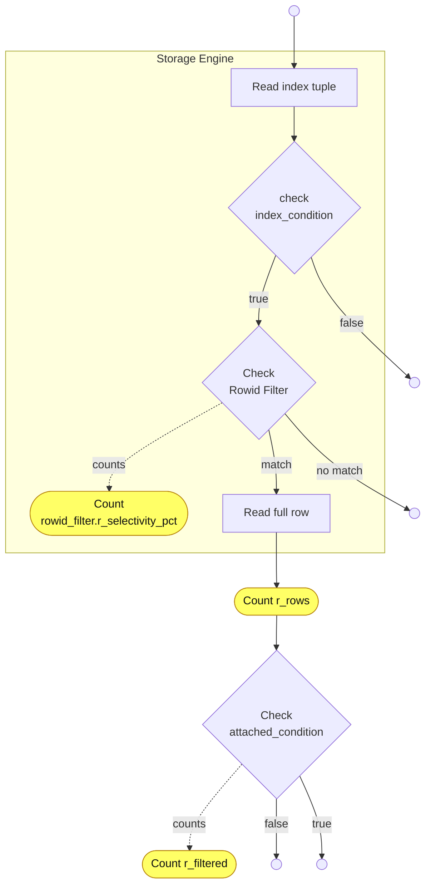
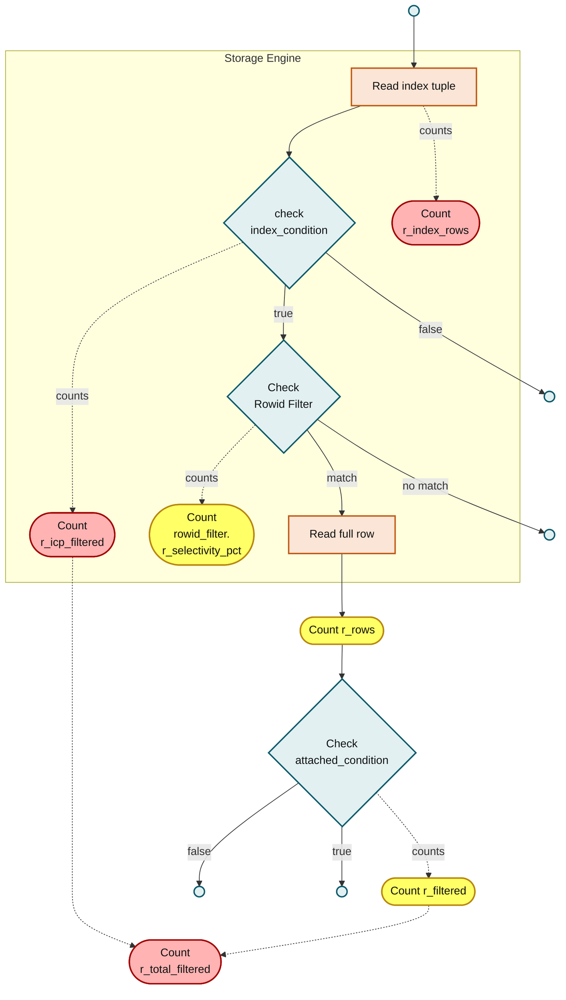

# ANALYZE: Interpreting rows and filtered members

This article describes how to interpret `r_rows` and `r_filtered` members in `ANALYZE FORMAT=JSON` when an index-based access method is used.

## Index-based access method

Index-based access method may employ some or all of the following:

* [Index Condition Pushdown](../../../../ha-and-performance/optimization-and-tuning/query-optimizations/index-condition-pushdown.md)
* [Rowid Filtering](../../../../ha-and-performance/optimization-and-tuning/query-optimizations/rowid-filtering-optimization.md)
* attached\_condition checking

Consider a table access which does all three:

```json
"table": {
    "table_name": "t1",
    "access_type": "range",
    "possible_keys": ...,
    "key": "INDEX1",
    ...
    "rowid_filter": {
      ...
      "r_selectivity_pct": n.nnn,
    },
    ...
    "rows": 123,
    "r_rows": 125,
    ...
    "filtered": 8.476269722,
    "r_filtered": 100,
    "index_condition": "cond1",
    "attached_condition": "cond2"
  }
```

The access is performed as follows:

### Access diagram



_The storage engine applies Index Condition Pushdown and the Rowid Filter internally; the server checks `attached_condition` afterwards, outside the storage engine._

## Statistics values in MariaDB before 11.5

In MariaDB versions before 11.5, the counters were counted as follows:



_Before MariaDB 11.5, `r_rows` is counted after the index and Rowid Filter checks, while `r_filtered` counts only the `attached_condition` selectivity._

that is,

* `r_rows` is counted after Index Condition Pushdown check and Rowid Filter check.
* `r_filtered` only counts selectivity of the `attached_condition`.
* selectivity of the Rowid Filter is in `rowid_filter.r_selectivity_pct`.

## Statistics values in [MariaDB 11.5](https://app.gitbook.com/s/aEnK0ZXmUbJzqQrTjFyb/community-server/old-releases/11.5/what-is-mariadb-115) and later versions

Starting from [MariaDB 11.5](https://app.gitbook.com/s/aEnK0ZXmUbJzqQrTjFyb/community-server/old-releases/11.5/what-is-mariadb-115) ([MDEV-18478](https://jira.mariadb.org/browse/MDEV-18478)), the row counters are:

* `r_index_rows` counts the number of enumerated index tuples, before any checks are made
* `r_rows` is the same as before - number of rows after index checks.

The selectivity counters are:

* `r_icp_filtered` is the percentage of records left after pushed index condition check.
* `rowid_filter.r_selectivity_pct` shows selectivity of Rowid Filter, as before.
* `r_filtered` is the selectivity of `attached_condition` check, as before.
* `r_total_filtered` is the combined selectivity of all checks.



_MariaDB 11.5 and later add `r_index_rows`, `r_icp_filtered`, and `r_total_filtered` (highlighted in red) alongside the existing `rowid_filter.r_selectivity_pct`, `r_rows`, and `r_filtered` counters (highlighted in yellow)._

### ANALYZE output members

in ANALYZE FORMAT=JSON output these members are placed as follows:

```json
"table": {
    "table_name": ...,

    "rows": 426,
    "r_index_rows": 349,
    "r_rows": 34,
```

Whenever applicable, `r_index_rows` is shown. It is comparable with `rows` - both are numbers of rows to enumerate before any filtering is done.\
If `r_index_rows` is not shown, `r_rows` shows the number of records enumerated.

Then, filtering members:

```json
...
    "filtered": 8.476269722,
    "r_total_filtered": 9.742120344,
```

`filtered` is comparable with `r_total_filtered`: both show total amount of filtering.

```json
...
    "index_condition": "lineitem.l_quantity > 47",
    "r_icp_filtered": 100,
```

ICP and its observed filtering. The optimizer doesn't compute an estimate for this currently.

```json
...
    "attached_condition": "lineitem.l_shipDATE between '1997-01-01' and '1997-06-30'",
    "r_filtered": 100
```

`attached_condition` and its observed filtering.

<sub>_This page is licensed: CC BY-SA / Gnu FDL_</sub>


