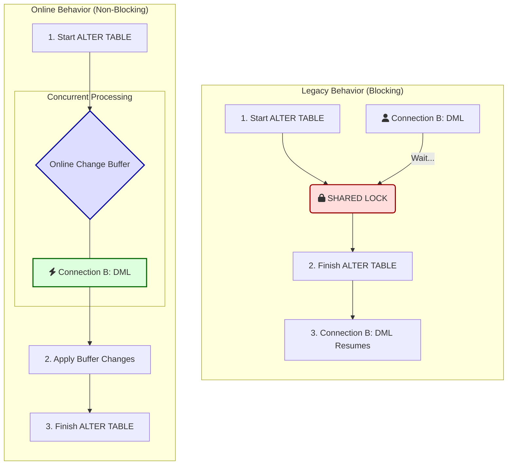

# Online Schema Change


This functionality is available from MariaDB 11.4.


The term _Online Schema Change_ refers to the ability to update the table schema without blocking concurrent DML[^1] statements for the duration of the schema change.

## Example

Starting with a table named `item` which has 2 columns (`id SERIAL`, `name TEXT`), we add a new `TIMESTAMP` column. While the change is performed, a concurrent connection inserts a new row.

#### Connection 1:

```sql
ALTER TABLE items ADD ts TIMESTAMP DEFAULT CURRENT_TIMESTAMP;
```

#### Connection 2:

```sql
INSERT INTO items(name) VALUES (“New item”);
```

### Previous Behavior

If the `INSERT` statement starts after the `ALTER TABLE` statement, it is not blocked, but proceeds normally, and may finish before the `ALTER TABLE` statement.

`ALTER TABLE` always allows concurrent [SELECT](../../../data-manipulation/selecting-data/select.md) statements. If the `LOCK=NONE` locking strategy is chosen, it allows concurrent modifications via DML[^1] statements like `INSERT`, `DELETE`, or `UPDATE`. `LOCK=NONE` is supported by the InnoDB and the Partition engine when `ALGORITHM=NOCOPY` is chosen, and is a default locking strategy when available.



### New Behavior

* From MariaDB 11.2, ALTER TABLE is universally online.
* In most cases, unless explicitly specified otherwise, `ALTER TABLE` implicitly operates as if `ALGORITHM=COPY, LOCK=NONE` is set.
* This means it uses the `COPY` algorithm while simultaneously allowing concurrent DML statements on the altered table.
* A few exceptions to this rule are described under [Limitations](online-schema-change.md#limitations).

## Mechanism

`LOCK=NONE` adds one extra step to the copy algorithm. It introduces a new internal entity, the **online change buffer**.

<figure><figcaption></figcaption></figure>

The online change buffer works like this:

1. A new table is created using the old table content as it was like at the beginning of the `ALTER TABLE` statement. For InnoDB and other transactional engines, this means copying in `REPEATABLE READ` isolation mode.&#x20;
2. In the meantime, every concurrent change is written in the old table and is duplicated to the online change buffer.
3. `ALTER TABLE` applies any accumulated changes to the online change buffer.


While all copying and online changes application happens without blocking concurrent `DML`, `ALTER TABLE` acquires an `EXCLUSIVE` lock on the table for a short amount of time, which is necessary to synchronize with all parallel operations that have not yet finished.


### Online Change Buffer Details

* Storage and Scope: Despite the name, the buffer is not purely in-memory; it is implemented as a temporary file on the filesystem using MariaDB's `create_temp_file` function. It is created on a per-table basis, rather than globally or per-session. The file is typically stored in the directory defined by the `TMPDIR` environment variable, or the OS default temporary path (like `GetTempPath` on Windows).
* Size Limits: The online schema change re-uses the temporary buffer mechanism used in the binlog for transaction/statement caches. There is currently no way to explicitly limit its maximum size via a system variable; it is only bounded by available disk space and OS-specific limits, such as a 4GB limit on a 32-bit machine.
* Disk Full Risks: Because there is no explicit size limit, heavy concurrent DML during a long schema change can fill up the disk hosting the temporary directory. This behaves similarly to a sort buffer for unindexed `SELECT`statements causing a disk full event, which could hang operations.
* Crash Behavior: If the server crashes during the `ALTER` statement, no manual cleanup is required. The temporary files are created with OS-level ephemeral flags (like `O_TMPFILE` on supported Linux systems or `O_TEMPORARY | O_SHORT_LIVED` on Windows) or are unlinked immediately upon creation. This ensures the operating system automatically reclaims the file space.

## Monitoring and Troubleshooting

* Currently, MariaDB does not provide a native mechanism to monitor or troubleshoot the online change buffer.
* There are no specific `STATUS` variables available to track the size or usage of this buffer.
* Furthermore, there are no corresponding tables in the `information_schema` or `performance_schema` to collect this data from a running server.
* Administrators must proactively monitor the available disk space of the filesystem hosting the temporary directory (`tmpdir`) during large `ALTER TABLE` operations to prevent disk exhaustion.

## Supported Storage Engines

For the new behavior to work, engines must allow concurrent writes, while other connections can read and have a repeatable-read behavior.

### MyISAM and Aria

MyISAM is capable of concurrent [INSERTs ](../../../data-manipulation/inserting-loading-data/insert.md)and also supports concurrent inserts while reading. It doesn't support a [REPEATABLE READ](../../../transactions/transactions-repeatable-read.md) transaction isolation layer, but newly inserted data isn't visible to other (reading) clients until the end of the statement. Therefore, MyISAM and Aria satisfy the criterion, even though those engines aren't transactional.

Statements that update or delete rows are blocked until the end of `ALTER TABLE` (or evaluate before `ALTER TABLE` acquires a lock, if it started earlier).

### InnoDB

InnoDB supports `REPEATABLE READ` isolation layer and allows concurrent writes, which means online schema change works, greatly improving its online ability represented by `INPLACE` and `INSTANT` algorithms. By default, an engine-native algorithm is chosen whenever possible. If InnoDB isn't capable of holding the schema change natively, a `COPY` algorithm using online schema change is applied. This is described in detail [here](online-schema-change.md#comparison-to-innodbs-inplace-capabilities).

### Other Storage Engines

Many other storage engines do not support online schema change, for a variety of reasons:

* [ColumnStore](https://app.gitbook.com/s/rBEU9juWLfTDcdwF3Q14/mariadb-columnstore) does not support `REPEATABLE READ` isolation layer.
* [Blackhole](../../../../../server-usage/storage-engines/blackhole.md) and [Sequence](../../../../../server-usage/storage-engines/sequence-storage-engine.md) don't support `LOCK=NONE` , or are read-only, like [S3](../../../../../server-usage/storage-engines/s3-storage-engine/).
* [Connect](../../../../../server-usage/storage-engines/connect/) cannot perform reads during write operations.
* [Spider](../../../../../server-usage/storage-engines/spider/) does not perform table-copy operations, but rather reassigns a table with a new set of metadata.

## Online Schema Change vs. InnoDB INPLACE

Everything that can be done by InnoDB’s `INPLACE` can also be done by online `COPY`. However, tables with foreign keys with cascade operations are not supported (see [Limitations](online-schema-change.md#limitations)).

* Changing the column’s data type is possible.
* A column can be modified to `NOT NULL`.
* A column with non-constant `DEFAULT` value can be added.
* A `STORED` generated column can be added.
* A `CHECK` constraint can be added.
* A `PRIMARY KEY` can be dropped.
* No key is required in the resulting table.
* A table can be changed to be partitioned, and partitioning can be removed.
* `SYSTEM VERSIONING` can be added.
* `AUTO_INCREMENT` can be added to the existing column (however, see [Limitations](online-schema-change.md#limitations)).

## Limitations

The following limitations apply:

* [AUTO\_INCREMENT](../../../../data-types/auto_increment.md) columns cannot be _added_, neither can `DEFAULT (…NEXTVAL(…))`. Changing an existing column to `AUTO_INCREMENT` is allowed, though. The two following conditions should be met:
  * The column must be `NOT NULL` in the old schema.
  * The `NO_AUTO_VALUE_ON_ZERO` mode must be unset.
  * At least one `UNIQUE NOT NULL` key must be in the old schema, and remain unchanged.
* `ALTER IGNORE TABLE` is not implemented. This operation can make the altered table have fewer rows than the original one (because duplicates are skipped), and the online copy algorithm doesn’t support operations that change the number of rows in the table.
* `ALTER TABLE DROP SYSTEM VERSIONING` is not supported either, for the same reason.
* Tables with foreign keys with `CASCADE/SET NULL/SET DEFAULT` operations can’t go online under `ALGORITHM=COPY` — similar to disallowing `CHECK` constraints and stored generated columns, cascade operations are done internally by the storage engine, so they bypass the online changes buffer. However, most operations are allowed by the InnoDB `INPLACE` algorithm. For each DDL[^2] request, the most optimal algorithm is chosen automatically.
* Transaction-versioned tables can only be changed under `INPLACE/INSTANT ALTER TABLE` algorithms.
* All the constraints (`CHECK, UNIQUE, FOREIGN KEY`) are evaluated for each row change that is applied from the online change buffer. This means that changes that are made during `ALTER TABLE’s` main phase must not violate the final table schema at any point in time. Checks can be disabled by setting `check_constraint_checks` and `FOREIGN_KEY_CHECKS` to `OFF`.
* `ALTER TABLE … ORDER BY` isn't supported because changes from the buffer are applied at the end, which might break the strict ordering of rows.
* Online schema change isn't available in embedded MariaDB Server due to replication libraries that are not present in that variant.

### Switching Back



Online copy is the default mode whenever `NOCOPY` does not apply. In case of any problem with it, it can be disabled by specifying `LOCK=SHARED` to force the usual `COPY` algorithm.

Additionally, to better support existing workflows, there is a new `old_mode` flag. The following statement disables online copy by default:

```sql
SET old_mode= LOCK_ALTER_TABLE_COPY;
```

With that mode enabled, you can still use the new behavior, by explicitly specifying `LOCK=NONE` in the `ALTER TABLE` statement.

Server-wide online schema change expands MariaDB Server’s capability for the `LOCK=NONE` approach broadly.



Online copy is **not** the default mode.



## See Also

For more information, read this blog post: [Reduced operational downtime with new ALTER TABLE](https://mariadb.com/resources/blog/reduced-operational-downtime-with-new-alter-table-features/)

[^1]: Data Modification Language, a part of the SQL language.

[^2]: Data Definition Language, a part of the SQL language.
