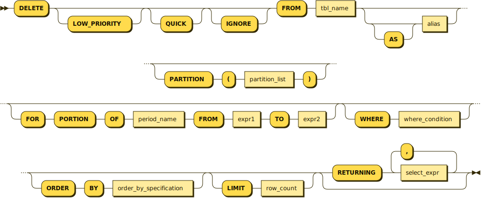

# DELETE

## Syntax


For the CTE[^1] syntax, available from MariaDB 12.3, see [here](delete.md#cte-syntax).


Single-table syntax:

```bnf
DELETE [LOW_PRIORITY] [QUICK] [IGNORE] 
  FROM tbl_name [PARTITION (partition_list)]
  [FOR PORTION OF PERIOD FROM expr1 TO expr2]
  [AS alias]                    -- from MariaDB 11.6
  [{USE|FORCE|IGNORE} {INDEX|KEY}
    [FOR {JOIN|ORDER BY|GROUP BY}]
    (index_list)]               -- from MariaDB 11.8.1
  [WHERE where_condition]
  [ORDER BY ...]
  [LIMIT row_count]
  [RETURNING select_expr 
    [, select_expr ...]]
```



The `AS alias` clause is available from MariaDB 11.6. `order_by_specification` stands in for the abbreviated `ORDER BY ...` in the source BNF; see [ORDER BY](../selecting-data/order-by.md) for its full form.

Multiple-table syntax:

```sql
DELETE [LOW_PRIORITY] [QUICK] [IGNORE]
    tbl_name[.*] [, tbl_name[.*]] ...
    FROM table_references
    [WHERE where_condition]
    [ORDER BY ...]              -- from MariaDB 11.8.1
    [LIMIT row_count]          -- from MariaDB 11.8.1
```

Or:

```sql
DELETE [LOW_PRIORITY] [QUICK] [IGNORE]
    FROM tbl_name[.*] [, tbl_name[.*]] ...
    USING table_references
    [WHERE where_condition]
    [ORDER BY ...]              -- from MariaDB 11.8.1
    [LIMIT row_count]          -- from MariaDB 11.8.1
```

Trimming history:

```sql
DELETE HISTORY
  FROM tbl_name [PARTITION (partition_list)]
  [BEFORE SYSTEM_TIME [TIMESTAMP|TRANSACTION] expression]
```

### CTE Syntax


This syntax is available from MariaDB 12.3.


```sql
WITH [RECURSIVE] table_reference [(columns_list)] AS  (
  SELECT ...
)
DELETE FROM non_cte_table expression
```

* `non_cte_table` is a table not defined by a CTE (common table expression).
* `expression` is a `WHERE` clause or a `USING`/`WHERE` clause.
* Supporting CTEs with `DELETE` is an extension of the SQL standard, similar to how MySQL does it.
* With `DELETE`, CTEs are read-only, like other derived tables – you cannot delete rows from tables in the CTE expression.
* For use cases, see the CTE examples.

## Description

| Option        | Description                                                                                                                                                                                                                                                                                                                                                                                                                                                                                             |
| ------------- | ------------------------------------------------------------------------------------------------------------------------------------------------------------------------------------------------------------------------------------------------------------------------------------------------------------------------------------------------------------------------------------------------------------------------------------------------------------------------------------------------------- |
| LOW\_PRIORITY | Wait until all `SELECT` statement are done before starting the statement. Used with storage engines that uses table locking (MyISAM, Aria etc). See [HIGH\_PRIORITY and LOW\_PRIORITY clauses](high_priority-and-low_priority.md) for details.                                                                                                                                                                                                                                                          |
| QUICK         | Signal the storage engine that it should expect that a lot of rows are deleted. The storage engine can do things to speed up the `DELETE` like ignoring merging of data blocks until all rows are deleted from the block (instead of when a block is half full). This speeds up things at the expanse of lost space in data blocks. At least [MyISAM](../../../../server-usage/storage-engines/myisam-storage-engine/) and [Aria](../../../../server-usage/storage-engines/aria/) support this feature. |
| IGNORE        | Don't stop the query even if a not-critical error occurs (like data overflow). See [How IGNORE works](../inserting-loading-data/ignore.md) for a full description.                                                                                                                                                                                                                                                                                                                                      |

For the single-table syntax, the `DELETE` statement deletes rows from tbl\_name and returns a count of the number of deleted rows. This count can be obtained by calling the [ROW\_COUNT()](../../../sql-functions/secondary-functions/information-functions/row_count.md) function. The`WHERE` clause, if given, specifies the conditions that identify which rows to delete. With no `WHERE` clause, all rows are deleted. If the [ORDER BY](../selecting-data/order-by.md) clause is specified, the rows are deleted in the order that is specified. The [LIMIT](../selecting-data/limit.md) clause places a limit on the number of rows that can be deleted.

For the multiple-table syntax, `DELETE` deletes from each `tbl_name` the rows that satisfy the conditions. From MariaDB 11.8.1, the multiple-table syntax also accepts [ORDER BY](../selecting-data/order-by.md) and [LIMIT](../selecting-data/limit.md); in earlier releases, these clauses could not be used with multiple-table `DELETE`. A `DELETE` can also reference tables which are located in different databases; see [Identifier Qualifiers](../../../sql-structure/sql-language-structure/identifier-qualifiers.md) for the syntax.

From MariaDB 11.8.1, single-table `DELETE` accepts index hints (`USE INDEX`, `FORCE INDEX`, and `IGNORE INDEX`) to influence which index the optimizer uses, with the same syntax as in [SELECT](../selecting-data/select.md). See [Index Hints: How to Force Query Plans](../../../../ha-and-performance/optimization-and-tuning/query-optimizations/index-hints-how-to-force-query-plans.md).

`where_condition` is an expression that evaluates to true for each row to be deleted. It is specified as described in [SELECT](../selecting-data/select.md).

You need the `DELETE` privilege on a table to delete rows from it. You need only the `SELECT` privilege for any columns that are only read, such as those named in the `WHERE` clause. See [GRANT](../../account-management-sql-statements/grant.md).

As stated, a `DELETE` statement with no `WHERE` clause deletes all rows. A faster way to do this, when you do not need to know the number of deleted rows, is to use `TRUNCATE TABLE`. However, within a transaction or if you have a lock on the table,`TRUNCATE TABLE` cannot be used whereas `DELETE` can. See [TRUNCATE TABLE](../../table-statements/truncate-table.md), and [LOCK](../../transactions/lock-tables.md).

### AS



Single-table `DELETE` statements support aliases. For example:

```sql
CREATE TABLE t1 (c1 INT);
INSERT INTO t1 VALUES (1), (2);

DELETE FROM t1 AS a1 WHERE a1.c1 = 2;
```



Single-table `DELETE` statements do **not** support aliases.



### PARTITION

See [Partition Pruning and Selection](../../../../server-usage/partitioning-tables/partition-pruning-and-selection.md) for details.

### FOR PORTION OF

See [Application Time Periods - Deletion by Portion](../../../sql-structure/temporal-tables/application-time-periods.md#deletion-by-portion).

### RETURNING

It is possible to return a result set of the deleted rows for a single table to the client by using the syntax `DELETE ... RETURNING select_expr [, select_expr2 ...]]`

Any of SQL expression that can be calculated from a single row fields is allowed. Subqueries are allowed. The AS keyword is allowed, so it is possible to use aliases.

The use of aggregate functions is not allowed. `RETURNING` cannot be used in multi-table `DELETE` statements.

### Same Source and Target Table

It is possible to delete from a table with the same source and target. For example:

```sql
DELETE FROM t1 WHERE c1 IN (SELECT b.c1 FROM t1 b WHERE b.c2=0);
```

### DELETE HISTORY

You can use `DELETE HISTORY` to delete historical information from [System-versioned tables](../../../sql-structure/temporal-tables/system-versioned-tables.md).

## Examples

### ORDER BY and LIMIT

How to use the [ORDER BY](../selecting-data/order-by.md) and [LIMIT](../selecting-data/limit.md) clauses:

```sql
DELETE FROM page_hit ORDER BY TIMESTAMP LIMIT 1000000;
```

From MariaDB 11.8.1, `ORDER BY` and `LIMIT` can also be used with the multiple-table syntax:

```sql
DELETE t1.*, t2.* FROM t1, t2 ORDER BY t1.id DESC LIMIT 3;
```

How to use the `RETURNING` clause:

```sql
DELETE FROM t RETURNING f1;
+------+
| f1   |
+------+
|    5 |
|   50 |
|  500 |
+------+
```

The following statement joins two tables: one is only used to satisfy a `WHERE` condition, but no row is deleted from it; rows from the other table are deleted, instead.

```sql
DELETE post FROM blog INNER JOIN post WHERE blog.id = post.blog_id;
```

### Deleting from the Same Source and Target

```sql
CREATE TABLE t1 (c1 INT, c2 INT);
DELETE FROM t1 WHERE c1 IN (SELECT b.c1 FROM t1 b WHERE b.c2=0);
```

The statement returns:

```
Query OK, 0 rows affected (0.00 sec)
```

### CTE Single-Table

```sql
WITH cte1 AS (SELECT * FROM t1 WHERE c < 5),
     cte2 AS (SELECT * FROM t2 WHERE b < 5)
     DELETE FROM t3 WHERE t3.a = (SELECT a FROM cte1 WHERE b IN (SELECT b FROM cte2));
```

### CTE Multi-Table

```sql
WITH cte1 AS (SELECT * FROM t1 WHERE c < 5),
     cte2 AS (SELECT * FROM t2 WHERE b < 5)
     DELETE FROM t3 USING t3, cte1 WHERE t3.a = cte1.a AND cte1.b IN (SELECT b FROM cte2);
```

```sql
WITH cte1 AS (SELECT * FROM t1 WHERE c < 5),
     cte2 AS (SELECT * FROM t2 WHERE b < 5)
     DELETE FROM t3 USING t3, cte1, cte2 WHERE cte1.a AND cte1.b = cte2.b;
```

## See Also

* [How IGNORE works](../inserting-loading-data/ignore.md)
* [SELECT](../selecting-data/select.md)
* [ORDER BY](../selecting-data/order-by.md)
* [LIMIT](../selecting-data/limit.md)
* [REPLACE ... RETURNING](replacereturning.md)
* [INSERT ... RETURNING](../inserting-loading-data/insertreturning.md)
* [Returning clause](https://www.youtube.com/watch?v=n-LTdEBeAT4) (video)

<sub>_This page is licensed: GPLv2, originally from_</sub> [<sub>_fill\_help\_tables.sql_</sub>](https://github.com/MariaDB/server/blob/main/scripts/fill_help_tables.sql)



[^1]: CTE (Common Table Expression): A temporary, named result set that exists only for the duration of a single `SELECT`, `INSERT`, `UPDATE`, or `DELETE` statement, used to make complex queries more readable.
