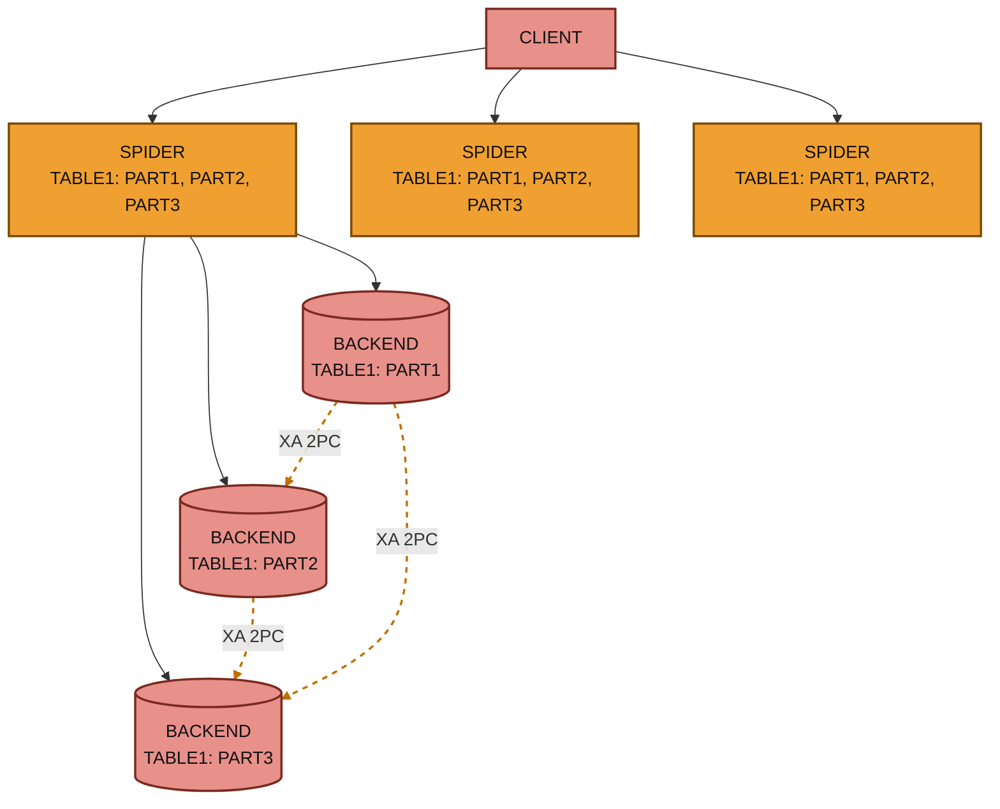
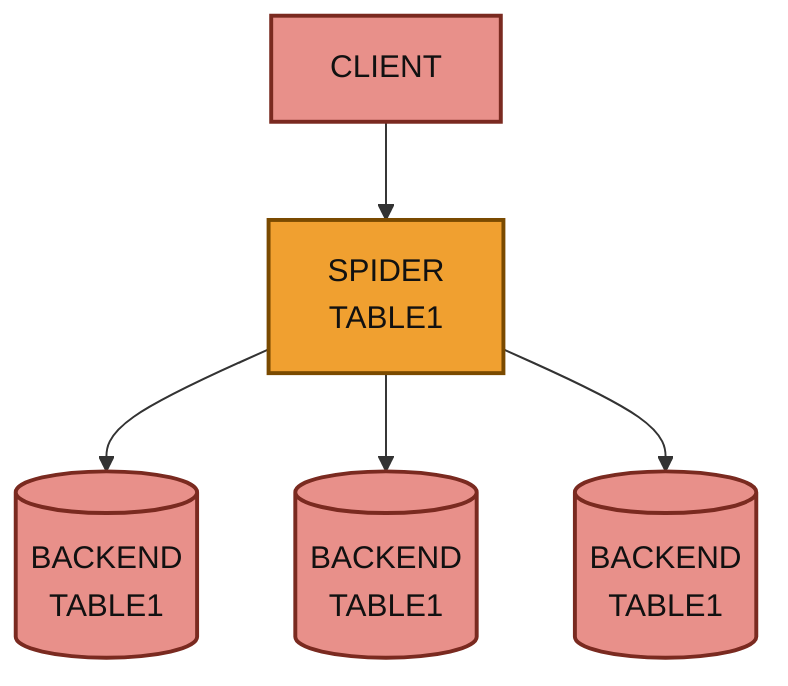

# Spider Benchmarks

This is best run on a cluster of 3 nodes intel NUC servers 12 virtual cores model name : Intel® Core(TM) i3-3217U CPU @ 1.80GHz

All nodes have been running a mysqlslap client attached to the local spider node in the best run.

```
/usr/local/skysql/mysql-client/bin/mysqlslap --user=skysql --password=skyvodka --host=192.168.0.201 --port=5012 -i1000000 -c32 -q "insert into test(c) values('0-31091-138522330')" --create-schema=test
```

`spider_conn_recycle_mode=1;`



_Spider sharding architecture: three Spider nodes route to three backend shards, each holding one partition of TABLE1, coordinated across backends by XA two-phase commit._

The read point select is produce with a 10M rows sysbench table



_Single Spider node distributing client queries to three backend nodes, each holding a full copy of TABLE1._

The write insert a single string into a memory table


Before Engine Condition Push Down patch .


Spider can benefit by 10% additional performance with Independent Storage Engine Statistics.

```sql
SET global use_stat_tables='preferably';
USE backend; 
ANALYZE TABLE sbtest;
```

<sub>_This page is licensed: CC BY-SA / Gnu FDL_</sub>


