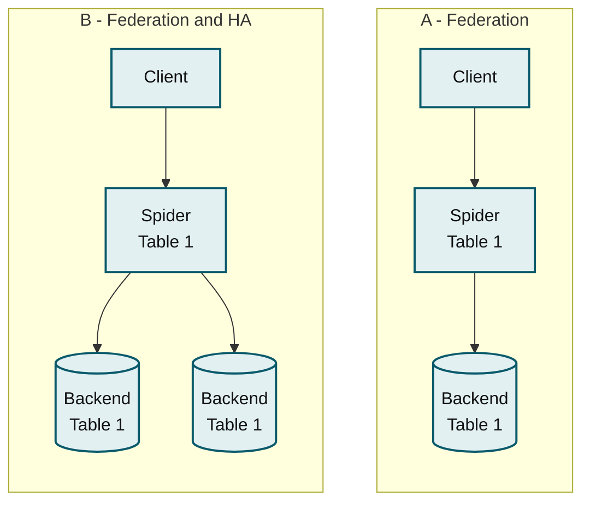
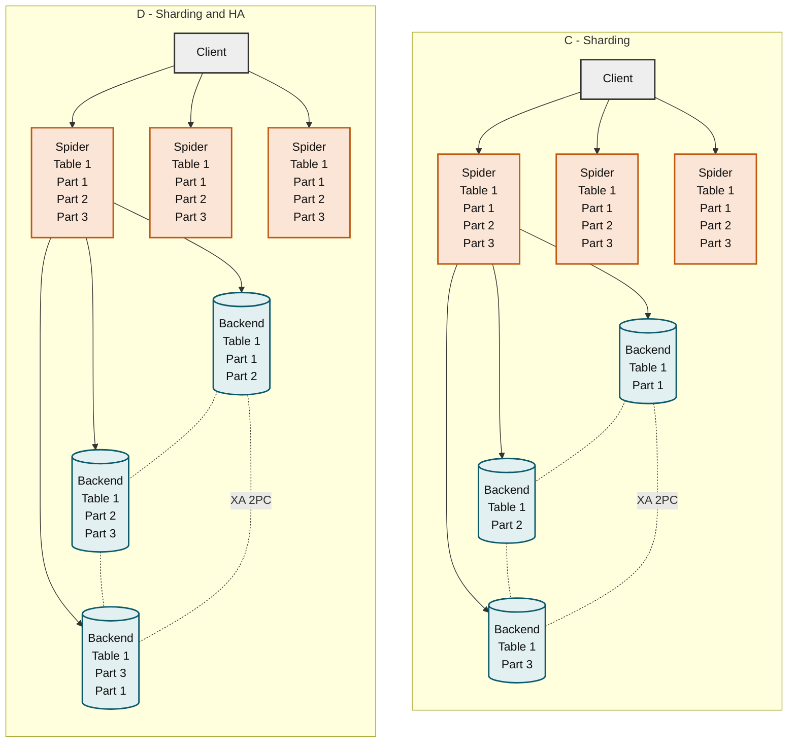
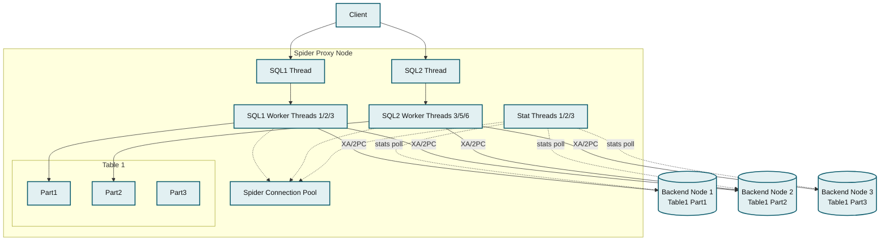

# Spider Storage Engine Core Concepts

A typical Spider deployment has a shared-nothing clustered architecture. The system works with any inexpensive hardware, and with a minimum of specific requirements for hardware or software. It consists of a set of computers, with one or more MariaDB processes known as nodes.

The nodes that store the data are designed as `Backend Nodes`, and can be any MariaDB, MySQL, Oracle server instances using any storage engine available inside the backend.

The `Spider Proxy Nodes` are instances running at least MariaDB 10. `Spider Proxy Nodes` are used to declare per table attachment to the backend nodes. In addition `Spider Proxy Nodes` can be setup to enable the tables to be split and mirrored to multiple `Backend Nodes`.

### Spider Common Usage



_Topology A (federation) routes a client through Spider to a single backend node; topology B (federation with HA) routes the same client through Spider to two redundant backend nodes._



_Topology C (sharding) routes a client through three Spider nodes to three non-overlapping backend shards; topology D (sharding with HA) uses the same Spider layer but stores each partition redundantly across two backend shards, all coordinated via XA two-phase commit._

In the default high availability setup Spider Nodes produce SQL errors when a backend server is not responding. Per table monitoring can be setup to enable availability in case of unresponsive backends `monotoring_bg_kind=1` or `monotoring_bg_kind=2`. The Monitoring Spider Nodes are inter-connected with usage of the system table `mysql.link_mon_servers` to manage network partitioning. Better known as split brain, an even number of `Spider Monitor Nodes` should be setup to allow a consensus based on the majority. Rather a single separated shared `Monitoring Node` instance or a minimum set of 3 `Spider Nodes`. More information can be found [here](https://fr.slideshare.net/Kentoku/spider-ha-20100922dtt7).

**MariaDB starting with** [**10.7.5**](https://app.gitbook.com/s/aEnK0ZXmUbJzqQrTjFyb/community-server/old-releases/10.7/10.7.5)

Spider's high availability feature has been deprecated (MDEV-28479), and are deleted. Please use other high availability solutions like [replication](../myrocks/myrocks-and-replication.md) or [galera-cluster](../../../../galera-cluster/README.md).

### Spider Storage Engine Federation

Spider is a pluggable Storage Engine, acting as a proxy between the optimizer and the remote backends. When the optimizer requests multiple calls to the storage engine, Spider enforces consistency using the 2 phase commit protocol to the backends and by creating transactions on the backends to preserve atomic operations for a single SQL execution.\
Preserving atomic operation during execution is used at multiple levels in the architecture. For the regular optimizer plan, it refers to `multiple split reads` and for concurrent partition scans, it will refer to `semi transactions`.

Costly queries can be more efficient when it is possible to fully push down part of the execution plan on each backend and reduce the result afterwards. Spider enables such execution with some direct execution shortcuts.

```mermaid
flowchart TB
    accTitle: Spider Storage Engine Federation Architecture
    accDescr {
        The Client sends requests into the Spider proxy node, reaching three client-facing interfaces: HS, Handler, and SQL. Inside the proxy node these sit alongside the Parse Tree, Optimizer, Partition and Table Storage Engine API, Handler Index (point, range, and multi-range access), and Handler Table (random first, next, and previous access) layers, plus the Spider Map Reduce and Spider Direct SQL UDF extensions, all layered above the core Spider engine. The Spider engine forwards requests to remote node interfaces: it connects to a remote Handler and a remote HS, while Spider Direct SQL UDF connects to the remote HS and a remote SQL interface. Those remote interfaces front four backend shards: a MariaDB backend (Shard 1), a MySQL backend (Shard 2), a MySQL backend copy (Shard 2), and an Oracle backend (Shard 3), which coordinate consistency among themselves using XA two-phase commit.
    }

    CLIENT[Client]

    subgraph PROXY["Spider Proxy Node"]
        direction TB
        HS1[HS]
        PT[Parse Tree]
        HDLC[Handler]
        SQLC[SQL]
        OPTZ[Optimizer]
        SMR[Spider Map Reduce]
        PAPI[Partition and Table Storage Engine API]
        HIDX["Handler Index<br/>Point &amp; Range &amp; Multi Range"]
        HTBL["Handler Table<br/>Rnd First &amp; Next &amp; Prev"]
        SDSU["Spider Direct<br/>SQL UDF"]
        SPD[Spider]
    end

    CLIENT --> HS1
    CLIENT --> HDLC
    CLIENT --> SQLC

    subgraph REMOTE["Remote Node Interfaces"]
        direction LR
        HDLR2[Handler]
        HS2[HS]
        SQLR2[SQL]
    end

    SPD --> HDLR2
    SPD --> HS2
    SDSU --> HS2
    SDSU --> SQLR2

    subgraph BACKENDS["Backend Shards"]
        direction LR
        B1[(MariaDB<br/>Backend<br/>Shard 1)]
        B2[(MySQL<br/>Backend<br/>Shard 2)]
        B3[(MySQL<br/>Backend Copy<br/>Shard 2)]
        B4[(Oracle<br/>Backend<br/>Shard 3)]
    end

    B1 -.- B2
    B2 -.- B3
    B3 -. XA 2PC .- B4
    B4 -.- B1

    classDef client fill:#eeeeee,stroke:#333333,stroke-width:2px,color:#111;
    classDef file fill:#eaf2fb,stroke:#2f5b8f,stroke-width:2px,color:#111;
    classDef proc fill:#fbe5d6,stroke:#c15911,stroke-width:2px,color:#111;
    classDef node fill:#e2f0f2,stroke:#0a5a6b,stroke-width:2px,color:#111;

    class CLIENT client;
    class PT,HDLC,SQLC,OPTZ,PAPI,HIDX,HTBL,HS1 file;
    class SMR,SDSU,SPD,HDLR2,HS2,SQLR2 proc;
    class B1,B2,B3,B4 node;
```



_The Spider proxy node layers client-facing Handler, HS, and SQL interfaces (plus the optimizer, partition API, and Spider Map Reduce/Direct SQL UDF extensions) over the core Spider engine, which forwards to remote node interfaces fronting four backend shards kept consistent via XA two-phase commit._

### Spider Threading Model

Spider uses the per partitions and per table model to concurrently access the remote backend nodes. For memory workload that property can be used to define multiple partitions on a single remote backend node to better adapt the concurrency to available CPUs in the hardware.



_Spider's per-partition, per-table threading model: SQL1/SQL2 worker threads coordinate over a shared connection pool and commit via XA two-phase commit across three backend nodes, while stat threads poll statistics independently._

Spider maintains an internal dictionary of Table and Index statistics based on separated threads. The statistics are pulled per default on a time line basis and refer to `crd` for cardinality and `sts` for table status.

### Spider Memory Model

Spider stores resultsets into memory, but [spider\_quick\_mode](spider-system-variables.md)=3 stores resultsets into internal temporary tables if the resultsets are larger than quick\_table\_size.

### Specifying Connection Information for Spider Tables

Spider tables connect to remote servers by reading connection information from one or more sources. MariaDB supports several methods for defining this information, each introduced at different versions. When more than one method is present, a defined precedence order determines which takes effect.

Connection information for Spider tables can be provided in different
ways:

* Foreign server options (using `CREATE SERVER`)
* `CONNECTION` or `COMMENT` strings
* Engine-defined options (such as `REMOTE_SERVER`, `REMOTE_DATABASE`, and `REMOTE_TABLE`)

Connection information for Spider tables can also be specified for
different levels, where partition-level info overrides table-level
info.

Spider has a predefined precedence order when using multiple methods.

**Applies to both CS and ES**

The following behavior applies to both CS and ES:

* Connection specification methods: (foreign server options, `COMMENT` string,
  `CONNECTION` string, and engine-defined options).
* Precedence rules (engine-defined options > `COMMENT` string >
  `CONNECTION` string > foreign server options; partition-level
  overrides table-level)
* Version-based behavior, such as the deprecation of
  `COMMENT`/`CONNECTION` in 11.4.1 and the introduction of
  engine-defined options `REMOTE_SERVER`, `REMOTE_DATABASE`, and
  `REMOTE_TABLE` in 10.8.1 and further options in 11.3.1

**ES Additional Behavior (ODBC)**

ODBC connection strings are used by Spider in Enterprise Server to
create connections via ODBC drivers.

The source of the ODBC connection string could be:

* `COMMENT` clause
* `CONNECTION` clause
* engine-defined options
* Foreign server options

These values are combined and converted into a format that is compatible with ODBC.

#### Connection Methods

**CREATE SERVER with COMMENT or CONNECTION**

Since earlier versions, connection information can be specified by creating a foreign server, then referencing it in the Spider table definition using `COMMENT=` or `CONNECTION=`.

```sql
CREATE SERVER s
  FOREIGN DATA WRAPPER mysql
  OPTIONS (HOST 'remote_host', PORT 3306, DATABASE 'db_name',
           USER 'user', PASSWORD 'secret');

CREATE TABLE t (id INT) ENGINE=SPIDER COMMENT='srv "s"';
```

The same server can also be referenced at the partition level.

```sql
CREATE TABLE t (id INT) ENGINE=SPIDER COMMENT='srv "s"'
PARTITION BY RANGE (a) (
    PARTITION p1 VALUES LESS THAN (3),
    PARTITION p2 VALUES LESS THAN MAXVALUE COMMENT='srv "s_2_2"'
```

**Engine-defined options: `REMOTE_SERVER`, `REMOTE_DATABASE`, `REMOTE_TABLE` (Since 10.8.1)**

Since [MariaDB 10.8.1](https://app.gitbook.com/s/aEnK0ZXmUbJzqQrTjFyb/community-server/old-releases/10.8/10.8.1) ([MDEV-27106](https://jira.mariadb.org/browse/MDEV-27106)), engine-defined table options can be used to directly specify connection details:

```sql
CREATE TABLE t (id INT) ENGINE=SPIDER
  REMOTE_SERVER='s'
  REMOTE_DATABASE='db_name'
  REMOTE_TABLE='remote_t';
```

These engine-defined options override `COMMENT=` when both are present. These options are more structured and are the recommended method for new configurations.

**Extended Engine-defined options (Since 11.3.1)**

Since [MariaDB 11.3.1](https://app.gitbook.com/s/aEnK0ZXmUbJzqQrTjFyb/community-server/old-releases/11.3/11.3.1) ([MDEV-28856](https://jira.mariadb.org/browse/MDEV-28856)), more engine-defined options are available. `COMMENT=` and `CONNECTION=` are ignored if there are any engine-defined options and warnings may be generated. Set `spider_suppress_comment_ignored_warning = 1` to suppress the warning that is generated when they are ignored.

**COMMENT and CONNECTION Deprecated (Since 11.4.1)**

Since [MariaDB 11.4.1](https://app.gitbook.com/s/aEnK0ZXmUbJzqQrTjFyb/community-server/11.4/11.4.1) ([MDEV-28861](https://jira.mariadb.org/browse/MDEV-28861)), the Spider connection information specified by `COMMENT=` and `CONNECTION=` has been deprecated. Instead, use the engine-defined parameters.

**ODBC Connection String via CONNECTION (Since 11.4.3-1 ES)**

In the following instances, `CONNECTION=` is used directly as the ODBC connection string since [MariaDB Enterprise Server 11.4.3-1 ](https://app.gitbook.com/s/aEnK0ZXmUbJzqQrTjFyb/enterprise-server/11.4/11.4.3-1)([MENT-2070](https://jira.mariadb.org/browse/MENT-2070)):

* `COMMENT=` / `CONNECTION=` are explicitly ignored (i.e., engine-defined options are present, per [MDEV-28856](https://jira.mariadb.org/browse/MDEV-28856))
* The value of `CONNECTION=` follows the ODBC connection string format (`param1=val1;param2=val2;...`)

In previous ES versions, the chosen `COMMENT=`, `CONNECTION=`, and
`OPTIONS` fields were used to create the ODBC connection string. See
[MENT-2076 comment](https://jira.mariadb.org/browse/MENT-2076?focusedCommentId=312663&page=com.atlassian.jira.plugin.system.issuetabpanels:comment-tabpanel#comment-312663) for a complete list of fields used.

**CREATE SERVER with FOREIGN DATA WRAPPER ODBC**

Foreign server options are directly translated to ODBC connection key-value pairs when using `CREATE SERVER` with `FOREIGN DATA WRAPPER ODBC` ([MENT-796](https://jira.mariadb.org/browse/MENT-796)). The above-described precedence order is maintained.

```sql
CREATE SERVER s
  FOREIGN DATA WRAPPER odbc
  OPTIONS (DSN 'MyDSN', UID 'user', PWD 'secret');
```

### Supported FOREIGN DATA WRAPPER Values

`CREATE SERVER ... FOREIGN DATA WRAPPER` supports the following wrapper types:

| Wrapper Value | Description                                         | Availability |
| ------------- | --------------------------------------------------- | ------------ |
| `mysql`       | Connects to a remote MySQL server natively | CS + ES      |
| `mariadb`     | Connects to a remote MariaDB server natively                 | CS + ES      |
| `odbc`        | Connects to a remote server via ODBC                | ES only      |

**Note**: The `odbc` wrapper value is only available in MariaDB Enterprise Server (ES). It is not supported in Community Server (CS).

**Default Behavior When Connection Information is not Specified**

If connection information is not explicitly specified using engine-defined options, Spider can depend on the configuration provided by other methods, such as `COMMENT`, `CONNECTION`, or `CREATE SERVER` statements.

The MariaDB version and configuration method determine the exact resolution behavior. The default behavior when no connection information is provided is currently being reviewed. To ensure predictable behavior, it is advised to explicitly specify connection details using engine-defined options (such as `REMOTE_SERVER`, `REMOTE_DATABASE`, and `REMOTE_TABLE`).

### See Also

* [Spider Table Parameters](spider-table-parameters.md)
* [Spider System Variables](spider-system-variables.md)
* [CREATE SERVER Statement](../../../reference/sql-statements/data-definition/create/create-server.md)
* [Spider Storage Engine](../../../architecture/topologies/spider-storage-engine.md)&#x20;

<sub>_This page is licensed: CC BY-SA / Gnu FDL_</sub>


