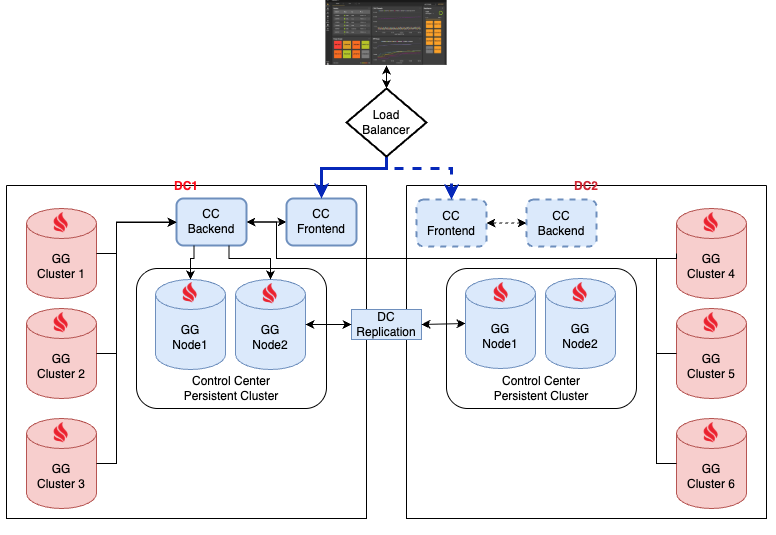
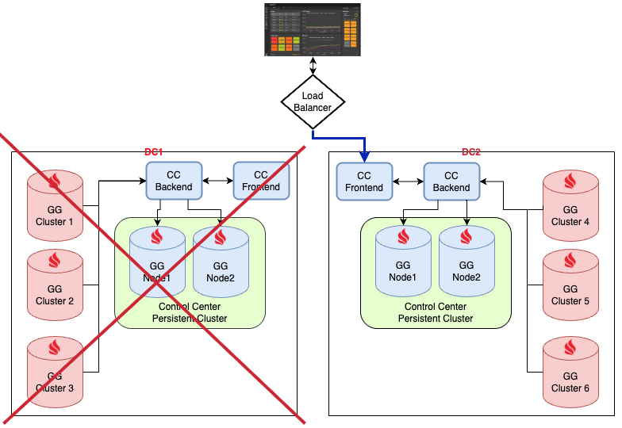

# Active-Passive Deployment

Control Center can be deployed across two data centers in an active-passive configuration, so that monitoring remains available if one data center fails.


Active-active deployment of Control Center is not supported. See [Limitations](#limitations).


## Architecture

The deployment spans two data centers:

- The active data center runs the Control Center frontend and backend that serve all clients.
- The passive data center runs a standby Control Center frontend and backend that take over after a failover.

Each data center has its own GridGain 8 cluster that stores Control Center data. Set up each persistent cluster as described in [Running Control Center with an External GridGain 8 Cluster](external-cluster.md).

The two persistent clusters are synchronized by Data Center Replication (DR) in active-passive mode. The persistent cluster in the active data center acts as the master, while the persistent cluster in the passive data center acts as the replica.

Monitored GridGain clusters connect to the Control Center backend in the active data center, including clusters running in the passive data center.

A load balancer in front of both data centers routes browser traffic to the frontend of the active data center. Only one Control Center instance has connected clients at any one time.


The load balancer is not part of Control Center. You choose, configure, and operate it yourself.


## Requirements

- Control Center 2025.4.1 or later, the minimum version that supports an external multinode cluster.
- GridGain 8 Enterprise Edition or Ultimate Edition for both persistent clusters.

## Failover

The diagram shows the deployment after the active data center has failed. The frontend and backend in the second data center become active, and the monitored clusters that remain available connect to that backend.

If the active data center becomes unavailable, redirect traffic at the load balancer to the frontend in the second data center. The Control Center instance there reads its state from its local persistent cluster, which DR keeps in sync.

Failover is controlled by the load balancer. Control Center does not detect failures of the other instance or switch roles automatically, so failure detection and traffic rerouting are the responsibility of the load balancer.

## TLS Configuration

Certificates are configured on your side. The component that terminates TLS depends on how the load balancer forwards requests:

- If the load balancer sends requests directly to the backend, configure the `server.ssl.*` properties as described in [SSL/TLS](configuration.md#ssltls).
- If the load balancer sends all requests to the frontend, the frontend proxies WebSocket and REST API requests to the backend. Configure the frontend through `control-center-frontend-configmap.yaml`, as described in [Running Control Center and GridGain with Encryption](kubernetes-tls.md).

## Limitations

- Only one Control Center instance serves clients at a time. The passive instance does not share the load.
- Some events can be lost during a failover. Control Center is a monitoring system, and event loss is possible in any setup.
- Active-active deployment is not supported. In an active-active setup, a browser connects to one backend while a cluster connects to another, so actions, metrics, and other events have to be relayed between backend instances. Relaying them would require a message broker, which Control Center does not provide.
- Load balancer selection and configuration are out of scope for Control Center. Extending Control Center functionality through the load balancer, for example adding two-factor authentication, is not supported.
