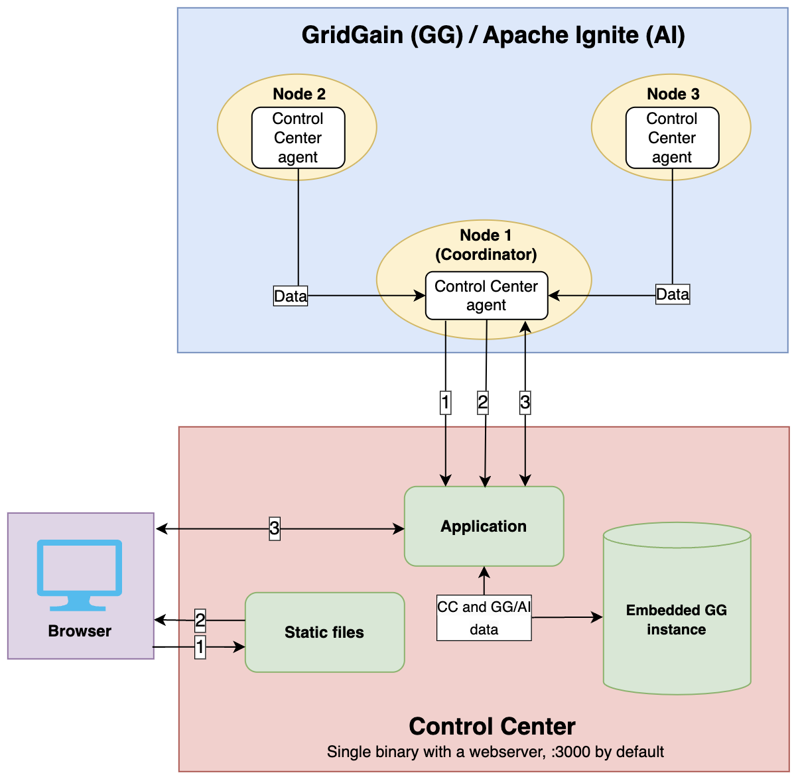
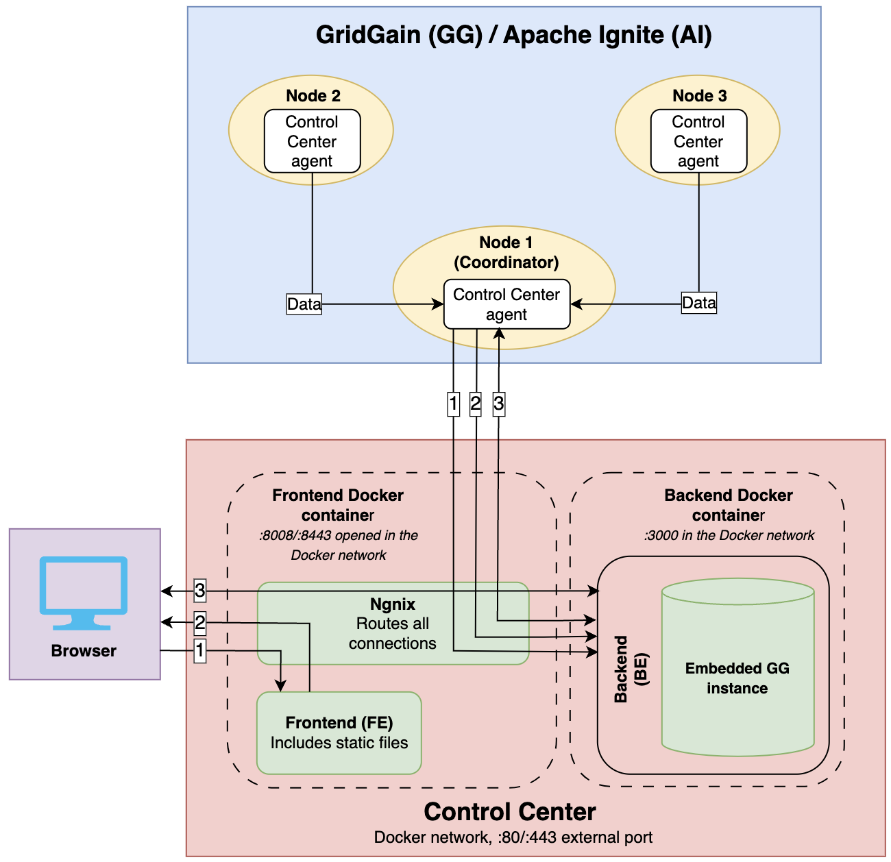

# Architecture Overview

This section describes the functional architecture of Control Center (including the Control Center Agent) deployed:

- As a single binary
- Over a Docker infrastructure


Cluster must have open egress on `TCP:8080`. Control Center must have open ingress for `TCP:8080`. If the cluster is SSL-enabled, change `8080` to `443`.


## Single Binary Architecture

The following diagram depicts the single-binary deployment option.

Browser / Control Center interaction:

1. Browser requires static files (HTML/CSS/JS/images).
2. Control Center provides the requested static files.
3. Browser initiates HTTPS and WS connections.

Control Center / Agent interaction:

1. Agent initiates connection and cluster registration in Control Center.
2. Agent initiates a bidirectional WS connection and sends the cluster info: topology, metrics, traces, etc.
3. Control Center sends commands; e.g., "get metrics requested by user."

## Docker-based Architecture

The following diagram depicts the Docker deployment option.

Browser / Frontend (FE) interaction:

1. Browser requires static files (HTML/CSS/JS/images).
2. FE provides the requested static files.
3. Browser initiates HTTPS and WS connections.

Backend (BE) / Agent interaction:

1. Agent initiates connection and cluster registration in CC.
2. Agent initiates a bidirectional WS connection and sends the cluster info: topology, metrics, traces, etc.
3. BE sends commands; e.g., "get metrics requested by user."
