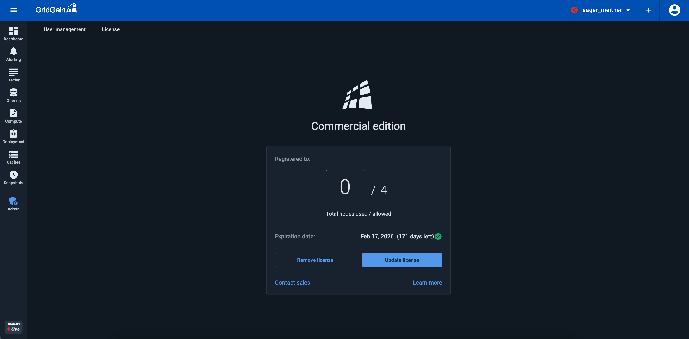

# Managing License

Control Center requires a license to operate. Contact [the Sales team](mailto:sales@gridgain.com?subject=GridGain%20Control%20Center%20License%20Inquiry) to get a license, then upload it to Control Center.

## Uploading License via UI

Once you have received the license (an XML file):

1. Open the **Admin** screen and go to the **License** tab.

   A dialog shows the terms of the current license - the number of nodes allowed and the expiration date.

   
2. Click **Update License** and upload your license file.


If you have no Administrator account, use a link in the Control Center log to connect and create the Administrator account.


## Adding License Before Startup

To add a license to a new installation, you can place the license file,  in the Control Center `root/license` folder. On the initial startup, Control Center will load the license file and apply the license.


If Control Center already has a license, you need to update it via UI or using the file watcher mechanism.


### Updating License Automatically

Instead of [Uploading License via UI](#uploading-license-via-ui) every time you need to update it, you can configure Control Center to update license automatically:

1. Enable the file watcher mechanism by adding `control.license.filestorage=true` to the [Control Center configuration](configuration.md).
2. Set the `control.license.path` to the license path location. For example:

   `control.license.path=/etc/cc/license/control-center-license.xml` - absolute or `control.license.path=license/2023/control-center-license.xml` - relative to root
3. Store the license file at the `control.license.path` location.

When the watcher discovers a new or updated license file, it will validate the license and, if the file is validated successfully, apply the new license. If the file fails validation, the old license will remain in power.

If you decide to update the license via UI while the file watcher is enabled, Control Center will store the manually uploaded license at `control.license.path`. If `control-center-license.xml` is already stored there, it will be renamed to `control-center-license.bak.xml`.
