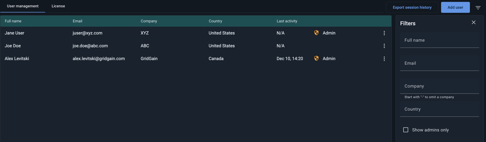
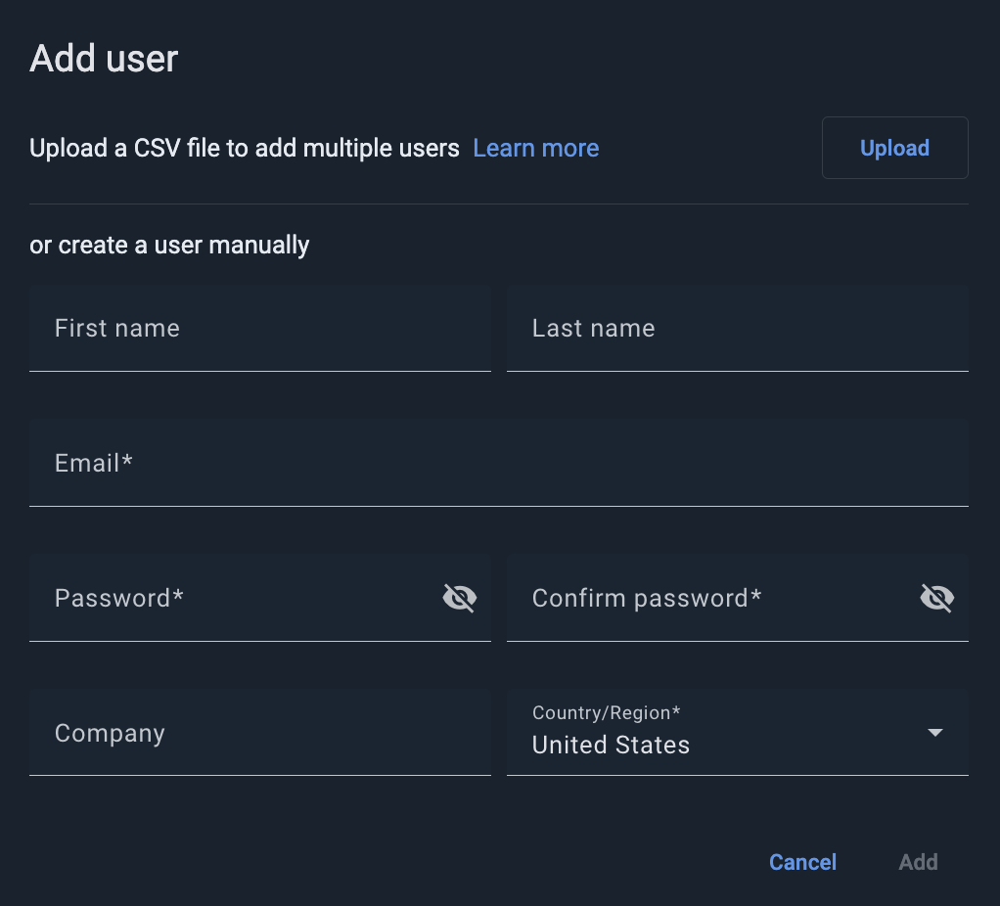
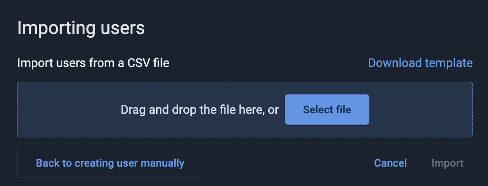
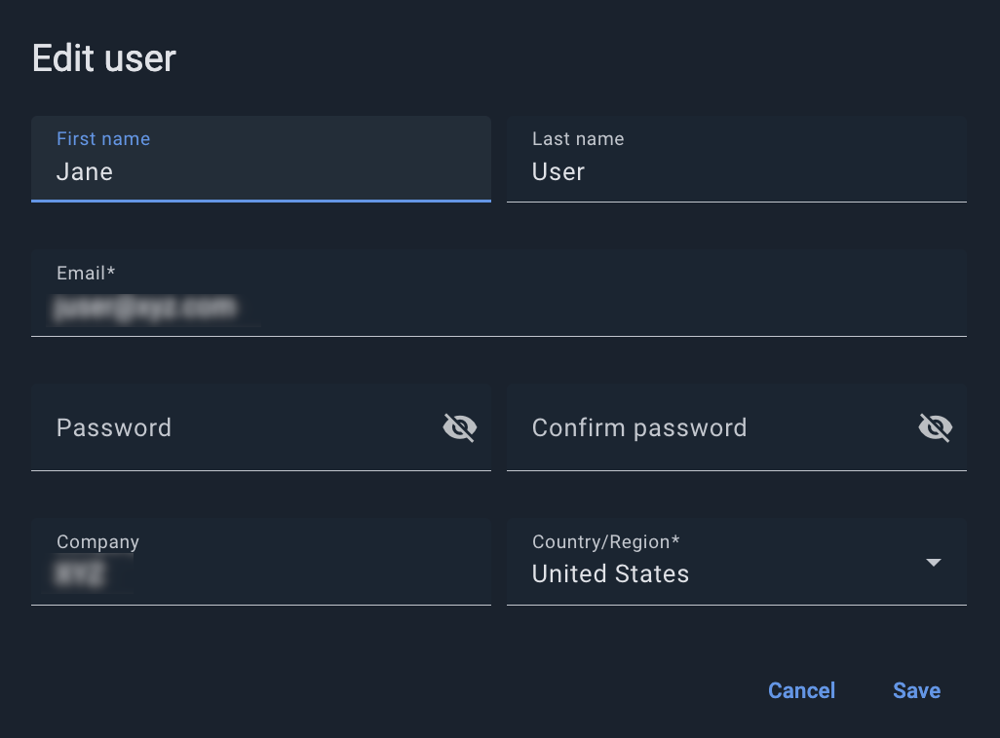
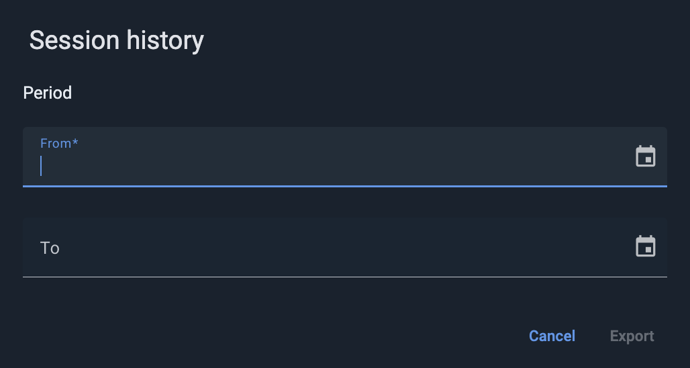

# Managing Users

There are two types of users in Control Center:

- Admin users - can manage users (lock/unlock accounts, grant admin privileges, etc.), as well as [update the Control Center license](license.md#uploading-license-via-ui)
- Regular (non-admin) users - can log in and monitor clusters

The person who activates a Control Center installation automatically becomes an admin user.

The admin users have access to the **User Management** tab of the **Admin** screen, where they can create and manage users.

To display this tab, click **Admin** on the left-hand-side navigation bar.

## View user list

The **User management** tab displays a list of the existing Control Center users. It includes the following columns:

| Column | Description |
|---|---|
| Full name | The user's first and last names. |
| Email | The user's email. |
| Company | The user's company name. |
| Country | The user's country. |
| Last activity | The date and time of the user's last activity in Control Center. |

You can filter the user list using the **Filters** section to the right of the list.

## Create Users

You can create users one-by-one - by entering new user details in a dialog, or in bulk, by importing multiple users' details from a CSV file. The file must have the following format: "email, pwd, firstName, lastName, company, country".

To create new user(s):

1. Click **Add user** on the tab toolbar.

   The **Add user** dialog opens.

   
2. To add a list of users from a CSV file:
   1. Click **Upload**.

      The **Importing users** dialog opens.

      
   2. Select a CSV file to upload. You can create this file: click **Download template** and enter the user details in the downloaded `users-template.csv` file.
   3. Click **Import**.
3. To add a single user.
   1. Fill out the user details.
   2. Click **Add**.

## Edit User Details

To edit an existing user's details:

1. From the user's context menu, select **Edit**.

   The **Edit user** dialog opens.

   
2. Edit user details as required.
3. Click **Save**.

## Grant and Revoke Admin Privileges

To convert a regular user to an admin user, from the user's context menu, select **Grant admin**.

To convert an admin user to a regular user, from the user's context menu, select **Revoke admin**.

## Lock and Unlock User Accounts

Users with locked accounts cannot log into Control Center. However, the user entities are kept in the system.

To lock a user account:

1. From the user's context menu, select **Lock this user**.
2. In the confirmation dialog that opens, click **Lock**.

To unlock a previously locked user account:

1. From the user's context menu, select **Unlock this user**.
2. In the confirmation dialog that opens, click **UnlLock**.

### Remove Users

To remove a user from the system:

1. From the user's context menu, select **Remove**.
2. In the confirmation dialog that opens, click **Remove**.


An administrator can remove a user even if the user has an attached cluster. When the user is removed, the cluster will be detached, and another user can attach it and become its owner.


## Export Session History

You can export the cluster session history to a `cluster-statistic-report-<from_date_to_date>.csv` file that includes the following columns: "clusterId, start, end". This file shows the cluster connection history for a specific period, where each "session" is the period between connection and disconnection.

To export session history:

1. Click **Export session history** on the tab toolbar.

   The **Session history** dialog opens.

   
2. In the **From** and **To** fields, enter the beginning and the end of the period to export.
3. Click **Export**.
