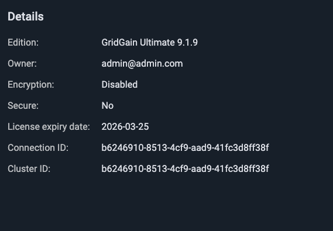

# REST API

Control Center provides a REST API for programmatic access to its functionality. The API enables automation of common tasks including user management, cluster attachment, alerting configuration, and health monitoring.

## API Overview

The REST API includes endpoints for:

- **Authentication** - Login and JWT token management
- **Users** - Create, update, and manage user accounts
- **Teams** - Create teams and manage team membership
- **Clusters** - Attach clusters and configure sharing
- **Notifications** - Configure email, SMS, and webhook notification channels
- **Alerts** - Set up metric-based alert configurations
- **Health** - Retrieve cluster health reports
- **License** - Upload and manage licenses
- **Connector** - Get the list of connectors for the current user

For the complete API specification, see the OpenAPI [documentation](https://www.gridgain.com/sdk/controlcenter/latest/openapi/openapi.html).

To learn how to use the REST API for fully automated Control Center deployment, see [Automated Deployment](automated-deployment.md).

## Authentication


These examples use plain-text credentials on the command line for simplicity. In production, manage credentials using secure mechanisms such as secrets managers, environment variables, or encrypted vaults. Do not store credentials in plain text or embed them directly in commands.


- Authenticate requests using HTTP Basic Authentication with your Control Center credentials (email and password):

  ```bash
  curl -u "username@example.com:password" \
    "https://<control-center-url:port>/rest/v1/..." \
    -H "Accept: application/json"
  ```
- Alternatively, obtain a JWT token by calling the login endpoint:

  ```bash
  curl -X POST \
    "https://<control-center-url:port>/rest/v1/authentication/login" \
    -H "Content-Type: application/json" \
    -d '{"username": "username@example.com", "password": "password"}'
  ```

  Then use the token in subsequent requests:

  ```bash
  curl -H "Authorization: Bearer <jwt-token>" \
    "https://<control-center-url:port>/rest/v1/..." \
    -H "Accept: application/json"
  ```

## Get Cluster Health Reports

Authenticate with your Control Center credentials (email and password) and specify the `connectionId` in the request.

```
GET /rest/v1/clusters/{connectionId}/health
```



The endpoint returns the cluster health report in JSON format.

Example request:

```bash
curl -v \
  -u "username@example.com:password" \
  "https://<control-center-url:port>/rest/v1/clusters/<connectionId>/health" \
  -H "Accept: application/json"
```

Example response:

```json
{
  "status": "GOOD",
  "reports": [
    {
      "reportName": "OfflineCmgNodes",
      "description": null,
      "status": "GOOD"
    },
    {
      "reportName": "OfflineMgNodes",
      "description": null,
      "status": "GOOD"
    },
    {
      "reportName": "Alerts",
      "description": null,
      "status": "GOOD"
    },
    {
      "reportName": "PartitionLoss",
      "description": null,
      "status": "GOOD"
    }
  ]
}
```

You can also view a specific report by passing `reportName` property to the endpoint:

```
/rest/v1/clusters/{connectionId}/health/{reportName}
```

Example response:

```json
{
   "reportName": "PartitionLoss",
   "description": null,
   "status": "GOOD"
}
```
