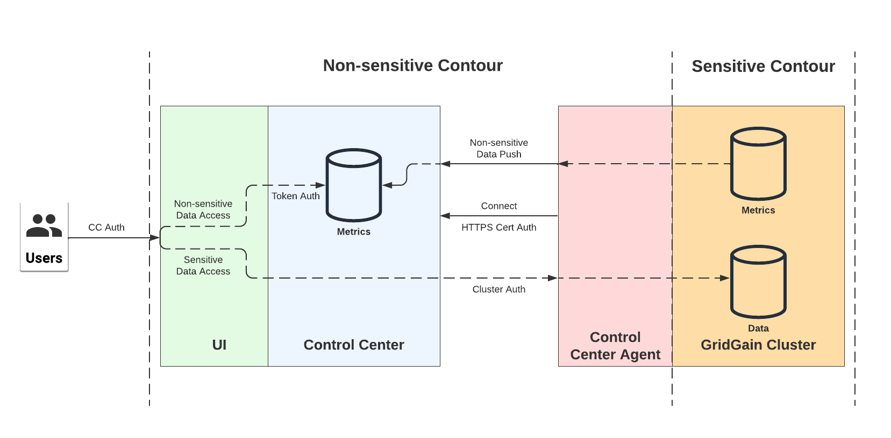

# Control Center Security for Attached Clusters

## Overview

The diagram below depicts the model that governs authentication and authorization between GridGain clusters, Control Center, and the Control Center users.

Control Center, users authenticated by Control Center, and Control Center Agent (which sends non-sensitive data from the cluster), form a **non-sensitive access contour**. In that contour, the trust is transitive: cluster trusts Control Center, Control Center trusts the user, the user gets access to the cluster. No authorization is required.

Cluster with its sensitive data forms a **sensitive access contour**. This contour requires a separate authentication and authorization from each party requesting access. Control Center itself never attempts sensitive access.


This document describes the authentication architecture from the cluster owner's point of view. It ignores the data that is stored in Control Center but is not related to specific clusters (for example, user information, etc.).


## Components and Trust Levels

### Cluster

The cluster entity has the maximum trust level. It holds sensitive data. Cluster is the most trusted and most critical component, which must never be compromised. If it is compromised, sensitive information is lost immediately.

In addition to direct access to sensitive data, the potentially destructive actions include cluster deactivation, snapshot creation or restore, etc. In this document, *sensitive access* means “sensitive data access OR execution of potentially destructive actions.”

Clusters also contain non-sensitive data, such as the cluster information, metrics, etc. Some actions on a cluster are considered non-destructive actions, such as listing the available snapshots. In this document, *non-sensitive access* means “non-sensitive data access OR execution of non-destructive actions.”

### Control Center

Control Center stores non-sensitive data from the cluster. If Control Center is compromised, non-sensitive data is lost but no sensitive access to the cluster is granted.

## Authentication and Authorization

### Cluster and Control Center Connection

Cluster authenticates Control Center via HTTPS only. As long as Control Center’s certificate is valid, the cluster grants it non-sensitive access with no additional authorization. Note that:

- It is assumed that the Control Center’s URI is known to the cluster. The cluster chose to connect to that specific URI and had checked that the URI matched the certificate.
- Most non-sensitive access is carried out via push from the cluster to Control Center. This means that clusters control what is sent.

By default, Control Center does not authenticate the cluster on the first connection.

On subsequent connections, Control Center authenticates the cluster using the cluster ID and secret.

Optionally, client SSL certificate validation can be enabled.

Control Center accepts any non-sensitive data pushed by the cluster with no additional authorization. It uses temporary and permanent bans to prohibit data pushes from misbehaving clusters and to prevent DoS.

Once an HTTPS connection is established between the cluster and Control Center, non-sensitive data access is unrestricted.

### User Access

User authentication and authorization for Control Center is as follows:

- The user authenticates to the Control Center UI with their Control Center credentials.
- To get non-sensitive access to the cluster data, the user provides a secret token generated by the cluster. No additional authorization is required. Optionally, a user who has non-sensitive access can share it with another user.
- To get sensitive access to the cluster data, the user needs to authenticate and authorize with the cluster. The cluster credentials are passed to the cluster through the UI.
