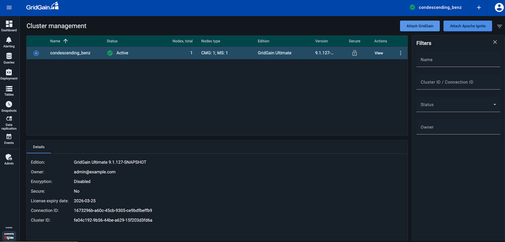
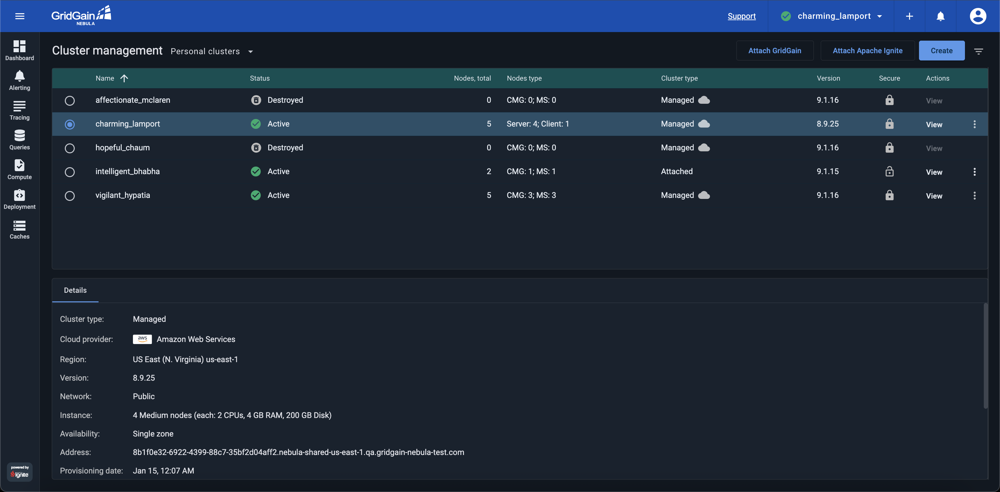
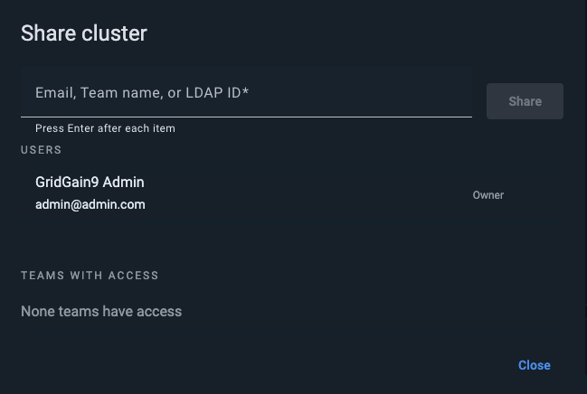

# Cluster Management Screen

On the **Cluster Management** screen, you can view a list of the clusters that are registered in Control Center. To access this screen, select **Cluster Management** from the user profile menu.

On this screen, you can add, remove, activate, and deactivate clusters, as well as share clusters with teams and users.

## GridGain 9 Clusters



The following information is available on the cluster list:

| Column | Description |
|---|---|
| Name | The name of the cluster. See [Cluster Name](#cluster-name). |
| Status | Indicates whether the cluster is connected to and reachable by Control Center, and reflects its current lifecycle state. See [Cluster Statuses](#cluster-statuses). |
| Nodes, total | The total number of nodes. |
| Nodes type | Shows the number of nodes included in the [Cluster Management Group](https://www.gridgain.com/docs/gridgain9/latest/administrators-guide/lifecycle#cluster-management-group) (CMG) and the number of nodes included in the [Metastorage Group](https://www.gridgain.com/docs/gridgain9/latest/administrators-guide/lifecycle#cluster-metastorage-group) (MS). |
| Edition | The product edition that the cluster uses (either GridGain edition or Apache Ignite). |
| Version | The version of the product. |
| Secure | Indicates whether the cluster is secured by [authentication](https://gridgain.com/docs/latest/administrators-guide/security/authentication). |

## GridGain 8 Clusters



The following information is available on the cluster list:

| Column | Description |
|---|---|
| Name | The name of the cluster. See [Cluster Name](#cluster-name). |
| Status | Indicates whether the cluster is connected to and reachable by Control Center, and reflects its current lifecycle state. See [Cluster Statuses](#cluster-statuses). |
| Nodes, total | The total number of nodes. |
| Nodes type | The number of client and server nodes. |
| Edition | The product edition that the cluster uses (either GridGain edition or Apache Ignite). |
| Version | The version of the product. |
| Secure | Indicates whether the cluster is secured by [authentication](https://gridgain.com/docs/latest/administrators-guide/security/authentication). |

Some additional information about the "current" cluster (selected on the list) is shown in the **Details** widget at the bottom of the screen,

To view [more information about the "current" (selected) cluster](gg9/dashboard/my-cluster.md) on the **My Cluster** screen, select **Dashboard** from the navigation menu.

## Cluster Statuses

The **Status** column reflects both the connection state and the lifecycle state of a cluster.

| Status | Applies to | Description |
|---|---|---|
| Active | All GG8 and GG9 clusters | The cluster is running and connected to Control Center. |
| Inactive | Attached GG8 clusters only | The cluster is deactivated. Cache operations are not allowed, but compute and metrics remain available. To reactivate it, see [Activating and Deactivating Clusters](#activating-and-deactivating-clusters). |
| Disconnected | Attached GG8 and GG9 clusters | The cluster is registered in Control Center but is currently unreachable. Control Center cannot communicate with it. |
| Uninitialized | Attached GG9 clusters only | The cluster is registered but not yet initialized. To proceed, follow the [instructions](gg9/dashboard/my-cluster.md#initializing-the-cluster). |
| Provisioning | Managed GG8 and GG9 clusters only | The cluster is being created and configured. |
| Resuming | Managed GG8 and GG9 clusters only | The cluster is starting up after being suspended. |
| Suspending | Managed GG8 and GG9 clusters only | The cluster is in the process of being suspended. |
| Suspended | Managed GG8 and GG9 clusters only | The cluster has been suspended and is not currently running. |
| Destroying | Managed GG8 and GG9 clusters only | The cluster is in the process of being permanently deleted. |
| Destroyed | Managed GG8 and GG9 clusters only | The cluster has been permanently deleted. |
| Failed | Managed GG8 and GG9 clusters only | The cluster failed to start. Contact the support team. |
| Limited | All GG8 and GG9 clusters | Monitoring is limited due to excessive load. Some data is not shown. Consider collecting fewer metrics, traces, and compute events. See [Why does my cluster show the Limited Cluster banner?](faq.md#why-does-my-cluster-show-the-limited-cluster-banner) |

## Cluster Name

Every cluster has a name displayed in the top-right corner. It is a human-readable label used purely within Control Center — changing it does not affect cluster operation.

When a cluster starts for the first time, a name is generated automatically.

GridGain users can rename a cluster either from the **My Cluster** screen context menu or via the control script. See [Assigning Cluster Name](getting-started/connect/connect-gridgain-cluster.md#assigning-cluster-name).

## Switching Between Clusters

If multiple clusters are registered in Control Center, you can switch between clusters by using the **Select Cluster** control at the top of the screen.

## Adding Clusters

When a cluster connects to Control Center, it prints an auto-generated token to the console of the coordinator node. You use this token to register the cluster in Control Center. Tokens are single use and expire after 5 minutes. Once a token is registered in a Control Center instance, it becomes invalid. You will need to [generate a new token](#generating-a-token) if you want to register the cluster again.

To add a cluster:

1. Click **ATTACH CLUSTER**.
2. If you attach Apache Ignite, make sure to switch to Apache Ignite in the wizard.
3. Paste the token into the dialog and click **OK**.
4. The wizard will confirm that the cluster was found and attached.

If your cluster is protected by [authentication](https://gridgain.com/docs/latest/administrators-guide/security/authentication), you will be asked to enter the username and password.


Each cluster can only be attached once. If it was already attached by another user, you will receive a warning and a part of their e-mail.


## Downloading Cluster Logs

Control Center lets you download cluster logs and, starting with GridGain 8.9.24, also collect debug information such as thread dumps, JVM properties, cluster topology, and cluster configuration.

### Download logs for GridGain 8.9.24 and later

You can collect debug information both from a single node or from multiple nodes at the same time.

To download logs and other diagnostics:

1. Click ⋮ next to the target cluster and select **Download debug info**.
2. In the **Debug info** dialog, choose what to include:
   - **Logs** — requires selecting a date.
   - **Thread dump**
   - **JVM properties**
   - **Cluster topology**
   - **Cluster configuration**
3. Select one or multiple nodes to collect data from.
4. Click **Download**.

### Download logs for GridGain 8.9.23 and earlier

To download cluster logs for a specific date, click ⋮ and select **Download logs**. In the **Cluster logs** dialog that opens, select a date and click **Get logs**.

A progress bar appears. Once the log package is ready, it automatically downloaded to your machine. If the download does not start automatically, click **Download** io the **Cluster logs** dialog.

## Generating a Token

Token generation is only available for Gridgain 8 clusters. To generate a token, use the `management.sh` script located in the `bin` directory of your Gridgain installation folder:



```bash
./management.sh --token
```



```bash
./management.bat --token
```



If your GridGain 8 cluster is running on localhost, you must explicitly specify the URI when generating the token. Execute the following instead:



```bash
./management.sh --uri localhost:3000
./management.sh --token
```



```bash
./management.bat --uri localhost:3000
./management.bat --token
```



Gridgain 9 clusters do not use tokens as all connections are managed via [connector](gg9/cloud-connector/connect-cloud-connector.md) instead.

## Activating and Deactivating Clusters

For a full list of possible cluster states, see [Cluster Statuses](#cluster-statuses). To activate or deactivate a cluster, click the `⋮` icon and, from the menu, select **Activate** or **Deactivate**.

## Sharing Clusters

You can have access to a cluster as:

- *User* - a regular user who can view the cluster that had been shared with them individually or via a team, as well as utilize the actions that appear in the cluster's context menu.
- *Owner* - the user who had created or attached the cluster. Owners have extended cluster access rights, including sharing the cluster with teams or users, suspension, removal, etc.

As a cluster owner, you can share that cluster with individual users and/or teams. You use the **Teams** screen to [create and manage teams](profile/teams.md).

### Sharing with Users and Teams

To share a cluster you have created or attached with individual users and/or teams, click `⋮` by that cluster's name on the list and select **Share**. The **Share Cluster** dialog opens.



The dialog lists users and teams that already have access to the cluster.

In the entry field across the top of the **Share Cluster** dialog, start typing a Control Center user's email, an LDAP ID, or a team name. As you type, the incremental search mechanism displays suggestions in a drop-down list. Select one of the suggested users or teams. Alternatively, type the identifier to the end, then click \[Enter]. You can add multiple users and/or teams in a single operation. When done, click **Share**.

The users and teams you have entered appear in the corresponding sections of the **Share Cluster** dialog. The system notifies the users and team members that a cluster had been shared with them. To close the **Share Cluster** dialog, click **Close**.

### Viewing Team's Clusters

Any team member can check which clusters had been shared with their team. To see the shared clusters, select the team from the drop-down list to the right of the screen title.

Control Center remembers what cluster you had selected and displays it next time you open the page. If the cluster had been reassigned to another team, Control Center opens the cluster in the new team's context.

If the *Global Team* feature is [enabled](admin-guide/configuration.md#teams) in your Control Center environment, the **Global Team** option appears on the drop-down list. By default, this team includes all active Control Center users. If your environment is integrated with AD/LDAP, Global Team includes all AD/LDAP users who had logged into Control Center at least once. The environment can be configured to [automatically share](admin-guide/configuration.md#teams) all clusters in Control Center with Global Team.

### Stopping a Cluster Share

As a cluster owner, you can stop sharing your cluster with a team or with an individual user (remove access to the cluster that had been previously granted to that team or user).

You can stop sharing a cluster with a specific team from that team's list of shared clusters. Select the required team from the drop-down list to the right of the screen title. Click `⋮` next to the cluster you want to stop sharing with the selected team and select **Stop Sharing**. In the confirmation dialog, click **Stop Sharing**.

Alternatively, you can stop sharing a cluster with team(s) and/or user(s) from the **Share Cluster** dialog. Click `⋮` by the cluster's name on the list and select **Share**. In the **Share Cluster** dialog that opens, select **Stop Sharing** from the context menu by the required team or user name. In the confirmation dialog, click **Stop Sharing**.

## Updating Cluster License

For GridGain 8 clusters, the license expiry date is displayed in the **Details** widget on the [My Cluster](gg8/dashboard/my-cluster.md) screen.

Your cluster may need a [new license](https://www.gridgain.com/docs/latest/installation-guide/licenses) when:

- Your previous license expires
- You are installing (or updating to) GridGain Enterprise Edition (EE) or Ultimate Edition (UE)

Once you have obtained the license XML file, you can upload it via the Control Center UI.

To upload a new GridGain license for a cluster:

1. From the cluster's context menu, select **Update license**.
2. In the **Update license** dialog that opens, do one of the following:
   - Drag and drop the license file, or
   - Click **Select file** and select the required file in the **Explorer/Finder** window.
3. Click **Update**.


The update is performed [without cluster or node downtime](https://www.gridgain.com/docs/latest/installation-guide/licenses#update-without-downtime).


## Next Steps

- [My cluster overview](gg9/dashboard/my-cluster.md)
