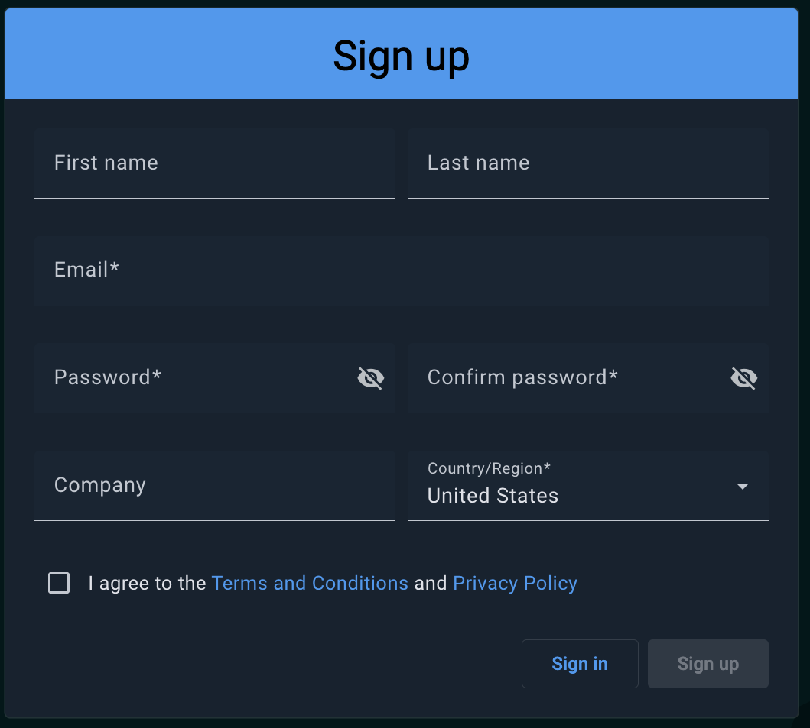
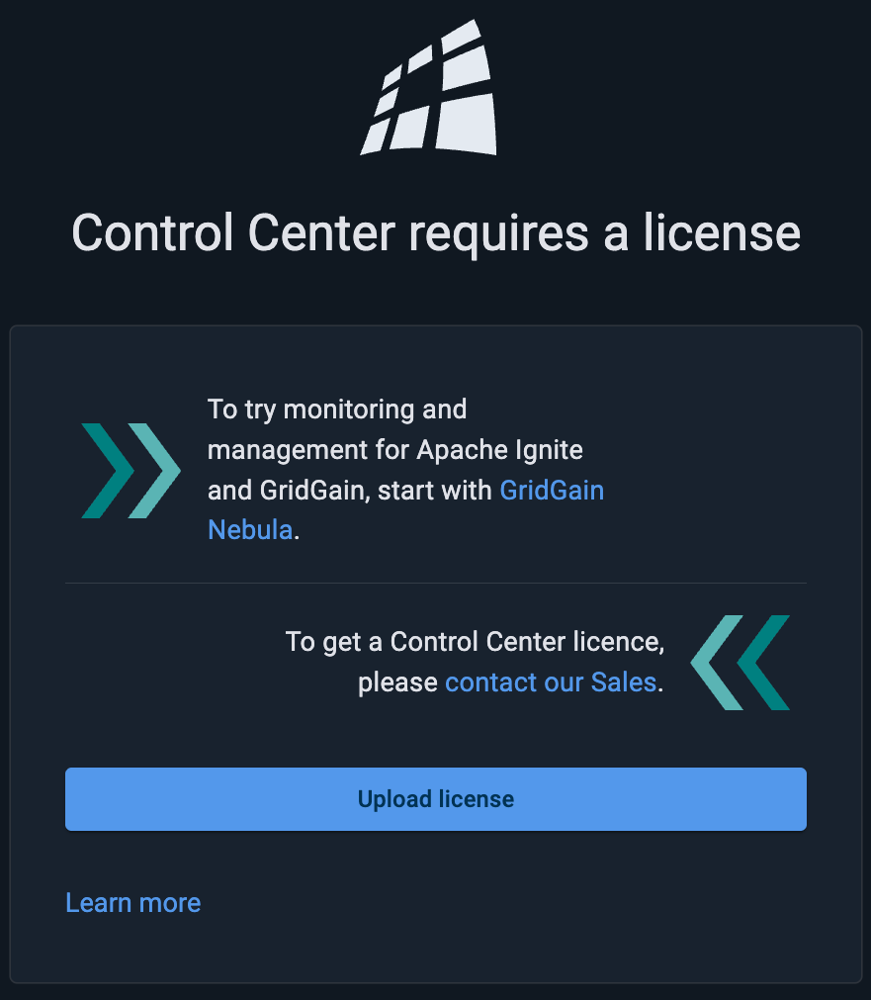

# Install Control Center and Add License

When you start working with Control Center, our [Sales Team](https://www.gridgain.com/contact) will provide you with a copy of the latest release of Control Center. To start working with it:

1. Unpack the archive into a directory of your choice.
2. Launch Control Center by running `control-center.sh` (or `control-center.bat` for Windows) in the installation directory.

On the initial launch, Control Center provides a link to be used for creating an administrator account.


When you launch the [Docker version](../installation/docker.md) of Control Center, the "admin" link is found in the backend Control Center log.


Follow the link, fill out the fields on the page that opens, and click **Sign up**. You are now logged into Control Center as an administrator.


You can change your password and profile data on the Profile page at any time. Click the user image in the top right corner and select **Profile**.


Once you sign up and log in to Control Center, you are prompted to provide a license. If necessary, get the license file from our sales team. Click **Upload license** and select the license file.

Now Control Center is available for any user to work with.

- [Connect a pre-made cluster](demo.md)
